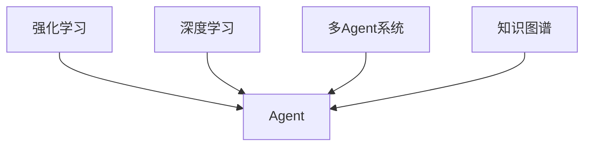

# AI人工智能 Agent：真实世界的智能体应用案例

## 1.背景介绍

人工智能(Artificial Intelligence, AI)是计算机科学领域的一个重要分支,它致力于研究如何让计算机模拟甚至超越人类的智能。而Agent(智能体)技术则是人工智能的一个重要应用方向。Agent是一种能够感知环境,并根据环境做出自主决策和行动的计算机程序或系统。

近年来,随着机器学习尤其是深度学习技术的飞速发展,Agent技术也取得了长足的进步。各种类型的智能Agent被广泛应用于工业、金融、医疗、教育、交通等诸多领域,极大地提高了生产和生活的智能化水平。本文将重点介绍几个Agent技术在真实世界的典型应用案例。

### 1.1 Agent的定义与特点

要理解Agent,首先需要明确它的定义。一般来说,Agent是指能够感知环境并根据环境做出自主行为的实体。从计算机科学的角度看,Agent通常是一个计算机程序,具有以下几个关键特点:

- 自主性(Autonomy):Agent能够不依赖人工干预,根据自身的知识和推理能力做出决策。
- 社会性(Social Ability):Agent之间可以通过某种通信语言进行交互与协作。 
- 反应性(Reactivity):Agent能够感知环境的变化,并及时做出反应。
- 主动性(Proactiveness):Agent不仅能被动地响应环境,还能主动地执行任务。

### 1.2 Agent的分类

根据应用场景和功能的不同,Agent可以分为多种类型:

- 反应型Agent(Reactive Agent):这类Agent主要根据当前感知做出快速反应,适合要求实时性高的场景。
- 推理型Agent(Reasoning Agent):具有推理和规划能力,能根据知识做出复杂决策。
- 学习型Agent(Learning Agent):通过机器学习算法,不断从数据中学习和优化策略。
- 混合型Agent:结合了反应、推理、学习等多种能力,是目前的主流发展方向。

### 1.3 Agent技术的发展历程

Agent概念最早由麻省理工学院教授John McCarthy等人在20世纪50年代提出。此后经历了几个重要的发展阶段:

- 20世纪80年代,符号主义Agent兴起,主要采用基于规则和逻辑推理的方法。
- 20世纪90年代,行为主义Agent崛起,强调Agent要植根于真实环境。
- 21世纪初,认知主义Agent成为热点,探索赋予Agent认知和学习能力。
- 近十年,深度学习驱动下,学习型Agent取得突破性进展,成为当前的研究重点。

## 2.核心概念与联系

要实现智能Agent,需要运用多个AI领域的核心概念和技术。下面我们重点介绍其中几个关键概念,并分析它们之间的内在联系。

### 2.1 强化学习(Reinforcement Learning)

强化学习是Agent技术的理论基础之一。它研究Agent如何通过与环境的交互来学习最优策略,以获得最大的累积奖励。强化学习的数学模型可以表示为一个马尔可夫决策过程(MDP),包含以下要素:

- 状态(State):表示Agent所处的环境状态。
- 行为(Action):Agent在某状态下可以采取的动作。 
- 奖励(Reward):环境对Agent行为的即时反馈。
- 策略(Policy):Agent的决策函数,即在某状态下应该选择哪个行为。
- 值函数(Value Function):评估某状态或状态-行为对的长期价值。

Agent的目标就是通过不断尝试和学习,找到一个最优策略,使得期望累积奖励最大化。强化学习经典算法包括Q学习、Sarsa、策略梯度等。

### 2.2 深度学习(Deep Learning)

深度学习是机器学习的一个分支,它模仿人脑的神经网络结构,使用多层次的表示来自动学习数据中的特征。深度学习网络一般包含输入层、多个隐藏层和输出层,每层由大量神经元节点组成,层与层之间通过可学习的连接权重来传递信息。

深度学习常用的网络模型有:多层感知机(MLP)、卷积神经网络(CNN)、循环神经网络(RNN)等。它们在计算机视觉、自然语言处理、语音识别等领域取得了广泛成功。近年来,深度学习也被引入强化学习,形成了深度强化学习(Deep RL)的研究热潮。

### 2.3 多Agent系统(Multi-Agent System)

在现实世界中,很多任务需要多个Agent协同完成。多Agent系统(MAS)就是由多个交互的、自治的Agent组成的计算机系统。每个Agent根据自身的局部视角进行感知、决策和执行,通过Agent之间的通信与协调来实现全局目标。MAS的典型应用如智能交通调度、智慧城市管理、电商推荐等。

MAS涉及的关键问题包括:如何表示Agent之间的交互关系,如何设计有效的通信协议,如何权衡个体决策与整体协调,如何实现群体智能涌现等。博弈论、协调理论、群体智能等都是MAS领域的重要理论工具。

### 2.4 知识图谱(Knowledge Graph)

知识图谱是一种结构化的知识库,它以图网络的形式来表示客观世界中的实体、概念及其关联。知识图谱通常包含大量的三元组(主、谓、宾),每个三元组表示两个实体之间的一种语义关系。知识图谱能够为Agent提供丰富的背景知识,增强其认知和推理能力。

构建知识图谱需要运用自然语言处理、信息抽取、知识表示等技术。当前,知识图谱已在智能问答、智能搜索、金融风控等领域得到广泛应用。知识图谱与深度学习、强化学习的结合,是实现认知型智能Agent的重要途径。

### 2.5 概念之间的关系

上述几个AI核心概念之间存在着紧密的内在联系,形成了实现智能Agent的技术基础:

强化学习为Agent提供了环境交互学习的理论框架,深度学习赋予Agent强大的感知与决策能力,多Agent系统研究Agent群体协同,知识图谱为Agent注入背景知识。它们相互配合,最终使得Agent能够在复杂环境中实现智能行为。

## 3.核心算法原理具体操作步骤

本节我们将重点介绍几个在Agent系统中广泛使用的核心算法,并给出它们的具体操作步骤。

### 3.1 Q学习算法

Q学习是强化学习中的一个经典算法,它通过学习动作-状态值函数Q(s,a)来寻找最优策略。Q学习的核心思想是值迭代和时间差分学习。其主要步骤如下:

1. 初始化Q值表Q(s,a),对所有s∈S,a∈A,令Q(s,a)=0。
2. 重复以下步骤,直到Q收敛或达到最大训练轮数:
    1) 根据当前状态s,用ε-贪婪策略选择一个动作a。
    2) 执行动作a,观察下一个状态s'和奖励r。 
    3) 更新Q值:Q(s,a) ← Q(s,a) + α[r+γ max_a' Q(s',a') - Q(s,a)]。
    4) 令s←s',开始下一轮迭代。
3. 返回最终学到的Q值表和最优策略π*。

其中,ε是探索率,α是学习率,γ是折扣因子。Q学习算法简单有效,但面对大规模状态空间时,需要引入函数近似等技术来提高学习效率。

### 3.2 深度Q网络算法(DQN)

DQN算法是将深度学习引入Q学习的代表性成果。它用一个深度神经网络来近似Q函数,从而能够处理高维、连续的状态空间。DQN的主要步骤如下:

1. 初始化经验回放缓存D,用于存储转移样本(s,a,r,s')。
2. 初始化Q网络的参数θ,令目标网络的参数θ'=θ。
3. 重复以下步骤,直到达到最大训练轮数:
    1) 根据ε-贪婪策略,用Q网络选择动作a。
    2) 执行a,观察r和s',存储(s,a,r,s')到D中。
    3) 从D中随机采样一批转移样本(s_i,a_i,r_i,s'_i)。
    4) 计算目标值y_i = r_i + γ max_a' Q(s'_i,a';θ')。
    5) 最小化均方误差Loss(θ)=(y_i - Q(s_i,a_i;θ))^2,更新Q网络参数θ。
    6) 每隔一定步数,将θ'←θ,同步目标网络参数。
4. 返回训练好的Q网络作为最优策略。

DQN在Atari视频游戏、机器人控制等领域取得了优异表现。此后,Double DQN、Dueling DQN、Rainbow等改进算法也被相继提出。

### 3.3 MADDPG算法

MADDPG(Multi-Agent DDPG)是一种用于多Agent协同学习的强化学习算法。它结合了中心化训练和分布式执行的思想,每个Agent学习一个基于自身局部观察的策略,同时考虑其他Agent的行为对自己的影响。MADDPG的主要步骤如下:

1. 初始化每个Agent的Actor网络μ_i和Critic网络Q_i,及其目标网络μ'_i和Q'_i。
2. 初始化经验回放缓存D。
3. 重复以下步骤,直到达到最大训练轮数:
    1) 每个Agent i根据自身观察o_i和策略μ_i选择动作a_i。
    2) 执行联合动作(a_1,...,a_N),观察奖励(r_1,...,r_N)和新观察(o'_1,...,o'_N)。
    3) 存储转移样本((o_1,...,o_N),(a_1,...,a_N),(r_1,...,r_N),(o'_1,...,o'_N))到D中。
    4) 从D中采样一批转移样本。
    5) 对每个Agent i,计算目标Q值y_i=r_i+γQ'_i(o'_1,...,o'_N,μ'_1(o'_1),...,μ'_N(o'_N))。
    6) 最小化Critic网络的均方误差Loss=(y_i-Q_i(o_1,...,o_N,a_1,...,a_N))^2,更新Q_i参数。
    7) 最大化Actor网络的目标J_i=E[Q_i(o_1,...,o_N,μ_1(o_1),...,μ_i(o_i),...,μ_N(o_N))]。
    8) 软更新目标网络参数。
4. 返回训练好的Actor网络μ_1,...,μ_N作为每个Agent的最优策略。

MADDPG通过集中训练、分布执行的方式,有效地平衡了全局协调和个体自治,在多Agent合作、竞争场景中表现出色。

## 4.数学模型和公式详细讲解举例说明

本节我们将详细讲解Agent系统涉及的几个关键数学模型,并给出具体的公式说明和算例。

### 4.1 马尔可夫决策过程(MDP)

MDP是强化学习的标准数学模型,用一个五元组(S,A,P,R,γ)来描述Agent与环境的交互过程:

- 状态空间S:Agent可能处于的状态集合。
- 动作空间A:Agent在每个状态下可以采取的行为集合。
- 转移概率P(s'|s,a):在状态s下执行动作a后转移到状态s'的概率。
- 奖励函数R(s,a):在状态s下执行动作a获得的即时奖励值。
- 折扣因子γ∈[0,1]:未来奖励相对于当前奖励的衰减率。

MDP的目标是寻找一个最优策略π:S→A,使得期望累积奖励最大化:

$$
\pi^* = \arg\max_{\pi} E\left[\sum_{t=0}^{\infty} \gamma^t R(s_t,\pi(s_t))\right]
$$

其中,s