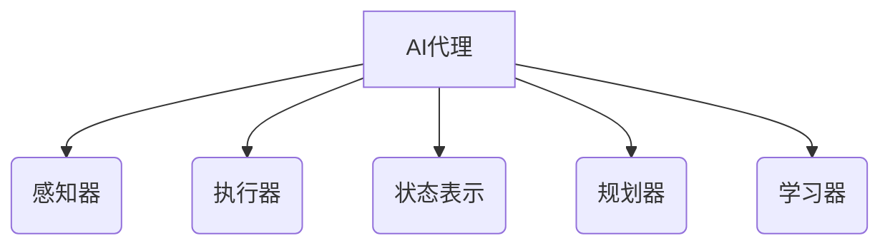
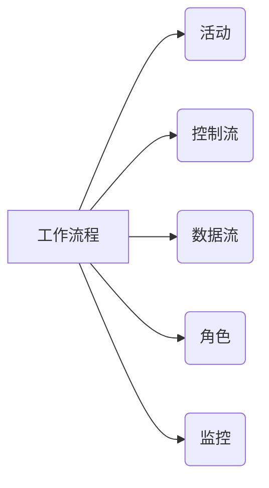
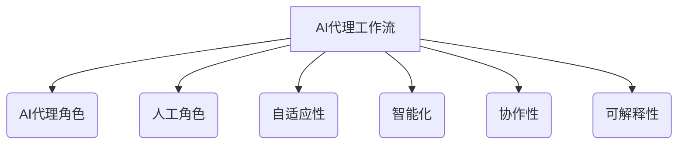
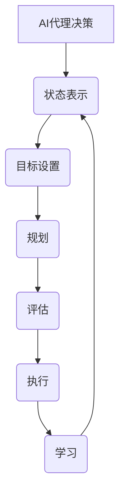

# AI人工智能代理工作流 AI Agent WorkFlow：在行业研究中的应用

## 1.背景介绍

### 1.1 人工智能代理的兴起

人工智能代理(AI Agent)是一种自主的软件实体,能够感知环境,规划行动并执行任务以实现特定目标。随着人工智能技术的快速发展,AI代理已经广泛应用于各个领域,包括工业、医疗、金融等。在行业研究中,AI代理可以帮助分析大量数据,发现隐藏的模式和趋势,为决策提供有价值的见解。

### 1.2 行业研究中的挑战

行业研究通常涉及处理大量的结构化和非结构化数据,如财务报表、新闻报道、社交媒体等。这些数据通常是异构的、分散的和动态变化的,给数据收集、整合和分析带来了巨大挑战。此外,行业研究还需要考虑多个因素的相互影响,如政策、竞争格局、消费者偏好等,这增加了研究的复杂性。

### 1.3 AI代理工作流的优势

AI代理工作流(AI Agent Workflow)通过将AI技术与传统的工作流程相结合,为行业研究提供了一种高效的解决方案。AI代理可以自动化数据收集、预处理和分析等任务,减轻人工工作负担。同时,AI代理还可以持续学习和优化,提高决策的准确性和效率。

## 2.核心概念与联系

### 2.1 AI代理

AI代理是一种具有自主性的软件实体,能够感知环境、规划行动并执行任务以实现特定目标。AI代理通常由以下几个核心组件组成:

1. **感知器(Sensors)**: 用于从环境中获取数据和信息。
2. **执行器(Actuators)**: 用于在环境中执行行动。
3. **状态表示(State Representation)**: 描述代理当前状态的数据结构。
4. **规划器(Planner)**: 根据状态和目标生成行动序列。
5. **学习器(Learner)**: 从经验中学习,优化代理的行为。



### 2.2 工作流程

工作流程(Workflow)是一系列有序的活动,用于实现特定的业务目标。工作流程通常包括以下几个核心概念:

1. **活动(Activity)**: 工作流程中的基本单元,表示需要执行的任务。
2. **控制流(Control Flow)**: 定义活动之间的执行顺序和条件。
3. **数据流(Data Flow)**: 描述活动之间的数据传递和依赖关系。
4. **角色(Role)**: 执行特定活动的参与者或系统。
5. **监控(Monitoring)**: 跟踪工作流程的执行状态和性能。



### 2.3 AI代理工作流

AI代理工作流是将AI代理与传统工作流程相结合的一种新型工作流范式。在AI代理工作流中,AI代理可以作为一种特殊的角色参与工作流程,执行自动化任务或辅助人工决策。AI代理工作流具有以下特点:

1. **自适应性**: AI代理可以根据环境和任务的变化自主调整行为。
2. **智能化**: AI代理可以利用机器学习等技术提高任务执行的效率和准确性。
3. **协作性**: AI代理可以与人类协作,共同完成复杂的任务。
4. **可解释性**: AI代理的决策过程应该具有一定的可解释性,以获得人类的信任。



## 3.核心算法原理具体操作步骤

### 3.1 AI代理决策过程

AI代理的核心任务是根据当前状态和目标生成最优行动序列。这个过程通常遵循以下步骤:

1. **状态表示**: 将环境信息转换为代理可理解的状态表示形式。
2. **目标设置**: 明确代理需要实现的目标。
3. **规划**: 根据状态和目标,生成潜在的行动序列。
4. **评估**: 对每个行动序列进行评估,选择最优序列。
5. **执行**: 执行选定的行动序列,并观察环境反馈。
6. **学习**: 根据反馈更新代理的知识库,优化未来的决策。



### 3.2 规划算法

规划算法是AI代理决策过程中的关键环节,用于生成潜在的行动序列。常见的规划算法包括:

1. **状态空间搜索**: 在状态空间中搜索从初始状态到目标状态的路径,如A*算法、IDA*算法等。
2. **启发式搜索**: 利用启发式函数估计每个状态到目标状态的距离,加速搜索过程,如贪心算法、最佳优先搜索等。
3. **规划网络**: 将规划问题建模为网络,并在网络中搜索最优路径,如层次任务网络(HTN)、Petri网等。
4. **约束满足问题(CSP)**: 将规划问题转化为约束满足问题,通过约束传播和回溯搜索求解,如GRAPHPLAN算法等。

### 3.3 学习算法

学习算法使AI代理能够从经验中不断优化自身的行为。常见的学习算法包括:

1. **监督学习**: 利用标注数据训练模型,如决策树、支持向量机等。
2. **无监督学习**: 从未标注数据中发现隐藏的模式和结构,如聚类算法、关联规则挖掘等。
3. **强化学习**: 通过与环境的交互,学习最优的行为策略,如Q-Learning、策略梯度等。
4. **迁移学习**: 利用已学习的知识加速新任务的学习过程。
5. **在线学习**: 在执行任务的同时持续学习,适应环境的动态变化。

## 4.数学模型和公式详细讲解举例说明

### 4.1 马尔可夫决策过程(MDP)

马尔可夫决策过程(Markov Decision Process, MDP)是描述AI代理与环境交互的数学模型,广泛应用于强化学习和规划算法中。MDP由以下五元组组成:

$$\langle S, A, P, R, \gamma \rangle$$

其中:

- $S$ 是状态集合
- $A$ 是行动集合
- $P(s'|s,a)$ 是状态转移概率,表示在状态 $s$ 执行行动 $a$ 后转移到状态 $s'$ 的概率
- $R(s,a)$ 是即时奖励函数,表示在状态 $s$ 执行行动 $a$ 所获得的奖励
- $\gamma \in [0,1)$ 是折现因子,用于平衡即时奖励和长期奖励

目标是找到一个策略 $\pi: S \rightarrow A$,使得期望的累积折现奖励最大化:

$$\max_\pi \mathbb{E}\left[\sum_{t=0}^\infty \gamma^t R(s_t, a_t)\right]$$

其中 $s_t$ 和 $a_t$ 分别表示第 $t$ 个时间步的状态和行动。

### 4.2 Q-Learning算法

Q-Learning是一种常用的强化学习算法,用于求解MDP问题。它通过不断更新状态-行动值函数 $Q(s,a)$ 来逼近最优策略。更新规则如下:

$$Q(s_t, a_t) \leftarrow Q(s_t, a_t) + \alpha \left[r_t + \gamma \max_{a'} Q(s_{t+1}, a') - Q(s_t, a_t)\right]$$

其中:

- $\alpha$ 是学习率,控制更新步长
- $r_t$ 是在时间步 $t$ 获得的即时奖励
- $\gamma$ 是折现因子
- $\max_{a'} Q(s_{t+1}, a')$ 是下一状态 $s_{t+1}$ 下所有可能行动的最大Q值

通过不断更新Q值,算法最终会收敛到最优策略 $\pi^*(s) = \arg\max_a Q(s,a)$。

### 4.3 策略梯度算法

策略梯度算法是另一种常用的强化学习算法,它直接对策略函数 $\pi_\theta(a|s)$ 进行优化,其中 $\theta$ 是策略的参数。目标是最大化期望的累积折现奖励:

$$J(\theta) = \mathbb{E}_{\pi_\theta}\left[\sum_{t=0}^\infty \gamma^t R(s_t, a_t)\right]$$

梯度更新规则如下:

$$\theta \leftarrow \theta + \alpha \nabla_\theta J(\theta)$$

其中 $\nabla_\theta J(\theta)$ 是目标函数关于参数 $\theta$ 的梯度,可以通过策略梯度定理计算:

$$\nabla_\theta J(\theta) = \mathbb{E}_{\pi_\theta}\left[\sum_{t=0}^\infty \nabla_\theta \log \pi_\theta(a_t|s_t) Q^{\pi_\theta}(s_t, a_t)\right]$$

这里 $Q^{\pi_\theta}(s_t, a_t)$ 是在策略 $\pi_\theta$ 下的状态-行动值函数。

## 5.项目实践：代码实例和详细解释说明

### 5.1 AI代理工作流框架

为了实现AI代理工作流,我们需要一个灵活的框架来集成AI代理和传统工作流引擎。以下是一个基于Python的简单示例:

```python
import abc

class Activity(abc.ABC):
    """工作流活动的抽象基类"""
    
    @abc.abstractmethod
    def execute(self, context):
        """执行活动"""
        pass

class HumanActivity(Activity):
    """人工活动"""
    
    def execute(self, context):
        # 实现人工活动的逻辑
        pass

class AIAgentActivity(Activity):
    """AI代理活动"""
    
    def __init__(self, agent):
        self.agent = agent
    
    def execute(self, context):
        # 利用AI代理执行活动
        action = self.agent.plan(context.state)
        context.state = self.agent.act(action)

class Workflow:
    """工作流引擎"""
    
    def __init__(self, activities):
        self.activities = activities
    
    def run(self, initial_state):
        context = Context(initial_state)
        for activity in self.activities:
            activity.execute(context)
        return context.state

class Context:
    """工作流上下文"""
    
    def __init__(self, initial_state):
        self.state = initial_state
```

在这个示例中,我们定义了`Activity`抽象基类,表示工作流中的活动。`HumanActivity`和`AIAgentActivity`分别表示人工活动和AI代理活动。`Workflow`类是工作流引擎,负责协调活动的执行顺序。`Context`类保存工作流的上下文信息,如当前状态等。

使用这个框架,我们可以构建包含人工活动和AI代理活动的工作流,并在`AIAgentActivity`中集成特定的AI代理实现。

### 5.2 AI代理实现示例

以下是一个简单的Q-Learning代理实现,用于解决格子世界(GridWorld)问题:

```python
import numpy as np

class QLearningAgent:
    def __init__(self, env, alpha=0.1, gamma=0.9, epsilon=0.1):
        self.env = env
        self.Q = np.zeros((env.observation_space.n, env.action_space.n))
        self.alpha = alpha
        self.gamma = gamma
        self.epsilon = epsilon
    
    def choose_action(self, state):
        if np.random.uniform() < self.epsilon:
            return self.env.action_space.sample()  # 探索
        else:
            return np.argmax(self.Q[state])  # 利用
    
    def learn(self, state, action, reward, next_state, done):
        target = reward
        if not done:
            target += self.gamma * np.max(self.Q[next_state])
        td_error = target - self.Q[state, action]
        self.Q[state, action] += self.alpha * td_error