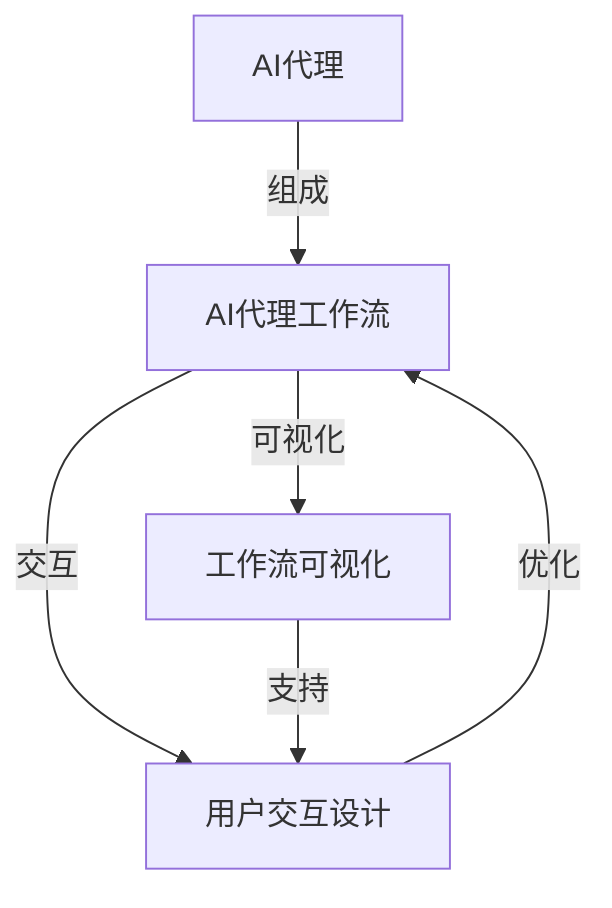

# AI人工智能代理工作流AI Agent WorkFlow：代理工作流的可视化与用户交互设计

## 1.背景介绍

### 1.1 人工智能代理的兴起

在当今快节奏的数字时代,人工智能(AI)技术已经渗透到我们生活和工作的方方面面。随着数据量的激增和计算能力的提高,AI系统不仅可以执行传统的规则驱动任务,而且还能够通过机器学习算法从大量数据中发现模式和规律,从而实现更高级的认知和决策能力。

在这种背景下,AI代理(AI Agent)的概念应运而生。AI代理是一种具有自主性的软件实体,能够感知环境、处理信息、做出决策并采取行动,以实现特定目标。它们可以作为虚拟助手、决策支持系统或自动化流程的执行者,在各个领域发挥着越来越重要的作用。

### 1.2 AI代理工作流的重要性

对于复杂的AI系统,通常需要多个AI代理协同工作才能完成复杂的任务。这就需要一个明确定义的工作流程,来协调不同代理之间的交互和任务分配。AI代理工作流(AI Agent Workflow)正是为了解决这一问题而产生的。

AI代理工作流描述了一系列有序的步骤,定义了不同AI代理之间的依赖关系、数据流转、条件分支和异常处理等细节。它确保了AI系统的高效运行,避免了代理之间的冲突和资源浪费。同时,工作流还可以提高系统的可维护性、可扩展性和可审计性,使得复杂的AI应用更加可控和可靠。

### 1.3 可视化和用户交互的重要性

尽管AI代理工作流在技术层面上极为复杂,但对于最终用户来说,他们更关注的是如何高效地利用AI系统来完成特定任务。因此,工作流的可视化和良好的用户交互设计就变得至关重要。

可视化技术可以将抽象的工作流程以图形化的形式呈现,使得复杂的流程逻辑一目了然。用户可以清晰地看到每个步骤的执行情况、数据流转路径以及潜在的瓶颈等,从而更好地理解和优化整个流程。

良好的用户交互设计则使得用户能够方便地启动、监控和干预工作流的执行。用户可以根据实际需求调整参数、插入新的步骤或者重新分配资源,使工作流更加贴合具体的应用场景。同时,交互设计还应该考虑可访问性和易用性,确保不同技能水平的用户都能高效地使用AI系统。

综上所述,AI代理工作流的可视化与用户交互设计是实现高效、可控的AI系统的关键因素。本文将深入探讨这一主题,为读者提供理论基础和实践指导。

## 2.核心概念与联系

在深入探讨AI代理工作流的可视化与用户交互设计之前,我们需要先理解几个核心概念及其内在联系。

### 2.1 AI代理(AI Agent)

AI代理是一种自主的软件实体,能够感知环境、处理信息、做出决策并采取行动,以实现特定目标。AI代理可以分为以下几种类型:

1. **反应型代理(Reactive Agent)**: 根据当前的感知数据做出直接反应,没有内部状态或记忆能力。
2. **基于模型的代理(Model-based Agent)**: 利用内部模型对环境状态进行推理,并基于此做出决策。
3. **基于目标的代理(Goal-based Agent)**: 具有特定目标,并采取行动以实现这些目标。
4. **基于效用的代理(Utility-based Agent)**: 根据效用函数(Utility Function)来评估不同行为的"价值",并选择效用最大的行为。
5. **学习型代理(Learning Agent)**: 能够从经验中学习,并不断优化自身的决策过程。

不同类型的AI代理具有不同的能力和复杂程度,在实际应用中需要根据具体需求进行选择和组合。

### 2.2 AI代理工作流(AI Agent Workflow)

AI代理工作流定义了多个AI代理之间的交互和协作方式,描述了一系列有序的步骤来完成复杂任务。工作流中的每个步骤可以由一个或多个AI代理来执行,代理之间可以传递数据和控制信号。

工作流通常可以表示为有向无环图(Directed Acyclic Graph, DAG),其中节点代表任务步骤,边代表数据和控制流。工作流还可以包含条件分支、并行执行、异常处理等高级结构,以满足复杂应用场景的需求。

### 2.3 工作流可视化(Workflow Visualization)

工作流可视化是将抽象的工作流过程以图形化的形式呈现,使其更加直观和易于理解。常见的可视化技术包括:

1. **流程图(Flow Chart)**: 使用标准符号(如矩形、菱形等)表示不同类型的步骤和决策点。
2. **时序图(Sequence Diagram)**: 展示不同代理之间的交互顺序和时间关系。
3. **甘特图(Gantt Chart)**: 直观地显示任务的开始时间、持续时间和依赖关系。
4. **动画和仿真(Animation and Simulation)**: 以动态的方式演示工作流的执行过程。

可视化技术不仅有助于理解和优化工作流本身,还可以用于监控和调试正在运行的工作流实例。

### 2.4 用户交互设计(User Interaction Design)

用户交互设计旨在为用户提供直观、高效的方式来启动、监控和控制AI代理工作流。良好的交互设计应该考虑以下几个方面:

1. **用户界面(User Interface)**: 包括布局、控件、导航等视觉和交互元素的设计。
2. **可访问性(Accessibility)**: 确保不同技能水平和能力的用户都能方便地使用系统。
3. **用户体验(User Experience)**: 提供流畅、直观和富有吸引力的用户体验。
4. **个性化和自定义(Personalization and Customization)**: 允许用户根据自身需求调整系统设置和工作流参数。
5. **安全性和隐私保护(Security and Privacy)**: 采取适当的措施保护用户数据和系统安全。

用户交互设计与工作流可视化密切相关,两者的有机结合可以极大地提高AI系统的可用性和用户满意度。

### 2.5 核心概念之间的联系

上述核心概念之间存在紧密的联系,如下图所示:

AI代理是工作流的基本构建块,多个代理通过协作完成复杂任务。工作流可视化技术使抽象的工作流过程变得直观和易于理解,而用户交互设计则让用户能够方便地启动、监控和控制工作流。可视化和交互设计相互支持,共同优化了整个AI代理工作流的效率和可用性。

只有将这些核心概念有机地结合起来,才能构建出真正高效、可靠和用户友好的AI系统。接下来,我们将深入探讨每个概念的细节和实现方法。

## 3.核心算法原理具体操作步骤

在上一节中,我们介绍了AI代理工作流的核心概念及其内在联系。现在,让我们深入探讨一些核心算法原理和具体的操作步骤。

### 3.1 工作流建模和表示

#### 3.1.1 有向无环图(DAG)表示

工作流通常可以用有向无环图(Directed Acyclic Graph, DAG)来表示。在DAG中,每个节点代表一个任务步骤,边表示步骤之间的依赖关系和数据流转。DAG的拓扑排序可以确定步骤的执行顺序,并避免循环依赖。

具体的建模步骤如下:

1. 确定工作流中的所有任务步骤,将每个步骤表示为一个节点。
2. 对于每个步骤,识别它所依赖的前置步骤,并在图中连接相应的边。
3. 检查图是否存在环路,如果存在,则需要进行重构以消除循环依赖。
4. 对图进行拓扑排序,确定步骤的执行顺序。

#### 3.1.2 工作流模式(Workflow Patterns)

除了基本的序列和并行结构外,工作流还可以包含更复杂的控制流模式,如条件分支、循环、异常处理等。这些模式可以使用特定的图形符号或XML标记来表示。

一些常见的工作流模式包括:

- **序列(Sequence)**: 按顺序执行一系列步骤。
- **并行分支(Parallel Split)**: 将控制流分成多个并行分支。
- **同步(Synchronization)**: 等待多个并行分支完成后再继续执行。
- **互斥选择(Exclusive Choice)**: 根据条件选择一个分支执行。
- **简单合并(Simple Merge)**: 将多个分支合并为一个控制流。
- **循环(Loop)**: 重复执行一个或多个步骤。
- **异常处理(Exception Handling)**: 捕获和处理异常情况。

通过组合这些模式,可以构建出复杂的工作流逻辑。

#### 3.1.3 工作流描述语言

为了方便地定义和交换工作流模型,需要使用标准的工作流描述语言。常见的语言包括:

- **BPMN(Business Process Model and Notation)**: 一种基于图形符号的标准化建模语言,广泛应用于业务流程管理领域。
- **BPEL(Business Process Execution Language)**: 基于XML的执行语言,用于定义Web服务之间的交互和组合。
- **YAWL(Yet Another Workflow Language)**: 一种基于Petri网的工作流语言,具有良好的形式化基础和表达能力。

这些语言提供了标准的语法和语义,使工作流模型可以在不同系统之间共享和执行。

### 3.2 工作流调度和执行

#### 3.2.1 任务分配和资源管理

在执行工作流时,需要将每个任务步骤分配给合适的AI代理或资源来执行。这个过程需要考虑代理的能力、可用性、负载情况等因素,以实现高效的任务分配和资源利用。

常见的任务分配和资源管理算法包括:

- **基于规则的分配**: 根据预定义的规则将任务分配给符合条件的代理。
- **基于优先级的分配**: 根据任务优先级和代理能力进行匹配和分配。
- **基于成本优化的分配**: 以最小化执行成本或最大化资源利用率为目标进行分配。
- **动态负载均衡**: 根据代理的实时负载情况动态调整任务分配。

除了任务分配,还需要管理代理的生命周期、监控代理状态、处理代理故障等。

#### 3.2.2 工作流实例管理

每次执行工作流时,都会创建一个工作流实例。实例管理器需要跟踪每个实例的执行状态、数据上下文、日志信息等,以确保工作流的正确执行和可审计性。

实例管理的主要步骤包括:

1. **实例创建**: 根据工作流模型创建新的实例,初始化上下文数据。
2. **任务调度和分发**: 根据工作流逻辑和任务分配策略,将任务分发给相应的代理执行。
3. **状态跟踪**: 持续监控每个任务和整个实例的执行状态。
4. **数据传递**: 在步骤之间传递所需的数据和上下文信息。
5. **异常处理**: 捕获和处理执行过程中的异常情况。
6. **实例完成**: 当所有任务完成时,标记实例为完成状态,进行必要的清理工作。

实例管理器还需要提供恢复和重试机制,以应对代理故障或网络中断等异常情况。

#### 3.2.3 工作流监控和优化

为了确保工作流的高效执行,需要持续监控工作流实例的运行状态,包括每个步骤的执行时间、代理负载、数据流量等指标。基于这些指标,可以发现潜在的瓶颈和优化机会。