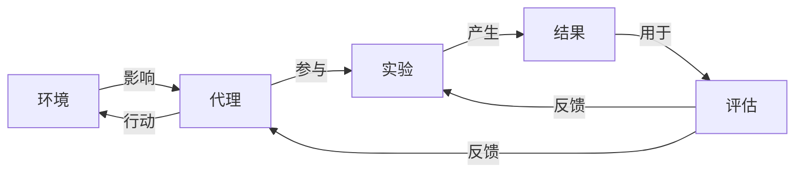

## 1.背景介绍

人工智能（AI）已经渗透到我们生活的方方面面。从自动驾驶汽车到智能家居，从自然语言处理到计算机视觉，AI已经改变了我们的生活方式。然而，AI的实现并非易事，尤其是在复杂的仿真环境中。这就是本文要探讨的主题：AI代理工作流（AI Agent Workflow）。

AI代理工作流是设计、实施、测试和评估AI代理的一种结构化方法。它包括了从环境定义到代理设计，再到实验设计和结果评估的所有步骤。通过这个工作流，我们可以更有效地开发和评估AI代理，以确保它们在仿真环境中的表现达到预期。

## 2.核心概念与联系

在AI代理工作流中，有几个核心概念需要我们理解：环境，代理，实验和评估。

环境是AI代理所在的世界，它定义了AI代理可以执行的操作，以及这些操作的结果。环境可以是真实的，如物理世界，也可以是虚拟的，如计算机游戏。

代理是在环境中行动的实体。它接收环境的状态，做出决策，然后执行操作。这个过程通常是通过一种称为策略的函数来完成的。

实验是在特定环境中运行代理以测试其性能的过程。实验的设计需要考虑到环境的特性，代理的能力，以及我们想要测量的性能指标。

评估是对实验结果的分析。它包括了对代理性能的定量和定性评估，以及对实验过程的反思和改进。

这些概念之间的关系可以用以下的Mermaid流程图表示：



## 3.核心算法原理具体操作步骤

AI代理的设计和实现通常涉及到多个算法，包括决策制定算法，学习算法，优化算法等。在这里，我们将以强化学习（Reinforcement Learning，RL）为例，介绍AI代理工作流的核心算法原理和具体操作步骤。

1. **环境定义**：首先，我们需要定义AI代理的操作环境。在强化学习中，环境通常被定义为一个马尔可夫决策过程（Markov Decision Process，MDP），包括状态集合，动作集合，状态转移函数，奖励函数等。

2. **代理设计**：然后，我们需要设计AI代理，包括其策略函数和学习算法。在强化学习中，策略函数通常用神经网络来表示，学习算法可以是Q-learning，Policy Gradient等。

3. **实验设计**：接下来，我们需要设计实验，包括实验的目标，实验的次数，每次实验的步数等。在强化学习中，实验的目标通常是最大化累计奖励，实验的次数和步数需要根据问题的复杂性和计算资源来决定。

4. **结果评估**：最后，我们需要评估实验结果，包括代理的性能，学习的稳定性，学习的速度等。在强化学习中，代理的性能通常用平均累计奖励来衡量，学习的稳定性和速度可以通过学习曲线来观察。

## 4.数学模型和公式详细讲解举例说明

在AI代理工作流中，有许多数学模型和公式。在这里，我们将以强化学习中的Q-learning为例，详细讲解和举例说明。

Q-learning是一种基于值函数的强化学习算法。它的目标是学习一个Q函数$Q(s,a)$，表示在状态$s$下执行动作$a$的长期回报的期望值。

Q-learning的核心是以下的更新公式：

$$
Q(s,a) \leftarrow Q(s,a) + \alpha [r + \gamma \max_{a'} Q(s',a') - Q(s,a)]
$$

其中，$s$和$a$是当前的状态和动作，$r$是执行动作$a$后获得的奖励，$s'$是执行动作$a$后的新状态，$a'$是在新状态$s'$下的最优动作，$\alpha$是学习率，$\gamma$是折扣因子。

这个公式的含义是，我们用当前的奖励$r$和新状态$s'$下的最大Q值$\max_{a'} Q(s',a')$来更新当前的Q值$Q(s,a)$。学习率$\alpha$控制了更新的速度，折扣因子$\gamma$控制了对未来回报的考虑程度。

## 5.项目实践：代码实例和详细解释说明

在这一部分，我们将以一个简单的强化学习项目为例，展示AI代理工作流的实践过程。我们将使用Python和OpenAI Gym库来实现一个Q-learning代理，它将在CartPole环境中学习如何平衡一个倒立的杆子。

首先，我们需要导入所需的库，并定义环境和代理：

```python
import gym
import numpy as np

env = gym.make('CartPole-v1')
n_states = env.observation_space.shape[0]
n_actions = env.action_space.n

Q = np.zeros((n_states, n_actions))
```

然后，我们可以定义Q-learning的更新公式，并进行实验：

```python
alpha = 0.5
gamma = 0.95
n_episodes = 1000
n_steps = 200

for i_episode in range(n_episodes):
    s = env.reset()
    for t in range(n_steps):
        a = np.argmax(Q[s])
        s_next, r, done, info = env.step(a)
        if done:
            Q[s,a] = Q[s,a] + alpha * (r - Q[s,a])
        else:
            Q[s,a] = Q[s,a] + alpha * (r + gamma * np.max(Q[s_next]) - Q[s,a])
        s = s_next
        if done:
            break
```

最后，我们可以评估代理的性能：

```python
n_tests = 100
total_reward = 0
for i_test in range(n_tests):
    s = env.reset()
    for t in range(n_steps):
        a = np.argmax(Q[s])
        s, r, done, info = env.step(a)
        total_reward += r
        if done:
            break
print('Average reward:', total_reward / n_tests)
```

## 6.实际应用场景

AI代理工作流可以广泛应用于各种场景。例如，在自动驾驶领域，我们可以定义一个仿真环境，包括道路，交通，天气等因素，设计一个自动驾驶代理，进行实验和评估。在电子商务领域，我们可以定义一个用户购物环境，设计一个推荐系统代理，进行实验和评估。在游戏领域，我们可以定义一个游戏环境，设计一个游戏AI代理，进行实验和评估。无论在哪个领域，AI代理工作流都可以帮助我们更有效地开发和评估AI代理。

## 7.工具和资源推荐

在AI代理工作流的实践过程中，有许多工具和资源可以帮助我们。例如，OpenAI Gym是一个提供各种标准化环境的库，我们可以用它来测试我们的AI代理。TensorFlow和PyTorch是两个强大的深度学习框架，我们可以用它们来实现复杂的策略函数和学习算法。还有一些在线课程和教程，如Coursera的强化学习专项课程，DeepMind的UCL深度强化学习课程等，可以帮助我们深入理解AI代理工作流的理论和实践。

## 8.总结：未来发展趋势与挑战

AI代理工作流是一个强大的工具，可以帮助我们更有效地开发和评估AI代理。然而，它也面临着一些挑战。例如，如何设计更复杂的环境，如何处理更大的状态空间和动作空间，如何提高学习的效率和稳定性等。未来的发展趋势可能包括更复杂的环境模型，更高效的学习算法，更智能的评估方法等。

## 9.附录：常见问题与解答

1. **Q: 什么是AI代理工作流？**

    A: AI代理工作流是设计、实施、测试和评估AI代理的一种结构化方法。它包括了从环境定义到代理设计，再到实验设计和结果评估的所有步骤。

2. **Q: 什么是环境，代理，实验和评估？**

    A: 环境是AI代理所在的世界，代理是在环境中行动的实体，实验是在特定环境中运行代理以测试其性能的过程，评估是对实验结果的分析。

3. **Q: 什么是强化学习和Q-learning？**

    A: 强化学习是一种通过与环境交互来学习最优行为的方法，Q-learning是一种基于值函数的强化学习算法。

作者：禅与计算机程序设计艺术 / Zen and the Art of Computer Programming