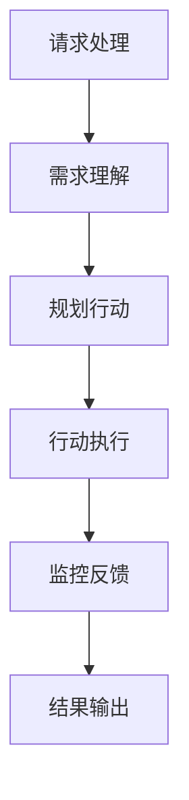

以下是题为"AI人工智能代理工作流AI Agent WorkFlow：智能代理在公共服务系统中的应用"的技术博客正文：

# AI人工智能代理工作流AI Agent WorkFlow：智能代理在公共服务系统中的应用

## 1.背景介绍

### 1.1 公共服务系统的重要性

公共服务系统是现代社会的重要组成部分,为市民提供各种基本的生活服务,如交通、医疗、教育、社会保障等。随着城市化进程的加快和人口的不断增长,公共服务的需求也在持续增加。因此,提高公共服务系统的效率和质量,优化资源配置,成为了当前的迫切需求。

### 1.2 人工智能在公共服务中的应用

人工智能(AI)技术在近年来得到了长足的发展,展现出广阔的应用前景。将AI技术应用于公共服务系统,可以极大提高服务的智能化水平,提升运营效率和服务质量。AI代理作为一种智能系统,能够根据用户需求自主完成特定任务,在公共服务领域大有可为。

### 1.3 AI代理的工作流程

AI代理的工作流程是指代理从接收任务请求到完成任务的全过程,包括理解用户需求、规划行动路径、执行具体操作、监控反馈等多个环节。合理设计AI代理的工作流程,对于提高代理的工作效率和服务质量至关重要。

## 2.核心概念与联系

### 2.1 智能代理(Intelligent Agent)

智能代理是一种具有自主性、反应性、主动性和持续时间概念的软件实体。它能够感知环境,根据设定的目标做出理性决策,并在环境中采取行动以完成特定任务。

智能代理包含以下几个核心概念:

1. **感知器(Sensors)**: 用于获取环境信息的组件
2. **效应器(Actuators)**: 用于对环境产生影响的组件 
3. **状态(State)**: 描述代理当前条件的数据结构
4. **规则(Rules)**: 指导代理行为的条件-行为规则集

### 2.2 AI代理工作流

AI代理工作流是指代理从接收任务请求到完成任务的全过程,主要包括以下几个环节:

1. **请求处理**: 接收并解析用户请求
2. **需求理解**: 分析用户意图,明确任务目标
3. **规划行动**: 根据规则生成行动计划序列
4. **行动执行**: 通过效应器执行具体操作
5. **监控反馈**: 跟踪行动效果,根据需要调整计划
6. **结果输出**: 将任务执行结果反馈给用户



### 2.3 公共服务系统中的AI代理应用

在公共服务系统中,AI代理可以扮演多种角色,如:

- **服务导航代理**: 根据用户需求推荐合适的服务
- **流程代理**: 协助用户办理复杂的服务流程  
- **咨询代理**: 提供专业领域的在线咨询服务
- **监控代理**: 实时监测系统运行状态,预警潜在风险

通过部署AI代理,公共服务系统可以提高服务的智能化和自动化水平,从而优化资源配置,提升用户体验。

## 3.核心算法原理具体操作步骤  

### 3.1 需求理解算法

需求理解是AI代理工作流的关键环节。常用的需求理解算法包括:

1. **基于规则的算法**:使用预定义的规则模板匹配用户输入,提取关键信息。
2. **基于机器学习的算法**:利用标注语料训练分类或序列标注模型,自动识别用户意图和槽位信息。

以基于机器学习的算法为例,具体操作步骤如下:

1. **数据标注**:构建包含用户查询及其对应意图和槽位信息的标注语料库
2. **特征工程**:将用户查询转化为特征向量,如词袋(BOW)、TF-IDF等
3. **模型训练**:使用逻辑回归、支持向量机等算法训练分类或序列标注模型
4. **模型评估**:在保留的测试集上评估模型性能,如准确率、F1等指标
5. **模型调优**:根据评估结果调整特征、算法参数等,重复训练评估直至满足要求
6. **模型部署**:将训练好的模型集成到AI代理系统中,用于实时需求理解

### 3.2 规划行动算法

规划行动的目标是根据代理当前状态和任务需求,生成一系列合理有效的行动序列。常用算法有:

1. **启发式搜索算法**:使用评价函数对节点进行打分,如A*、IDA*等
2. **规划领域特定语言(PDDL)**:基于PDDL对问题进行形式化描述,使用Planner进行求解

以A*搜索算法为例,其操作步骤为:

1. **定义状态空间**:根据问题领域确定可能的状态集合
2. **定义初始状态和目标状态**:分别对应问题的起点和终点
3. **定义行动集**:可执行的有效行动及其代价
4. **设计评价函数**:估计从当前状态到目标状态的总代价
5. **构建搜索树**:从初始状态开始,基于评价函数展开搜索树
6. **搜索最优路径**:找到从初始状态到目标状态的最小代价路径序列

### 3.3 行动执行与监控反馈

行动执行是指AI代理通过效应器对环境产生影响,以实现既定目标。监控反馈则是跟踪行动执行效果,并根据需要调整规划。

1. **行动执行**:遍历规划好的行动序列,通过与环境交互的效应器执行具体操作
2. **状态更新**:根据行动执行结果更新代理的当前状态
3. **监控反馈**:比较当前状态与预期状态,判断是否需要重新规划
4. **重新规划(如需)**:如果检测到偏差,则重新执行规划行动算法,生成新的行动序列

该环节的关键是建立代理与环境的交互机制,并设计合理的监控反馈策略,以确保任务能够高效准确地完成。

## 4.数学模型和公式详细讲解举例说明

### 4.1 马尔可夫决策过程(MDP)

马尔可夫决策过程是描述AI代理与环境交互的数学框架,可用于需求理解、规划行动等多个环节。一个MDP可形式化定义为$\langle S, A, T, R \rangle$:

- $S$是有限状态集合
- $A$是有限行动集合  
- $T(s, a, s')=P(s'|s, a)$是状态转移概率
- $R(s, a, s')$是在状态$s$执行行动$a$转移到$s'$时获得的奖励

在MDP中,代理的目标是找到一个策略$\pi: S \rightarrow A$,使得期望累积奖励$\sum_t \gamma^t R(s_t, a_t, s_{t+1})$最大化,其中$\gamma \in [0, 1]$是折扣因子。

常用的求解MDP的算法有价值迭代和策略迭代等。以价值迭代为例,算法步骤为:

1) 初始化$V(s)=0, \forall s \in S$
2) 重复直到收敛:
$$V(s) \leftarrow \max_{a \in A} \Big\{R(s, a) + \gamma \sum_{s' \in S}T(s, a, s')V(s')\Big\}$$
3) 得到最优策略:
$$\pi^*(s) = \arg\max_{a \in A} \Big\{R(s, a) + \gamma \sum_{s' \in S}T(s, a, s')V(s')\Big\}$$

通过建模为MDP,AI代理可以学习出最优的策略,指导其在特定环境下的行为决策。

### 4.2 多智能体马尔可夫博弈(Markov Game)

在复杂的公共服务系统中,通常存在多个AI代理同时与环境交互。这种情况可以用多智能体马尔可夫博弈(Markov Game)来描述,定义为$\langle N, S, \{A_i\}, T, \{R_i\}\rangle$:

- $N$是智能体个数
- $S$是有限状态集合
- $A_i$是第$i$个智能体的有限行动集合
- $T(s, a_1, \ldots, a_N, s')$是状态转移概率
- $R_i(s, a_1, \ldots, a_N, s')$是第$i$个智能体获得的奖励

每个智能体的目标是最大化自身的期望累积奖励。由于智能体的行动会相互影响,求解最优策略需要考虑其他智能体的行为。

一种常用的求解算法是迭代逼近最优响应(Iterated Removal of Strict Dominances),步骤如下:

1) 初始化每个智能体的策略为均匀随机策略
2) 重复直到收敛:
   - 对每个智能体$i$,固定其他智能体的策略,求解最优响应策略$\pi_i^*$
   - 更新智能体$i$的策略为$\pi_i^*$
3) 得到纳什均衡解

通过建模为多智能体马尔可夫博弈,可以研究多个AI代理在公共服务系统中的协作行为,实现高效的资源分配和任务调度。

## 5.项目实践:代码实例和详细解释说明

为了更好地理解AI代理在公共服务系统中的应用,我们以医疗服务导航为例,构建一个简单的智能导航代理系统。

### 5.1 需求场景

某市民想要就诊,但不太清楚哪些医院可以提供所需的服务。他可以通过智能导航代理查询,代理会根据用户的症状信息,推荐合适的医院及科室。

### 5.2 系统架构


系统主要包括以下几个模块:

1. **需求理解模块**:识别用户输入的症状信息
2. **规划模块**:根据症状查询合适的医院和科室 
3. **导航模块**:从数据库获取医院信息,并输出给用户
4. **数据库**:存储医院、科室、症状等相关数据

### 5.3 代码实现(Python)

#### 需求理解模块

```python
import numpy as np
from sklearn.feature_extraction.text import TfidfVectorizer
from sklearn.naive_bayes import MultinomialNB

# 训练数据
symptoms = ["头痛", "头晕", "发烧", "咳嗽", "腹痛", "便秘"]
labels = [0, 0, 1, 1, 2, 2]

# 特征提取和模型训练
vectorizer = TfidfVectorizer()
X = vectorizer.fit_transform(symptoms)
clf = MultinomialNB().fit(X, labels)

# 需求理解
def understand(query):
    X_new = vectorizer.transform([query])
    y_pred = clf.predict(X_new)[0]
    if y_pred == 0:
        return "神经内科"
    elif y_pred == 1:
        return "呼吸内科" 
    else:
        return "消化内科"
        
# 示例        
user_input = "我最近一直拉肚子"
department = understand(user_input)
print(f"建议就诊科室: {department}")
```

该模块使用TF-IDF特征和朴素贝叶斯分类器对症状信息进行分类,输出建议就诊的科室。

#### 规划和导航模块

```python
# 医院数据
hospitals = {
    "神经内科": ["市一医院", "市三医院"],
    "呼吸内科": ["市二医院", "市三医院"],
    "消化内科": ["市一医院", "市二医院"]
}

def plan(department):
    return hospitals[department]
    
def navigate(hospital_list):
    print("推荐就诊医院:")
    for hospital in hospital_list:
        print(f"- {hospital}")
        
# 示例
department = "消化内科"
candidates = plan(department)
navigate(candidates)
```

规划模块根据建议科室查询可就诊的医院列表,导航模块则将