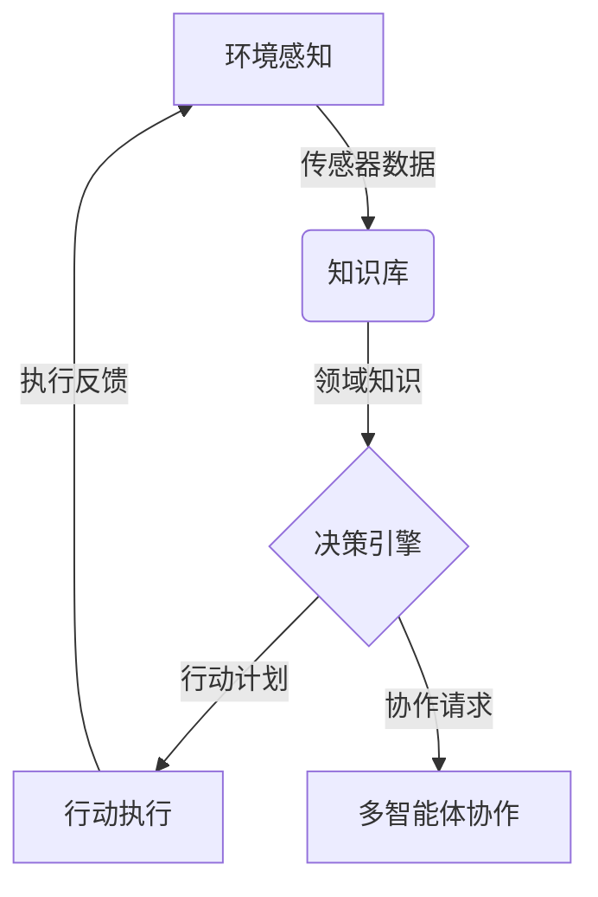

# AI人工智能代理工作流AI Agent WorkFlow：智能代理在农业自动化系统中的应用

## 1.背景介绍

### 1.1 农业自动化的重要性

随着世界人口的不断增长和气候变化的挑战,确保粮食安全和可持续农业发展变得至关重要。农业自动化系统通过将人工智能(AI)、物联网(IoT)和机器人技术整合到农业生产中,为提高农业效率和可持续性提供了有前景的解决方案。

### 1.2 智能代理在农业自动化中的作用

智能代理,作为人工智能系统的一个关键组成部分,在农业自动化中扮演着重要角色。它们可以收集和处理来自各种传感器的数据,进行智能决策,并协调执行相应的行动,如控制灌溉系统、调节温室环境或指导农机作业。

### 1.3 AI Agent Workflow概述

AI Agent Workflow描述了智能代理在农业自动化系统中的工作流程,包括感知环境、决策规划和行动执行等关键步骤。它融合了多种人工智能技术,如机器学习、知识表示和规划算法,使智能代理能够自主高效地完成复杂的农业任务。

## 2.核心概念与联系

### 2.1 智能代理的定义

智能代理是一种自主的软件实体,能够感知环境、处理信息、做出决策并采取行动以实现特定目标。在农业自动化系统中,智能代理需要具备以下核心能力:

1. **感知能力**:通过各种传感器收集农场数据,如土壤湿度、温度、作物生长状态等。
2. **认知能力**:基于所获取的数据和领域知识,对农场状况进行理解和推理。
3. **决策能力**:根据认知结果,运用决策算法制定行动计划,如调节灌溉、施肥或采收等。
4. **行动能力**:通过控制执行器(如阀门、机械臂等)执行决策行动。
5. **交互能力**:与其他智能代理、人工操作员等进行协作和通信。

### 2.2 智能代理与其他AI技术的关系

智能代理是一种综合性的AI系统,需要融合多种AI技术,包括但不限于:

- **机器学习**:用于从农场数据中提取模式和知识,如作物生长模型、土壤湿度预测等。
- **知识表示与推理**:构建农业领域的本体知识库,支持智能代理的推理和决策。
- **规划算法**:生成高效的行动计划序列,优化农场操作。
- **多智能体系统**:支持多个智能代理之间的协作,实现复杂任务的分工合作。

### 2.3 AI Agent Workflow与传统农业自动化的区别

相比于传统的基于规则的农业自动化系统,AI Agent Workflow具有以下优势:

1. **自适应性**:智能代理可以根据动态变化的环境做出智能响应,而不是简单执行预设的规则。
2. **高效决策**:利用机器学习和优化算法,智能代理能够生成更高效的决策方案。
3. **可扩展性**:通过构建模块化的智能代理系统,可以方便地扩展和集成新功能。
4. **人机协作**:智能代理可以与人工操作员协同工作,发挥人机优势互补的作用。

## 3.核心算法原理具体操作步骤 

### 3.1 AI Agent Workflow总体架构

AI Agent Workflow的总体架构可以概括为以下几个核心模块:



1. **环境感知模块**:通过各种传感器收集农场环境数据,如气象数据、土壤数据、作物生长数据等。
2. **知识库模块**:存储农业领域知识,包括本体知识库、规则库和机器学习模型等。
3. **决策引擎模块**:基于感知数据和知识库,运用机器学习、规划等算法生成行动计划。
4. **行动执行模块**:控制执行器(如灌溉系统、机械臂等)执行决策行动。
5. **多智能体协作模块**:支持多个智能代理之间的通信协作,分工合作完成复杂任务。

### 3.2 环境感知算法

环境感知是智能代理的基础,常用的算法包括:

1. **数据融合算法**:将来自多种异构传感器的数据进行融合,获得更准确完整的环境表示。
2. **噪声滤波算法**:去除传感器数据中的噪声,提高数据质量。
3. **特征提取算法**:从原始数据中提取有意义的特征,为后续的模式识别和决策提供支持。

### 3.3 决策算法

决策算法是智能代理的核心,常用算法包括:

1. **机器学习算法**:
    - 监督学习(如决策树、支持向量机等),用于建模并预测作物生长、土壤状况等。
    - 无监督学习(如聚类算法),用于发现农场数据中的潜在模式。
    - 强化学习,通过试错学习获得优化的决策策略。
2. **规划算法**:
    - 启发式搜索算法(如A*算法),用于生成高效的行动计划序列。
    - 约束规划算法,在满足多种约束条件下生成可行的行动计划。
3. **多智能体决策算法**:
    - 协作过滤算法,通过信息交换实现智能代理间的决策协作。
    - 博弈论算法,用于分析多智能体间的策略互动。

### 3.4 行动执行算法

1. **控制算法**:用于控制各种执行器(如灌溉阀门、机械臂等)的运动和动作。
2. **轨迹规划算法**:为移动执行器(如无人机、无人车等)生成平滑、无碰撞的运动轨迹。
3. **故障诊断与容错算法**:监测执行器状态,及时发现并处理故障,提高系统的鲁棒性。

## 4.数学模型和公式详细讲解举例说明

智能代理的决策过程通常需要建立数学模型,并使用相应的公式进行计算和优化。以下是一些常见的数学模型和公式:

### 4.1 作物生长模型

作物生长模型描述了作物在不同环境条件下的生长过程,是智能决策的重要依据。一种常用的作物生长模型是基于生长度日(GDD)的模型:

$$
GDD = \sum_{i=1}^{n}(T_i - T_b)
$$

其中,
- $GDD$是生长度日的累积值
- $T_i$是第i天的平均温度
- $T_b$是作物生长的基温
- $n$是生长周期的天数

当$GDD$达到一定阈值时,作物即进入下一生育阶段。该模型可用于预测作物的开花期、成熟期等关键时间节点。

### 4.2 土壤湿度模型

准确估计土壤湿度对于制定合理的灌溉策略至关重要。一种常用的土壤湿度模型是基于水分平衡的模型:

$$
\theta_{t+1} = \theta_t + P_t - ET_t - D_t - R_t
$$

其中,
- $\theta_t$和$\theta_{t+1}$分别是t时刻和t+1时刻的土壤湿度
- $P_t$是t时段的降水量
- $ET_t$是t时段的蒸散量
- $D_t$是t时段的下渗量
- $R_t$是t时段的地表径流量

通过测量或估算各个量,可以预测未来的土壤湿度变化,从而指导灌溉决策。

### 4.3 机器人路径规划

对于需要在农场中移动的执行器(如无人机、无人车等),路径规划是一个关键问题。一种常用的路径规划算法是A*算法,它以启发式的方式搜索代价最小的路径。

设机器人当前位置为$s$,目标位置为$g$,则A*算法的评估函数为:

$$
f(n) = g(n) + h(n)
$$

其中,
- $g(n)$是从起点$s$到当前节点$n$的实际代价
- $h(n)$是从当前节点$n$到目标节点$g$的估计代价(启发函数)

算法通过不断扩展$f(n)$值最小的节点,最终找到从$s$到$g$的最优路径。

### 4.4 其他模型

根据具体应用场景,智能代理还可能需要建立其他数学模型,如:

- 农产品供需预测模型
- 温室环境控制模型
- 农机作业路线优化模型
- 多智能体决策模型
- ......

这些模型通常涉及优化理论、控制理论、博弈论等数学工具,需要专业的数理分析和建模能力。

## 5.项目实践:代码实例和详细解释说明

为了帮助读者更好地理解智能代理在农业自动化中的实际应用,我们将提供一个基于Python的代码示例,模拟一个简单的温室环境控制系统。

### 5.1 系统概述

该系统包含以下主要组件:

1. **环境模拟器**:模拟温室的温度、湿度、光照等环境状态。
2. **传感器模拟器**:模拟温度、湿度、光强传感器,提供环境数据。
3. **执行器模拟器**:模拟加热器、冷却器、遮阳装置等执行器。
4. **智能代理**:基于感知数据做出决策,控制执行器以维持理想的环境状态。

### 5.2 环境模拟器

我们首先定义`GreenhouseEnvironment`类,模拟温室环境的变化:

```python
import random

class GreenhouseEnvironment:
    def __init__(self, temp_init=20, hum_init=50, light_init=500):
        self.temp = temp_init  # 初始温度(摄氏度)
        self.hum = hum_init    # 初始湿度(%)
        self.light = light_init # 初始光照强度(lux)
        
    def step(self, temp_change, hum_change, light_change):
        # 环境状态随机变化
        self.temp += temp_change + random.uniform(-1, 1)
        self.hum += hum_change + random.uniform(-2, 2)
        self.light += light_change + random.randint(-50, 50)
        
        # 约束环境状态在合理范围内
        self.temp = max(10, min(40, self.temp))
        self.hum = max(30, min(80, self.hum))
        self.light = max(100, min(1000, self.light))
        
    def get_state(self):
        return self.temp, self.hum, self.light
```

该类维护了温室的温度、湿度和光照三个状态变量。`step()`方法模拟了环境状态的随机变化,并将状态约束在合理范围内。`get_state()`方法返回当前环境状态。

### 5.3 传感器和执行器模拟器

我们定义`Sensor`和`Actuator`类,分别模拟传感器和执行器:

```python
class Sensor:
    def __init__(self, env, noise=0.1):
        self.env = env
        self.noise = noise
        
    def get_temp(self):
        temp = self.env.get_state()[0]
        return temp + self.noise * random.uniform(-1, 1)
    
    def get_hum(self):
        hum = self.env.get_state()[1]
        return hum + self.noise * random.uniform(-1, 1)
    
    def get_light(self):
        light = self.env.get_state()[2]
        return light + self.noise * random.uniform(-1, 1)

class Actuator:
    def __init__(self, env):
        self.env = env
        
    def heat(self, amount):
        temp_change = amount
        hum_change = -0.05 * amount
        light_change = 0
        self.env.step(temp_change, hum_change, light_change)
        
    def cool(self, amount):
        temp_change = -amount
        hum_change = 0.05 * amount
        light_change = 0
        self.env.step(temp_change, hum_change, light_change)
        
    def shade(self, amount):
        temp_change = -0.1 * amount
        hum_change = 0
        light_change = -amount
        self.env.step(temp_change, hum