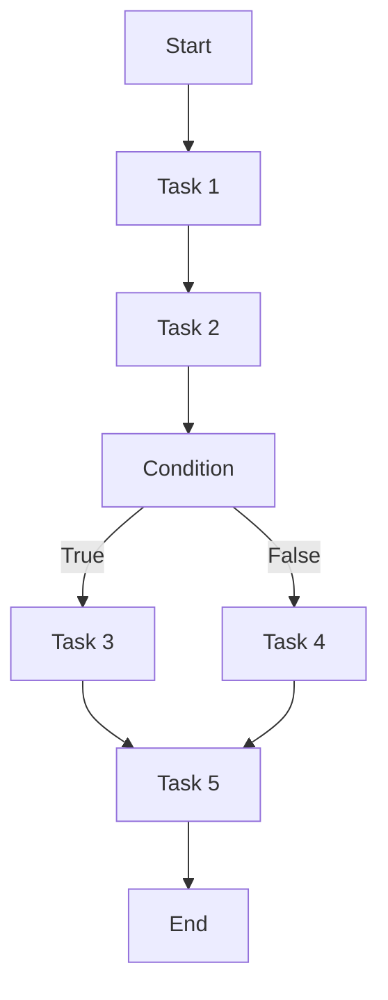

# AI人工智能代理工作流AI Agent WorkFlow：智能代理在智慧城市中的实践

## 1.背景介绍

### 1.1 智慧城市的兴起

随着城市化进程的不断加快,城市面临着日益严峻的挑战,如交通拥堵、环境污染、公共资源分配不均等。为了应对这些挑战,构建智慧城市成为了许多城市的发展目标。智慧城市是一种新型城市发展模式,它利用物联网、大数据、人工智能等先进技术,实现城市运营的智能化管理和优化,提高城市运营效率,创造更高质量的生活环境。

### 1.2 智能代理技术的重要性

在智慧城市的建设中,智能代理技术扮演着关键角色。智能代理是指能够感知环境、自主思考并采取行动的软件实体。它们可以代表人类或其他智能体执行各种任务,如数据采集、决策分析、任务调度等。通过部署智能代理,城市可以实现自动化的资源调配、服务优化和问题处理,从而提高运营效率和公共服务质量。

### 1.3 AI Agent WorkFlow概述

AI Agent WorkFlow是一种用于构建和管理智能代理的工作流程框架。它提供了一整套工具和方法,支持智能代理的设计、开发、部署和运维,使得智能代理能够高效协作,完成复杂的城市运营任务。AI Agent WorkFlow的核心思想是将城市运营过程抽象为一系列任务流程,由多个智能代理协同完成。

## 2.核心概念与联系

### 2.1 智能代理

智能代理是AI Agent WorkFlow的核心概念。一个智能代理是一个软件实体,具有以下特征:

1. 自主性(Autonomy):能够独立地感知环境并作出决策,而无需人工干预。
2. 反应性(Reactivity):能够及时响应环境的变化,并采取相应的行动。
3. 主动性(Pro-activeness):不仅被动响应环境,还能够根据自身目标主动采取行动。
4. 社会能力(Social Ability):能够与其他智能代理进行协作和协调,共同完成任务。

### 2.2 任务流程

任务流程是AI Agent WorkFlow中另一个关键概念。它描述了一系列需要完成的任务及其执行顺序。任务流程可以是线性的、并行的或者具有条件分支,以适应不同的应用场景。每个任务可以由一个或多个智能代理来执行。



上图展示了一个简单的任务流程示例,包含顺序执行、条件分支和并行执行等结构。

### 2.3 智能代理与任务流程的关系

智能代理和任务流程是相互依赖的概念。一方面,智能代理是执行任务流程中各个任务的主体;另一方面,任务流程又为智能代理的协作提供了指导和约束。在AI Agent WorkFlow中,智能代理需要根据任务流程的要求,自主地执行分配给自己的任务,并与其他代理进行协作和信息交互。

## 3.核心算法原理具体操作步骤

AI Agent WorkFlow的核心算法原理包括任务分解、智能代理选择、执行监控和异常处理等多个方面。

### 3.1 任务分解

任务分解是将一个复杂的任务流程分解为多个可执行的子任务的过程。这个过程可以采用自顶向下或自底向上的方式进行。自顶向下的方式从整体出发,将任务逐步分解为更小的子任务;而自底向上的方式则从基本任务出发,通过组合形成更复杂的任务流程。

任务分解算法的核心思想是将一个复杂的问题分解为多个相对简单的子问题,从而降低问题的复杂性,提高可解决性。常用的任务分解算法包括层次分析法(AHP)、功能分解法等。

### 3.2 智能代理选择

在完成任务分解后,需要为每个子任务选择合适的智能代理来执行。智能代理选择算法的目标是找到最优的代理组合,使得整个任务流程能够高效、可靠地执行。

智能代理选择算法需要考虑多个因素,如代理的功能、计算能力、可用性、成本等。常用的选择算法包括基于规则的匹配算法、基于约束的优化算法、基于机器学习的预测算法等。

### 3.3 执行监控

在智能代理执行任务的过程中,需要对其执行情况进行监控,以确保任务能够按预期进行。执行监控算法需要收集各个智能代理的执行数据,如执行时间、资源消耗、中间结果等,并对这些数据进行分析和评估。

常用的执行监控算法包括基于规则的异常检测算法、基于机器学习的预测算法等。如果发现异常情况,监控算法需要及时发出警报,并采取相应的处理措施。

### 3.4 异常处理

在任务执行过程中,可能会出现各种异常情况,如智能代理故障、网络中断、数据错误等。异常处理算法的目标是在异常发生时,能够及时发现并采取相应的恢复措施,使得任务流程能够继续执行或者平稳降级。

异常处理算法通常包括以下几个步骤:

1. 异常检测:发现异常情况的发生。
2. 根因分析:分析异常的原因和影响范围。
3. 恢复策略选择:根据异常类型和影响程度,选择合适的恢复策略,如重试、切换代理、任务重新分配等。
4. 执行恢复:执行选定的恢复策略,使任务流程能够继续执行或者平稳降级。
5. 反馈学习:将异常情况和处理结果记录下来,用于后续的优化和改进。

## 4.数学模型和公式详细讲解举例说明

在AI Agent WorkFlow中,数学模型和公式在多个环节发挥着重要作用,如任务分解、智能代理选择、执行监控等。下面将详细介绍其中几个典型的数学模型和公式。

### 4.1 层次分析法(AHP)

层次分析法是一种常用的多准则决策方法,可用于任务分解和智能代理选择。它将复杂的决策问题分解为多个层次,通过构建判断矩阵和计算权重,得出最优决策方案。

对于任务分解问题,AHP的基本步骤如下:

1. 建立层次结构模型
2. 构造判断矩阵
   
   设有n个决策因素$C_1,C_2,...,C_n$,通过两两比较的方式构造判断矩阵$A=(a_{ij})_{n\times n}$,其中$a_{ij}$表示因素$C_i$相对于$C_j$的重要程度。

   $$
   A=\begin{bmatrix}
   1 & a_{12} & \cdots & a_{1n} \\
   a_{21} & 1 & \cdots & a_{2n} \\
   \vdots & \vdots & \ddots & \vdots \\
   a_{n1} & a_{n2} & \cdots & 1
   \end{bmatrix}
   $$

3. 计算特征向量和一致性检验
   
   计算判断矩阵$A$的特征值$\lambda_{max}$和对应的特征向量$W$,其中$W$即为各决策因素的权重向量。同时,需要进行一致性检验,确保判断矩阵的一致性在可接受范围内。

   $$
   AW=\lambda_{max}W
   $$

4. 层次总排序并作出决策

通过上述步骤,可以得到各决策因素的权重,从而对任务进行合理的分解。

### 4.2 马尔可夫决策过程(MDP)

马尔可夫决策过程是一种强大的数学模型,可用于智能代理的决策和行为选择。在AI Agent WorkFlow中,MDP可以用于指导智能代理在不确定环境中作出最优决策。

MDP由一个五元组$(S, A, P, R, \gamma)$表示:

- $S$是状态集合,表示环境的可能状态
- $A$是行为集合,表示智能代理可执行的行为
- $P(s'|s,a)$是状态转移概率,表示在状态$s$执行行为$a$后,转移到状态$s'$的概率
- $R(s,a)$是即时奖励函数,表示在状态$s$执行行为$a$所获得的即时奖励
- $\gamma \in [0,1)$是折现因子,用于权衡即时奖励和长期累积奖励

MDP的目标是找到一个最优策略$\pi^*$,使得在任意初始状态$s_0$下,按照该策略执行可获得最大的期望累积奖励:

$$
\pi^* = \arg\max_\pi \mathbb{E}\left[\sum_{t=0}^\infty \gamma^t R(s_t, a_t) | s_0, \pi\right]
$$

其中$a_t = \pi(s_t)$表示在状态$s_t$下,按策略$\pi$选择的行为。

常用的求解MDP的算法有价值迭代法(Value Iteration)、策略迭代法(Policy Iteration)、Q-Learning等。这些算法可以用于训练智能代理的决策模型,使其能够在复杂的环境中作出最优决策。

### 4.3 贝叶斯网络

贝叶斯网络是一种基于概率论的图模型,可用于表示不确定性和因果关系。在AI Agent WorkFlow中,贝叶斯网络可以用于异常检测、根因分析和决策支持等场景。

贝叶斯网络由一个有向无环图(DAG)和一组条件概率表(CPT)组成。节点表示随机变量,有向边表示变量之间的因果关系。每个节点的CPT定义了该节点在给定父节点取值时的条件概率分布。

对于一个包含$n$个节点的贝叶斯网络$\mathcal{B}=(G, \Theta)$,其中$G$是DAG,$\Theta$是CPT集合,联合概率分布可以按如下公式计算:

$$
P(X_1, X_2, \ldots, X_n) = \prod_{i=1}^n P(X_i | \text{Parents}(X_i))
$$

其中$\text{Parents}(X_i)$表示节点$X_i$的父节点集合。

在异常检测场景中,可以将系统的各个组件建模为贝叶斯网络中的节点,通过观测到的证据(如监控数据)对网络进行概率推理,计算出异常发生的概率,从而实现异常检测。同理,贝叶斯网络也可以用于根因分析和决策支持等任务。

## 5.项目实践:代码实例和详细解释说明

为了更好地理解AI Agent WorkFlow的实现,下面将给出一个简单的Python代码示例,模拟一个智能代理执行任务流程的场景。

### 5.1 定义智能代理和任务

首先,我们定义智能代理和任务的基类:

```python
class Agent:
    def __init__(self, name):
        self.name = name
    
    def execute_task(self, task):
        print(f"Agent {self.name} executing task: {task.name}")
        # 执行任务的具体逻辑
        task.status = "completed"

class Task:
    def __init__(self, name):
        self.name = name
        self.status = "pending"
        self.agents = []
    
    def assign_agent(self, agent):
        self.agents.append(agent)
```

`Agent`类表示一个智能代理,它可以执行分配给它的任务。`Task`类表示一个任务,它可以分配给一个或多个智能代理执行。

### 5.2 定义任务流程

接下来,我们定义一个简单的任务流程,包含顺序执行、并行执行和条件分支:

```python
def create_workflow():
    # 创建智能代理
    agent1 = Agent("Agent1")
    agent2 = Agent("Agent2")
    agent3 = Agent("Agent3")

    # 创建任务
    task1 = Task("Task1")
    task2 = Task("Task2")
    task3 = Task("Task3")
    task4 = Task("Task4")
    task5 = Task("Task5")

    # 分配智能代理
    task1.assign_agent(agent1)
    task2.assign_agent(agent2)
    task3