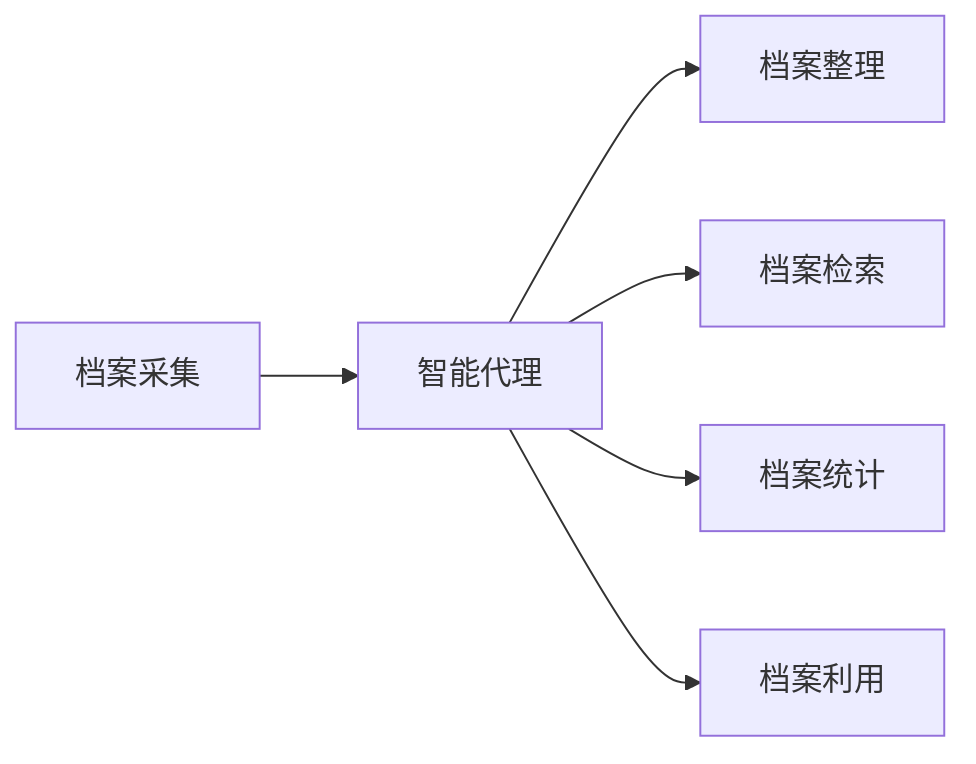

# AI人工智能代理工作流AI Agent WorkFlow：智能代理在档案管理系统中的应用

## 1.背景介绍

随着人工智能技术的快速发展,智能代理(Intelligent Agent)开始在各个领域得到广泛应用。智能代理是一种能够自主感知环境、进行推理决策并采取行动的人工智能系统。它可以根据环境的变化动态调整自身行为,从而更好地完成任务目标。

在档案管理领域,传统的人工管理方式面临着效率低下、差错率高、检索困难等诸多问题。引入智能代理技术,可以显著提升档案管理的智能化水平。智能代理可以自动对档案进行分类、提取、索引,实现高效准确的档案组织;可以根据用户需求快速检索相关档案,提供个性化的档案服务;还可以通过数据挖掘分析,发现档案中隐藏的知识和规律。

本文将重点探讨智能代理在档案管理系统中的应用,介绍智能代理的核心概念和工作原理,并结合实际案例分析其应用效果。通过本文的阐述,希望能够为档案管理领域的智能化发展提供参考和启示。

## 2.核心概念与联系

要理解智能代理在档案管理中的应用,首先需要了解几个核心概念:

### 2.1 智能代理(Intelligent Agent)
智能代理是一种能够感知环境、进行推理决策并采取行动的自主计算实体。它具有以下特点:

- 自主性:能够独立运行,无需人工干预
- 社会性:能够与其他代理或人类进行交互
- 反应性:能够感知环境变化并及时做出反应  
- 主动性:能够主动采取行动以达成目标

智能代理的内部通常由感知、推理、决策、执行等模块组成,通过感知获取外部信息,运用推理和决策能力制定行动策略,并通过执行模块来实施具体行动。

### 2.2 档案管理系统
档案管理系统是对档案进行收集、整理、保管、检索、统计和利用的信息系统。其主要功能包括:

- 档案采集:从各种渠道收集纸质或电子形式的档案文件
- 档案整理:对档案进行分类、编目、著录等整理工作
- 档案保管:将档案存储在恰当的载体中,并定期进行备份、迁移  
- 档案检索:提供条件检索、全文检索等多种档案查询方式
- 档案统计:对档案的数量、分布等进行统计分析
- 档案利用:为用户提供档案的阅览、复制、鉴定等服务

传统的档案管理系统大多依赖人工操作,智能化程度较低。引入智能代理后,可以将很多任务自动化,减轻人工负担。

### 2.3 两者联系
智能代理与档案管理系统结合,可以实现档案管理流程的自动化和智能化:

- 在档案采集环节,智能代理可以定期从指定源抓取电子档案,或通过OCR等技术自动识别纸质档案 
- 在档案整理环节,智能代理可以利用自然语言处理、模式识别等技术,自动对档案进行分类、命名、提取关键词,生成元数据
- 在档案检索环节,智能代理可以支持语义检索、关联检索、个性化推荐等高级功能  
- 在档案统计环节,智能代理可以自动生成各类统计报表,并挖掘档案使用规律
- 在档案利用环节,智能代理可以根据档案的保密等级,自动控制用户的访问权限

下图展示了智能代理与档案管理系统的结合关系:



## 3.核心算法原理具体操作步骤

智能代理的核心是其内部的推理决策机制。常见的智能代理推理决策算法有:

### 3.1 基于规则的推理
基于规则的推理通过预先定义一系列IF-THEN形式的规则,根据当前环境条件进行匹配,得出相应的结论或行动。其基本步骤如下:

1. 定义规则库,将领域知识表示为IF-THEN形式的规则
2. 接收当前环境信息,提取关键特征  
3. 根据特征与规则条件进行匹配
4. 根据匹配结果选择相应的结论或行动
5. 执行所选的行动,更新环境状态

基于规则的推理简单直观,但难以处理复杂的决策问题。而且规则库的构建和维护需要大量人工工作。

### 3.2 基于案例的推理
基于案例的推理通过对历史案例的归纳学习,对新问题进行类比推理。其基本步骤如下:  

1. 收集和存储历史案例库
2. 接收当前环境信息,提取关键特征
3. 计算当前问题与案例库中各案例的相似度
4. 选择相似度最高的案例作为参考
5. 根据参考案例给出问题的解决方案
6. 将当前问题和解决方案作为新案例加入案例库

基于案例的推理通过经验的累积和复用,可以处理一些难以用规则描述的问题。但其推理结果的质量很大程度上依赖于案例库的覆盖程度。

### 3.3 基于模型的推理
基于模型的推理通过建立决策问题的内在机理模型,根据模型进行推演和预测。其基本步骤如下:

1. 建立问题的内在机理模型,通常用有向图、状态机等形式描述
2. 接收当前环境信息,提取特征参数 
3. 将参数输入模型,进行推演预测
4. 根据推演预测结果给出决策方案
5. 执行决策方案,同时用真实反馈对模型进行校正

基于模型的推理能够揭示问题的内在规律,给出更符合因果关系的决策方案,但其对领域知识的形式化要求较高。

在实际应用中,智能代理通常结合使用多种推理决策机制,取长补短。例如,先用基于规则的方法进行粗筛,再用基于案例或模型的方法进行精细决策。

## 4.数学模型和公式详细讲解举例说明

接下来我们用一个简单的数学模型来说明智能代理的推理决策过程。考虑一个档案分类问题,我们希望根据档案的特征自动将其划分到预定的类别中。

### 4.1 特征表示
假设每个档案由d个特征描述,用一个d维特征向量表示:

$x = (x_1, x_2, ..., x_d)$

其中$x_i$表示第i个特征的取值。特征可以是数值型(如文件大小),也可以是类别型(如文件格式)。类别型特征需要进行适当的数值化编码。

### 4.2 分类模型
我们用一个线性分类模型来刻画档案特征与类别之间的关系。假设有k个类别,用$y \in \{1,2,...,k\}$表示档案的类别标签。定义k个d维参数向量:

$w_j = (w_{j1}, w_{j2}, ..., w_{jd}), j=1,2,...,k$

$w_j$称为第j个类别的权重向量,刻画了各特征对该类别的重要程度。再定义一个k维的偏置向量:

$b = (b_1, b_2, ..., b_k)$

则档案$x$属于第j个类别的得分为:

$z_j = w_j \cdot x + b_j = \sum_{i=1}^d w_{ji}x_i + b_j$

### 4.3 决策过程
智能代理根据上述k个类别得分,选择得分最高的类别作为预测结果:

$y = \arg\max_{j} z_j$

即档案$x$将被划分到第$y$类。这一过程可以用下面的决策函数表示:

$$f(x) = \arg\max_{j} (w_j \cdot x + b_j)$$

### 4.4 参数学习
模型中的参数$w_j$和$b_j$需要通过训练数据进行学习。给定一批已标注类别的训练档案:

$\{(x_1,y_1), (x_2,y_2), ..., (x_n,y_n)\}$

我们希望学到一组参数,使得模型在训练数据上的预测误差最小。一种常用的学习算法是梯度下降法,通过最小化下面的损失函数求解最优参数:

$$L(w,b) = \sum_{i=1}^n \log(1 + \exp(-y_i(w_{y_i} \cdot x_i + b_{y_i}))) + \lambda\sum_{j=1}^k \|w_j\|^2$$

其中$\lambda$是一个正则化系数,用于控制模型复杂度,防止过拟合。通过不断迭代更新参数,最终学习到最优的模型。

### 4.5 案例说明
假设我们要对一批档案进行类别划分,每个档案包含标题、发布时间、正文三个特征。我们可以将标题和正文表示为词向量,将发布时间转化为以天为单位的整数。假设最终每个档案表示为一个100维的特征向量。

我们希望将档案划分到三个类别:新闻、公告、通知。于是定义三个100维的权重向量$w_1,w_2,w_3$和一个3维偏置向量$b$。

现在收到一个新的档案$x=(0.3,0.1,...,0.2)$,智能代理将计算三个类别的得分:

$z_1 = w_1 \cdot x + b_1$
$z_2 = w_2 \cdot x + b_2$
$z_3 = w_3 \cdot x + b_3$

假设$z_1=2.1, z_2=0.8, z_3=1.5$,则智能代理将$x$划分到得分最高的第一类,即新闻类。

通过这个案例,我们可以看到智能代理如何利用数学模型进行推理决策。当然,实际系统中的模型可能更加复杂,特征的表示和提取也需要借助自然语言处理等技术,但基本原理是一致的。

## 5.项目实践：代码实例和详细解释说明

下面我们用Python实现一个简单的档案自动分类智能代理。该代理使用支持向量机(SVM)作为分类模型,可以根据档案的标题和关键词自动划分类别。

### 5.1 数据准备
首先我们准备一批训练数据,每个样本包含档案的标题、关键词和对应的类别标签。这里假设有三个类别:新闻、公告、通知。

```python
train_data = [
    {'title':'关于召开2023年度工作会议的通知','keywords':'2023,工作会议','label':'通知'},
    {'title':'2022年第三季度财务报告','keywords':'2022,财务报告','label':'公告'},
    {'title':'公司首席科学家荣获国家科技进步奖','keywords':'首席科学家,国家科技进步奖','label':'新闻'},
    ...
]
```

### 5.2 特征提取
接下来我们将每个样本的标题和关键词映射为特征向量。这里使用词袋(Bag-of-Words)模型,将出现过的每个词视为一个特征维度。

```python
from sklearn.feature_extraction.text import CountVectorizer

vectorizer = CountVectorizer()
corpus = [sample['title'] + ' ' + sample['keywords'] for sample in train_data]
X = vectorizer.fit_transform(corpus)
```

`CountVectorizer`会自动统计语料库中每个词的出现频次,生成一个词频矩阵`X`。`X`的每一行对应一个样本,每一列对应一个词,元素值为该词在该样本中的出现次数。

### 5.3 标签编码
将类别标签转化为数字编码,便于模型训练。

```python
from sklearn.preprocessing import LabelEncoder

encoder = LabelEncoder()
y = encoder.fit_transform([sample['label'] for sample in train_data])
```

`LabelEncoder`会将不同的类别标签映射为一组连续的整数,例如`新闻->0, 公告->1, 通知->2`。

### 5.4 模型训练
使用SVM模型进行训练,寻找最优的分类边界。

```python
from sklearn.svm import SVC

model = SVC()
model.fit(X, y)
```

`SVC`是SVM的一种实现,通过最大