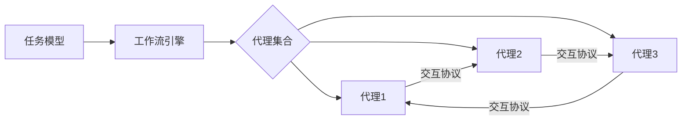

# AI人工智能代理工作流AI Agent WorkFlow：智能代理在能源管理系统中的应用

## 1.背景介绍
### 1.1 能源管理系统面临的挑战
随着全球能源需求的不断增长和可再生能源的快速发展,高效、智能化的能源管理系统变得越来越重要。传统的能源管理系统面临着诸多挑战,例如:
- 能源供需平衡的动态优化
- 分布式能源系统的协调控制
- 海量能源数据的实时处理和分析
- 能源系统的故障诊断和容错控制
- 能源系统的安全防护

这些挑战对能源管理系统的智能化水平提出了更高的要求。

### 1.2 人工智能在能源领域的应用现状
人工智能技术的飞速发展为解决上述能源管理挑战提供了新的思路和方法。目前,人工智能在能源领域已有广泛应用,主要包括:

- 需求预测:利用机器学习算法对建筑、工厂等用能设备的能耗进行预测,为能源优化调度提供依据。
- 运行优化:通过强化学习等算法对能源系统的运行参数进行动态优化,提高能源利用效率。
- 故障诊断:基于深度学习模型对海量传感器数据进行分析,及时发现能源设备的异常和故障。  
- 能源交易:利用区块链和多智能体技术构建安全高效的能源交易平台。

### 1.3 智能代理技术及其优势
智能代理(Intelligent Agent)是一种具有自主性、社会性、反应性、主动性等特征的计算机程序。它能够感知环境,根据自身知识和目标做出决策,并通过执行动作对环境施加影响。将智能代理引入能源管理系统,可以带来如下优势:

- 提高系统自治性:代理可自主完成监控、分析、决策、控制等任务,减少人工干预。
- 增强系统鲁棒性:多个代理可并行工作,单个代理的失效不影响整个系统。
- 实现可扩展性:可方便地增加或删减代理,满足能源系统规模变化的需求。
- 支持灵活协作:代理之间可以通过协商机制实现任务分解与协同。

因此,智能代理是实现能源管理系统智能化的一种很有前景的技术途径。本文将重点探讨将智能代理工作流应用于能源管理的相关理论、方法和案例。

## 2.核心概念与联系
### 2.1 智能代理的定义与特征
智能代理是一种驻留在某个环境中,能够自主地、持续地感知环境信息,根据知识推理做出决策,并通过执行动作来实现特定目标的计算机程序。一个典型的智能代理通常具有以下特征:

- 自主性:代理能够在没有外界直接干预的情况下进行决策和行动。
- 社会性:代理能够与环境中的其他代理或人类进行通信、协商与合作。  
- 反应性:代理能够及时感知环境的变化并做出相应的反应。
- 主动性:代理不仅能被动地响应,还能主动地执行任务以实现目标。
- 学习性:代理能够从自身的经验中学习,不断提高完成任务的能力。

### 2.2 代理工作流的概念与组成
将多个智能代理组织起来协同完成复杂任务的过程,称为代理工作流(Agent Workflow)。在能源管理领域,代理工作流可用于建模各类管理任务,如监控、调度、控制、交易等。一个代理工作流通常由以下几个部分组成:

- 代理集合:参与工作流的多个智能代理,每个代理承担特定的角色和任务。
- 任务模型:对整个管理任务的层次化、结构化描述,明确任务的目标、约束条件等。
- 交互协议:规定了代理之间交换信息的语法、语义以及交互的时序。
- 工作流引擎:负责解释任务模型,驱动代理按照既定的流程协同工作。

下图给出了一个典型的代理工作流的组成示意:



### 2.3 智能代理与能源管理的关联
能源管理系统是一个复杂的人-机-环境混合系统,涉及能源设备监控、生产调度、需求侧响应、电力交易等多个任务。引入智能代理技术后,可以将这些任务映射为代理工作流中的不同角色:

- 监控代理:负责收集和融合能源设备的状态信息。
- 调度代理:负责优化能源生产与存储设备的出力,保证电力平衡。
- 需求响应代理:负责分析和引导用户的能源消费行为。
- 交易代理:负责参与电力市场交易,争取经济效益最大化。

这些代理按照预定的任务模型,通过彼此交互协作,共同完成能源系统的优化管理,提高能源利用效率,促进能源系统的安全、经济、环保运行。

## 3.核心算法原理具体操作步骤
智能代理的核心是其决策算法,即如何根据所掌握的知识和信息,推理出合理的动作方案。常见的代理决策算法可分为以下三类:

### 3.1 基于规则的决策
这类算法使用一组预先定义好的IF-THEN规则来进行推理决策。具体步骤如下:

1. 知识表示:将领域知识抽象为一系列产生式规则。
2. 规则匹配:根据当前环境信息,找出所有满足条件的规则。
3. 冲突消解:从满足条件的规则中选出一条或多条适用的规则。
4. 规则执行:执行规则中THEN部分所规定的动作。
5. 环境更新:动作改变环境状态,进入下一轮决策。

基于规则的决策算法简单直观,但缺乏灵活性,难以处理复杂多变的环境。

### 3.2 基于效用的决策
该算法为每个动作定义一个效用函数,度量该动作对于目标的贡献。然后选择具有最大期望效用的动作。步骤如下:

1. 效用定义:针对每个可能的动作,定义其效用函数U(s,a)。
2. 效用计算:根据当前状态s,计算每个动作a的期望效用。
3. 动作选择:选择具有最大期望效用的动作a*。
4. 动作执行:执行选定的动作a*。
5. 环境更新:动作改变环境状态,进入下一轮决策。

基于效用的决策需要准确定义效用函数,能够权衡行动的长期收益。

### 3.3 基于强化学习的决策
强化学习通过不断地试错和反馈,使代理学会最优的决策策略。常见的强化学习算法包括Q学习、Sarsa、Policy Gradient等。以Q学习为例,其步骤为:

1. Q值初始化:随机初始化各状态-动作对(s,a)的Q值。
2. 动作选择:在状态s下,以ε-greedy的方式选择动作a。
3. 动作执行:执行动作a,环境反馈即时奖励r和下一状态s'。 
4. Q值更新:根据(s,a,r,s')更新Q(s,a)值:
$$Q(s,a) \leftarrow Q(s,a)+\alpha[r+\gamma \max _{a'} Q(s',a')-Q(s,a)]$$
其中α为学习率,γ为折扣因子。
5. 状态转移:将当前状态更新为s',重复步骤2-5,直至达到终止状态。

强化学习能够在未知环境中学习出最优策略,但需要大量的试错和训练时间。

## 4.数学模型和公式详细讲解举例说明
为了更好地阐述智能代理工作流的理论基础,本节以能源调度优化为例,介绍相关的数学模型和公式。

### 4.1 能源调度优化模型
考虑一个由传统发电机、风电、光伏、储能等组成的能源系统。目标是在满足电力平衡等约束条件下,最小化发电成本。可建立如下优化模型:

$$
\begin{aligned}
\min \quad & \sum_{i=1}^{N_g} \sum_{t=1}^{T} C_i(P_{i,t}) \\
\text{s.t.} \quad 
& \sum_{i=1}^{N_g} P_{i,t} + P_{w,t} + P_{pv,t} + P_{s,t} = P_{d,t}, \forall t \\ 
& P_i^{min} \leq P_{i,t} \leq P_i^{max}, \forall i, \forall t\\
& P_{s}^{min} \leq P_{s,t} \leq P_{s}^{max}, \forall t\\
& E_{s,t} = E_{s,t-1} + \eta_c P_{s,t}^+\Delta t - \frac{P_{s,t}^-\Delta t}{\eta_d}, \forall t\\
& E_s^{min} \leq E_{s,t} \leq E_s^{max}, \forall t
\end{aligned}
$$

其中,$P_{i,t}$为第$i$台发电机在$t$时刻的出力,$C_i(\cdot)$为其成本函数;$P_{w,t},P_{pv,t}$分别为风电和光伏的预测出力;$P_{s,t}$为储能的充放电功率(正值表示充电,负值表示放电);$P_{d,t}$为负荷预测值;$E_{s,t}$为储能容量,受充放电效率$\eta_c,\eta_d$影响;$\Delta t$为时间步长。目标函数最小化总发电成本,约束条件包括电力平衡、发电机出力上下限、储能充放电功率及容量限制等。

### 4.2 分布式调度算法
传统的集中式优化算法难以应对大规模能源系统的调度挑战。因此,可采用多代理分布式优化的思想,每个发电机或储能设备都由一个代理控制,通过迭代协商实现全局最优。以分布式Primal-Dual算法为例:

1. 定义拉格朗日函数:
$$L(P,\lambda) = \sum_{i=1}^{N_g+1} C_i(P_i) + \sum_{t=1}^T \lambda_t(\sum_{i=1}^{N_g+1}P_{i,t}-P_{d,t})$$
其中$P_i$为第$i$个代理的决策变量向量,$\lambda_t$为时刻$t$的电力平衡对偶变量。

2. 各代理并行解如下子问题,得到$P_i^{k+1}$:
$$P_i^{k+1} = \arg\min_{P_i} C_i(P_i) + \sum_{t=1}^T P_{i,t}\lambda_t^k$$

3. 汇总各代理的出力,更新对偶变量$\lambda^{k+1}$:
$$\lambda_t^{k+1} = \lambda_t^k + \alpha(\sum_{i=1}^{N_g+1}P_{i,t}^{k+1}-P_{d,t}), \forall t$$
其中$\alpha$为步长参数。

4. 重复步骤2-3直至收敛。

该算法实现了调度任务在多个代理间的分解与协同求解,大大提高了计算效率。

## 5.项目实践：代码实例和详细解释说明
本节给出一个基于Python的能源调度代理工作流简单实现。

### 5.1 定义代理类
首先定义一个通用的`Agent`基类,作为各专门代理的父类:

```python
class Agent:
    def __init__(self, name, env):
        self.name = name
        self.env = env
        
    def perceive(self):
        """感知环境状态"""
        pass
    
    def decide(self):
        """根据状态做出决策"""
        pass
    
    def act(self):
        """执行动作,改变环境"""
        pass
```

然后定义发电机代理类`GeneratorAgent`和储能代理类`StorageAgent`,继承自`Agent`基类:

```python
class GeneratorAgent(Agent):
    def __init__(self, name, env, min_power, max_power, cost_coeff):
        super().__init__(name, env)
        self.min_power = min_power
        self.max_power = max_power
        