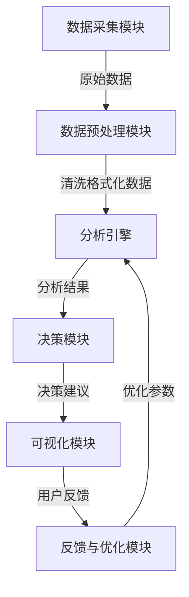

# AI人工智能代理工作流AI Agent WorkFlow：智能代理在行业研究系统中的应用

## 1.背景介绍

### 1.1 行业研究系统概述

在当今快节奏的商业环境中,行业研究系统扮演着至关重要的角色。它们为企业提供了深入洞察行业趋势、竞争格局和市场动态的宝贵资源,有助于制定明智的战略决策。然而,随着数据量的激增和分析需求的不断提高,传统的行业研究方法已经无法满足当前的需求。

### 1.2 人工智能代理的兴起

人工智能(AI)技术的飞速发展为行业研究系统带来了革命性的变化。AI代理作为智能系统的核心组成部分,凭借其强大的数据处理、模式识别和决策能力,正在重塑行业研究的范式。

### 1.3 AI代理工作流的重要性

AI代理工作流描述了代理如何与外部系统和用户交互,以及内部如何处理数据和执行任务的过程。合理设计AI代理工作流对于充分发挥其潜力至关重要。本文将探讨AI代理工作流在行业研究系统中的应用,阐述其核心概念、算法原理、实现方式和实际案例,为读者提供全面的理解和实践指导。

## 2.核心概念与联系

### 2.1 AI代理

AI代理是一种自主的软件实体,能够感知环境、处理信息、做出决策并采取行动。在行业研究系统中,AI代理可以执行各种任务,如数据收集、清洗、分析、可视化等。

### 2.2 工作流

工作流描述了一系列有序的活动,用于完成特定的业务目标。在AI代理工作流中,这些活动包括数据输入、处理、决策和输出等步骤。

### 2.3 智能代理

智能代理是指具有一定智能水平的AI代理,能够根据环境变化自主做出决策和行为调整。在行业研究系统中,智能代理可以自适应地优化分析过程,提高效率和准确性。

### 2.4 核心概念关系

AI代理、工作流和智能代理之间存在密切关系。AI代理是实现自动化分析的基础;工作流定义了代理执行任务的流程;而智能代理则赋予了系统自主学习和决策的能力,从而实现更高级的功能。这三个概念相辅相成,共同构建了高效、智能的行业研究系统。

## 3.核心算法原理具体操作步骤  

### 3.1 AI代理工作流架构

AI代理工作流的核心架构可以概括为以下几个主要组成部分:

#### 3.1.1 数据采集模块

负责从各种来源(如网络、数据库、文件等)收集相关的行业数据,包括结构化和非结构化数据。常用的数据采集技术有网络爬虫、API调用、文件读取等。

#### 3.1.2 数据预处理模块

对采集到的原始数据进行清洗、转换和标准化,以满足后续分析的需求。常见的预处理操作包括去重、填充缺失值、特征提取、数据规范化等。

#### 3.1.3 分析引擎

分析引擎是AI代理工作流的核心部分,负责对预处理后的数据进行智能分析。根据不同的分析目标和数据类型,可以采用多种算法和模型,如机器学习、自然语言处理、知识图谱等技术。

#### 3.1.4 决策模块

根据分析引擎的输出,决策模块对分析结果进行解释和评估,并提出相应的决策建议。这可能涉及到规则引擎、优化算法等技术的应用。

#### 3.1.5 可视化模块  

将分析结果和决策建议以直观的形式呈现给用户,如报表、图表、仪表板等,方便用户理解和使用。

#### 3.1.6 反馈与优化模块

通过收集用户反馈和系统运行数据,对AI代理工作流进行持续优化,提高分析精度和效率。这可能涉及到强化学习、在线学习等技术的应用。

### 3.2 关键算法步骤

AI代理工作流中的关键算法步骤包括:

#### 3.2.1 数据采集算法

- **网络爬虫算法**: 用于从网站上自动采集数据,通常包括网页解析、链接提取、去重等步骤。常用算法有BFS、DFS等图遍历算法。
- **API调用算法**: 根据API文档,构造合法的请求来获取所需数据。需要处理认证、参数构造、异常处理等问题。

#### 3.2.2 数据预处理算法

- **数据清洗算法**: 处理缺失值、异常值、重复数据等,如均值插补、基于模型的插补、去重等。
- **特征工程算法**: 从原始数据中提取有用的特征,如文本特征提取(TF-IDF、Word2Vec等)、图像特征提取(HOG、SIFT等)。
- **数据转换算法**: 将数据转换为模型可接受的格式,如One-Hot编码、标准化等。

#### 3.2.3 分析算法

- **机器学习算法**: 根据分析目标选择合适的监督学习或无监督学习算法,如回归、分类、聚类等,并对模型进行训练和调优。
- **自然语言处理算法**: 用于分析文本数据,如情感分析、主题模型、命名实体识别等,常用算法有BERT、GPT等。  
- **知识图谱算法**: 构建概念、实体及其关系的知识库,用于挖掘隐藏的知识模式,如基于规则的构建、基于embedding的构建等。

#### 3.2.4 决策算法  

- **规则引擎算法**: 根据预定义的业务规则对分析结果进行解释和决策,如决策树、专家系统等。
- **优化算法**: 在满足约束条件的前提下,寻找最优决策方案,如线性规划、动态规划等。

#### 3.2.5 可视化算法

- **统计可视化算法**: 生成各种统计图表,如柱状图、折线图、饼图等,以直观展示数据分布和趋势。
- **信息可视化算法**: 将抽象的数据转换为图形化表示,如树状图、关系图等,揭示数据内在结构和模式。

#### 3.2.6 优化算法

- **强化学习算法**: 通过试错与反馈,自动优化代理的决策策略,常用算法有Q-Learning、Policy Gradient等。  
- **在线学习算法**: 持续地从新数据中学习,不断更新模型参数,如随机梯度下降、PassiveAggressive等。

这些算法步骤有机结合,共同构建了AI代理工作流的分析和决策能力。根据具体的应用场景和需求,可以灵活选择和组合不同的算法模块。

## 4.数学模型和公式详细讲解举例说明

AI代理工作流中涉及了多种数学模型和公式,下面将对其中几个核心模型进行详细讲解。

### 4.1 机器学习模型

机器学习算法是AI代理工作流中的重要组成部分,用于从数据中自动学习模式并进行预测或决策。常见的机器学习模型包括:

#### 4.1.1 线性回归模型

线性回归模型试图学习输入特征$\boldsymbol{x}$和目标值$y$之间的线性关系,模型形式为:

$$y = \boldsymbol{w}^T\boldsymbol{x} + b$$

其中$\boldsymbol{w}$是权重向量,$b$是偏置项。通过最小化损失函数(如均方误差)来学习模型参数:

$$\min_{\boldsymbol{w},b}\frac{1}{n}\sum_{i=1}^n(y_i - \boldsymbol{w}^T\boldsymbol{x}_i - b)^2$$

线性回归模型简单高效,可用于数值预测任务。

#### 4.1.2 逻辑回归模型

逻辑回归模型用于二分类问题,通过对线性模型的输出应用 Sigmoid 函数将其映射到(0,1)区间,作为预测类别的概率:

$$p(y=1|\boldsymbol{x}) = \sigma(\boldsymbol{w}^T\boldsymbol{x} + b) = \frac{1}{1+e^{-(\boldsymbol{w}^T\boldsymbol{x} + b)}}$$

模型参数通过最大似然估计或交叉熵损失最小化来学习。

#### 4.1.3 决策树模型

决策树是一种基于树状结构的监督学习模型,通过对特征的条件判断将实例分配到不同的叶节点。决策树的构建过程可以使用信息增益或基尼系数作为选择最优特征的标准。

对于连续值特征,信息增益可以定义为:

$$\text{Gain}(D, a) = \text{Entropy}(D) - \sum_{v=1}^V \frac{|D^v|}{|D|}\text{Entropy}(D^v)$$

其中$D$是数据集,$a$是特征,$V$是该特征的可取值集合,$D^v$是特征$a$取值为$v$的子集。

决策树具有可解释性强、无需特征缩放等优点,适用于分类和回归任务。

### 4.2 自然语言处理模型

自然语言处理(NLP)是AI代理工作流中另一个重要的组成部分,用于从文本数据中提取有价值的信息。常见的NLP模型有:

#### 4.2.1 N-gram语言模型

N-gram语言模型是一种基于统计的模型,用于估计一个词序列的概率。对于长度为$n$的序列$w_1,w_2,...,w_n$,其概率可以通过链式法则分解为:

$$P(w_1,w_2,...,w_n) = \prod_{i=1}^nP(w_i|w_1,...,w_{i-1})$$

由于直接计算上式的复杂度很高,通常会做马尔可夫假设,只考虑有限的历史:

$$P(w_i|w_1,...,w_{i-1}) \approx P(w_i|w_{i-n+1},...,w_{i-1})$$

N-gram模型可用于语言建模、机器翻译等任务。

#### 4.2.2 Word2Vec模型

Word2Vec是一种将词嵌入到低维连续向量空间的技术,能够很好地捕捉词与词之间的语义关系。常见的Word2Vec模型包括CBOW(连续词袋)和Skip-gram两种。

以Skip-gram为例,给定中心词$w_t$,目标是最大化上下文词$w_{t-m},...,w_{t-1},w_{t+1},...,w_{t+m}$的条件概率:

$$\max_{\theta}\prod_{-m\leq j\leq m,j\neq0}\log P(w_{t+j}|w_t;\theta)$$

其中$\theta$是需要学习的模型参数。通过梯度下降等优化算法可以得到词向量表示。

Word2Vec模型可用于词性分析、情感分析等自然语言处理任务。

### 4.3 知识图谱模型

知识图谱是一种结构化的知识表示形式,由实体(Entity)、概念(Concept)和关系(Relation)组成。知识图谱模型能够捕捉实体之间的复杂关系,对行业研究中的知识挖掘和推理具有重要意义。

#### 4.3.1 TransE模型

TransE是一种基于翻译的知识图谱嵌入模型,将实体和关系映射到低维连续向量空间中。对于一个三元组$(h,r,t)$,TransE模型试图让$\boldsymbol{h}+\boldsymbol{r} \approx \boldsymbol{t}$成立,即头实体$h$通过关系$r$的"翻译"可以到达尾实体$t$。

模型的目标是最小化所有三元组的能量函数:

$$\mathcal{L} = \sum_{(h,r,t)\in\mathcal{S}}\sum_{(h',r',t')\in\mathcal{S}^{neg}}\max(0,\gamma + d(\boldsymbol{h}