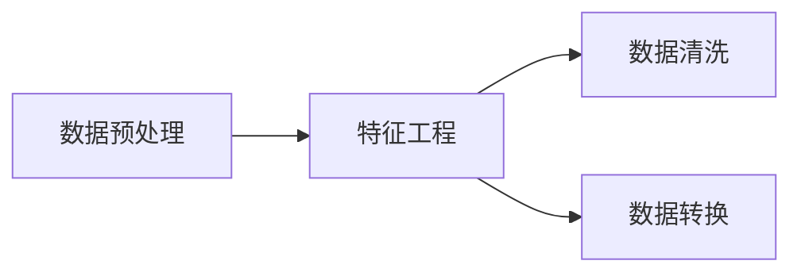

## 1.背景介绍

在当今信息化的社会，数据已经成为了一种新的资源。而如何有效地处理和利用这些数据，已经成为了科技行业中的一项重要挑战。人工智能（AI）的出现，为我们提供了一个全新的视角和工具来处理和理解数据。在这篇文章中，我们将深入探讨AI在数据处理中的应用，包括核心概念、算法原理、数学模型以及代码实例。

## 2.核心概念与联系

在AI中，数据处理主要涉及到以下几个核心概念：数据预处理、特征工程、数据清洗和数据转换。数据预处理是将原始数据转化为适合机器学习算法处理的格式的过程。特征工程是从原始数据中提取有用的信息，这些信息被称为特征，它们是机器学习模型的输入。数据清洗是去除数据中的错误和不一致性，以提高数据质量。数据转换则是将数据从一种格式转换为另一种格式，以适应不同的应用需求。



## 3.核心算法原理具体操作步骤

在AI的数据处理中，我们通常会遵循以下几个步骤：

1. 数据收集：这是数据处理的第一步，通常会从各种来源收集数据，如数据库、文件、网络等。
2. 数据预处理：包括数据清洗、数据转换和数据规范化等步骤。
3. 特征工程：从预处理后的数据中提取有用的特征，为后续的机器学习模型提供输入。
4. 数据分析：使用统计和机器学习方法对数据进行分析，以提取有价值的信息和知识。
5. 数据可视化：通过图形和图像的方式将数据分析的结果展示出来，使人们能够更直观地理解数据。


## 4.数学模型和公式详细讲解举例说明

在数据处理中，我们常常需要使用到一些数学模型和公式。例如，在特征工程中，我们可能需要使用到主成分分析（PCA）来降低数据的维度。PCA的主要思想是将$n$维特征映射到$k$维上($k<n$)，这$k$维是全新的正交特征也被称为主成分。PCA的数学表达式如下：

$$
Y=XW
$$

其中$X$是原始数据，$W$是投影矩阵，$Y$是投影后的数据。

## 5.项目实践：代码实例和详细解释说明

下面我们以Python为例，介绍如何使用AI进行数据处理。我们将使用pandas库进行数据预处理，使用sklearn库进行特征工程。

```python
import pandas as pd
from sklearn.decomposition import PCA

# 数据预处理
df = pd.read_csv('data.csv')
df = df.dropna() # 删除空值

# 特征工程
pca = PCA(n_components=2)
df_pca = pca.fit_transform(df)

# 数据可视化
plt.scatter(df_pca[:, 0], df_pca[:, 1])
plt.show()
```

## 6.实际应用场景

AI在数据处理中的应用非常广泛，包括但不限于以下几个领域：

- 金融：在金融领域，AI可以用于信用卡交易的欺诈检测，通过分析用户的交易数据，AI可以预测哪些交易可能是欺诈行为。
- 医疗：在医疗领域，AI可以用于疾病的早期预测，通过分析病人的医疗数据，AI可以预测病人可能患有哪些疾病。
- 电商：在电商领域，AI可以用于商品推荐，通过分析用户的购物数据，AI可以推荐用户可能感兴趣的商品。

## 7.工具和资源推荐

以下是一些在AI数据处理中常用的工具和资源：

- 数据处理库：pandas、numpy
- 机器学习库：scikit-learn、tensorflow
- 数据可视化库：matplotlib、seaborn
- 在线课程：Coursera的"Machine Learning"、edX的"Introduction to Artificial Intelligence (AI)"

## 8.总结：未来发展趋势与挑战

随着AI技术的不断发展，我们可以预见，AI在数据处理方面的应用将会越来越广泛。然而，这同时也带来了一些挑战，例如数据安全问题、数据质量问题等。我们需要在发展AI技术的同时，也要重视这些问题，寻找合适的解决方案。

## 9.附录：常见问题与解答

1. Q: 为什么需要进行数据预处理？
   A: 因为在实际情况中，收集到的数据往往是不完整的，包含错误的，或者格式不一致的。数据预处理的目的就是通过清洗和转换等操作，将原始数据转化为可以直接用于机器学习算法的数据。

2. Q: 什么是特征工程？
   A: 特征工程是从原始数据中提取有用的信息，这些信息被称为特征，它们是机器学习模型的输入。特征工程的目的是提高机器学习模型的性能。

3. Q: 如何选择合适的数据处理方法？
   A: 这需要根据具体的应用场景和数据特性来决定。一般来说，我们需要先理解数据的分布和结构，然后选择合适的数据处理方法。

作者：禅与计算机程序设计艺术 / Zen and the Art of Computer Programming