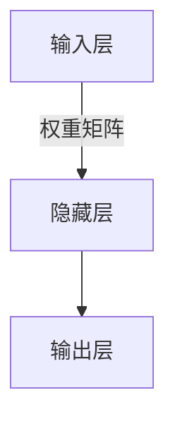

# AI人工智能核心算法原理与代码实例讲解：机器智能

## 1.背景介绍

### 1.1 人工智能的兴起

人工智能(Artificial Intelligence, AI)作为一门跨学科的研究领域,已经存在了几十年的时间。在过去的几年里,受益于计算能力的飞速提升、大数据的广泛应用以及算法的不断优化,AI技术得到了前所未有的发展,并在多个领域取得了突破性的进展。

### 1.2 AI的重要性

AI已经深深地融入到我们的日常生活中,无论是网络搜索、语音助手、推荐系统,还是自动驾驶、医疗诊断等领域,都能看到AI技术的身影。AI不仅能够提高效率,降低成本,还能帮助人类解决一些复杂的问题。因此,掌握AI核心算法原理对于开发人员、研究人员以及决策者来说都是非常重要的。

### 1.3 本文概述

本文将重点介绍AI领域中几种核心算法的原理、实现细节以及实际应用场景。我们将从算法的理论基础出发,深入探讨它们的工作原理,并通过具体的代码示例来加深读者的理解。同时,也会分析这些算法在实际应用中可能遇到的挑战和局限性,为读者提供更全面的视角。

## 2.核心概念与联系

在深入探讨具体算法之前,我们先来了解一些AI领域中的核心概念,以及它们之间的关联。

### 2.1 机器学习

机器学习(Machine Learning)是AI的一个重要分支,它赋予了计算机在没有明确程序的情况下,通过学习数据来获取知识或经验的能力。根据学习的方式不同,机器学习可以分为监督学习、非监督学习和强化学习等。

### 2.2 深度学习

深度学习(Deep Learning)是机器学习中的一个具体方法,它是一种基于对数据的表征学习,对人工神经网络进行训练和学习的算法。深度学习模型能够对复杂的非线性关系进行建模,在计算机视觉、自然语言处理等领域取得了巨大的成功。

### 2.3 神经网络

神经网络(Neural Network)是深度学习的核心模型,它是一种模拟生物神经网络的数学模型。神经网络由大量的节点(神经元)和连接它们的边(权重)组成,通过对输入数据进行层层传递和变换,最终得到输出结果。



上图展示了一个典型的神经网络结构,包括输入层、隐藏层和输出层。在训练过程中,通过调整权重矩阵中的参数值,使得神经网络能够学习到数据的内在规律。

### 2.4 优化算法

在训练神经网络时,我们需要使用优化算法来不断调整网络参数,使得模型在训练数据上的损失函数值最小化。常用的优化算法包括梯度下降(Gradient Descent)、动量优化(Momentum)、RMSProp、Adam等。

上述概念相互关联、相辅相成,共同构成了AI领域的理论基础。接下来,我们将详细介绍几种核心算法的原理和实现细节。

## 3.核心算法原理具体操作步骤

### 3.1 线性回归

线性回归是一种基础但非常重要的监督学习算法,它通过对数据集中的自变量和因变量之间的关系进行建模,来预测连续型的目标变量。线性回归的核心思想是找到一条最佳拟合直线,使得数据点到直线的欧几里德距离之和最小。

#### 3.1.1 算法原理

给定一个数据集 $\{(x_i, y_i)\}_{i=1}^{N}$,其中 $x_i$ 是输入特征向量, $y_i$ 是对应的目标值。我们希望找到一个线性函数 $f(x) = wx + b$,使得预测值 $\hat{y}_i = f(x_i)$ 与真实值 $y_i$ 之间的差异最小。

为了量化这种差异,我们定义了损失函数(Loss Function),通常使用平方损失:

$$J(w, b) = \frac{1}{2N}\sum_{i=1}^{N}(f(x_i) - y_i)^2$$

我们的目标是找到参数 $w$ 和 $b$,使得损失函数 $J(w, b)$ 最小化。这可以通过梯度下降法来实现。

#### 3.1.2 梯度下降法

梯度下降法是一种常用的优化算法,它通过沿着梯度的反方向不断更新参数,逐步逼近损失函数的最小值。对于线性回归问题,梯度下降法的更新规则如下:

$$
w := w - \alpha \frac{\partial J}{\partial w} \\
b := b - \alpha \frac{\partial J}{\partial b}
$$

其中 $\alpha$ 是学习率,控制了每次更新的步长。通过不断迭代更新,直到收敛或达到最大迭代次数。

以下是线性回归算法的伪代码:

```
初始化参数 w, b
repeat:
    计算损失函数 J(w, b)
    计算梯度 dw = ∂J/∂w, db = ∂J/∂b
    更新参数 w = w - α*dw, b = b - α*db
until 收敛或达到最大迭代次数
```

线性回归虽然简单,但在许多实际问题中都有着广泛的应用,如股票价格预测、房价估值等。

### 3.2 逻辑回归

逻辑回归是一种用于解决分类问题的算法,它可以处理二分类和多分类问题。与线性回归不同,逻辑回归的输出是一个概率值,表示输入数据属于某个类别的可能性。

#### 3.2.1 算法原理

给定一个二分类数据集 $\{(x_i, y_i)\}_{i=1}^{N}$,其中 $x_i$ 是输入特征向量, $y_i \in \{0, 1\}$ 是对应的类别标签。我们希望找到一个函数 $f(x)$,使得对于任意输入 $x$,函数输出 $\hat{y} = f(x)$ 接近于真实标签 $y$。

在逻辑回归中,我们使用 Sigmoid 函数作为激活函数:

$$f(x) = \sigma(w^Tx + b) = \frac{1}{1 + e^{-(w^Tx + b)}}$$

其中 $w$ 和 $b$ 是需要学习的参数。Sigmoid 函数的输出范围在 $(0, 1)$ 之间,可以很自然地解释为一个概率值。

为了学习参数 $w$ 和 $b$,我们定义了交叉熵损失函数(Cross-Entropy Loss):

$$J(w, b) = -\frac{1}{N}\sum_{i=1}^{N}[y_i\log f(x_i) + (1 - y_i)\log(1 - f(x_i))]$$

我们的目标是最小化损失函数 $J(w, b)$,同样可以使用梯度下降法来优化参数。

#### 3.2.2 梯度下降法

对于逻辑回归问题,梯度下降法的更新规则如下:

$$
w := w - \alpha \frac{\partial J}{\partial w} \\
b := b - \alpha \frac{\partial J}{\partial b}
$$

其中梯度的计算公式为:

$$
\frac{\partial J}{\partial w} = \frac{1}{N}\sum_{i=1}^{N}(f(x_i) - y_i)x_i \\
\frac{\partial J}{\partial b} = \frac{1}{N}\sum_{i=1}^{N}(f(x_i) - y_i)
$$

以下是逻辑回归算法的伪代码:

```
初始化参数 w, b
repeat:
    计算损失函数 J(w, b)
    计算梯度 dw = ∂J/∂w, db = ∂J/∂b
    更新参数 w = w - α*dw, b = b - α*db
until 收敛或达到最大迭代次数
```

逻辑回归在许多领域都有应用,如垃圾邮件分类、信用评分、疾病诊断等。

### 3.3 支持向量机

支持向量机(Support Vector Machine, SVM)是一种有监督的机器学习算法,它可以用于解决分类和回归问题。SVM的核心思想是找到一个最优超平面,将不同类别的数据点分开,并使得它们与超平面之间的距离最大化。

#### 3.3.1 算法原理

对于一个二分类问题,假设我们有一个训练数据集 $\{(x_i, y_i)\}_{i=1}^{N}$,其中 $x_i$ 是特征向量, $y_i \in \{-1, 1\}$ 是对应的类别标签。我们希望找到一个超平面 $w^Tx + b = 0$,使得不同类别的数据点被正确分开。

为了使超平面具有良好的泛化能力,我们希望找到一个最优超平面,使得它与最近的数据点之间的距离最大化。这个距离被称为函数间隔(Functional Margin),定义为:

$$\gamma_i = y_i(w^Tx_i + b)$$

我们的目标是最大化所有训练数据点的最小函数间隔,这相当于求解以下优化问题:

$$
\begin{align*}
\max_{\gamma, w, b} &\quad \gamma \\
\text{s.t.} &\quad y_i(w^Tx_i + b) \geq \gamma, \quad i = 1, 2, \ldots, N
\end{align*}
$$

上述优化问题可以通过引入拉格朗日乘子,转化为对偶形式,从而使用核技巧(Kernel Trick)来解决非线性可分问题。

#### 3.3.2 核函数

对于非线性可分的数据集,我们可以使用核函数(Kernel Function)将数据映射到更高维的特征空间,使得在新的特征空间中数据变为线性可分。常用的核函数包括:

- 线性核: $K(x_i, x_j) = x_i^Tx_j$
- 多项式核: $K(x_i, x_j) = (\gamma x_i^Tx_j + r)^d$
- 高斯核(RBF核): $K(x_i, x_j) = \exp(-\gamma \|x_i - x_j\|^2)$

通过使用核函数,SVM可以有效地解决非线性分类和回归问题。

以下是SVM算法的伪代码:

```
输入: 训练数据集 {(x_i, y_i)}_{i=1}^N, 核函数 K, 正则化参数 C
初始化 α = 0
repeat:
    对于每个 i = 1, 2, ..., N:
        计算误差 E_i = ∑_j α_j y_j K(x_j, x_i) - y_i
        if (0 < α_i < C) or ((y_i * E_i < -ε and α_i = 0) or (y_i * E_i > ε and α_i = C)):
            选择第二个拉格朗日乘子 α_j
            更新 α_i 和 α_j
until 收敛
计算 w = ∑_i α_i y_i x_i, b = y_k - ∑_i α_i y_i K(x_i, x_k)
```

SVM在文本分类、图像识别、生物信息学等领域有着广泛的应用。

## 4.数学模型和公式详细讲解举例说明

在上一节中,我们介绍了几种核心算法的原理和具体操作步骤。这些算法都涉及到一些数学模型和公式,现在让我们进一步深入探讨它们的细节。

### 4.1 线性回归的数学模型

在线性回归中,我们假设目标变量 $y$ 和自变量 $x$ 之间存在线性关系,即:

$$y = w^Tx + b$$

其中 $w$ 是权重向量,表示每个特征对目标变量的贡献程度; $b$ 是偏置项,表示当所有特征为0时,目标变量的值。

为了找到最优的 $w$ 和 $b$,我们定义了平方损失函数:

$$J(w, b) = \frac{1}{2N}\sum_{i=1}^{N}(y_i - w^Tx_i - b)^2$$

这个损失函数衡量了预测值与真实值之间的差异。我们的目标是最小化损失函数,即