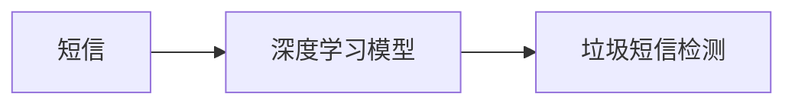

## 1.背景介绍

垃圾短信是现代通信中一个普遍存在的问题，它不仅破坏了用户的体验，而且可能会导致用户接收到欺诈信息，甚至泄露个人信息。因此，如何有效地识别和过滤垃圾短信，已经成为了通信运营商和互联网公司亟待解决的问题。近年来，随着人工智能技术的发展，特别是深度学习算法的出现，为我们提供了新的解决方案。

## 2.核心概念与联系

深度学习是机器学习的一个分支，它模仿人脑的工作原理，通过神经网络模型对数据进行高层次的抽象和理解。在垃圾短信检测中，我们可以使用深度学习算法来自动学习和识别垃圾短信的特征，从而实现准确的垃圾短信过滤。



## 3.核心算法原理具体操作步骤

在垃圾短信检测中，我们可以使用深度学习中的自然语言处理（NLP）算法，例如长短期记忆网络（LSTM）和卷积神经网络（CNN）。以下是使用这些算法进行垃圾短信检测的基本步骤：

1. 数据预处理：首先，我们需要对短信数据进行预处理，包括去除停用词、标点符号和特殊字符，以及将文本转换为数字表示。

2. 特征提取：然后，我们使用深度学习模型来自动提取短信的特征。这些特征可以包括短信的词频、词序和语义等信息。

3. 模型训练：接下来，我们使用带有标签的短信数据（即已知哪些短信是垃圾短信）来训练深度学习模型。训练过程中，模型会自动学习和调整参数，以最大化对垃圾短信的识别准确率。

4. 短信分类：最后，我们使用训练好的模型对新的短信进行分类，根据模型的预测结果，我们可以将短信分为垃圾短信和非垃圾短信。

## 4.数学模型和公式详细讲解举例说明

在深度学习模型中，我们常常使用激活函数来增加模型的非线性。例如，我们可以使用Sigmoid函数作为激活函数，其公式为：

$$
f(x) = \frac{1}{1 + e^{-x}}
$$

在这个公式中，$e$ 是自然对数的底数，$x$ 是输入信号。当$x$的值越大，$f(x)$的值越接近1，反之越接近0。这意味着，我们可以通过这个函数将任意的输入值映射到0和1之间，从而实现二分类。

在训练深度学习模型时，我们常常使用交叉熵损失函数来衡量模型的预测结果和真实标签之间的差距。其公式为：

$$
L(y, \hat{y}) = - \sum_{i} y_i \log(\hat{y_i}) + (1 - y_i) \log(1 - \hat{y_i})
$$

在这个公式中，$y$是真实标签，$\hat{y}$是模型的预测结果。当模型的预测结果越接近真实标签，交叉熵损失函数的值就越小。

## 5.项目实践：代码实例和详细解释说明

在Python中，我们可以使用Keras库来实现深度学习模型。以下是一个简单的示例代码：

```python
from keras.models import Sequential
from keras.layers import Dense, LSTM, Embedding

# 创建模型
model = Sequential()
model.add(Embedding(10000, 32))  # 嵌入层
model.add(LSTM(32))  # LSTM层
model.add(Dense(1, activation='sigmoid'))  # 输出层

# 编译模型
model.compile(optimizer='rmsprop', loss='binary_crossentropy', metrics=['acc'])

# 训练模型
model.fit(x_train, y_train, epochs=10, batch_size=32, validation_data=(x_val, y_val))
```

在这段代码中，我们首先创建了一个顺序模型，然后添加了一个嵌入层、一个LSTM层和一个输出层。嵌入层用于将短信的数字表示转换为固定长度的向量；LSTM层用于提取短信的特征；输出层用于预测短信是否为垃圾短信。然后，我们使用RMSprop优化器和交叉熵损失函数来编译模型。最后，我们使用训练数据和验证数据来训练模型。

## 6.实际应用场景

深度学习算法在垃圾短信检测中的应用已经越来越广泛。例如，通信运营商可以使用深度学习模型来自动过滤用户收到的垃圾短信；互联网公司可以使用深度学习模型来检测用户在社区或论坛中发布的垃圾信息。此外，深度学习算法还可以用于其他文本分类任务，例如情感分析、主题分类等。

## 7.工具和资源推荐

如果你想进一步学习和实践深度学习算法，以下是一些推荐的工具和资源：

- Python：一个广泛用于科学计算和数据分析的编程语言。
- Keras：一个基于Python的深度学习库，它提供了一种简洁和方便的方式来定义和训练深度学习模型。
- TensorFlow：一个强大的机器学习框架，它提供了一整套的工具和库来支持深度学习的研究和应用。
- Scikit-learn：一个基于Python的机器学习库，它提供了大量的机器学习算法和工具，包括数据预处理、模型训练和模型评估等。

## 8.总结：未来发展趋势与挑战

随着深度学习技术的发展，我们有理由相信，未来的垃圾短信检测将更加准确和高效。然而，同时我们也面临着一些挑战，例如如何处理大规模的短信数据，如何处理短信的语言和内容的多样性，如何处理垃圾短信的变化和演变等。这些问题需要我们进行更深入的研究和探索。

## 9.附录：常见问题与解答

1. **问：深度学习模型的训练需要多长时间？**

答：这取决于许多因素，包括模型的复杂度、数据的大小、计算资源的性能等。一般来说，深度学习模型的训练可能需要几分钟到几天的时间。

2. **问：深度学习模型的准确率如何？**

答：在垃圾短信检测任务中，深度学习模型的准确率通常可以达到90%以上。然而，这也取决于许多因素，包括模型的设计、数据的质量、模型的训练方法等。

3. **问：深度学习模型如何处理新的垃圾短信？**

答：深度学习模型可以通过持续的学习和更新，来适应垃圾短信的变化和演变。例如，我们可以定期使用新的垃圾短信数据来更新模型的参数。

作者：禅与计算机程序设计艺术 / Zen and the Art of Computer Programming