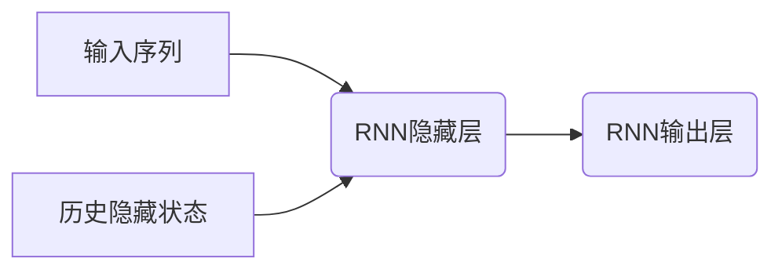
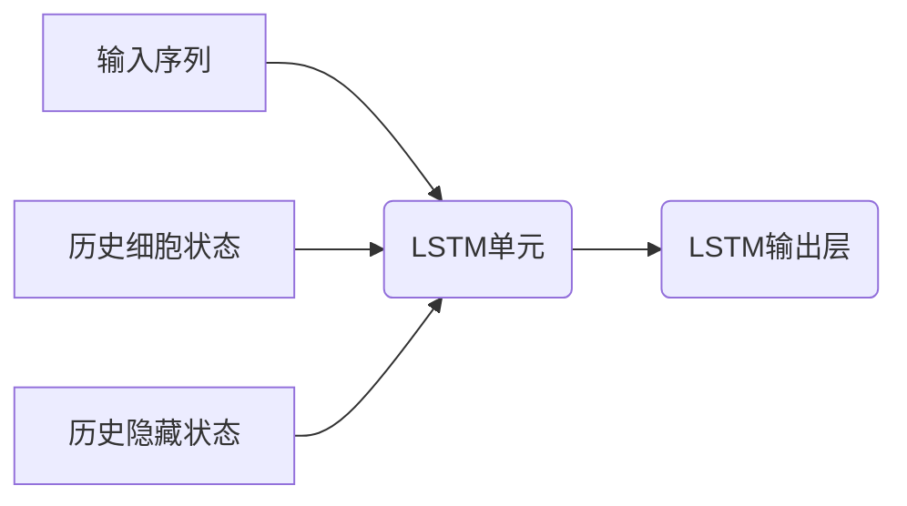
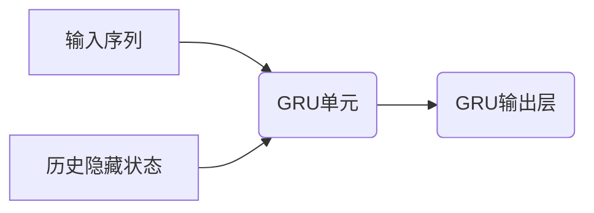
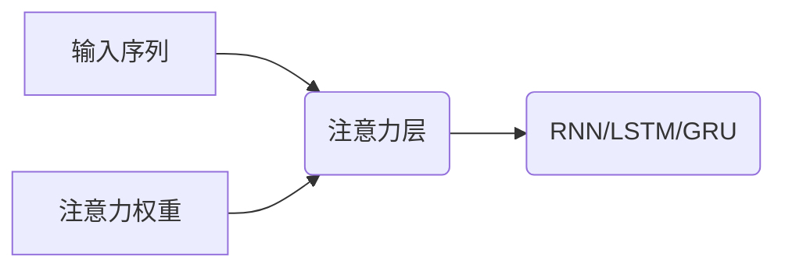
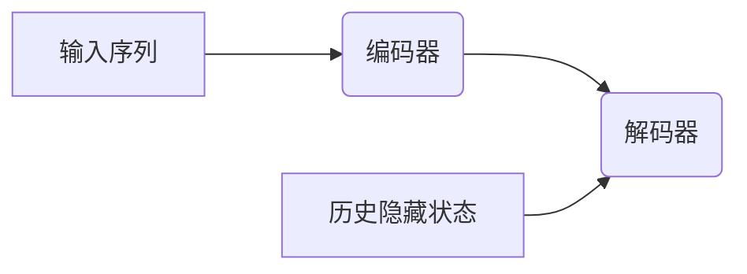
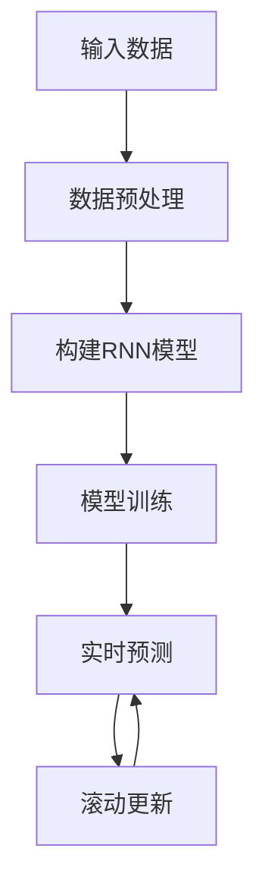
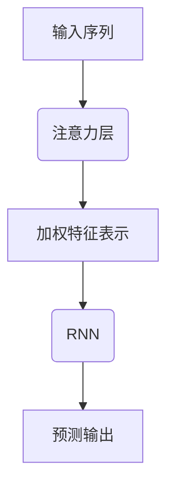
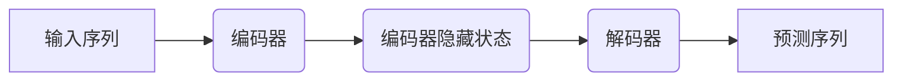

# AI人工智能深度学习算法：在实时估计中的应用

## 1.背景介绍

### 1.1 实时估计的重要性

在当今快节奏的数字时代，实时估计在各个领域扮演着至关重要的角色。无论是金融交易、网络流量监控、自动驾驶汽车还是工业控制系统,都需要对连续变化的数据进行实时估计和预测,以便做出及时的决策和响应。实时估计不仅能提高系统的效率和准确性,更能确保关键任务的安全性和可靠性。

### 1.2 传统方法的局限性

传统的实时估计方法,如卡尔曼滤波器(Kalman Filter)和粒子滤波器(Particle Filter),在处理线性系统和高斯噪声时表现出色。然而,在面对复杂的非线性系统和非高斯噪声时,这些方法往往效果不佳,估计精度和鲁棒性都受到了挑战。

### 1.3 深度学习算法的优势

近年来,深度学习算法在计算机视觉、自然语言处理等领域取得了巨大成功,展现出强大的非线性建模能力。将深度学习引入实时估计领域,有望突破传统方法的瓶颈,提供更精确、更鲁棒的解决方案。

## 2.核心概念与联系

### 2.1 递归神经网络(RNN)

递归神经网络(Recurrent Neural Network, RNN)是一种具有内部记忆的深度神经网络,能够处理序列数据。RNN在实时估计中扮演着关键角色,它可以捕捉时间序列中的动态模式,并基于历史观测值预测未来状态。



### 2.2 长短期记忆网络(LSTM)

长短期记忆网络(Long Short-Term Memory, LSTM)是RNN的一种变体,专门设计用于解决RNN在处理长序列时梯度消失或爆炸的问题。LSTM通过引入门控机制,能够更好地捕捉长期依赖关系,从而提高实时估计的性能。



### 2.3 门控递归单元(GRU)

门控递归单元(Gated Recurrent Unit, GRU)是LSTM的一种简化变体,具有更少的参数和更高的计算效率。GRU通过更新门和重置门来控制信息的流动,在保持较好性能的同时,降低了计算复杂度。



### 2.4 注意力机制

注意力机制(Attention Mechanism)是一种允许神经网络专注于输入序列中最相关部分的技术。在实时估计中,注意力机制可以帮助模型更好地捕捉关键信息,提高预测精度。



### 2.5 序列到序列模型

序列到序列模型(Sequence-to-Sequence Model)是一种将输入序列映射到输出序列的框架,常用于机器翻译、语音识别等任务。在实时估计中,序列到序列模型可以将历史观测值序列映射到未来状态序列,实现端到端的预测。



## 3.核心算法原理具体操作步骤

### 3.1 RNN实时估计算法

1. **输入数据预处理**:将连续的观测数据划分为固定长度的时间窗口,每个时间窗口作为一个输入序列。
2. **构建RNN模型**:根据问题的复杂程度,选择合适的RNN变体(vanilla RNN、LSTM或GRU)。
3. **模型训练**:使用历史数据集训练RNN模型,最小化预测误差。可以采用反向传播算法和梯度下降优化方法。
4. **实时预测**:在新的观测数据到来时,将其与最近的时间窗口数据组成新的输入序列,输入到训练好的RNN模型中,获得下一时刻的状态预测值。
5. **滚动更新**:将新的观测值添加到时间窗口,舍弃最早的观测值,形成新的输入序列,重复步骤4。



### 3.2 注意力机制增强RNN

1. **构建注意力层**:在RNN之前添加一个注意力层,用于计算输入序列中每个时间步的注意力权重。
2. **计算注意力权重**:通过注意力层,将当前隐藏状态与输入序列的每个时间步进行匹配,得到对应的注意力权重。
3. **加权求和**:将注意力权重与输入序列对应时间步的特征向量相乘,再对所有时间步求和,得到加权特征表示。
4. **输入RNN**:将加权特征表示作为RNN的输入,进行序列建模和预测。



### 3.3 序列到序列模型

1. **构建编码器**:使用RNN(或LSTM、GRU)作为编码器,对输入序列进行编码,获得最终的隐藏状态表示。
2. **构建解码器**:使用另一个RNN作为解码器,初始隐藏状态来自编码器的最终隐藏状态。
3. **序列生成**:在每个时间步,解码器根据当前隐藏状态和上一步输出,生成当前时间步的输出。
4. **训练模型**:使用序列到序列的监督数据(输入序列和目标输出序列)训练整个模型。
5. **实时预测**:将新的观测数据作为输入序列输入编码器,解码器生成对应的未来状态序列。



## 4.数学模型和公式详细讲解举例说明

### 4.1 RNN模型

RNN的核心思想是将当前输入 $x_t$ 和前一时间步的隐藏状态 $h_{t-1}$ 相结合,计算当前时间步的隐藏状态 $h_t$,并基于 $h_t$ 生成输出 $y_t$。数学表达式如下:

$$h_t = f(Wx_t + Uh_{t-1} + b)$$
$$y_t = g(Vh_t + c)$$

其中:
- $x_t$ 是当前时间步的输入
- $h_{t-1}$ 是前一时间步的隐藏状态
- $W$、$U$、$V$ 是权重矩阵
- $b$、$c$ 是偏置向量
- $f$ 和 $g$ 分别是隐藏层和输出层的激活函数,通常使用tanh或ReLU

在实时估计任务中,RNN的输出 $y_t$ 即为对应时间步的状态估计值。

### 4.2 LSTM模型

LSTM通过引入门控机制,可以更好地捕捉长期依赖关系。LSTM单元的数学表达式如下:

$$\begin{aligned}
f_t &= \sigma(W_f x_t + U_f h_{t-1} + b_f) &\text{(遗忘门)} \\
i_t &= \sigma(W_i x_t + U_i h_{t-1} + b_i) &\text{(输入门)} \\
o_t &= \sigma(W_o x_t + U_o h_{t-1} + b_o) &\text{(输出门)} \\
c_t &= f_t \odot c_{t-1} + i_t \odot \tanh(W_c x_t + U_c h_{t-1} + b_c) &\text{(细胞状态)} \\
h_t &= o_t \odot \tanh(c_t) &\text{(隐藏状态)}
\end{aligned}$$

其中:
- $f_t$、$i_t$、$o_t$ 分别是遗忘门、输入门和输出门
- $c_t$ 是当前时间步的细胞状态
- $\sigma$ 是sigmoid激活函数
- $\odot$ 表示元素wise乘积

通过门控机制,LSTM能够有选择地保留或遗忘历史信息,从而更好地捕捉长期依赖关系。

### 4.3 注意力机制

注意力机制的核心思想是为每个输入向量 $x_i$ 分配一个注意力权重 $\alpha_i$,表示其对当前任务的重要程度。加权求和后,可以得到一个上下文向量 $c$,作为RNN的输入。数学表达式如下:

$$\alpha_i = \frac{\exp(e_i)}{\sum_j \exp(e_j)}$$
$$c = \sum_i \alpha_i x_i$$

其中:
- $e_i = a(x_i, h)$ 是一个评分函数,用于衡量输入 $x_i$ 与当前隐藏状态 $h$ 的相关性
- $a$ 可以是简单的向量点乘,也可以是更复杂的函数,如多层感知机
- $\alpha_i$ 是通过softmax函数归一化后的注意力权重

通过注意力机制,模型可以自适应地关注输入序列中最相关的部分,提高预测精度。

### 4.4 序列到序列模型

序列到序列模型由编码器和解码器两部分组成。编码器将输入序列 $X = (x_1, x_2, \dots, x_T)$ 映射到一个固定长度的向量表示 $c$,解码器则根据 $c$ 生成目标序列 $Y = (y_1, y_2, \dots, y_{T'})$。数学表达式如下:

$$h_t = f(x_t, h_{t-1})$$ 
$$c = q(h_1, h_2, \dots, h_T)$$
$$p(y_t | y_1, \dots, y_{t-1}, c) = g(y_{t-1}, s_t, c)$$
$$s_t = f'(s_{t-1}, y_{t-1}, c)$$

其中:
- $f$ 和 $f'$ 分别是编码器和解码器的递归函数,通常使用RNN、LSTM或GRU
- $q$ 是一个函数,用于从编码器的所有隐藏状态中获取向量表示 $c$
- $g$ 是一个函数,用于根据上一时间步的输出 $y_{t-1}$、当前解码器隐藏状态 $s_t$ 和编码器向量表示 $c$,预测当前时间步的输出概率分布

在实时估计任务中,序列到序列模型可以将历史观测序列映射到未来状态序列,实现端到端的预测。

## 5.项目实践：代码实例和详细解释说明

本节将提供一个使用PyTorch实现的LSTM实时估计示例,用于估计一维信号的未来值。我们将逐步介绍代码的各个部分,帮助读者更好地理解深度学习在实时估计中的应用。

### 5.1 导入所需库

```python
import torch
import torch.nn as nn
import numpy as np
import matplotlib.pyplot as plt
```

### 5.2 生成示例数据

我们将使用一个简单的正弦波信号作为示例数据。

```python
# 生成示例数据
np.random.seed(1234)
time = np.linspace(0, 10, 1000)
signal = np.sin(time) + np.random.normal(0, 0.1, len(time))
```

### 5.3 数据预处理

将连续信号划分为固定长度的时间窗口,构建输入序列和目标序列。

```python
# 数据预处理
window_size = 50
X = []
Y = []
for i in range(len(signal) - window_size):
    X.append(signal[i:i+window_size])
    Y.append(signal[i+window_size])

X = np.array(X).reshape(-1, window_size, 