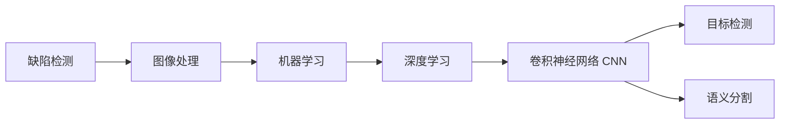

# AI人工智能深度学习算法：在缺陷检测中的应用

## 1. 背景介绍

在现代工业生产中，产品质量控制是一个至关重要的环节。传统的人工检测方法效率低下，容易受到人为因素的影响，难以满足日益增长的生产需求。随着人工智能技术的飞速发展，利用深度学习算法进行缺陷检测已成为一种新的趋势。本文将深入探讨AI深度学习在缺陷检测领域的应用，分析其核心概念、算法原理、数学模型以及实际项目实践，为读者提供全面而深入的认识。

### 1.1 缺陷检测的重要性

在工业生产过程中，产品缺陷会导致以下严重后果：

- 影响产品性能和可靠性
- 增加生产成本和维修费用  
- 降低客户满意度和品牌声誉
- 引发安全事故和法律纠纷

因此，及时准确地发现和识别产品缺陷对于保证产品质量、提高生产效率和维护企业利益至关重要。

### 1.2 传统缺陷检测方法的局限性

传统的缺陷检测主要依赖人工视觉检查和专用检测设备，存在以下局限性：

- 人工检测效率低，容易疲劳，检测结果主观性强
- 专用设备成本高，灵活性差，难以适应产品变化
- 无法适应复杂工况和微小缺陷的检测需求
- 缺乏数据积累和智能分析能力

因此，亟需一种高效、灵活、智能的缺陷检测新方法。

### 1.3 AI深度学习在缺陷检测中的优势

AI深度学习是一种模拟人脑神经网络结构，通过多层次特征提取和抽象，实现高层语义理解和智能决策的机器学习方法。将其应用于缺陷检测领域，具有以下优势：

- 强大的特征学习和表示能力，可自动提取缺陷特征
- 良好的泛化和鲁棒性，可适应不同工况和缺陷类型
- 高效的并行计算能力，可实现实时在线检测
- 海量数据训练和持续优化，可不断提升检测性能

因此，AI深度学习为缺陷检测带来了新的突破，有望彻底革新传统的检测模式。

## 2. 核心概念与联系

要理解AI深度学习在缺陷检测中的应用，需要掌握以下核心概念：

### 2.1 缺陷检测

缺陷检测是指对产品进行全面检查，识别和定位各种缺陷的过程。常见的产品缺陷类型有：裂纹、划痕、变形、锈蚀、异物等。缺陷检测的目标是找出不合格品，防止其流入后续工序或交付客户。

### 2.2 图像处理 

图像处理是指对图像进行各种变换和分析，提取有用信息的技术。常用的图像处理方法有：滤波、增强、分割、特征提取等。图像处理是缺陷检测的基础，通过对缺陷图像的处理，可以突出缺陷区域，方便后续识别和分类。

### 2.3 机器学习

机器学习是一种赋予计算机学习能力的算法，使其能够从数据中自动分析获得规律，并利用规律对未知数据进行预测。常见的机器学习任务有：分类、回归、聚类、降维等。机器学习是实现缺陷检测智能化的关键技术。

### 2.4 深度学习

深度学习是机器学习的一个重要分支，其特点是利用多层神经网络对高维数据进行表示学习，提取多层次的特征。深度学习网络可以通过训练数据自动优化网络参数，具有强大的学习和泛化能力。常见的深度学习网络有：CNN、RNN、GAN等。

### 2.5 卷积神经网络 CNN 

CNN是一种专门用于处理网格拓扑结构数据（如图像）的深度学习网络。CNN的基本组件是卷积层和池化层，通过局部连接和权值共享，可以提取图像的局部特征，具有平移不变性。CNN在图像识别领域取得了广泛成功，是缺陷检测的首选模型。

### 2.6 目标检测

目标检测是指在图像或视频中定位和识别感兴趣的目标物体的任务。常用的目标检测算法有两大类：两阶段检测器（如R-CNN系列）和单阶段检测器（如YOLO、SSD）。目标检测是缺陷检测的核心任务，通过检测缺陷目标的位置和类别，可以实现缺陷的自动识别。

### 2.7 语义分割

语义分割是指在像素级别上对图像进行分类，将每个像素划分到某一类别。与目标检测不同，语义分割可以得到目标的精确轮廓和边界。常用的语义分割网络有：FCN、U-Net、DeepLab等。语义分割可用于缺陷区域的精细定位和描述。

### 核心概念之间的联系

以上核心概念之间的联系可以用下面的Mermaid流程图表示：

从图中可以看出，缺陷检测任务首先需要对缺陷图像进行预处理，然后利用机器学习尤其是深度学习算法实现缺陷的智能识别，其中CNN是最常用的深度学习模型，可以同时用于缺陷目标检测和缺陷区域分割。

## 3. 核心算法原理具体操作步骤

本节将详细介绍几种用于缺陷检测的核心深度学习算法的原理和操作步骤。

### 3.1 CNN缺陷分类

CNN可以用于对缺陷图像进行分类，判断其是否属于某种缺陷类型。其基本步骤如下：

1. 数据准备：收集大量缺陷图像，并进行人工标注，将其划分为正常、缺陷1、缺陷2等类别。
2. 图像预处理：对原始图像进行尺寸归一化、数据增强等预处理操作。
3. 网络构建：设计或选择合适的CNN网络结构，如ResNet、DenseNet等，并根据任务需求调整网络参数。
4. 网络训练：利用准备好的数据集对网络进行训练，通过反向传播算法优化网络权重，使其能够准确分类缺陷图像。
5. 模型评估：在单独的测试集上评估训练好的模型性能，计算准确率、召回率等指标。
6. 模型应用：将训练好的模型部署到实际生产环境中，对新采集的图像进行缺陷分类。

### 3.2 Faster R-CNN缺陷检测

Faster R-CNN是一种经典的两阶段目标检测算法，可以用于检测图像中的缺陷目标。其基本步骤如下：

1. 数据准备：收集缺陷图像，并标注出每个缺陷目标的位置和类别。
2. 骨干网络：选择预训练的CNN网络（如ResNet）作为骨干网络，提取图像特征。
3. 区域建议网络RPN：在骨干网络的输出特征图上滑动一个小网络，生成候选区域建议。
4. 区域兴趣ROI Pooling：对每个候选区域进行特征聚合，得到固定尺寸的特征图。
5. 区域分类和回归：对ROI Pooling后的特征进行分类和位置回归，得到每个区域的类别和位置坐标。
6. 后处理：对预测结果进行非极大值抑制，合并重叠的检测框，得到最终的缺陷检测结果。

### 3.3 U-Net缺陷分割

U-Net是一种广泛使用的语义分割网络，可以用于精细定位缺陷区域。其基本步骤如下：

1. 数据准备：收集缺陷图像，并标注出每个像素所属的类别（正常或缺陷）。
2. 编码器：利用卷积和下采样操作提取图像的多尺度特征，得到高层语义信息。
3. 解码器：利用反卷积和上采样操作恢复特征图的空间分辨率，得到像素级别的分割结果。
4. 跳跃连接：在编码器和解码器之间添加跳跃连接，将浅层的高分辨率特征与深层的高语义特征融合，提高分割精度。
5. 损失函数：使用交叉熵损失函数衡量预测结果与真实标签之间的差异，并通过反向传播优化网络参数。
6. 后处理：对分割结果进行阈值处理，得到二值化的缺陷掩码，并计算缺陷区域的面积、周长等几何属性。

## 4. 数学模型和公式详细讲解举例说明

深度学习算法的核心是数学模型和公式，下面以CNN为例，详细讲解其中的几个关键公式。

### 4.1 卷积操作

卷积是CNN的核心操作，可以提取图像的局部特征。二维卷积的数学定义为：

$$ (f*g)(x,y) = \sum_{i=-\infty}^{\infty} \sum_{j=-\infty}^{\infty} f(i,j)g(x-i,y-j) $$

其中，$f$为输入图像，$g$为卷积核，$*$为卷积操作符。

举例说明：假设输入图像为3x3，卷积核为2x2，如下所示：

输入图像：
$$
\begin{bmatrix}
1 & 2 & 3 \\
4 & 5 & 6 \\
7 & 8 & 9
\end{bmatrix}
$$

卷积核：
$$
\begin{bmatrix}
1 & 0 \\
0 & 1
\end{bmatrix}
$$

则卷积结果为：
$$
\begin{bmatrix}
1*1+2*0+4*0+5*1 & 2*1+3*0+5*0+6*1 \\
4*1+5*0+7*0+8*1 & 5*1+6*0+8*0+9*1
\end{bmatrix}
=
\begin{bmatrix}
6 & 8 \\
12 & 14
\end{bmatrix}
$$

可以看出，卷积操作可以提取图像的局部特征，并保留空间结构信息。

### 4.2 池化操作

池化是CNN中常用的下采样操作，可以减小特征图的尺寸，提高特征的鲁棒性。最大池化的数学定义为：

$$ y(i,j) = \max_{(m,n) \in R(i,j)} x(m,n) $$

其中，$x$为输入特征图，$R(i,j)$为池化窗口，$(i,j)$为输出特征图的坐标。

举例说明：假设输入特征图为4x4，池化窗口为2x2，步长为2，如下所示：

输入特征图：
$$
\begin{bmatrix}
1 & 2 & 3 & 4\\
5 & 6 & 7 & 8\\
9 & 10 & 11 & 12\\
13 & 14 & 15 & 16
\end{bmatrix}
$$

则最大池化结果为：
$$
\begin{bmatrix}
\max(1,2,5,6) & \max(3,4,7,8) \\
\max(9,10,13,14) & \max(11,12,15,16)
\end{bmatrix}
=
\begin{bmatrix}
6 & 8 \\
14 & 16
\end{bmatrix}
$$

可以看出，最大池化可以保留特征图中的显著特征，同时降低特征图的分辨率。

### 4.3 激活函数

激活函数是CNN中用于增加网络非线性表达能力的关键组件。常用的激活函数有Sigmoid、Tanh、ReLU等。以ReLU为例，其数学定义为：

$$ f(x) = \max(0, x) $$

其中，$x$为输入特征值。

举例说明：假设输入特征值为[-1, 2, -3, 4]，则ReLU激活后的结果为：

$$
f([-1, 2, -3, 4]) = [\max(0, -1), \max(0, 2), \max(0, -3), \max(0, 