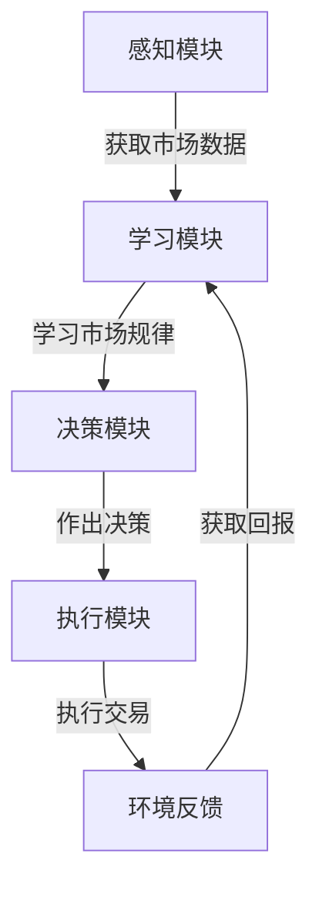

# AI人工智能深度学习算法：在股市分析中应用智能深度学习代理

## 1.背景介绍

### 1.1 股市分析的重要性

股市是一个复杂的动态系统,涉及多种因素的相互作用,包括经济指标、政治事件、公司业绩等。准确分析和预测股市走势对于投资者和金融机构来说至关重要。然而,由于影响股市的因素错综复杂,传统的分析方法往往难以获得准确的预测结果。

### 1.2 人工智能在股市分析中的应用

随着人工智能技术的不断发展,尤其是深度学习算法的兴起,人工智能在股市分析领域展现出了巨大的潜力。深度学习算法能够从海量历史数据中自动学习特征,捕捉复杂的非线性模式,从而更准确地预测股市走势。

### 1.3 智能深度学习代理的概念

智能深度学习代理是一种集成了深度学习算法的智能系统,能够自主地观察环境、学习知识并作出决策。在股市分析中,智能深度学习代理可以持续地获取市场数据、学习市场规律,并根据学习结果提供投资建议或自动执行交易策略。

## 2.核心概念与联系

### 2.1 深度学习算法

深度学习算法是人工智能领域的一个重要分支,它基于对数据的表征学习方法,能够自动学习数据的高阶抽象特征。常用的深度学习算法包括:

- 卷积神经网络(CNN)
- 循环神经网络(RNN)
- 长短期记忆网络(LSTM)
- 门控循环单元(GRU)

这些算法在图像识别、自然语言处理等领域已经取得了巨大的成功,在股市分析中也有广泛的应用。

### 2.2 强化学习

强化学习是机器学习的一个重要分支,它通过与环境的交互来学习如何获取最大的累积奖励。在股市分析中,智能代理可以将股市视为一个环境,通过不断地观察市场数据、执行交易策略并获取回报,从而学习到最优的交易策略。

常用的强化学习算法包括:

- Q-Learning
- Sarsa
- 策略梯度算法
- 深度Q网络(DQN)

### 2.3 智能代理

智能代理是一种能够感知环境、学习知识并作出决策的智能系统。在股市分析中,智能深度学习代理集成了深度学习算法和强化学习算法,能够自主地观察市场数据、学习市场规律,并根据学习结果提供投资建议或自动执行交易策略。

智能深度学习代理的核心组件包括:

- 感知模块:获取市场数据
- 学习模块:基于深度学习算法和强化学习算法学习市场规律
- 决策模块:根据学习结果作出投资决策或执行交易策略

### 2.4 核心概念联系

深度学习算法、强化学习算法和智能代理技术在股市分析中的应用是紧密相连的。深度学习算法用于从海量市场数据中学习特征,强化学习算法用于优化交易策略,而智能深度学习代理则将这两种算法集成,形成一个自主学习、决策的智能系统。

## 3.核心算法原理具体操作步骤

### 3.1 深度学习算法原理

深度学习算法的核心思想是通过构建深层神经网络模型,对输入数据进行多层次的特征抽象和转换,从而学习数据的高阶特征表示。常用的深度学习模型包括卷积神经网络(CNN)、循环神经网络(RNN)等。

以卷积神经网络为例,其工作原理可分为以下几个步骤:

1. 卷积层:通过卷积核对输入数据(如图像)进行卷积操作,提取局部特征。
2. 池化层:对卷积层的输出进行下采样,降低特征维度,提高模型的泛化能力。
3. 全连接层:将池化层的输出展平,并通过全连接层对特征进行高层次的组合和转换。
4. 输出层:根据任务目标(如分类或回归),产生最终的输出结果。
5. 反向传播:通过计算损失函数,利用梯度下降算法对网络参数进行优化。

在股市分析中,可以将历史股价数据作为输入,通过深度学习模型学习股价的特征表示,并基于这些特征进行股价预测或其他任务。

### 3.2 强化学习算法原理

强化学习算法的核心思想是通过与环境的交互,学习一个策略,使得在该策略下能获得最大的累积奖励。

以Q-Learning算法为例,其工作原理可分为以下几个步骤:

1. 初始化Q表:Q表是一个状态-行为值函数,用于估计在某个状态下执行某个行为所能获得的期望累积奖励。
2. 选择行为:根据当前状态,从Q表中选择一个行为执行,可以采用贪婪策略或ε-贪婪策略。
3. 执行行为:执行选择的行为,观察环境的反馈(下一个状态和即时奖励)。
4. 更新Q表:根据观察到的反馈,更新Q表中相应的状态-行为值。
5. 迭代训练:重复执行步骤2-4,直到Q表收敛。

在股市分析中,可以将市场状态(如股价、技术指标等)作为状态,交易行为(如买入、卖出等)作为行为,交易收益作为即时奖励。通过不断与市场环境交互,强化学习算法能够学习到一个最优的交易策略。

### 3.3 智能深度学习代理架构

智能深度学习代理是一种集成了深度学习算法和强化学习算法的智能系统,其核心架构如下:



1. 感知模块:获取市场数据,如股价、技术指标等,作为输入传递给学习模块。
2. 学习模块:集成了深度学习算法和强化学习算法,用于从市场数据中学习特征表示和交易策略。
3. 决策模块:根据学习模块的输出,作出投资决策或生成交易策略。
4. 执行模块:执行决策模块的决策,在真实市场环境中进行交易。
5. 环境反馈:获取交易的回报(收益或损失),作为强化学习算法的即时奖励,反馈给学习模块进行策略优化。

通过不断地感知、学习、决策和交互,智能深度学习代理能够持续地优化交易策略,适应市场的动态变化。

## 4.数学模型和公式详细讲解举例说明

在深度学习算法和强化学习算法中,数学模型和公式扮演着重要的角色。下面将详细讲解一些常用的数学模型和公式。

### 4.1 深度学习中的数学模型

#### 4.1.1 卷积神经网络

卷积神经网络(CNN)是深度学习中一种常用的模型,它通过卷积操作和池化操作对输入数据进行特征提取。

卷积操作的数学表达式如下:

$$
S(i, j) = (I * K)(i, j) = \sum_{m}\sum_{n}I(i+m, j+n)K(m, n)
$$

其中,$ I $表示输入数据,$ K $表示卷积核,$ S $表示卷积操作的输出特征图。

池化操作通常采用最大池化或平均池化,用于降低特征维度。最大池化的数学表达式如下:

$$
P(i, j) = \max\limits_{(m, n) \in R}I(i+m, j+n)
$$

其中,$ I $表示输入特征图,$ R $表示池化区域,$ P $表示池化操作的输出。

#### 4.1.2 循环神经网络

循环神经网络(RNN)是处理序列数据的一种深度学习模型,它能够捕捉序列数据中的长期依赖关系。

RNN的核心是一个循环单元,其数学表达式如下:

$$
h_t = f_W(x_t, h_{t-1})
$$

其中,$ x_t $表示当前时刻的输入,$ h_{t-1} $表示上一时刻的隐藏状态,$ f_W $表示由权重参数$ W $决定的非线性函数,$ h_t $表示当前时刻的隐藏状态。

常用的RNN变体包括长短期记忆网络(LSTM)和门控循环单元(GRU),它们通过引入门控机制来解决RNN的梯度消失问题。

### 4.2 强化学习中的数学模型

#### 4.2.1 马尔可夫决策过程

马尔可夫决策过程(MDP)是强化学习的基础数学模型,它描述了智能体与环境之间的交互过程。

MDP可以用一个元组$ (S, A, P, R, \gamma) $来表示,其中:

- $ S $表示状态集合
- $ A $表示行为集合
- $ P(s'|s, a) $表示在状态$ s $下执行行为$ a $后,转移到状态$ s' $的概率
- $ R(s, a) $表示在状态$ s $下执行行为$ a $获得的即时奖励
- $ \gamma \in [0, 1) $表示折现因子,用于权衡即时奖励和长期累积奖励

#### 4.2.2 Q-Learning算法

Q-Learning是一种基于时序差分的强化学习算法,它通过不断更新Q函数来学习最优策略。

Q函数$ Q(s, a) $表示在状态$ s $下执行行为$ a $所能获得的期望累积奖励,其更新规则如下:

$$
Q(s_t, a_t) \leftarrow Q(s_t, a_t) + \alpha \left[ r_t + \gamma \max_{a}Q(s_{t+1}, a) - Q(s_t, a_t) \right]
$$

其中,$ \alpha $表示学习率,$ r_t $表示在时刻$ t $获得的即时奖励,$ \gamma $表示折现因子,$ \max_{a}Q(s_{t+1}, a) $表示在下一状态$ s_{t+1} $下可获得的最大期望累积奖励。

通过不断更新Q函数,Q-Learning算法最终能够收敛到最优策略。

## 5.项目实践:代码实例和详细解释说明

为了更好地理解智能深度学习代理在股市分析中的应用,我们将通过一个实际项目来进行实践。在这个项目中,我们将构建一个基于深度Q网络(DQN)的智能代理,用于学习股票交易策略。

### 5.1 数据准备

我们将使用历史股票数据作为输入,包括开盘价、最高价、最低价、收盘价和成交量等指标。这些数据可以从金融数据提供商处获取,也可以从公开的金融数据网站下载。

为了方便起见,我们将使用Python的pandas库来加载和预处理数据。

```python
import pandas as pd

# 加载股票数据
stock_data = pd.read_csv('stock_data.csv', parse_dates=['Date'])

# 数据预处理
stock_data = stock_data.sort_values('Date')
stock_data = stock_data.dropna()
```

### 5.2 构建智能代理

我们将使用PyTorch框架来构建智能深度学习代理。首先,我们定义一个深度Q网络(DQN)模型,用于估计在不同状态下执行不同行为所能获得的期望累积奖励。

```python
import torch
import torch.nn as nn

class DQN(nn.Module):
    def __init__(self, state_size, action_size):
        super(DQN, self).__init__()
        self.fc1 = nn.Linear(state_size, 64)
        self.fc2 = nn.Linear(64, 64)
        self.fc3 = nn.Linear(64, action_size)

    def forward(self, state):
        x = torch.relu(self.fc1(state))
        x = torch.relu(self.fc2(x))
        q_values = self.fc3(x)
        return q_values
```

接下来,我们定义一个智能代理类,集成了DQN模型和强化学习算法。

```python
import random
from collections import deque

class StockTradingAgent:
    def __init__(self, state_size, action_size