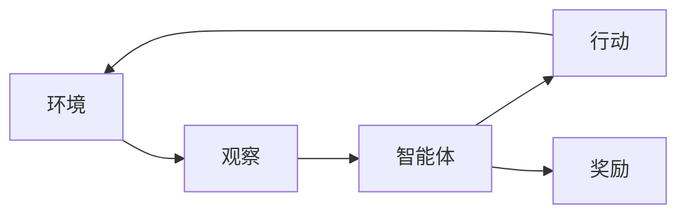
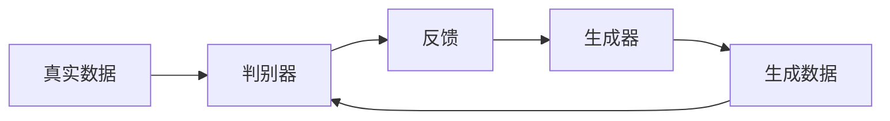

# AI人工智能深度学习算法：在视频游戏中的自适应机制

## 1.背景介绍

### 1.1 游戏行业的发展与挑战

视频游戏已经成为当今最受欢迎和最具影响力的娱乐形式之一。随着技术的不断进步,游戏的视觉效果、故事情节和交互体验都在不断提升。然而,游戏开发者面临着一个重大挑战:如何为不同水平的玩家提供适当的难度和乐趣。

### 1.2 传统游戏AI系统的局限性

传统的游戏AI系统通常采用基于规则的方法或有限状态机来控制非玩家角色(NPC)的行为。这些系统缺乏灵活性和适应性,无法根据玩家的表现动态调整游戏难度,导致游戏体验不佳。

### 1.3 人工智能在游戏中的应用前景

人工智能(AI)技术,特别是深度学习算法,为解决这一挑战提供了新的可能性。通过利用大量游戏数据和机器学习技术,AI系统可以学习玩家的行为模式,并根据玩家的技能水平动态调整游戏难度,从而提供更加个性化和富有乐趣的游戏体验。

## 2.核心概念与联系

### 2.1 深度强化学习

深度强化学习是一种将深度神经网络与强化学习相结合的技术,它允许智能体通过与环境的互动来学习如何采取最优行动,以最大化预期回报。在游戏中,深度强化学习可用于训练智能代理,使其学习如何根据玩家的行为做出适当的反应。



### 2.2 生成对抗网络(GAN)

生成对抗网络(GAN)是一种深度学习架构,由生成器和判别器两个神经网络组成。生成器旨在生成逼真的数据样本,而判别器则试图区分真实数据和生成数据。在游戏中,GAN可用于生成新的游戏内容,如关卡、敌人或武器,以增加游戏的多样性和挑战性。



### 2.3 深度学习与游戏设计

深度学习不仅可以用于控制游戏中的智能代理,还可以应用于游戏设计的各个方面,如程序生成内容、过程化生成、游戏平衡和测试等。通过利用深度学习技术,游戏开发者可以创造出更加丰富多样、具有挑战性和个性化的游戏体验。

## 3.核心算法原理具体操作步骤

### 3.1 深度Q网络(DQN)

深度Q网络(DQN)是一种基于深度神经网络的强化学习算法,它可以学习在给定状态下采取最优行动,以最大化预期的累积奖励。DQN算法的核心步骤如下:

1. 初始化深度神经网络Q(s, a; θ),用于估计在状态s下采取行动a的Q值。
2. 初始化经验回放池D,用于存储(s, a, r, s')元组。
3. 对于每个时间步t:
   a. 根据当前状态s_t,选择行动a_t = argmax_a Q(s_t, a; θ)。
   b. 执行行动a_t,观察奖励r_t和下一个状态s_(t+1)。
   c. 将(s_t, a_t, r_t, s_(t+1))存储到经验回放池D中。
   d. 从D中采样一批数据(s_j, a_j, r_j, s_(j+1))。
   e. 计算目标Q值y_j = r_j + γ max_a' Q(s_(j+1), a'; θ^-)。
   f. 优化损失函数L = Σ_j (y_j - Q(s_j, a_j; θ))^2,更新网络参数θ。

其中,θ^-表示目标网络的参数,用于计算目标Q值,以提高训练的稳定性。

### 3.2 策略梯度算法

策略梯度算法是另一种常用的深度强化学习算法,它直接学习策略函数π(a|s; θ),即在给定状态s下选择行动a的概率。策略梯度算法的核心步骤如下:

1. 初始化策略网络π(a|s; θ),用于输出在状态s下选择每个行动a的概率。
2. 对于每个时间步t:
   a. 根据当前状态s_t,从策略π(a|s_t; θ)中采样行动a_t。
   b. 执行行动a_t,观察奖励r_t和下一个状态s_(t+1)。
   c. 计算回报G_t = Σ_k γ^k r_(t+k)。
   d. 优化目标函数J(θ) = E[G_t log π(a_t|s_t; θ)],更新网络参数θ。

策略梯度算法直接优化策略函数,可以处理连续的行动空间,但训练过程通常较为不稳定。

### 3.3 Actor-Critic算法

Actor-Critic算法结合了值函数估计(Critic)和策略优化(Actor)的优点,可以提高训练的稳定性和收敛速度。Actor-Critic算法的核心步骤如下:

1. 初始化Actor网络π(a|s; θ^π)和Critic网络V(s; θ^V)。
2. 对于每个时间步t:
   a. 根据当前状态s_t,从Actor网络采样行动a_t ~ π(a|s_t; θ^π)。
   b. 执行行动a_t,观察奖励r_t和下一个状态s_(t+1)。
   c. 计算优势函数A_t = r_t + γV(s_(t+1); θ^V) - V(s_t; θ^V)。
   d. 优化Actor网络目标函数J(θ^π) = E[A_t log π(a_t|s_t; θ^π)]。
   e. 优化Critic网络目标函数L(θ^V) = E[(r_t + γV(s_(t+1); θ^V) - V(s_t; θ^V))^2]。

Actor-Critic算法可以同时学习策略函数和值函数,提高了训练的稳定性和效率。

## 4.数学模型和公式详细讲解举例说明

### 4.1 马尔可夫决策过程(MDP)

强化学习问题通常被建模为马尔可夫决策过程(MDP),它由一组元组(S, A, P, R, γ)定义:

- S是状态空间,表示环境的所有可能状态。
- A是行动空间,表示智能体可以采取的所有行动。
- P是状态转移概率,P(s'|s, a)表示在状态s下采取行动a后转移到状态s'的概率。
- R是奖励函数,R(s, a, s')表示在状态s下采取行动a并转移到状态s'时获得的奖励。
- γ是折现因子,用于权衡即时奖励和长期奖励的重要性。

智能体的目标是学习一个策略π,使得在遵循该策略时,预期的累积折现奖励最大化:

$$J(\pi) = \mathbb{E}_\pi \left[ \sum_{t=0}^\infty \gamma^t R(s_t, a_t, s_{t+1}) \right]$$

其中,期望是关于状态序列s_0, s_1, ...和行动序列a_0, a_1, ...的联合概率分布计算的。

### 4.2 Q-Learning

Q-Learning是一种基于值函数的强化学习算法,它试图直接估计在给定状态s下采取行动a的Q值,即预期的累积折现奖励:

$$Q(s, a) = \mathbb{E}_\pi \left[ \sum_{t=0}^\infty \gamma^t R(s_t, a_t, s_{t+1}) | s_0 = s, a_0 = a \right]$$

Q-Learning算法通过不断更新Q值,逐步逼近最优Q函数Q*(s, a)。更新规则如下:

$$Q(s_t, a_t) \leftarrow Q(s_t, a_t) + \alpha \left[ r_t + \gamma \max_{a'} Q(s_{t+1}, a') - Q(s_t, a_t) \right]$$

其中,α是学习率,γ是折现因子。

### 4.3 策略梯度定理

策略梯度算法直接优化策略函数π(a|s; θ),以最大化预期的累积折现奖励J(θ)。根据策略梯度定理,J(θ)关于θ的梯度可以表示为:

$$\nabla_\theta J(\theta) = \mathbb{E}_{\pi_\theta} \left[ \sum_{t=0}^\infty \nabla_\theta \log \pi_\theta(a_t|s_t) Q^{\pi_\theta}(s_t, a_t) \right]$$

其中,Q^π(s, a)是在策略π下的行动值函数,表示在状态s下采取行动a,然后遵循策略π时的预期累积折现奖励。

策略梯度算法通过采样估计梯度,并使用梯度上升法更新策略参数θ,以最大化J(θ)。

### 4.4 Actor-Critic算法的优势函数

Actor-Critic算法中,Critic网络估计值函数V(s; θ^V),而Actor网络优化策略函数π(a|s; θ^π)。Actor网络的目标函数是最大化优势函数A(s, a)关于π(a|s; θ^π)的期望:

$$J(\theta^\pi) = \mathbb{E}_{s \sim \rho^\pi, a \sim \pi_\theta} \left[ A(s, a) \right]$$

其中,优势函数A(s, a)定义为:

$$A(s, a) = Q^{\pi_\theta}(s, a) - V^{\pi_\theta}(s)$$

优势函数表示在状态s下采取行动a相对于只遵循策略π时的额外奖励。通过最大化优势函数的期望,Actor网络可以学习到更好的策略。

## 5.项目实践：代码实例和详细解释说明

在这一部分,我们将提供一个基于PyTorch实现的深度Q网络(DQN)示例,用于训练一个智能代理在经典游戏"CartPole"中平衡杆。

### 5.1 环境设置

首先,我们需要导入必要的库和定义环境:

```python
import gym
import torch
import torch.nn as nn
import torch.optim as optim
import numpy as np

# 创建CartPole环境
env = gym.make('CartPole-v1')

# 定义状态和行动空间
state_size = env.observation_space.shape[0]
action_size = env.action_space.n
```

### 5.2 深度Q网络

接下来,我们定义深度Q网络的结构:

```python
class DQN(nn.Module):
    def __init__(self, state_size, action_size):
        super(DQN, self).__init__()
        self.fc1 = nn.Linear(state_size, 64)
        self.fc2 = nn.Linear(64, 64)
        self.fc3 = nn.Linear(64, action_size)

    def forward(self, x):
        x = torch.relu(self.fc1(x))
        x = torch.relu(self.fc2(x))
        return self.fc3(x)
```

### 5.3 训练过程

下面是DQN训练过程的关键步骤:

```python
# 初始化DQN和目标网络
dqn = DQN(state_size, action_size)
target_dqn = DQN(state_size, action_size)
target_dqn.load_state_dict(dqn.state_dict())

# 初始化优化器和经验回放池
optimizer = optim.Adam(dqn.parameters())
replay_buffer = []

# 训练循环
for episode in range(num_episodes):
    state = env.reset()
    done = False
    while not done:
        # 选择行动
        action = dqn(torch.from_numpy(state).float()).max(0)[1].item()
        
        # 执行行动并观察结果
        next_state, reward, done, _ = env.step(action)
        replay_buffer.append((state, action, reward, next_state, done))
        
        # 采样批量数据并优化DQN
        if len(replay_buffer) >= batch_size:
            states, actions, rewards, next_states, dones = zip(*random.sample(replay_buffer, batch_size))
            states = torch.from_numpy(np.stack(states)).float()
            actions = torch.LongTensor(actions)
            rewards = torch.Tensor(rewards)
            next_states = torch.from_numpy(np.stack(next_states)).float()
            