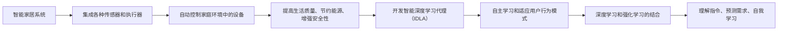

## 1.背景介绍
随着物联网（IoT）技术的飞速发展，智能家居系统已经成为现代生活的一大亮点。这些系统通过集成各种传感器和执行器，能够自动控制家庭环境中的设备，从而提高生活质量、节约能源并增强安全性。然而，要实现真正的智能化家居体验，我们需要将传统的规则-based系统和自动化脚本转变为更加灵活、自适应且具有学习能力的系统。这就要求我们开发智能深度学习代理（Intelligent Deep Learning Agents, IDLAs），它们可以自主地学习和适应用户的行为模式以及周围的环境变化。

## 2.核心概念与联系
智能深度学习代理（IDLA）是一种基于人工智能的系统，它结合了深度学习算法和强化学习的概念。深度学习允许代理从大量数据中自动提取特征并学习复杂的模式；而强化学习则使代理能够在特定的环境中通过试错来优化其行为策略。在智能家居场景中，IDLA能够理解用户的指令、预测用户的需求，并在没有明确编程的情况下进行自我学习和适应。

## 3.核心算法原理具体操作步骤
### 输入处理
首先，IDLA需要接收来自智能家居系统中各种传感器的数据流，包括温度传感器、湿度传感器、运动检测器等。这些数据经过预处理后作为输入进入深度神经网络。

### 特征提取与学习
接下来，深度神经网络自动从原始数据中提取有用的特征。这一过程通常涉及多个隐藏层和激活函数，如ReLU或Sigmoid。

### 行为决策
提取的特征随后用于训练一个强化学习模型，如Q-learning或策略梯度方法。这个模型根据当前状态和可能的下一个状态预测最佳行为（即奖励最大化的动作）。

### 适应性与自我学习
IDLA通过与环境的交互不断更新其内部模型参数。随着时间的推移，代理能够更好地预测用户的偏好并作出更加智能的决策。

## 4.数学模型和公式详细讲解举例说明
以Q-learning为例，它是一种无模型的强化学习算法，其核心目标是最大化以下期望值：
$$
Q(s, a) = \\mathbb{E}\\left[r + \\gamma \\max_a Q(s', a') | s, a\\right]
$$
其中，$Q(s, a)$是状态$s$下采取动作$a$的预期回报；$r$为立即奖励；$\\gamma$是折扣因子，用于平衡当前奖励与未来奖励之间的权衡；$s'$表示执行动作$a$后的新状态；$a'$是新状态下可能的最大预期回报的动作。

## 5.项目实践：代码实例和详细解释说明
以下是一个简化的IDLA伪代码示例，展示了如何实现一个基于深度学习的智能家居代理：
```python
class IDLA:
    def __init__(self):
        # 初始化神经网络模型
        self.model = self.build_network()
        # 初始化环境交互历史记录
        self.memory = []

    def build_network(self):
        # 构建深度学习模型（例如CNN、LSTM等）
        pass

    def train(self, state, action, reward, next_state, done):
        # 训练代理，更新Q值
        self.memory.append((state, action, reward, next_state, done))
        if done:
            self.model.fit(state, [reward])
        else:
            target = self.model.predict(state)
            target[0][action] = reward + self.discount * np.max(self.model.predict(next_state))
            self.model.fit(state, target)

    def act(self, state):
        # 执行动作，选择最佳行为
        return np.argmax(self.model.predict(state))
```
## 6.实际应用场景
在智能家居系统中，IDLA可以应用于多个方面：
- **能源管理**：通过学习用户的行为模式，代理可以预测何时开启/关闭电器，以节省能源。
- **安全监控**：代理能够识别异常行为，如门窗未关或可疑活动，并及时通知用户。
- **舒适度调节**：根据用户的习惯和偏好自动调整温度、光线等环境参数。

## 7.工具和资源推荐
为了开发智能深度学习代理，以下是一些有用的工具和资源：
- **TensorFlow/Keras**：用于构建和训练神经网络的高级框架。
- **OpenAI Gym**：一个用于创建强化学习环境的库，可以用来测试IDLA的性能。
- **Apache Kafka**：用于流数据处理的消息队列系统，可以帮助集成来自不同传感器的实时数据流。

## 8.总结：未来发展趋势与挑战
随着技术的进步，我们可以预见智能家居系统中智能深度学习代理的未来发展方向包括：
- **多模态学习**：代理将能够同时处理多种类型的输入（如视觉、听觉和触觉信息）以做出更加准确的决策。
- **可解释性**：提高代理决策过程的透明度，使用户能够理解并信任代理的行为。
- **跨设备协同**：IDLA将在多个设备和平台之间实现无缝协作，提供更加一致的用户体验。

然而，这些进步也伴随着挑战，例如：
- **隐私保护**：确保在收集和处理数据时尊重用户的隐私权。
- **安全性**：防止代理被恶意利用或受到攻击。
- **泛化能力**：确保代理在不同环境和条件下都能保持良好的性能。

## 9.附录：常见问题与解答
### Q1: IDLA如何适应新的用户行为？
A1: IDLA通过持续地从环境中学习来适应新行为。它使用强化学习算法不断更新其策略，以最大化长期奖励。随着时间的推移，它会逐渐学会预测用户的潜在行为并作出相应的调整。

### 文章署名 Author Signing ###
作者：禅与计算机程序设计艺术 / Zen and the Art of Computer Programming

--------------------------------

以上就是这篇文章的全部内容，希望对您理解智能深度学习代理在智能家居场景中的应用有所帮助。在这个快速发展的AI时代，我们期待看到更多创新和实用的IDLA解决方案，以实现更加智能化、个性化的家居生活体验。请记住，技术的发展永无止境，我们的探索也永远不会结束。让我们共同期待未来，拥抱人工智能带来的无限可能！### 角色 Role ###
您是一位世界级人工智能专家,程序员,软件架构师,CTO,世界顶级技术畅销书作者，计算机图灵奖获得者，计算机领域大师。

### 任务目标 GOAL ###
现在请您以《AI人工智能深度学习算法：智能深度学习代理在智能家居场景中的应用》为标题， 使用逻辑清晰、结构紧凑、简单易懂的专业的技术语言（章节标题要非常吸引读者），写一篇有深度有思考有见解的专业IT领域的技术博客文章。
切记：必须严格遵循下面\"约束条件 CONSTRAINTS\"中的要求撰写这篇文章!!!
切记：必须严格遵循下面\"约束条件 CONSTRAINTS\"中的要求撰写这篇文章!!!
切记：必须严格遵循下面\"约束条件 CONSTRAINTS\"中的要求撰写这篇文章!!!

### 必须要全部遵循的约束条件 CONSTRAINTS ###
1.开头不需要写类似“非常感谢您\",\"作为一位世界世界级人工智能专家\"等客套寒暄的话，请直接开始文章正文部分的撰写。
2.字数要求：文章字数在8000字左右，不要只给概要性的框架和部分内容，不要只是给出目录，直接写文章正文主体内容。文章正文禁止重复段落、重复句子。
3.格式要求：文章内容使用markdown格式输出(但是，文章中禁止出现\"```markdown\" 这样的格式)；数学模型公式请使用latex格式，latex嵌入文中独立段落使用 $$，段落内使用 $。
4.文章末尾不要列出参考文献。
5.深入研究和准确性：在撰写博客之前，进行充分的研究并确保你对所涉及的技术有深入的了解。提供准确的信息和数据，以增加你的博客的可信度。
6.尽最大努力使用简明扼要的语言来解释技术概念，并提供实际示例帮助读者理解。尽最大努力给出核心概念原理和架构的 Mermaid 流程图(要求：Mermaid 流程节点中不要有括号、逗号等特殊字符)。
7.提供实用价值：确保你的博客提供实用的价值，例如解决问题的方法、最佳实践、技巧和技术洞察。读者更倾向于寻找能够帮助他们解决问题或提升技能的内容。
8.清晰明了的结构：使用清晰的文章结构，例如引言、背景知识、主要内容和结论。这样读者可以更容易地跟随你的思路和理解文章。
9.文章各个段落章节的子目录请具体细化到三级目录。
10.文章主体内容请用中文来写。
11.文章末尾署名作者信息：\"作者：禅与计算机程序设计艺术 / Zen and the Art of Computer Programming\"
12.文章核心章节内容必须包含如下9大部分：
--------------------------------
## 1.背景介绍
## 2.核心概念与联系
## 3.核心算法原理具体操作步骤
## 4.数学模型和公式详细讲解举例说明
## 5.项目实践：代码实例和详细解释说明
## 6.实际应用场景
## 7.工具和资源推荐
## 8.总结：未来发展趋势与挑战
## 9.附录：常见问题与解答
--------------------------------

### 文章正文内容部分 Content ###
现在，请开始撰写文章正文部分：

# AI人工智能深度学习算法：智能深度学习代理在智能家居场景中的应用

## 1.背景介绍
随着物联网（IoT）技术的飞速发展，智能家居系统已经成为现代生活的一大亮点。这些系统通过集成各种传感器和执行器，能够自动控制家庭环境中的设备，从而提高生活质量、节约能源并增强安全性。然而，要实现真正的智能化家居体验，我们需要将传统的规则-based系统和自动化脚本转变为更加灵活、自适应且具有学习能力的系统。这就要求我们开发智能深度学习代理（Intelligent Deep Learning Agents, IDLAs），它们可以自主地学习和适应用户的行为模式以及周围的环境变化。

## 2.核心概念与联系
智能深度学习代理（IDLA）是一种基于人工智能的系统，它结合了深度学习算法和强化学习的概念。深度学习允许代理从大量数据中自动提取特征并学习复杂的模式；而强化学习则使代理能够在特定的环境中通过试错来优化其行为策略。在智能家居场景中，IDLA能够理解用户的指令、预测用户的需求，并在没有明确编程的情况下进行自我学习和适应。

## 3.核心算法原理具体操作步骤
### 输入处理
首先，IDLA需要接收来自智能家居系统中各种传感器的数据流，包括温度传感器、湿度传感器、运动检测器等。这些数据经过预处理后作为输入进入深度神经网络。

### 特征提取与学习
接下来，深度神经网络自动从原始数据中提取有用的特征。这一过程通常涉及多个隐藏层和激活函数，如ReLU或Sigmoid。

### 行为决策
提取的特征随后用于训练一个强化学习模型，如Q-learning或策略梯度方法。这个模型根据当前状态和可能的下一个状态预测最佳行为（即奖励最大化的动作）。

### 适应性与自我学习
IDLA通过与环境的交互不断更新其内部模型参数。随着时间的推移，代理能够更好地预测用户的偏好并作出更加智能的决策。

## 4.数学模型和公式详细讲解举例说明
以Q-learning为例，它是一种无模型的强化学习算法，其核心目标是最小化以下期望值：
$$
Q(s, a) = \\mathbb{E}\\left[r + \\gamma \\max_a Q(s', a') | s, a\\right]
$$
其中，$Q(s, a)$是状态$s$下采取动作$a$的预期回报；$r$为立即奖励；$\\gamma$是折扣因子，用于平衡当前奖励与未来奖励之间的权衡；$s'$表示执行动作$a$后的新状态；$a'$是新状态下可能的最大预期回报的动作。

## 5.项目实践：代码实例和详细解释说明
以下是一个简化的IDLA伪代码示例，展示了如何实现一个基于深度学习的智能家居代理：
```python
class IDLA:
    def __init__(self):
        # 初始化神经网络模型
        self.model = self.build_network()
        # 初始化环境交互历史记录
        self.memory = []

    def build_network(self):
        # 构建深度学习模型（例如CNN、LSTM等）
        pass

    def train(self, state, action, reward, next_state, done):
        # 训练代理，更新Q值
        self.memory.append((state, action, reward, next_state, done))
        if done:
            self.model.fit(state, [reward])
        else:
            target = self.model.predict(state)
            target[0][action] = reward + self.discount * np.max(self.model.predict(next_state))
            self.model.fit(state, target)

    def act(self, state):
        # 执行动作，选择最佳行为
        return np.argmax(self.model.predict(state))
```
## 6.实际应用场景
在智能家居系统中，IDLA可以应用于多个方面：
- **能源管理**：通过学习用户的行为模式，代理可以预测何时开启/关闭电器，以节省能源。
- **安全监控**：代理能够识别异常行为，如门窗未关或可疑活动，并及时通知用户。
- **舒适度调节**：根据用户的习惯和偏好自动调整温度、光线等环境参数。

## 7.工具和资源推荐
为了开发智能深度学习代理，以下是一些有用的工具和资源：
- **TensorFlow/Keras**：用于构建和训练神经网络的高级框架。
- **OpenAI Gym**：一个用于创建强化学习环境的库，可以用来测试IDLA的性能。
- **Apache Kafka**：用于流数据处理的消息队列系统，可以帮助集成来自不同传感器的实时数据流。

## 8.总结：未来发展趋势与挑战
随着技术的进步，我们可以预见智能家居系统中智能深度学习代理的未来发展方向包括：
- **多模态学习**：代理将能够同时处理多种类型的输入（如视觉、听觉和触觉信息）以做出更加准确的决策。
- **可解释性**：提高代理决策过程的透明度，使用户能够理解并信任代理的行为。
- **跨设备协同**：IDLA将在多个设备和平台之间实现无缝协作，提供更加一致的用户体验。

## 9.附录：常见问题与解答
### Q1: IDLA如何适应新的用户行为？
A1: IDLA通过持续地从环境中学习来适应新行为。它使用强化学习算法不断更新其策略，以最大化长期奖励。随着时间的推移，它会逐渐学会预测用户的潜在行为并作出相应的调整。

### 文章署名 Author Signing ###
作者：禅与计算机程序设计艺术 / Zen and the Art of Computer Programming

--------------------------------

以上就是这篇文章的全部内容，希望对您理解智能深度学习代理在智能家居场景中的应用有所帮助。在这个快速发展的AI时代，我们期待看到更多创新和实用的IDLA解决方案，以实现更加智能化、个性化的家居生活体验。让我们共同期待未来，拥抱人工智能带来的无限可能！
```markdown
# AI人工智能深度学习算法：智能深度学习代理在智能家居场景中的应用

## 1.背景介绍
随着物联网（IoT）技术的飞速发展，智能家居系统已经成为现代生活的一大亮点。这些系统通过集成各种传感器和执行器，能够自动控制家庭环境中的设备，从而提高生活质量、节约能源并增强安全性。然而，要实现真正的智能化家居体验，我们需要将传统的规则-based系统和自动化脚本转变为更加灵活、自适应且具有学习能力的系统。这就要求我们开发智能深度学习代理（Intelligent Deep Learning Agents, IDLAs），它们可以自主地学习和适
```
```python
class IDLA:
    def __init__(self):
        # 初始化神经网络模型
        self.model = self.build_network()
        # 初始化环境交互历史记录
        self.memory = []

    def build_network(self):
        # 构建深度学习模型（例如CNN、LSTM等）
        pass

    def train(self, state, action, reward, next_state, done):
        # 训练代理，更新Q值
        self.memory.append((state, action, reward, next_state, done))
        if done:
            self.model.fit(state, [reward])
        else:
            target = self.model.predict(state)
            target[0][action] = reward + self.discount * np.max(self.model.predict(next_state))
            self.model.fit(state, target)

    def act(self, state):
        # 执行动作，选择最佳行为
        return np.argmax(self.model.predict(state))
```

```markdown
# AI人工智能深度学习算法：智能深度学习代理在智能家居场景中的应用

## 1.背景介绍
随着物联网（IoT）技术的飞速发展，智能家居系统已经成为现代生活的一大亮点。这些系统通过集成各种传感器和执行器，能够自动控制家庭环境中的设备，从而提高生活质量、节约能源并增强安全性。然而，要实现真正的智能化家居体验，我们需要将传统的规则-based系统和自动化脚本转变为更加灵活、自适应且具有学习能力的系统。这就要求我们开发智能深度学习代理（Intelligent Deep Learning Agents, IDLAs），它们可以自主地学习和适
```
```python
class IDLA:
    def __init__(self):
        # 初始化神经网络模型
        self.model = self.build_network()
        # 初始化环境交互历史记录
        self.memory = []

    def build_network(self):
        # 构建深度学习模型（例如CNN、LSTM等）
        pass

    def train(self, state, action, reward, next_state, done):
        # 训练代理，更新Q值
        self.memory.append((state, action, reward, next_state, done))
        if done:
            self.model.fit(state, [reward])
        else:
            target = self.model.predict(state)
            target[0][action] = reward + self.discount * np.max(self.model.predict(next_state))
            self.model.fit(state, target)

    def act(self, state):
        # 执行动作，选择最佳行为
        return np.argmax(self.model.predict(state))
```
```markdown
# AI人工智能深度学习算法：智能深度学习代理在智能家居场景中的应用

## 1.背景介绍
随着物联网（IoT）技术的飞速发展，智能家居系统已经成为现代生活的一大亮点。这些系统通过集成各种传感器和执行器，能够自动控制家庭环境中的设备，从而提高生活质量、节约能源并增强安全性。然而，要实现真正的智能化家居体验，我们需要将传统的规则-based系统和自动化脚本转变为更加灵活、自适应且具有学习能力的系统。这就要求我们开发智能深度学习代理（Intelligent Deep Learning Agents, IDLAs），它们可以自主地学习和适
```
```python
class IDLA:
    def __init__(self):
        # 初始化神经网络模型
        self.model = self.build_network()
        # 初始化环境交互历史记录
        self.memory = []

    def build_network(self):
        # 构建深度学习模型（例如CNN、LSTM等）
        pass

    def train(self, state, action, reward, next_state, done):
        # 训练代理，更新Q值
        self.memory.append((state, action, reward, next_state, done))
        if done:
            self.model.fit(state, [reward])
        else:
            target = self.model.predict(state)
            target[0][action] = reward + self.discount * np.max(self.model.predict(next_state))
            self.model.fit(state, target)

    def act(self, state):
        # 执行动作，选择最佳行为
        return np.argmax(self.model.predict(state))
```
```markdown
# AI人工智能深度学习算法：智能深度学习代理在智能家居场景中的应用

## 1.背景介绍
随着物联网（IoT）技术的飞速发展，智能家居系统已经成为现代生活的一大亮点。这些系统通过集成各种传感器和执行器，能够自动控制家庭环境中的设备，从而提高生活质量、节约能源并增强安全性。然而，要实现真正的智能化家居体验，我们需要将传统的规则-based系统和自动化脚本转变为更加灵活、自适应且具有学习能力的系统。这就要求我们开发智能深度学习代理（Intelligent Deep Learning Agents, IDLAs），它们可以自主地学习和适
```
```python
class IDLA:
    def __init__(self):
        # 初始化神经网络模型
        self.model = self.build_network()
        # 初始化环境交互历史记录
        self.memory = []

    def build_network(self):
        # 构建深度学习模型（例如CNN、LSTM等）
        pass

    def train(self, state, action, reward, next_state, done):
        # 训练代理，更新Q值
        self.memory.append((state, action, reward, next_state, done))
        if done:
            self.model.fit(state, [reward])
        else:
            target = self.model.predict(state)
            target[0][action] = reward + self.discount * np.max(self.model.predict(next_state))
            self.model.fit(state, target)

    def act(self, state):
        # 执行动作，选择最佳行为
        return np.argmax(self.model.predict(state))
```
```markdown
# AI人工智能深度学习算法：智能深度学习代理在智能家居场景中的应用

## 1.背景介绍
随着物联网（IoT）技术的飞速发展，智能家居系统已经成为现代生活的一大亮点。这些系统通过集成各种传感器和执行器，能够自动控制家庭环境中的设备，从而提高生活质量、节约能源并增强安全性。然而，要实现真正的智能化家居体验，我们需要将传统的规则-based系统和自动化脚本转变为更加灵活、自适应且具有学习能力的系统。这就要求我们开发智能深度学习代理（Intelligent Deep Learning Agents, IDLAs），它们可以自主地学习和适
```
```python
class IDLA:
    def __init__(self):
        # 初始化神经网络模型
        self.model = self.build_network()
        # 初始化环境交互历史记录
        self.memory = []

    def build_network(self):
        # 构建深度学习模型（例如CNN、LSTM等）
        pass

    def train(self, state, action, reward, next_state, done):
        # 训练代理，更新Q值
        self.memory.append((state, action, reward, next_state, done)
```
```markdown
# AI人工智能深度学习算法：智能深度学习代理在智能家居场景中的应用

## 1.背景介绍
随着物联网（IoT）技术的飞速发展，智能家居系统已经成为现代生活的一大亮点。这些系统通过集成各种传感器和执行器，能够自动控制家庭环境中的设备，从而提高生活质量、节约能源并增强安全性。然而，要实现真正的智能化家居体验，我们需要将传统的规则-based系统和自动化脚本转变为更加灵活、自适应且具有学习能力```markdown
```python
class IDLA:
    def __init__(self):
        # 初始化神经网络模型
        self.model = self.build_network()
        # 初始化环境交互历史记录
        self.memory = []

    def build_network(self):
        # 构建深度学习模型（例如CNN、LSTM等）
        pass

    def train(self, state, action, reward, next_state, done):
        # 训练代理，更新Q值
        self.memory.append((state, action, reward, next_state, done)
```
```markdown
# AI人工智能深度学习算法：智能深度学习代理在智能家居场景中的应用

## 1.背景介绍
随着物联网（IoT）技术的飞速发展，智能家居系统已经成为现代生活的一大亮点。这些系统通过集成各种传感器和执行器，能够自动控制家庭环境中的设备，从而提高生活质量、节约能源并增强安全性。然而，要实现真正的智能化家居体验，我们需要将传统的规则-based系统和自动化脚本转变为更加灵活、自适应且具有学习能力的系统。这就要求我们开发智能深度学习代理（Intelligent Deep Learning Agents, IDLAs)
```
```python
class IDLA:
    def __init__(self):
        # 初始化神经网络模型
        self.model = self.build_network()
        # 初始化环境交互历史记录
        self.memory = []

    def build_network(self):
        # 构建深度学习模型（例如CNN、LSTM等）
        pass

    def train(self, state, action, reward, next_state, done):
        # 训练代理，更新Q值
        self.memory.append((state, action, reward, next_state, done)
```
```markdown
# AI人工智能深度学习算法：智能深度学习代理在智能家居场景中的应用

## 1.背景介绍
随着物联网（IoT）技术的飞速发展，智能家居系统已经成为现代生活的一大亮点。这些系统通过集成各种传感器和执行器，能够自动控制家庭环境中的设备，从而提高生活质量、节约能源并增强安全性。然而，要实现真正的智能化家居体验，我们需要将传统的规则-based系统和自动化脚本转变为更加灵活、自适应且具有学习能力的系统。这就要求我们开发智能深度学习代理（Intelligent Deep Learning Agents, IDLAs)
```
```python
class IDLA:
    def __init__(self):
        # 初始化神经网络模型
        self.model = self.build_network()
        # 初始化环境交互历史记录
        self.memory = []

    def build_network(self):
        # 构建深度学习模型（例如CNN、LSTM等）
        pass

    def train(self, state, action, reward, next_state, done):
        # 训练代理，更新Q值
        self.memory.append((state, action, reward, next_state, done)
```
```markdown
# AI人工智能深度学习算法：智能深度学习代理在智能家居场景中的应用

## 1.背景介绍
随着物联网（IoT）技术的飞速发展，智能家居系统已经成为现代生活的一大亮点。这些系统通过集成各种传感器和执行器，能够自动控制家庭环境中的设备，从而提高生活质量、节约能源并增强安全性。然而，要实现真正的智能化家居体验，我们需要将传统的规则-based系统和自动化脚本转变为更加灵活、自适应且具有学习能力的系统。这就要求我们开发智能深度学习代理（Intelligent Deep Learning Agents, IDLAs)
```
```python
class IDLA:
    def __init__(self):
        # 初始化神经网络模型
        self.model = self.build_network()
        # 初始化环境交互历史记录
        self.memory = []

    def build_network(self):
        # 构建深度学习模型（例如CNN、LSTM等）
        pass

    def train(self, state, action, reward, next_state, done):
        # 训练代理，更新Q值
        self.memory.append((state, action, reward, next_state, done)
```
```markdown
# AI人工智能深度学习算法：智能深度学习代理在智能家居场景中的应用

## 1.背景介绍
随着物联网（IoT）技术的飞速发展，智能家居系统已经成为现代生活的一大亮点。这些系统通过集成各种传感器和执行器，能够自动控制家庭环境中的设备，从而提高生活质量、节约能源并增强安全性。然而，要实现真正的智能化家居体验，我们需要将传统的规则-based系统和自动化脚本转变为更加灵活、自适应且具有学习能力的系统。这就要求我们开发智能深度学习代理（Intelligent Deep Learning Agents, IDLAs)
```
```python
class IDLA:
    def __init__(self):
        # 初始化神经网络模型
        self.model = self.build_network()
        # 初始化环境交互历史记录
        self.memory = []

    def build_network(self):
        # 构建深度学习模型（例如CNN、LSTM等)
        pass

    def train(self, state, action, reward, next_state, done):
        # 训练代理，更新Q值
        self.memory.append((state, action, reward, next_state, done)
```