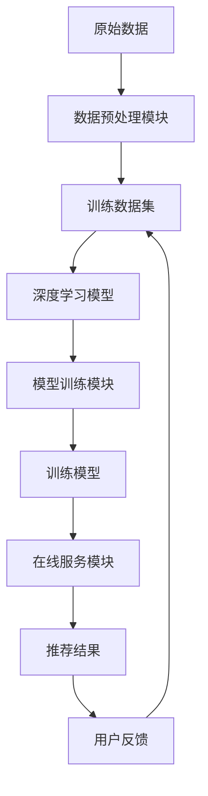

# AI人工智能深度学习算法：智能深度学习代理的个性化推荐与用户体验设计

## 1.背景介绍

### 1.1 人工智能的兴起与发展

人工智能(Artificial Intelligence, AI)是当代科技发展的重要领域,近年来受到了前所未有的关注和投资。AI技术的快速发展正在深刻影响和改变着各行各业,催生了诸多创新应用,为人类社会带来了巨大的变革。

### 1.2 个性化推荐系统的重要性

在信息时代,人们面临着信息过载的困扰。有效地为用户个性化推荐感兴趣的信息和服务,不仅能提升用户体验,也是企业获取竞争优势的关键。传统的推荐系统主要依赖于用户的历史数据和人工设计的规则,难以适应复杂多变的用户需求。

### 1.3 深度学习在推荐系统中的应用

深度学习(Deep Learning)作为人工智能的一个重要分支,凭借其强大的模式识别和自动化特征提取能力,为推荐系统带来了新的发展机遇。智能深度学习代理通过学习海量数据,能够自动发现用户偏好的深层次特征,从而实现更加精准的个性化推荐。

## 2.核心概念与联系

### 2.1 深度学习

深度学习是机器学习的一种新技术,它模仿人脑的神经网络结构,通过构建多层非线性变换模型对输入数据进行特征提取和模式分析。常见的深度学习模型包括卷积神经网络(CNN)、循环神经网络(RNN)、长短期记忆网络(LSTM)等。

### 2.2 推荐系统

推荐系统的目标是根据用户的历史行为和偏好,为用户推荐感兴趣的项目(如商品、新闻、视频等)。常见的推荐系统包括协同过滤(Collaborative Filtering)、基于内容(Content-based)和混合推荐(Hybrid)等方法。

### 2.3 深度学习推荐系统

深度学习推荐系统将深度学习技术应用于推荐任务中,旨在自动学习用户和项目的深层次特征表示,从而提高推荐的准确性和个性化程度。这种方法能够有效地解决传统推荐系统中的数据稀疏、冷启动和交叉特征组合等问题。

### 2.4 用户体验设计

用户体验设计(User Experience Design, UX Design)是一门研究如何优化产品与用户之间交互过程的学科,旨在为用户提供高效、愉悦和有价值的体验。在推荐系统中,良好的用户体验设计能够提高推荐结果的可解释性和可操作性,增强用户对系统的信任度和粘性。

## 3.核心算法原理具体操作步骤

### 3.1 深度学习推荐系统框架

智能深度学习代理的个性化推荐系统通常包括以下几个核心组件:

1. **数据预处理模块**: 对用户行为数据、项目内容数据等原始数据进行清洗、转换和特征工程,为模型训练做好准备。

2. **深度学习模型**: 根据推荐任务的特点,选择合适的深度学习模型架构,如基于因子分解机(FFM)的神经网络、宽卷积深堆栈(Wide & Deep)等。

3. **模型训练模块**: 使用优化算法(如随机梯度下降)在训练数据集上训练深度学习模型,学习用户和项目的特征表示。

4. **在线服务模块**: 将训练好的模型部署到线上服务器,为用户提供实时的个性化推荐。

5. **反馈与更新模块**: 收集用户对推荐结果的反馈(如点击、购买等隐式反馈和评分等显式反馈),并将这些新数据加入训练集,周期性地重新训练模型。



### 3.2 深度学习模型架构

深度学习推荐模型的核心是学习用户和项目的低维、高阶特征表示,并基于这些特征计算用户对项目的兴趣程度。常见的模型架构包括:

1. **宽卷积深堆栈(Wide & Deep)**:
    - 宽部分(Wide Component)对离散特征进行线性加权,捕获特征之间的简单关系。
    - 深部分(Deep Component)使用前馈神经网络对连续特征进行高阶特征组合抽象。

2. **神经因子分解机(Neural Factorization Machines, NFM)**:
    - 使用双向神经网络对二阶特征交互进行建模,能够自动学习特征之间的重要程度。
    - 通过端到端的训练,NFM能够同时学习有效的特征表示和预测目标之间的非线性关系。

3. **注意力机制(Attention Mechanism)**:
    - 通过注意力层自动分配不同特征的权重,突出对预测目标更加重要的特征。
    - 能够有效地处理变长序列输入(如用户历史行为序列),提高模型的表达能力。

4. **对比学习(Contrastive Learning)**:
    - 通过最大化相似项目对的表示相似度,最小化不相似项目对的表示相似度,学习高质量的特征表示。
    - 能够有效缓解数据稀疏和冷启动问题,提高推荐系统的鲁棒性。

以上模型架构可以根据具体的推荐场景和数据特点进行组合和改进,以获得更好的推荐效果。

## 4.数学模型和公式详细讲解举例说明

### 4.1 矩阵分解

矩阵分解是协同过滤推荐系统的基础技术之一。假设有 $m$ 个用户和 $n$ 个项目,用户-项目交互数据可以表示为一个 $m \times n$ 的评分矩阵 $R$。矩阵分解的目标是将 $R$ 分解为两个低维矩阵的乘积:

$$R \approx P^TQ$$

其中, $P \in \mathbb{R}^{k \times m}$ 是用户隐语义特征矩阵, $Q \in \mathbb{R}^{k \times n}$ 是项目隐语义特征矩阵, $k$ 是隐语义空间的维度。通过优化以下目标函数来学习 $P$ 和 $Q$:

$$\min_{P,Q} \sum_{(u,i) \in \kappa} (r_{ui} - p_u^Tq_i)^2 + \lambda(\|P\|_F^2 + \|Q\|_F^2)$$

其中, $\kappa$ 是已观测的用户-项目对集合, $r_{ui}$ 是用户 $u$ 对项目 $i$ 的评分, $\lambda$ 是正则化系数, $\|\cdot\|_F$ 是矩阵的Frobenius范数。

### 4.2 因子分解机

因子分解机(Factorization Machines, FM)是一种常用的特征工程技术,能够高效地对特征进行二阶组合。对于一个输入向量 $\mathbf{x} = (x_1, x_2, \ldots, x_n)^T$,FM模型的预测公式为:

$$\hat{y}(x) = w_0 + \sum_{i=1}^n w_i x_i + \sum_{i=1}^n \sum_{j=i+1}^n \langle \mathbf{v}_i, \mathbf{v}_j \rangle x_i x_j$$

其中, $w_0$ 是全局偏置, $w_i$ 是一阶特征权重, $\mathbf{v}_i \in \mathbb{R}^k$ 是与第 $i$ 个特征对应的隐向量, $k$ 是隐向量的维度。FM模型能够捕捉特征之间的二阶交互关系,但计算复杂度较高。

### 4.3 神经因子分解机

神经因子分解机(Neural Factorization Machines, NFM)是FM的神经网络版本,它使用双向神经网络来学习特征交互的重要程度。NFM模型的预测公式为:

$$\hat{y}(x) = w_0 + \sum_{i=1}^n w_i x_i + f(\mathbf{x})$$

其中, $f(\mathbf{x})$ 是一个双向神经网络,用于捕获高阶特征交互:

$$f(\mathbf{x}) = \sum_{i=1}^n \sum_{j=i+1}^n x_i x_j \cdot \phi(\mathbf{v}_i^T \mathbf{v}_j)$$

这里, $\phi$ 是神经网络的激活函数(如ReLU), $\mathbf{v}_i, \mathbf{v}_j \in \mathbb{R}^k$ 是与第 $i$ 和第 $j$ 个特征对应的嵌入向量。NFM能够通过端到端的训练自动学习特征交互的重要程度,提高了模型的表达能力和泛化性能。

### 4.4 注意力机制

注意力机制(Attention Mechanism)是深度学习中的一种重要技术,它允许模型自动分配不同输入部分的权重,突出对预测目标更加重要的部分。在推荐系统中,注意力机制常用于处理用户历史行为序列等变长序列输入。

假设用户 $u$ 的历史行为序列为 $\mathbf{x}_u = (x_1, x_2, \ldots, x_T)$,其中 $x_t$ 是第 $t$ 个行为的特征向量。我们首先使用编码器(如RNN或Transformer)对序列进行编码,得到隐状态序列 $\mathbf{h}_u = (h_1, h_2, \ldots, h_T)$。然后计算注意力权重:

$$\alpha_t = \text{softmax}(f(h_t))$$

其中, $f$ 是一个单层神经网络。最后,将加权求和得到用户的表示向量:

$$\mathbf{u} = \sum_{t=1}^T \alpha_t h_t$$

注意力机制能够自动分配更大的权重给对预测目标更加重要的历史行为,从而提高模型的预测准确性。

## 5.项目实践:代码实例和详细解释说明

在本节中,我们将通过一个基于TensorFlow的实例项目,演示如何构建一个基于神经因子分解机(NFM)的推荐系统。该系统使用MovieLens数据集,为用户推荐电影。

### 5.1 数据预处理

首先,我们需要对原始数据进行预处理,包括填充缺失值、编码分类特征和构建输入张量等步骤。

```python
import pandas as pd

# 加载数据集
ratings = pd.read_csv('ratings.csv')
movies = pd.read_csv('movies.csv')

# 填充缺失值
movies = movies.fillna('')

# 编码分类特征
from sklearn.preprocessing import LabelEncoder
le = LabelEncoder()
movies['genre'] = le.fit_transform(movies['genres'])

# 构建输入张量
input_tensors = {
    'user_id': ratings['userId'].values,
    'movie_id': ratings['movieId'].values,
    'movie_categories': movies['genre'].values,
    'movie_titles': movies['title'].values,
    'ratings': ratings['rating'].values
}
```

### 5.2 构建NFM模型

接下来,我们定义NFM模型的架构。该模型包含一个嵌入层、一个NFM层和一个密集层。

```python
import tensorflow as tf

# 嵌入层
user_embedding = tf.keras.layers.Embedding(max_user_id, embedding_size)
movie_embedding = tf.keras.layers.Embedding(max_movie_id, embedding_size)
category_embedding = tf.keras.layers.Embedding(max_category_id, embedding_size)

# NFM层
nfm_layer = tf.keras.layers.NFM(units=64, 
                                embedding_data=[user_embedding, movie_embedding, category_embedding])

# 密集层
dense = tf.keras.layers.Dense(1, activation='sigmoid')

# 构建模型
inputs = [user_embedding.input, movie_embedding.input, category_embedding.input]
x = nfm_layer(inputs)
outputs = dense(x)
model = tf.keras.Model(inputs=inputs, outputs=outputs)
```

### 5.3 模型训练与评估

最后,我们编译模型,并在训练集上进行训练和评估。

```python
# 编译模型
model.compile(optimizer='adam', loss='binary_crossentropy', metrics=['accuracy'])

# 训练模型
model.fit(input_tensors, epochs=10, batch_size=64, validation