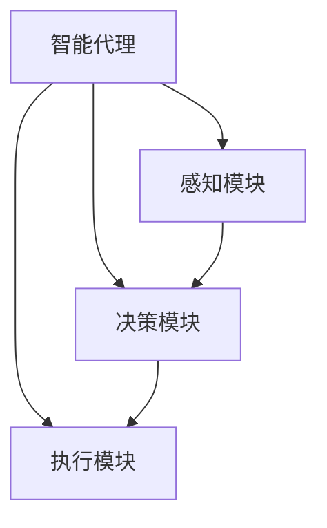

# AI人工智能深度学习算法：智能深度学习代理的仿真环境下的实验与评估

## 1.背景介绍

### 1.1 人工智能的发展历程

人工智能(Artificial Intelligence, AI)是当代科技发展的热点领域之一,旨在创造出能够模仿人类智能行为的智能系统。自20世纪50年代AI概念被正式提出以来,经历了几个重要的发展阶段。

#### 1.1.1 AI的起步阶段

AI的起步阶段始于20世纪50年代,当时的研究主要集中在逻辑推理、博弈问题、机器学习等基础理论领域。这一时期的代表性成果包括诞生了第一个人工神经网络(Perceptron)、证明了一些基本的机器学习算法(如最小二乘法)的收敛性等。

#### 1.1.2 专家系统与知识库时代

20世纪70年代,AI进入了专家系统与知识库的发展时期。研究人员开始构建基于规则和知识库的智能系统,旨在模拟人类专家在特定领域内的推理和决策过程。这种系统在医疗诊断、金融决策等领域得到了广泛应用。

#### 1.1.3 机器学习与神经网络的兴起

20世纪80年代后期,随着计算能力的提升和大数据的出现,机器学习和神经网络技术开始受到重视。这一时期诞生了支持向量机(SVM)、决策树等经典机器学习算法,并取得了令人瞩目的成就。

#### 1.1.4 深度学习的突破

21世纪初,深度学习(Deep Learning)技术在图像识别、语音识别等领域取得了突破性进展,推动了AI的新一轮繁荣。深度神经网络能够自主学习数据特征,在处理高维复杂数据时表现出色。

### 1.2 智能代理与仿真环境

#### 1.2.1 智能代理的概念

在AI领域,智能代理(Intelligent Agent)是指能够感知环境、学习并采取行动以实现既定目标的智能系统。智能代理需要具备环境感知、决策推理、行为执行等多种能力。

#### 1.2.2 仿真环境的作用

仿真环境(Simulation Environment)是指为评估和优化智能代理而构建的虚拟环境。在仿真环境中,智能代理可以安全地进行试验和训练,而不会对真实世界产生影响。仿真环境为AI算法的开发和测试提供了可控和高效的平台。

### 1.3 深度学习在智能代理中的应用

深度学习技术在智能代理领域发挥着重要作用,尤其在以下几个方面:

1. **环境感知**: 利用卷积神经网络(CNN)和递归神经网络(RNN)等模型,智能代理可以从复杂的视觉、语音等数据中提取特征,实现对环境的感知和理解。

2. **决策推理**: 通过强化学习(Reinforcement Learning)等技术,智能代理能够根据当前状态和预期奖励,自主学习最优决策策略。

3. **行为控制**: 结合深度神经网络和控制理论,智能代理可以生成连续的行为控制指令,实现精细化的行为控制。

4. **模型迁移**: 借助深度学习模型在不同领域的迁移能力,智能代理可以快速适应新的环境和任务。

本文将重点探讨智能深度学习代理在仿真环境下的实验与评估,包括核心算法、数学模型、实践案例等内容,为读者提供全面的技术洞见。

## 2.核心概念与联系

### 2.1 深度强化学习

深度强化学习(Deep Reinforcement Learning, DRL)是将深度学习技术与强化学习相结合的一种范式,旨在训练出能够在复杂环境中做出最优决策的智能代理。

#### 2.1.1 强化学习基础

强化学习是一种基于环境交互的机器学习方法,智能代理通过不断尝试和学习,寻找在给定环境下获得最大累积奖励的策略。强化学习过程包括以下几个核心要素:

- **环境(Environment)**: 智能代理所处的虚拟或真实环境。
- **状态(State)**: 描述当前环境的状态信息。
- **行为(Action)**: 智能代理可以采取的行动。
- **奖励(Reward)**: 环境对智能代理行为的反馈,用于指导策略优化。
- **策略(Policy)**: 智能代理在给定状态下选择行为的策略函数。

强化学习算法通过不断尝试和更新策略,最终收敛到一个能够获得最大累积奖励的最优策略。

#### 2.1.2 深度学习在强化学习中的应用

传统的强化学习算法在处理高维、复杂的环境状态时存在局限性。深度学习技术的引入使得智能代理能够自主从原始数据(如图像、语音等)中提取特征,从而更好地表示环境状态,并基于深度神经网络来近似策略函数或值函数。

常见的深度强化学习算法包括:

- **深度Q网络(Deep Q-Network, DQN)**: 利用深度神经网络来近似Q值函数,用于处理离散动作空间的任务。
- **深度确定性策略梯度(Deep Deterministic Policy Gradient, DDPG)**: 结合Actor-Critic架构和深度神经网络,用于处理连续动作空间的任务。
- **深度Q学习(Deep Q-Learning)**: 基于DQN,通过双重Q学习等技术提高训练稳定性。
- **异步优势Actor-Critic(Asynchronous Advantage Actor-Critic, A3C)**: 利用异步优势更新和并行计算加速训练过程。

### 2.2 智能代理架构

智能深度学习代理通常采用模块化的架构设计,包括以下几个核心模块:

#### 2.2.1 感知模块

感知模块负责从环境中获取原始数据(如图像、语音等),并利用深度学习模型(如CNN、RNN等)提取环境状态的特征表示。这是智能代理理解环境的基础。

#### 2.2.2 决策模块

决策模块根据当前环境状态和深度强化学习算法(如DQN、DDPG等),输出智能代理应采取的最优行为。决策模块通常包括策略网络和值网络两个深度神经网络组件。

#### 2.2.3 执行模块

执行模块将决策模块输出的行为指令转化为具体的控制指令,并在环境中执行相应的动作。对于连续控制任务,执行模块还需要结合控制理论生成平滑的控制序列。

### 2.3 智能代理评估指标

评估智能代理的表现是深度强化学习研究的重要环节。常用的评估指标包括:

- **累积奖励(Cumulative Reward)**: 智能代理在一个环节或多个环节中获得的总奖励值,反映了策略的优劣。
- **收敛速度(Convergence Speed)**: 策略收敛到最优解的训练步数,反映了算法的效率。
- **成功率(Success Rate)**: 智能代理成功完成任务的比例,用于评估算法的鲁棒性。
- **决策延迟(Decision Latency)**: 智能代理做出决策所需的时间,反映了实时性能。
- **泛化能力(Generalization Ability)**: 智能代理在新环境中的适应能力,评估算法的泛化性。

根据不同的应用场景,我们需要权衡各项指标,选择合适的评估方式。

## 3.核心算法原理具体操作步骤

### 3.1 深度Q网络(DQN)

深度Q网络(Deep Q-Network, DQN)是一种广泛应用的深度强化学习算法,适用于离散动作空间的任务。DQN的核心思想是利用深度神经网络来近似Q值函数,从而解决传统Q学习在高维状态空间下的局限性。

DQN算法的具体操作步骤如下:

1. **初始化回放缓冲区(Replay Buffer)和Q网络**。

2. **对于每一个时间步**:
    a. 从当前状态$s_t$出发,根据$\epsilon$-贪婪策略选择行动$a_t$。
    b. 执行行动$a_t$,观测到新状态$s_{t+1}$和奖励$r_t$,将转换($s_t$, $a_t$, $r_t$, $s_{t+1}$)存入回放缓冲区。
    c. 从回放缓冲区中随机采样一个小批量的转换($s_j$, $a_j$, $r_j$, $s_{j+1}$)。
    d. 计算目标Q值:

    $$
    y_j = \begin{cases}
        r_j, & \text{if } s_{j+1} \text{ is terminal}\\
        r_j + \gamma \max_{a'} Q(s_{j+1}, a'; \theta^-), & \text{otherwise}
    \end{cases}
    $$

    其中$\theta^-$是目标Q网络的参数,用于计算$\max_{a'} Q(s_{j+1}, a'; \theta^-)$。

    e. 使用均方误差损失函数优化Q网络的参数$\theta$:

    $$
    L(\theta) = \mathbb{E}_{(s_j, a_j, r_j, s_{j+1}) \sim D}\left[(y_j - Q(s_j, a_j; \theta))^2\right]
    $$

    f. 每隔一定步数同步Q网络参数到目标Q网络参数$\theta^-$。

3. **重复步骤2,直到算法收敛**。

DQN算法引入了两个重要技术:

1. **经验回放(Experience Replay)**: 通过回放缓冲区存储过去的转换,打破数据独立同分布假设,提高数据利用效率。

2. **目标网络(Target Network)**: 使用一个延迟更新的目标Q网络计算目标Q值,提高训练稳定性。

### 3.2 深度确定性策略梯度(DDPG)

深度确定性策略梯度(Deep Deterministic Policy Gradient, DDPG)是一种适用于连续动作空间的深度强化学习算法,它结合了确定性策略梯度和Actor-Critic架构。

DDPG算法的具体操作步骤如下:

1. **初始化回放缓冲区、Actor网络($\mu(s;\theta^\mu)$)和Critic网络($Q(s,a;\theta^Q)$)**。

2. **对于每一个时间步**:
    a. 从当前状态$s_t$出发,根据行为策略$a_t=\mu(s_t;\theta^\mu)+\mathcal{N}_t$选择行动$a_t$,其中$\mathcal{N}_t$是探索噪声。
    b. 执行行动$a_t$,观测到新状态$s_{t+1}$和奖励$r_t$,将转换($s_t$, $a_t$, $r_t$, $s_{t+1}$)存入回放缓冲区。
    c. 从回放缓冲区中随机采样一个小批量的转换($s_j$, $a_j$, $r_j$, $s_{j+1}$)。
    d. 计算目标Q值:

    $$
    y_j = r_j + \gamma Q'(s_{j+1}, \mu'(s_{j+1};\theta^{\mu'}); \theta^{Q'})
    $$

    其中$\theta^{\mu'}$和$\theta^{Q'}$分别是目标Actor网络和目标Critic网络的参数。

    e. 使用均方误差损失函数优化Critic网络的参数$\theta^Q$:

    $$
    L(\theta^Q) = \mathbb{E}_{(s_j, a_j, r_j, s_{j+1}) \sim D}\left[(y_j - Q(s_j, a_j; \theta^Q))^2\right]
    $$

    f. 使用确定性策略梯度公式优化Actor网络的参数$\theta^\mu$:

    $$
    \nabla_{\theta^\mu} J \approx \mathbb{E}_{s_j \sim D}\left[\nabla_{\theta^\mu} \mu(s_j;\theta^\mu) \nabla_{a} Q(s_j, a;\theta^Q)|_{a=\mu(s_j;\theta^\mu)}\right]
    $$

    g. 每隔一定步数同步Actor网络和Critic网络参数到目标网络参数$\theta^{\mu'}$和$\theta^{Q'}$。

3. **重复步骤2,直到算法收敛**。