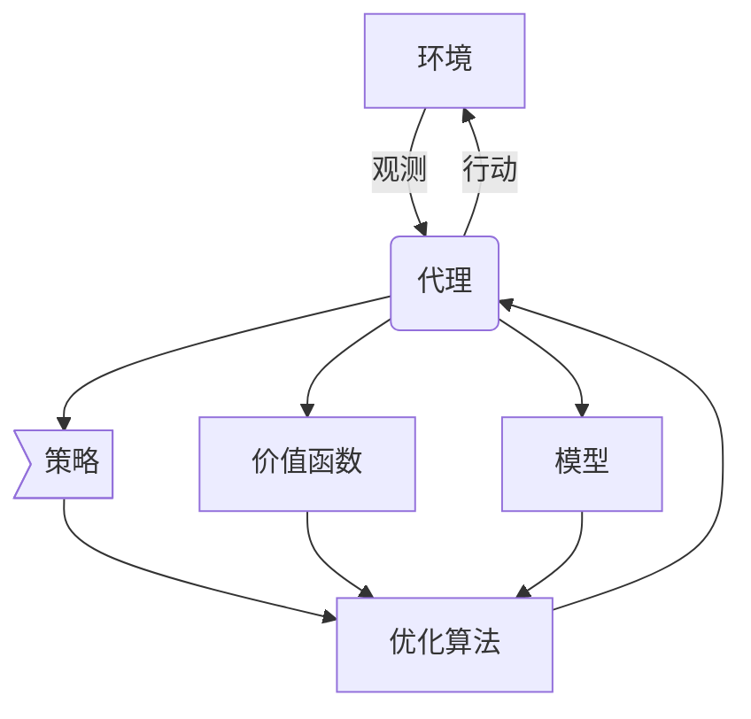

# AI人工智能深度学习算法：智能深度学习代理的工作流可视化与用户交互设计

## 1.背景介绍

### 1.1 人工智能的崛起
人工智能(Artificial Intelligence, AI)是当代最具颠覆性和革命性的技术之一。近年来,人工智能取得了长足的进步,尤其是在深度学习(Deep Learning)领域,已经在计算机视觉、自然语言处理、语音识别等诸多领域展现出超人类的能力。

### 1.2 深度学习代理的重要性
深度学习代理(Deep Learning Agent)是指基于深度学习算法构建的智能系统,能够根据环境状态作出决策并采取行动。这些代理在很多领域发挥着关键作用,如自动驾驶、机器人控制、游戏AI等。随着人工智能的不断发展,深度学习代理的复杂性也与日俱增。

### 1.3 可视化和用户交互的必要性
由于深度学习代理的复杂性,单纯依赖代码和数据是难以理解其内部工作机制的。因此,将代理的工作流程可视化,并提供直观的用户交互界面,对于开发者、研究人员和最终用户来说都是至关重要的。可视化和用户交互不仅有助于理解和解释模型,还可以提高透明度和可解释性,从而增强人们对AI系统的信任。

## 2.核心概念与联系

### 2.1 深度学习代理
深度学习代理是一种基于深度神经网络的智能系统,能够从环境中获取观测数据,并根据这些数据作出决策和采取行动。它通常由以下几个核心组件构成:

1. **环境(Environment)**: 代理所处的外部世界,包括状态和奖惩机制。
2. **策略(Policy)**: 代理根据当前状态选择行动的决策函数。
3. **价值函数(Value Function)**: 评估当前状态或状态-行动对的长期回报。
4. **模型(Model)**: 预测下一个状态和奖惩的函数近似器。
5. **优化算法(Optimization Algorithm)**: 用于训练神经网络的算法,如策略梯度等。

### 2.2 工作流可视化
工作流可视化是将深度学习代理的内部运作过程以图形化的方式呈现出来,使其更加直观和易于理解。可视化通常包括以下几个方面:

1. **网络结构**: 展示神经网络的层次结构和连接方式。
2. **激活图**: 可视化每一层神经元的激活强度。
3. **决策过程**: 展示代理根据观测数据作出决策的过程。
4. **奖惩机制**: 可视化代理在不同状态下获得的奖惩。
5. **训练过程**: 展示神经网络在训练过程中的损失函数、准确率等指标变化。

### 2.3 用户交互设计
用户交互设计旨在为用户提供一种直观、友好的方式来与深度学习代理进行交互。良好的交互设计可以提高用户体验,增强对模型的理解和控制。交互设计通常包括以下几个方面:

1. **可视化界面**: 将代理的工作流程以图形化的方式呈现给用户。
2. **参数调整**: 允许用户调整代理的超参数,观察其对模型行为的影响。
3. **场景模拟**: 提供一个模拟环境,让用户可以观察代理在不同情况下的表现。
4. **解释工具**: 提供解释工具,帮助用户理解代理的决策过程。
5. **反馈机制**: 允许用户对代理的行为提供反馈,以改进模型。

## 3.核心算法原理具体操作步骤

深度学习代理的核心算法原理主要包括以下几个方面:

### 3.1 策略梯度算法

策略梯度算法是一种常用的强化学习算法,用于训练深度学习代理的策略网络。其基本思想是通过梯度上升的方式,不断调整策略网络的参数,使得代理在环境中获得的期望回报最大化。

具体操作步骤如下:

1. 初始化策略网络的参数$\theta$。
2. 在环境中采样一批轨迹,每个轨迹包含状态序列$s_1, s_2, \dots, s_T$、行动序列$a_1, a_2, \dots, a_T$和奖励序列$r_1, r_2, \dots, r_T$。
3. 计算每个轨迹的回报$R = \sum_{t=1}^T \gamma^{t-1} r_t$,其中$\gamma$是折现因子。
4. 计算策略梯度$\nabla_\theta J(\theta) = \mathbb{E}_{\pi_\theta}[\nabla_\theta \log \pi_\theta(a|s)R]$。
5. 使用优化算法(如Adam)更新策略网络参数$\theta \leftarrow \theta + \alpha \nabla_\theta J(\theta)$,其中$\alpha$是学习率。
6. 重复步骤2-5,直到策略收敛。

### 3.2 Q-Learning算法

Q-Learning是一种基于价值函数的强化学习算法,用于训练深度学习代理的价值网络。其基本思想是通过不断更新状态-行动对的Q值,使得代理能够选择最优的行动序列,从而最大化期望回报。

具体操作步骤如下:

1. 初始化Q网络的参数$\theta$。
2. 从经验回放池中采样一批transitions $(s_t, a_t, r_t, s_{t+1})$。
3. 计算目标Q值$y_t = r_t + \gamma \max_{a'} Q(s_{t+1}, a'; \theta^-)$,其中$\theta^-$是目标网络的参数。
4. 计算损失函数$L(\theta) = \mathbb{E}_{(s_t, a_t) \sim \rho(\cdot)}[(y_t - Q(s_t, a_t; \theta))^2]$。
5. 使用优化算法(如Adam)更新Q网络参数$\theta \leftarrow \theta - \alpha \nabla_\theta L(\theta)$。
6. 每隔一定步数,将Q网络的参数复制到目标网络$\theta^- \leftarrow \theta$。
7. 重复步骤2-6,直到Q网络收敛。

### 3.3 Actor-Critic算法

Actor-Critic算法是一种结合了策略梯度和Q-Learning的强化学习算法,同时训练策略网络(Actor)和价值网络(Critic)。其基本思想是利用价值网络的估计值来减小策略梯度的方差,从而提高训练效率。

具体操作步骤如下:

1. 初始化Actor网络参数$\theta^\pi$和Critic网络参数$\theta^V$。
2. 在环境中采样一批轨迹,每个轨迹包含状态序列$s_1, s_2, \dots, s_T$、行动序列$a_1, a_2, \dots, a_T$和奖励序列$r_1, r_2, \dots, r_T$。
3. 计算每个时间步的优势函数$A_t = r_t + \gamma V(s_{t+1}; \theta^V) - V(s_t; \theta^V)$。
4. 计算Actor的策略梯度$\nabla_{\theta^\pi} J(\theta^\pi) = \mathbb{E}_{\pi_{\theta^\pi}}[\sum_{t=1}^T \nabla_{\theta^\pi} \log \pi_{\theta^\pi}(a_t|s_t)A_t]$。
5. 使用优化算法(如Adam)更新Actor网络参数$\theta^\pi \leftarrow \theta^\pi + \alpha_\pi \nabla_{\theta^\pi} J(\theta^\pi)$。
6. 计算Critic的损失函数$L(\theta^V) = \mathbb{E}_{(s_t, r_t, s_{t+1}) \sim \rho(\cdot)}[(r_t + \gamma V(s_{t+1}; \theta^V) - V(s_t; \theta^V))^2]$。
7. 使用优化算法(如Adam)更新Critic网络参数$\theta^V \leftarrow \theta^V - \alpha_V \nabla_{\theta^V} L(\theta^V)$。
8. 重复步骤2-7,直到Actor和Critic网络收敛。

## 4.数学模型和公式详细讲解举例说明

在深度学习代理的算法中,数学模型和公式扮演着重要的角色。以下是一些常见的数学模型和公式,以及它们的详细讲解和举例说明。

### 4.1 马尔可夫决策过程(Markov Decision Process, MDP)

马尔可夫决策过程是强化学习的数学基础,用于描述代理与环境的交互过程。一个MDP可以用一个元组$(S, A, P, R, \gamma)$来表示,其中:

- $S$是状态空间,表示代理可能处于的所有状态。
- $A$是行动空间,表示代理可以采取的所有行动。
- $P(s'|s, a)$是状态转移概率,表示在状态$s$下采取行动$a$后,转移到状态$s'$的概率。
- $R(s, a)$是奖励函数,表示在状态$s$下采取行动$a$所获得的即时奖励。
- $\gamma \in [0, 1)$是折现因子,用于平衡即时奖励和长期回报。

例如,在一个简单的格子世界环境中,状态$S$可以表示代理在格子中的位置,行动$A$可以表示代理向四个方向移动,状态转移概率$P$可以表示代理移动后到达新位置的概率,奖励函数$R$可以表示代理到达目标位置时获得的奖励。

### 4.2 策略函数(Policy Function)

策略函数$\pi(a|s)$表示在状态$s$下选择行动$a$的概率,是代理的决策核心。在深度学习代理中,策略函数通常由一个神经网络来近似,网络的输入是状态$s$,输出是每个行动$a$的概率值。

对于连续行动空间,策略函数可以表示为:

$$\pi(a|s; \theta) = \mathcal{N}(a|\mu(s; \theta), \Sigma(s; \theta))$$

其中,$\mu(s; \theta)$是均值网络,输出行动$a$的均值,$\Sigma(s; \theta)$是方差网络,输出行动$a$的方差。$\theta$是策略网络的参数。

对于离散行动空间,策略函数可以表示为:

$$\pi(a|s; \theta) = \frac{e^{f(s, a; \theta)}}{\sum_{a'}e^{f(s, a'; \theta)}}$$

其中,$f(s, a; \theta)$是评分函数,输出行动$a$在状态$s$下的评分值。

### 4.3 价值函数(Value Function)

价值函数用于评估一个状态或状态-行动对的长期回报,是强化学习算法的另一个核心组件。

状态价值函数$V(s)$定义为:

$$V(s) = \mathbb{E}_\pi[\sum_{t=0}^\infty \gamma^t r_{t+1} | s_0 = s]$$

它表示在状态$s$下,按照策略$\pi$行动所获得的期望回报。

状态-行动价值函数$Q(s, a)$定义为:

$$Q(s, a) = \mathbb{E}_\pi[\sum_{t=0}^\infty \gamma^t r_{t+1} | s_0 = s, a_0 = a]$$

它表示在状态$s$下采取行动$a$,之后按照策略$\pi$行动所获得的期望回报。

在深度学习代理中,价值函数通常由一个神经网络来近似,网络的输入是状态$s$或状态-行动对$(s, a)$,输出是对应的价值估计。

### 4.4 优势函数(Advantage Function)

优势函数$A(s, a)$定义为状态-行动价值函数$Q(s, a)$与状态价值函数$V(s)$的差值:

$$A(s, a) = Q(s, a) - V(s)$$

它表示在状态$s$下采取行动$a$,相对于只按照策略$\pi$行动,所获得的额外回报。优势函数在Actor-Critic算法中扮演着重要的角色,用于减小策略梯度的方差,提高训练效率。

### 4.5 损失函数(Loss Function)

在训练深度学习代理的过程中,需要定义一个损失函数来衡量模型的预测