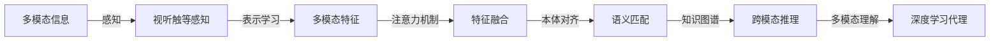

# AI人工智能深度学习算法：深度学习代理的多模态感知与处理能力

## 1. 背景介绍

人工智能(Artificial Intelligence, AI)的快速发展,尤其是深度学习(Deep Learning, DL)技术的突破,使得机器在视觉、语音、自然语言理解等多个模态上取得了接近甚至超越人类的感知和认知能力。深度学习代理(Deep Learning Agents)作为一种具有多模态感知与处理能力的智能体,正在成为人工智能领域的研究热点和产业应用的重要方向。

### 1.1 人工智能的发展历程

人工智能的发展可以追溯到1956年达特茅斯会议,正式提出"人工智能"的概念。此后经历了三次浪潮:

- 第一次浪潮(1956-1974):以符号主义为主,探索用计算机模拟人类智能
- 第二次浪潮(1980-1987):以专家系统为主,利用知识工程解决特定领域问题
- 第三次浪潮(2006-至今):以机器学习尤其是深度学习为主,通过海量数据训练多层神经网络

### 1.2 深度学习的崛起

深度学习源于人工神经网络,通过构建多层网络结构和海量数据训练,实现了强大的特征学习和表示能力。2012年,Hinton团队的AlexNet在ImageNet图像分类竞赛上以远超第二名的成绩夺冠,掀起了深度学习的热潮。此后,深度学习在计算机视觉、语音识别、自然语言处理等领域不断取得突破,成为当前人工智能的核心技术。

### 1.3 多模态感知与处理的意义

现实世界的信息具有多模态(multi-modal)的特点,即同一个对象可以用图像、文本、语音等不同形式表示。人类可以轻松理解和关联不同模态信息,但对机器而言是一个巨大挑战。多模态感知与处理旨在赋予机器理解和融合多种模态信息的能力,提升人工智能系统的全面感知和认知水平,具有重要的理论和应用价值。

## 2. 核心概念与联系

要理解深度学习代理的多模态感知与处理能力,需要掌握以下核心概念:

### 2.1 感知(Perception)

感知是指智能体接收和解释外界信息的过程。对于深度学习代理,主要涉及:

- 视觉感知:通过摄像头接收图像/视频信号,用计算机视觉算法进行分析理解
- 听觉感知:通过麦克风接收语音/音频信号,用语音识别算法转换为文本或命令
- 触觉感知:通过触控装置接收压力、纹理等信号,用触觉识别算法分析物体属性
- 其他感知:如红外、雷达等传感器接收的信号

### 2.2 多模态(Multi-modal)

多模态是指同一个对象或概念可以用多种形式表示,常见的模态有:

- 视觉模态:图像、视频等
- 语言模态:文本、语音等 
- 声音模态:音乐、环境声等
- 动作模态:手势、体态等

不同模态信息具有互补性,融合多模态有助于全面理解对象。

### 2.3 表示学习(Representation Learning)

表示学习是指通过某种映射或变换,将原始的高维输入数据转化为更加抽象和富有语义的低维特征表示,以便后续的分类、回归、生成等任务。深度学习的核心能力就是端到端的分层特征学习。

以视觉模态为例,CNN网络逐层提取图像的边缘、纹理、局部结构、整体语义等层次丰富的视觉特征。学习到的特征表示可以显著提升图像分类、检测、分割等任务性能。

### 2.4 注意力机制(Attention Mechanism)

注意力机制源于人类视觉注意的选择性和聚焦性。核心思想是学习一个权重分布,对输入的不同部分赋予不同的重要性,聚焦到任务相关的关键信息上。

常见的注意力机制有:

- Soft Attention:通过可微的权重分布实现端到端训练,如 Transformer 中的自注意力
- Hard Attention:通过离散采样实现关键区域选择,如强化学习中的 glimpse sensor

注意力机制被广泛用于多模态特征融合中,可以自适应地对齐和关联不同模态的语义信息。

### 2.5 本体对齐(Ontology Alignment)

本体对齐是在两个本体之间建立语义映射关系,实现知识的互操作和融合。多模态感知涉及不同模态本体的匹配,需要考虑:

- 语义层次:高层语义概念的对应关系,如"汽车"对应car
- 语法层次:中层语法结构的对应关系,如"红色的汽车"对应red car
- 数据层次:底层数据分布的对应关系,如图像区域与文本片段

多模态本体对齐可以显著提升跨模态推理和检索的性能。

### 2.6 知识图谱(Knowledge Graph)

知识图谱以结构化的图形式表示概念实体及其关系,形成了一种可解释、可复用的知识库。将多模态信息映射到同一个知识图谱中,可以实现跨模态的知识关联和推理。

如给定一张图像,通过视觉感知得到图中有"汽车",再通过知识图谱推理出"汽车是一种交通工具,可以代步或运输"等丰富语义信息。多模态知识图谱是实现高层语义理解的重要手段。

### 2.7 概念间的关系

上述核心概念间的关系可以总结为:

即深度学习代理通过多层次的感知、学习、融合、推理,将多模态信息映射到一个统一的语义空间,从而具备了多模态理解和交互的能力。这是实现通用人工智能的关键一步。

## 3. 核心算法原理与操作步骤

多模态深度学习涉及一系列核心算法,下面以视觉-语言跨模态学习为例,介绍几种代表性算法的原理和步骤。

### 3.1 多模态表示学习

#### 3.1.1 多模态自编码器(Multimodal AutoEncoder)

多模态自编码器通过重建损失函数,学习不同模态数据的统一表示。以视觉-文本为例:

1. 视觉编码器$f_v$将图像$x_v$映射为隐表示$h_v$
2. 文本编码器$f_t$将文本$x_t$映射为隐表示$h_t$
3. 联合隐表示$h=[h_v,h_t]$
4. 视觉解码器$g_v$从$h$重建出图像$\hat{x}_v$
5. 文本解码器$g_t$从$h$重建出文本$\hat{x}_t$
6. 最小化重建误差$\mathcal{L}=\Vert x_v-\hat{x}_v \Vert^2 + \Vert x_t-\hat{x}_t \Vert^2$

联合表示$h$携带了两个模态的共享语义信息,可用于跨模态检索等任务。

#### 3.1.2 对抗式多模态表示学习

引入对抗训练,可以进一步提升联合表示的语义一致性:

1. 生成器$G$学习将随机噪声$z$映射为逼真的联合表示$h$
2. 判别器$D$判断$h$来自真实数据还是生成器
3. 训练$G$以欺骗$D$,同时训练$D$以区分真实/生成的$h$
4. 最小化对抗损失$\mathcal{L}_{adv}=\mathbb{E}_{h\sim p_{data}}[\log D(h)] + \mathbb{E}_{z\sim p_z}[\log (1-D(G(z)))]$

对抗训练使得生成的联合表示在真实数据分布上达到了平衡,携带了更加自然和语义一致的多模态信息。

### 3.2 多模态注意力机制

#### 3.2.1 多模态共注意力(Co-Attention)

考虑视觉特征$V\in \mathbb{R}^{k\times d_v}$和文本特征$T\in \mathbb{R}^{n\times d_t}$,多模态共注意力学习两个模态间的对齐关系:

1. 计算两个模态的相似度矩阵$S=VW_sT^T,S\in \mathbb{R}^{k\times n}$
2. 对$S$按行softmax,得到视觉到文本的注意力分布$A_t\in \mathbb{R}^{k\times n}$
3. 对$S$按列softmax,得到文本到视觉的注意力分布$A_v\in \mathbb{R}^{k\times n}$
4. 计算视觉聚合特征$\hat{V}=A_tT,\hat{V}\in \mathbb{R}^{k\times d_t}$
5. 计算文本聚合特征$\hat{T}=A_v^TV,\hat{T}\in \mathbb{R}^{n\times d_v}$

其中$W_s$为学习参数。多模态共注意力可以学习到视觉区域与文本单词间的对齐关系,常用于图像问答、视觉问答等任务中。

#### 3.2.2 分层注意力(Hierarchical Attention)

在视觉-文本跨模态任务中,文本信息具有多粒度层次结构(如单词、短语、句子),需要分层建模:

1. 词级注意力:$\alpha_{ti}=\frac{\exp(s_{ti})}{\sum_j \exp(s_{tj})}, s_{ti}=w_s^T\tanh(W_{vt}v_i+W_{tt}t_j)$
2. 句级注意力:$\beta_i=\frac{\exp(r_i)}{\sum_j \exp(r_j)}, r_i=w_r^T\tanh(W_{vr}\bar{v}+W_{tr}\bar{t}_i)$
3. 文档表示:$d=\sum_i \beta_i\bar{t}_i$

其中$v_i$为第$i$个视觉区域,$t_j$为第$j$个词向量,$\bar{t}_i$为第$i$个句子向量,$\bar{v}$为全局视觉特征,其余为学习参数。分层注意力可以建模文本信息的层次结构,提升跨模态任务性能。

### 3.3 多模态本体对齐与推理

#### 3.3.1 基于图卷积网络(GCN)的多模态本体对齐

考虑两个模态的本体图$G_1,G_2$,节点为概念实体,边为关系三元组。我们学习一个GCN将它们映射到同一个嵌入空间:

1. 初始化概念节点表示$H^{(0)}$
2. 图卷积更新:$H^{(l+1)}=\sigma(\tilde{D}^{-\frac{1}{2}}\tilde{A}\tilde{D}^{-\frac{1}{2}}H^{(l)}W^{(l)})$
3. 对齐损失:$\mathcal{L}_{align}=\sum_{(e_i,e_j)\in A}\Vert h_i-h_j \Vert^2$

其中$\tilde{A}=A+I$为加自环的邻接矩阵,$\tilde{D}$为$\tilde{A}$的度矩阵,$\sigma$为激活函数,$A$为已知的种子对齐。最小化$\mathcal{L}_{align}$可以让已知对齐的概念在嵌入空间中距离最近,从而实现两个本体的对齐。

#### 3.3.2 基于知识图谱的多模态推理

将视觉、文本等多模态信息映射到知识图谱后,可以进行基于图的推理,回答复杂问题:

1. 问题$q$通过文本理解模块解析为查询图$q_g$
2. 在知识图谱$G$中匹配子图$G_q$,使其与$q_g$同构
3. 将$G_q$中的未知节点作为候选答案集合$C_q$
4. 学习一个打分函数$f(a,q,G),a\in C_q