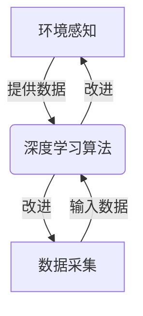
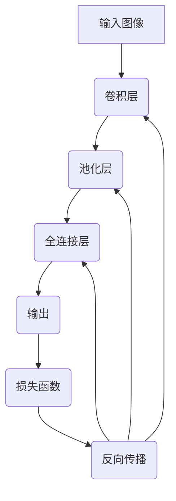
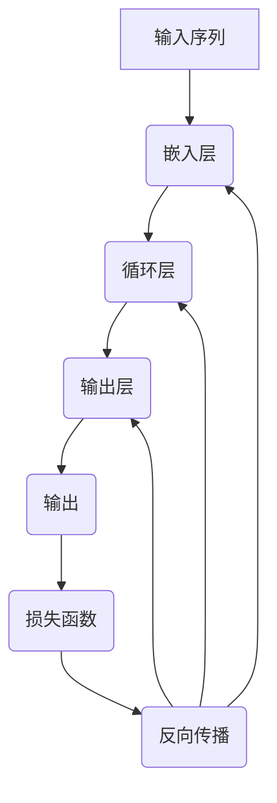
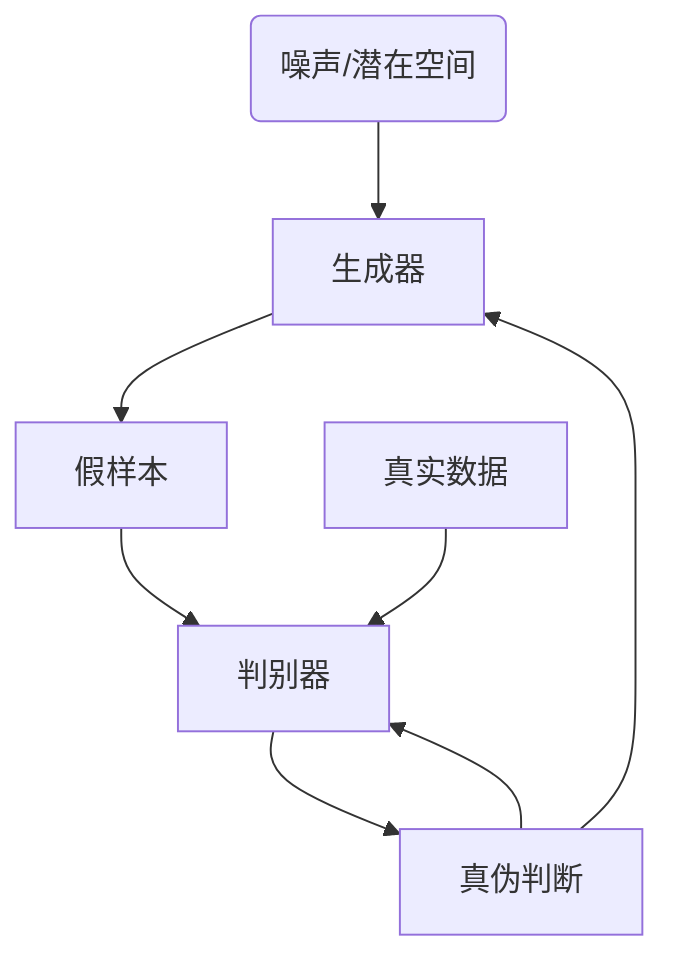

# AI人工智能深度学习算法：环境感知与数据采集机制

## 1.背景介绍

### 1.1 人工智能的崛起
人工智能(AI)已经成为当今科技领域最热门、最具影响力的技术之一。从语音助手到自动驾驶汽车,人工智能系统无处不在,正在彻底改变我们的生活和工作方式。

### 1.2 环境感知的重要性
对于人工智能系统来说,能够准确感知和理解周围环境是至关重要的。只有获取高质量的环境数据,AI算法才能从中学习,做出明智的决策和行为。因此,环境感知和数据采集是人工智能系统的基础。

### 1.3 深度学习的优势
传统的机器学习算法在处理复杂环境数据时存在局限性。而深度学习凭借其强大的特征提取和模式识别能力,在视觉、语音、自然语言处理等领域展现出卓越的环境感知能力,成为人工智能的核心驱动力。

## 2.核心概念与联系

### 2.1 环境感知
环境感知是指人工智能系统通过各种传感器获取周围环境的信息,并对这些信息进行理解和解释的过程。它包括视觉、听觉、触觉等多种感知模态。

### 2.2 数据采集
数据采集是指从各种来源收集与任务相关的原始数据,为后续的数据预处理、特征提取和模型训练做准备。高质量的数据采集对于构建高性能的人工智能模型至关重要。

### 2.3 深度学习
深度学习是一种基于人工神经网络的机器学习技术,能够自动从原始数据中学习特征表示,并对其进行高层次抽象,从而实现复杂模式的识别和预测。

### 2.4 核心联系
环境感知、数据采集和深度学习三者紧密相连:

1. 环境感知提供了原始数据的来源
2. 数据采集确保了数据的质量和多样性  
3. 深度学习算法利用采集的数据进行训练,提高环境感知的精度和鲁棒性



## 3.核心算法原理具体操作步骤  

深度学习在环境感知和数据采集中扮演着核心角色。以下是一些常用的深度学习算法及其工作原理:

### 3.1 卷积神经网络(CNN)

卷积神经网络擅长处理网格结构数据,如图像、视频和声音信号。它通过卷积、池化等操作自动学习局部特征,并逐层组合形成更高层次的特征表示。

1. 输入原始数据(如图像)
2. 卷积层:使用多个卷积核在输入数据上滑动,提取局部特征
3. 池化层:下采样特征图,减少数据量,提取主要特征
4. 全连接层:将提取的特征映射到最终输出(如分类结果)
5. 损失函数:计算输出与真实标签的差异
6. 反向传播:根据损失值更新网络权重



### 3.2 循环神经网络(RNN)

循环神经网络适用于处理序列数据,如自然语言、语音和时间序列。它能够捕捉数据中的长期依赖关系,并对序列进行建模和预测。

1. 输入序列数据(如文本)
2. 嵌入层:将词语转换为向量表示
3. 循环层:通过循环计算单元(如LSTM、GRU)处理序列
4. 输出层:根据序列信息生成输出(如下一个词语)
5. 损失函数:计算输出与真实标签的差异
6. 反向传播:根据损失值更新网络权重



### 3.3 生成对抗网络(GAN)

生成对抗网络可用于生成逼真的数据样本,如图像、音频和视频。它由一个生成器网络和一个判别器网络组成,两者相互对抗,最终达到生成器生成逼真样本、判别器无法区分真伪的状态。

1. 生成器从噪声或潜在空间采样,生成假样本
2. 判别器接收真实数据和生成的假样本,判断其真伪
3. 生成器根据判别器的反馈,优化生成更逼真的样本
4. 判别器根据生成器的优化,提高判别能力
5. 重复上述过程,直到生成器与判别器达到平衡



以上算法展示了深度学习在环境感知和数据采集中的应用,通过端到端的训练,能够自动从原始数据中提取有用的特征表示,从而提高系统的感知和建模能力。

## 4.数学模型和公式详细讲解举例说明

深度学习算法背后有着丰富的数学理论支撑,以下是一些核心数学模型和公式:

### 4.1 神经网络模型

神经网络是深度学习的基础模型,它模拟了生物神经元的工作原理。一个简单的前馈神经网络可以表示为:

$$
\begin{aligned}
z^{(l)} &= W^{(l)}a^{(l-1)} + b^{(l)} \\
a^{(l)} &= \sigma(z^{(l)})
\end{aligned}
$$

其中:
- $z^{(l)}$是第$l$层的加权输入
- $W^{(l)}$是第$l$层的权重矩阵
- $b^{(l)}$是第$l$层的偏置向量
- $a^{(l)}$是第$l$层的激活值
- $\sigma$是激活函数,如ReLU、Sigmoid等

通过反向传播算法,我们可以计算损失函数关于权重和偏置的梯度,并使用优化算法(如梯度下降)更新网络参数。

### 4.2 卷积运算

卷积运算是卷积神经网络的核心,它能够有效捕捉局部特征。对于一个二维输入$I$和卷积核$K$,卷积运算可以表示为:

$$
S(i, j) = (I * K)(i, j) = \sum_{m}\sum_{n}I(i+m, j+n)K(m, n)
$$

其中$S$是输出特征图,$(i, j)$是输出位置,$(m, n)$是卷积核的位置。通过滑动卷积核并进行元素级乘积和求和,我们可以获得新的特征表示。

### 4.3 循环神经网络

循环神经网络通过内部状态的循环传递,能够有效处理序列数据。以LSTM(Long Short-Term Memory)为例,它的前向传播过程可以表示为:

$$
\begin{aligned}
f_t &= \sigma(W_f \cdot [h_{t-1}, x_t] + b_f) \\
i_t &= \sigma(W_i \cdot [h_{t-1}, x_t] + b_i) \\
\tilde{C}_t &= \tanh(W_C \cdot [h_{t-1}, x_t] + b_C) \\
C_t &= f_t \odot C_{t-1} + i_t \odot \tilde{C}_t \\
o_t &= \sigma(W_o \cdot [h_{t-1}, x_t] + b_o) \\
h_t &= o_t \odot \tanh(C_t)
\end{aligned}
$$

其中$f_t$、$i_t$、$o_t$分别是遗忘门、输入门和输出门,用于控制信息的流动。$C_t$是细胞状态,用于存储长期信息。通过门控机制,LSTM能够有效解决长期依赖问题。

### 4.4 生成对抗网络

生成对抗网络由生成器$G$和判别器$D$组成,它们的目标函数可以表示为:

$$
\begin{aligned}
\min_G \max_D V(D, G) &= \mathbb{E}_{x \sim p_{\text{data}}(x)}[\log D(x)] \\
&+ \mathbb{E}_{z \sim p_z(z)}[\log(1 - D(G(z)))]
\end{aligned}
$$

其中$p_{\text{data}}(x)$是真实数据分布,$p_z(z)$是噪声或潜在变量的分布。判别器$D$试图最大化对真实数据和生成数据的判别能力,而生成器$G$则试图最小化判别器对其生成数据的判别能力。通过这种对抗训练,生成器最终能够生成逼真的数据样本。

以上数学模型和公式阐述了深度学习算法的核心原理,为环境感知和数据采集提供了理论基础。通过对这些模型的深入理解,我们可以更好地设计和优化人工智能系统。

## 5.项目实践:代码实例和详细解释说明

为了更好地理解深度学习在环境感知和数据采集中的应用,我们将通过一个实际项目案例进行说明。该项目旨在构建一个计算机视觉系统,用于识别和分类交通标志。

### 5.1 数据准备

我们将使用开源的德国交通标志数据集(German Traffic Sign Recognition Benchmark, GTSRB),该数据集包含43种不同类型的交通标志图像,共计39209张训练图像和12630张测试图像。

```python
import os
import numpy as np
from PIL import Image

# 加载数据集
data_dir = 'data/GTSRB'
train_dir = os.path.join(data_dir, 'Train')
test_dir = os.path.join(data_dir, 'Test')

# 读取图像并转换为numpy数组
def load_images(dir_path):
    images = []
    labels = []
    for class_dir in os.listdir(dir_path):
        class_path = os.path.join(dir_path, class_dir)
        if os.path.isdir(class_path):
            for img_file in os.listdir(class_path):
                img_path = os.path.join(class_path, img_file)
                img = Image.open(img_path)
                img = np.array(img)
                images.append(img)
                labels.append(int(class_dir))
    return np.array(images), np.array(labels)

# 加载训练数据和测试数据
X_train, y_train = load_images(train_dir)
X_test, y_test = load_images(test_dir)
```

### 5.2 构建卷积神经网络模型

我们将使用PyTorch构建一个卷积神经网络模型,用于交通标志分类任务。

```python
import torch
import torch.nn as nn

class TrafficSignClassifier(nn.Module):
    def __init__(self):
        super(TrafficSignClassifier, self).__init__()
        self.conv1 = nn.Conv2d(3, 32, kernel_size=3, padding=1)
        self.pool = nn.MaxPool2d(2, 2)
        self.conv2 = nn.Conv2d(32, 64, kernel_size=3, padding=1)
        self.fc1 = nn.Linear(64 * 8 * 8, 128)
        self.fc2 = nn.Linear(128, 43)
        self.relu = nn.ReLU()

    def forward(self, x):
        x = self.relu(self.conv1(x))
        x = self.pool(x)
        x = self.relu(self.conv2(x))
        x = self.pool(x)
        x = x.view(-1, 64 * 8 * 8)
        x = self.relu(self.fc1(x))
        x = self.fc2(x)
        return x

# 初始化模型
model = TrafficSignClassifier()
criterion = nn.CrossEntropyLoss()
optimizer = torch.optim.Adam(model.parameters(), lr=0.001)
```

该模型包含两个卷积层、两个全连接层和一个最大池化层。我们将使用交叉熵损失函数和Adam优化器进行训练。

### 5.3 模型训练

接下来,我们将对模型进行训练,并在测试集上评估其性能。