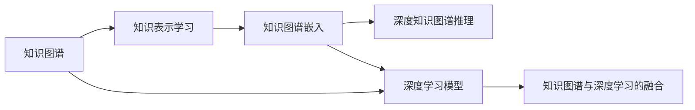

# AI人工智能深度学习算法：知识图谱在深度学习代理中的应用

## 1.背景介绍
### 1.1 人工智能与深度学习
人工智能(Artificial Intelligence, AI)是计算机科学的一个分支,旨在创建能够模拟人类智能的机器。深度学习(Deep Learning, DL)是人工智能的一个重要分支,它通过模拟人脑的神经网络结构,构建多层次的机器学习模型,实现了对复杂模式的自动学习和识别。

### 1.2 知识图谱概述
知识图谱(Knowledge Graph)是一种结构化的知识库,它以图的形式表示实体及其之间的关系。通过构建知识图谱,可以更好地组织、管理和利用海量的结构化和非结构化数据,实现知识的关联、推理和应用。

### 1.3 知识图谱在深度学习中的应用价值
将知识图谱引入深度学习,可以显著提升深度学习模型的表现。一方面,知识图谱可以为深度学习提供高质量的结构化知识,丰富模型的语义理解能力；另一方面,知识图谱可以作为先验知识引导深度学习模型的训练,加速收敛并提高泛化能力。因此,知识图谱与深度学习的结合具有重要的研究意义和应用价值。

## 2.核心概念与联系
### 2.1 知识表示学习
知识表示学习(Knowledge Representation Learning)是将知识图谱中的实体和关系映射到连续的低维向量空间,使得在向量空间中的语义相似度与知识图谱中的结构相似度一致。常见的知识表示学习方法包括TransE、TransR、TransD等。

### 2.2 知识图谱嵌入
知识图谱嵌入(Knowledge Graph Embedding)是一类用于知识表示学习的方法,它将知识图谱中的实体和关系映射到连续的低维向量空间,并保留其在原知识图谱中的结构信息。知识图谱嵌入可以用于知识图谱的补全、实体链接、关系预测等任务。

### 2.3 深度知识图谱推理
深度知识图谱推理(Deep Knowledge Graph Reasoning)是利用深度学习模型,在知识图谱上进行复杂的逻辑推理和问答。通过将知识图谱嵌入作为深度学习模型的输入,可以实现多跳关系推理、路径查询、子图匹配等高阶推理任务。

### 2.4 知识图谱与深度学习的融合范式
知识图谱与深度学习的融合主要有两种范式:一是将知识图谱嵌入作为深度学习模型的输入特征,增强模型的语义表示能力；二是利用知识图谱作为先验知识,约束深度学习模型的训练过程,提高模型的可解释性和泛化性。



## 3.核心算法原理具体操作步骤
### 3.1 TransE算法
TransE(Translating Embedding)是一种经典的知识图谱嵌入算法,其核心思想是将关系看作实体之间的平移向量。具体来说,对于一个三元组(h,r,t),TransE将其嵌入到d维实向量空间,使得h+r≈t。TransE的目标函数为:

$$L = \sum_{(h,r,t)\in S}\sum_{(h',r,t')\in S'_{(h,r,t)}} [\gamma + d(h+r,t) - d(h'+r,t')]_+$$

其中,$S$为正样本三元组集合,$S'_{(h,r,t)}$为负样本三元组集合,$\gamma$为超参数,用于控制正负样本之间的间隔,$d$为距离函数,通常选用L1或L2范数。

TransE的训练过程如下:
1. 随机初始化实体和关系的嵌入向量；
2. 对于每个正样本三元组(h,r,t),采样生成对应的负样本三元组(h',r,t'); 
3. 计算正负样本的距离差,并计算损失函数;
4. 通过梯度下降法更新嵌入向量,最小化损失函数;
5. 重复步骤2-4,直到模型收敛或达到预设的迭代次数。

### 3.2 TransR算法
TransR(Translating Embedding in Relation Space)是TransE的一种改进算法,它考虑了不同关系可能存在不同的语义空间。具体来说,TransR为每个关系r学习一个映射矩阵$M_r\in R^{k\times d}$,将实体从实体空间映射到关系空间。TransR的目标函数为:

$$L = \sum_{(h,r,t)\in S}\sum_{(h',r,t')\in S'_{(h,r,t)}} [\gamma + d(M_rh+r,M_rt) - d(M_rh'+r,M_rt')]_+$$

TransR的训练过程与TransE类似,只是在计算距离时需要先将实体向量通过映射矩阵$M_r$映射到关系空间。

### 3.3 TransD算法
TransD(Dynamic Mapping Matrix)是TransR的一种动态版本,它为每个实体-关系对(h,r)或(r,t)学习一个映射矩阵,而不是为每个关系学习一个固定的映射矩阵。TransD引入了两个向量$\mathbf{h}_p,\mathbf{t}_p\in R^m$分别表示头实体和尾实体的投影向量,以及两个向量$\mathbf{r}_p,\mathbf{r}_q\in R^n$表示关系的投影向量。TransD定义头实体和尾实体的映射矩阵为:

$$\mathbf{M}_{rh} = \mathbf{r}_p\mathbf{h}_p^\top + \mathbf{I}^{m\times n} \quad
\mathbf{M}_{rt} = \mathbf{r}_q\mathbf{t}_p^\top + \mathbf{I}^{m\times n}$$

其中,$\mathbf{I}^{m\times n}$为$m\times n$的单位矩阵。TransD的目标函数为:

$$L = \sum_{(h,r,t)\in S}\sum_{(h',r,t')\in S'_{(h,r,t)}} [\gamma + d(\mathbf{M}_{rh}h+r,\mathbf{M}_{rt}t) - d(\mathbf{M}_{rh}h'+r,\mathbf{M}_{rt}t')]_+$$

TransD的训练过程与TransR类似,只是在计算距离时需要动态构建映射矩阵。

## 4.数学模型和公式详细讲解举例说明
以TransE为例,详细说明其数学模型和公式。

TransE将知识图谱中的实体和关系嵌入到同一个d维实向量空间。对于每个实体$e$,TransE学习一个嵌入向量$\mathbf{e}\in R^d$；对于每个关系$r$,TransE学习一个嵌入向量$\mathbf{r}\in R^d$。TransE假设对于一个合理的三元组$(h,r,t)$,头实体嵌入向量$\mathbf{h}$加上关系嵌入向量$\mathbf{r}$应该接近尾实体嵌入向量$\mathbf{t}$,即$\mathbf{h} + \mathbf{r} \approx \mathbf{t}$。

基于上述假设,TransE定义了以下得分函数(scoring function)来评估一个三元组$(h,r,t)$的合理性:

$$f_r(h,t) = ||\mathbf{h} + \mathbf{r} - \mathbf{t}||_{L1/L2}$$

其中,$||\cdot||_{L1/L2}$表示L1范数或L2范数。得分函数的值越小,表示三元组越合理。

在训练过程中,TransE采用负采样的方式生成负样本三元组。对于每个正样本三元组$(h,r,t)$,TransE通过随机替换头实体或尾实体生成对应的负样本三元组$(h',r,t)$或$(h,r,t')$。TransE的目标是最小化正样本三元组的得分函数值,同时最大化负样本三元组的得分函数值,从而学习到合理的实体和关系嵌入向量。

TransE的损失函数定义为:

$$L = \sum_{(h,r,t)\in S}\sum_{(h',r,t')\in S'_{(h,r,t)}} [\gamma + f_r(h,t) - f_r(h',t')]_+$$

其中,$S$为正样本三元组集合,$S'_{(h,r,t)}$为对应的负样本三元组集合,$\gamma$为超参数,用于控制正负样本之间的间隔。$[x]_+ = max(0,x)$表示取正部分。

举例说明,假设知识图谱中存在以下三元组:
- (北京,首都,中国)
- (伦敦,首都,英国)
- (巴黎,首都,法国)

TransE将实体"北京"、"中国"、"伦敦"、"英国"、"巴黎"、"法国"以及关系"首都"嵌入到同一个d维实向量空间。通过最小化损失函数,TransE学习到合理的嵌入向量,使得对于合理的三元组(北京,首都,中国),有$\mathbf{北京} + \mathbf{首都} \approx \mathbf{中国}$；而对于不合理的三元组(伦敦,首都,法国),有$\mathbf{伦敦} + \mathbf{首都} \not\approx \mathbf{法国}$。

## 5.项目实践：代码实例和详细解释说明
以下是使用Python和TensorFlow实现TransE模型的简化代码:

```python
import tensorflow as tf

class TransE(tf.keras.Model):
    def __init__(self, num_entity, num_relation, embedding_dim):
        super(TransE, self).__init__()
        self.entity_embedding = tf.keras.layers.Embedding(num_entity, embedding_dim)
        self.relation_embedding = tf.keras.layers.Embedding(num_relation, embedding_dim)
    
    def call(self, h, r, t):
        h_emb = self.entity_embedding(h)
        r_emb = self.relation_embedding(r)
        t_emb = self.entity_embedding(t)
        score = tf.reduce_sum(tf.abs(h_emb + r_emb - t_emb), axis=-1)
        return score

def train(model, train_triples, num_epochs, batch_size, learning_rate):
    optimizer = tf.keras.optimizers.Adam(learning_rate)
    
    for epoch in range(num_epochs):
        for batch_start in range(0, len(train_triples), batch_size):
            batch_triples = train_triples[batch_start:batch_start+batch_size]
            
            with tf.GradientTape() as tape:
                h = tf.convert_to_tensor([triple[0] for triple in batch_triples])
                r = tf.convert_to_tensor([triple[1] for triple in batch_triples])
                t = tf.convert_to_tensor([triple[2] for triple in batch_triples])
                
                pos_score = model(h, r, t)
                
                neg_h = tf.random.shuffle(h)
                neg_t = tf.random.shuffle(t)
                neg_score1 = model(neg_h, r, t)
                neg_score2 = model(h, r, neg_t)
                
                loss = tf.reduce_mean(tf.maximum(0., 1. + pos_score - neg_score1) + 
                                      tf.maximum(0., 1. + pos_score - neg_score2))
            
            gradients = tape.gradient(loss, model.trainable_variables)
            optimizer.apply_gradients(zip(gradients, model.trainable_variables))
        
        print(f"Epoch {epoch+1}, Loss: {loss:.4f}")

# 示例用法
num_entity = 10
num_relation = 5
embedding_dim = 20
learning_rate = 0.001
num_epochs = 100
batch_size = 32

train_triples = [
    [0, 1, 2], [1, 0, 3], [4, 2, 5], [3, 1, 6], 
    [0, 3, 4], [2, 4, 1], [5, 0, 7], [8, 3, 9]
]

model = TransE(num_entity, num_relation, embedding_dim)
train(model, train_triples, num_epochs, batch_size, learning_rate)
```

代码解释:
1. 定义TransE模型类,包含实体嵌入层和关系嵌入层。
2. 在模型的前向传播中,计算三元组的得分函数值,即头实体嵌入向量加上关系嵌入向量减去尾实体嵌入向量的L1范数。
3. 定义训练函数,使用Adam优化器和负采样的方式训练模型。
4. 在每个批次中,对