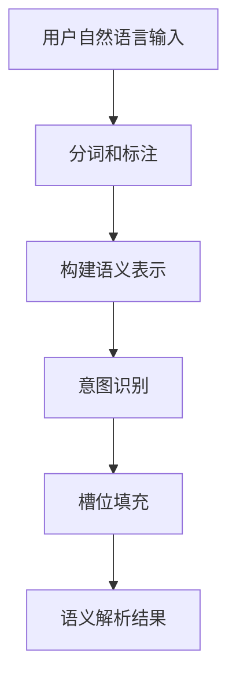
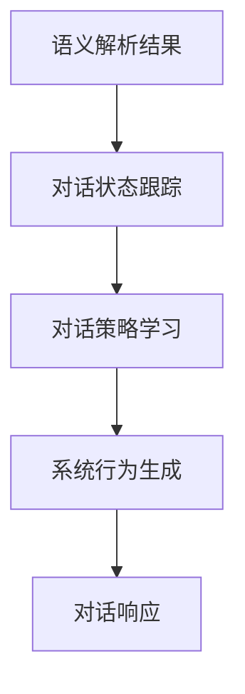
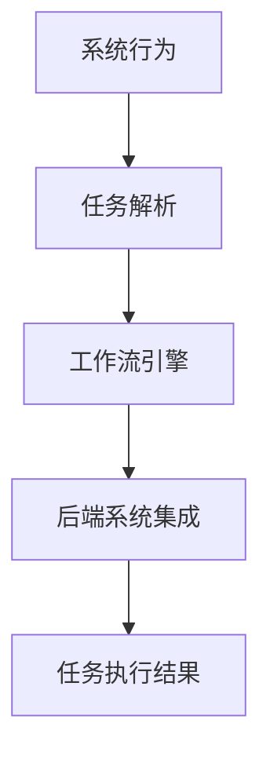

# AI人工智能深度学习算法：自然语言处理在工作流代理中的运用

## 1.背景介绍

### 1.1 工作流程自动化的重要性

在当今快节奏的商业环境中，工作流程自动化已经成为提高效率、降低成本和优化运营的关键因素。手动处理大量重复性任务不仅耗时耗力,而且容易出错。通过将这些任务自动化,组织可以将员工的注意力集中在更有价值的工作上,从而提高生产力和竞争力。

### 1.2 自然语言处理(NLP)的作用

自然语言处理(NLP)是人工智能的一个分支,旨在使计算机能够理解、解释和生成人类语言。随着深度学习技术的不断发展,NLP已经取得了长足的进步,在各种领域都有广泛的应用。在工作流程自动化中,NLP可以帮助系统更好地理解和响应用户的自然语言输入,从而实现更智能、更人性化的交互体验。

### 1.3 工作流代理的概念

工作流代理是一种软件应用程序,旨在自动执行特定的工作流程任务。它可以接收用户的自然语言指令,并根据预定义的规则和算法执行相应的操作。通过将NLP技术与工作流代理相结合,我们可以构建出更加智能化的自动化系统,提高工作效率和用户体验。

## 2.核心概念与联系

### 2.1 深度学习与自然语言处理

深度学习是机器学习的一个子领域,它利用多层神经网络模型来模拟人脑的工作原理,从而实现对复杂数据的自动学习和模式识别。在自然语言处理领域,深度学习技术已经取得了令人瞩目的成就,例如:

- **Word Embedding**: 将单词映射到连续的向量空间,捕捉单词之间的语义关系。
- **递归神经网络(RNN)**: 能够处理序列数据,常用于语言模型、机器翻译等任务。
- **长短期记忆网络(LSTM)**: 是RNN的一种变体,可以更好地捕捉长期依赖关系。
- **注意力机制(Attention)**: 允许模型关注输入序列中的关键部分,提高了性能。
- **Transformer**: 基于自注意力机制的序列到序列模型,在机器翻译等任务中表现出色。
- **BERT**: 一种预训练的深度双向Transformer模型,可用于多种NLP任务。

这些技术极大地推动了自然语言处理的发展,使得计算机能够更好地理解和生成人类语言。

### 2.2 工作流代理与自然语言处理的结合

将自然语言处理技术与工作流代理相结合,可以实现更智能、更人性化的交互体验。用户可以使用自然语言指令来触发特定的工作流程,而代理系统则能够准确理解这些指令,并执行相应的操作。

例如,在一个办公自动化场景中,用户可以说:"请为我安排下周一上午9点的会议,并邀请相关人员参加。"工作流代理系统会利用NLP技术来解析这个指令,识别出需要执行的任务类型(安排会议)、时间(下周一上午9点)以及相关人员。然后,它会自动完成预定会议室、发送邀请函等一系列操作。

通过这种方式,用户无需手动完成每个繁琐的步骤,只需使用自然语言进行交互,就可以高效地完成工作流程。这不仅提高了工作效率,而且提供了更加友好的用户体验。

## 3.核心算法原理具体操作步骤

实现一个基于自然语言处理的工作流代理系统,通常需要以下几个关键步骤:

### 3.1 语言理解



1. **分词和标注**: 将用户输入的自然语言句子分割成单词序列,并为每个单词标注其词性、命名实体类型等信息。
2. **构建语义表示**: 将分词和标注后的结果转换为语义表示,例如依存语法树或序列标注向量。
3. **意图识别**: 根据语义表示,确定用户的意图类型,如"安排会议"、"发送邮件"等。
4. **槽位填充**: 从语义表示中提取出意图所需的参数值,如会议时间、与会人员等。

这个过程通常采用基于深度学习的方法,利用序列标注模型(如RNN、LSTM)或结构化预测模型(如依存解析树)来完成语义解析任务。

### 3.2 对话管理



1. **对话状态跟踪**: 根据当前的语义解析结果和历史对话上下文,更新对话状态。
2. **对话策略学习**: 基于对话状态,确定系统的下一步行为,如请求补充信息、执行任务操作等。
3. **系统行为生成**: 将策略学习的结果转换为具体的系统行为表示。
4. **对话响应**: 根据系统行为,生成自然语言响应,与用户进行交互。

对话管理模块通常采用强化学习或基于模板的方法,前者更加灵活和智能,但需要大量的对话数据进行训练;后者则更加简单和可控,但响应的多样性和自然度有限。

### 3.3 任务执行



1. **任务解析**: 将系统行为映射为具体的任务类型和参数。
2. **工作流引擎**: 根据任务类型,调用相应的工作流定义,并使用参数执行工作流。
3. **后端系统集成**: 工作流中的活动可能需要与其他后端系统(如邮件服务器、日历系统等)进行交互和集成。
4. **任务执行结果**: 工作流执行完成后,将结果反馈给对话管理模块,以生成自然语言响应。

任务执行模块负责将对话管理的输出转化为实际的系统操作,它通常由工作流引擎和各种后端系统集成模块组成。在设计时,需要注意系统的可扩展性和灵活性,以支持新的任务类型和后端系统的无缝集成。

## 4.数学模型和公式详细讲解举例说明

在自然语言处理中,数学模型和公式扮演着重要的角色。以下是一些常见的模型和公式,以及它们在工作流代理系统中的应用:

### 4.1 Word Embedding

Word Embedding是将单词映射到连续的向量空间的技术,它能够捕捉单词之间的语义关系。常见的Word Embedding模型包括Word2Vec、GloVe等。

在Word2Vec中,我们使用Skip-gram模型和Negative Sampling来学习单词向量表示。其目标函数如下:

$$J = \frac{1}{T}\sum_{t=1}^{T}\sum_{-c \leq j \leq c, j \neq 0}\log\sigma(v_{w_t}^{\top}v_{w_{t+j}}) + \sum_{i=1}^{k}\mathbb{E}_{w_i \sim P_n(w)}[\log\sigma(-v_{w_t}^{\top}v_{w_i})]$$

其中:
- $v_w$和$v_c$分别表示单词$w$和上下文单词$c$的向量表示
- $c$是上下文窗口大小
- $\sigma$是sigmoid函数
- $P_n(w)$是负采样的噪声分布

通过优化这个目标函数,我们可以获得能够很好地捕捉语义关系的单词向量表示。在工作流代理系统中,Word Embedding可用于提高语义理解的准确性。

### 4.2 序列标注模型

序列标注模型常用于命名实体识别、词性标注等任务。其中,条件随机场(CRF)是一种常见的无向无环图模型,可以高效地对序列数据进行概率建模。

在线性链条件随机场中,我们定义了如下概率模型:

$$P(y|x) = \frac{1}{Z(x)}\exp\left(\sum_{t=1}^{T}\sum_{k}\lambda_kf_k(y_t,y_{t-1},x_t)\right)$$

其中:
- $x$是输入序列
- $y$是对应的标记序列
- $f_k$是特征函数
- $\lambda_k$是特征权重
- $Z(x)$是归一化因子

通过最大化对数似然,我们可以学习到特征权重$\lambda$。在工作流代理系统中,序列标注模型可用于语义槽位填充等任务。

### 4.3 注意力机制

注意力机制允许模型在对输入序列编码时,对不同位置的信息赋予不同的注意力权重。它常与RNN、Transformer等模型结合使用。

给定查询向量$q$、键向量$k$和值向量$v$,注意力分数可以计算如下:

$$\text{Attention}(q, k, v) = \text{softmax}\left(\frac{qk^T}{\sqrt{d_k}}\right)v$$

其中$d_k$是缩放因子,用于防止内积过大导致的梯度消失问题。

多头注意力则是将注意力机制应用于不同的子空间,然后将结果拼接:

$$\text{MultiHead}(Q, K, V) = \text{Concat}(head_1, ..., head_h)W^O$$
$$\text{where } head_i = \text{Attention}(QW_i^Q, KW_i^K, VW_i^V)$$

在工作流代理系统中,注意力机制可用于提高语义理解的准确性,并生成更自然的对话响应。

### 4.4 强化学习

强化学习是一种基于环境交互的学习范式,它可用于训练对话管理策略。在强化学习中,我们定义了马尔可夫决策过程(MDP):

$$\langle\mathcal{S}, \mathcal{A}, \mathcal{P}, \mathcal{R}\rangle$$

其中:
- $\mathcal{S}$是状态空间
- $\mathcal{A}$是动作空间
- $\mathcal{P}$是状态转移概率
- $\mathcal{R}$是奖励函数

我们的目标是学习一个策略$\pi: \mathcal{S} \rightarrow \mathcal{A}$,使得累积奖励最大化:

$$J(\pi) = \mathbb{E}_{\pi}\left[\sum_{t=0}^{\infty}\gamma^tr(s_t, a_t)\right]$$

其中$\gamma$是折现因子。

常见的强化学习算法包括Q-Learning、策略梯度等。在工作流代理系统中,强化学习可用于训练对话管理策略,从而优化系统的整体行为。

## 5.项目实践:代码实例和详细解释说明

为了更好地理解自然语言处理在工作流代理中的应用,我们将通过一个简单的示例项目来进行实践。在这个项目中,我们将构建一个基于Python的会议安排助理,它能够根据用户的自然语言输入安排会议。

### 5.1 项目概述

我们的会议安排助理将包含以下几个主要模块:

1. **语义解析模块**: 使用RASA NLU库进行意图识别和槽位填充。
2. **对话管理模块**: 基于对话状态进行策略决策,并生成系统响应。
3. **任务执行模块**: 与Google Calendar API集成,执行实际的会议安排操作。

### 5.2 语义解析模块

我们首先定义一个RASA NLU配置文件`config.yml`,指定使用的pipeline组件和意图/实体类型:

```yaml
language: en
pipeline:
  - name: WhitespaceTokenizer
  - name: RegexFeaturizer
  - name: LexicalSyntacticFeaturizer
  - name: CountVectorsFeaturizer
  - name: CountVectorsFeaturizer
    analyzer: char_wb
    min_ngram: 1
    max_ngram: 4
  - name: EmbeddingIntentClassifier
  - name: EntitySynonymMapper
  - name: ResponseSelector
    epochs: 100

intents:
  - schedule_meeting

entities:
  -