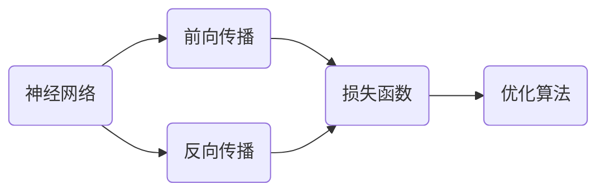

## 1.背景介绍

深度学习已经在各个领域取得了显著的成果，从图像识别、语音识别到自然语言处理，深度学习都在提供前所未有的解决方案。这种强大的学习能力源于其独特的处理方式，它通过模拟人脑神经网络的工作机制，能够从大量数据中自动学习并提取有价值的特征。

## 2.核心概念与联系

深度学习的核心概念包括神经网络、前向传播、反向传播、损失函数、优化算法等。神经网络是深度学习的基础，它由输入层、隐藏层和输出层构成。前向传播是数据在神经网络中的传播过程，反向传播则是通过计算损失函数的梯度，更新神经网络的权重和偏置。优化算法如梯度下降法、随机梯度下降法、Adam等用于优化损失函数，从而优化神经网络的性能。



## 3.核心算法原理具体操作步骤

### 3.1 初始化参数

神经网络的参数包括权重和偏置，需要在开始训练前进行初始化。一般情况下，我们会使用小的随机数来初始化权重，偏置则初始化为零。

### 3.2 前向传播

前向传播是指将输入数据传递到神经网络的过程。在每一层，我们都会计算该层的线性输出（即权重和输入的点积加上偏置），然后将线性输出传递给激活函数，得到该层的激活输出。

### 3.3 计算损失

当数据通过神经网络得到预测值后，我们需要计算预测值与真实值之间的差距，即损失。常用的损失函数有均方误差、交叉熵等。

### 3.4 反向传播

反向传播是指根据损失函数的梯度，从输出层向输入层逐层更新参数的过程。这个过程中，我们需要计算每一层的梯度，然后用这个梯度来更新该层的参数。

### 3.5 参数更新

参数更新是指根据反向传播得到的梯度，使用优化算法更新参数。常用的优化算法有梯度下降法、随机梯度下降法、Adam等。

## 4.数学模型和公式详细讲解举例说明

### 4.1 前向传播

在神经网络的第$l$层，其线性输出$Z^{[l]}$和激活输出$A^{[l]}$可以通过以下公式计算：

$$
Z^{[l]} = W^{[l]}A^{[l-1]} + b^{[l]}
$$

$$
A^{[l]} = g^{[l]}(Z^{[l]})
$$

其中，$W^{[l]}$和$b^{[l]}$是第$l$层的权重和偏置，$A^{[l-1]}$是前一层的激活输出，$g^{[l]}$是激活函数。

### 4.2 计算损失

对于二分类问题，我们通常使用交叉熵损失函数：

$$
L(y, \hat{y}) = -y\log(\hat{y}) - (1-y)\log(1-\hat{y})
$$

其中，$y$是真实值，$\hat{y}$是预测值。

### 4.3 反向传播

在反向传播过程中，我们需要计算损失函数关于权重$W^{[l]}$和偏置$b^{[l]}$的梯度：

$$
\frac{\partial L}{\partial W^{[l]}} = \frac{1}{m} dZ^{[l]} A^{[l-1]T}
$$

$$
\frac{\partial L}{\partial b^{[l]}} = \frac{1}{m} np.sum(dZ^{[l]}, axis=1, keepdims=True)
$$

其中，$dZ^{[l]}$是第$l$层的线性输出的梯度，$m$是样本数量。

### 4.4 参数更新

参数更新公式如下：

$$
W^{[l]} = W^{[l]} - \alpha \frac{\partial L}{\partial W^{[l]}}
$$

$$
b^{[l]} = b^{[l]} - \alpha \frac{\partial L}{\partial b^{[l]}}
$$

其中，$\alpha$是学习率。

## 5.项目实践：代码实例和详细解释说明

以下是一个简单的神经网络训练过程的Python代码示例：

```python
import numpy as np

# 初始化参数
W = np.random.randn(1, 2)
b = np.zeros((1, 1))

# 前向传播
Z = np.dot(W, X) + b
A = 1 / (1 + np.exp(-Z))

# 计算损失
L = -np.mean(Y*np.log(A) + (1-Y)*np.log(1-A))

# 反向传播
dZ = A - Y
dW = np.dot(dZ, X.T) / m
db = np.mean(dZ, axis=1, keepdims=True)

# 参数更新
W = W - alpha * dW
b = b - alpha * db
```

这段代码中，`X`是输入数据，`Y`是真实值，`m`是样本数量，`alpha`是学习率。我们首先初始化参数`W`和`b`，然后进行前向传播，计算损失，进行反向传播，最后更新参数。

## 6.实际应用场景

深度学习在许多领域都有广泛的应用，包括：

- 图像识别：深度学习能够从图像中自动提取特征，用于识别物体、人脸、手写数字等。
- 语音识别：深度学习能够从声音信号中自动提取特征，用于识别语音、语言、口音等。
- 自然语言处理：深度学习能够理解和生成语言，用于机器翻译、情感分析、文本生成等。

## 7.工具和资源推荐

以下是一些常用的深度学习工具和资源：

- TensorFlow：Google开源的深度学习框架，提供了丰富的深度学习模型和工具。
- PyTorch：Facebook开源的深度学习框架，提供了灵活和直观的编程接口。
- Keras：基于TensorFlow的高级深度学习框架，提供了简单易用的API。

## 8.总结：未来发展趋势与挑战

深度学习在近年来取得了显著的进步，但仍面临许多挑战，包括训练时间长、需要大量数据、难以解释等。未来，我们需要进一步研究如何提高深度学习的效率，减少数据需求，提高模型的可解释性。

## 9.附录：常见问题与解答

1. **问：深度学习和机器学习有什么区别？**

答：深度学习是机器学习的一个子领域，它使用神经网络来模拟人脑的工作机制，能够从大量数据中自动学习并提取有价值的特征。

2. **问：深度学习需要大量的数据，如果我没有那么多数据怎么办？**

答：你可以使用数据增强、迁移学习等技术来解决数据不足的问题。数据增强是通过对原始数据进行变换（如旋转、缩放、裁剪等）来生成新的数据。迁移学习是利用在大型数据集上预训练的模型，只需微调少量参数即可适应新的任务。

3. **问：深度学习的训练过程很慢，有什么解决办法吗？**

答：你可以使用更强大的硬件（如GPU）、更优秀的优化算法（如Adam）、更小的模型等方法来加速训练过程。

作者：禅与计算机程序设计艺术 / Zen and the Art of Computer Programming