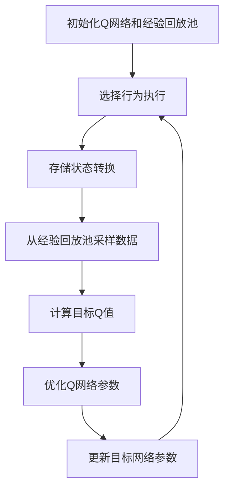
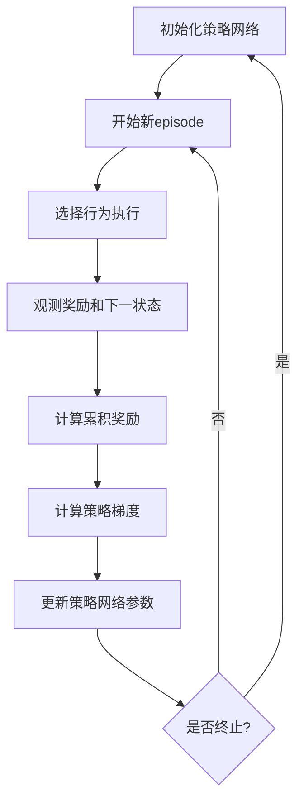
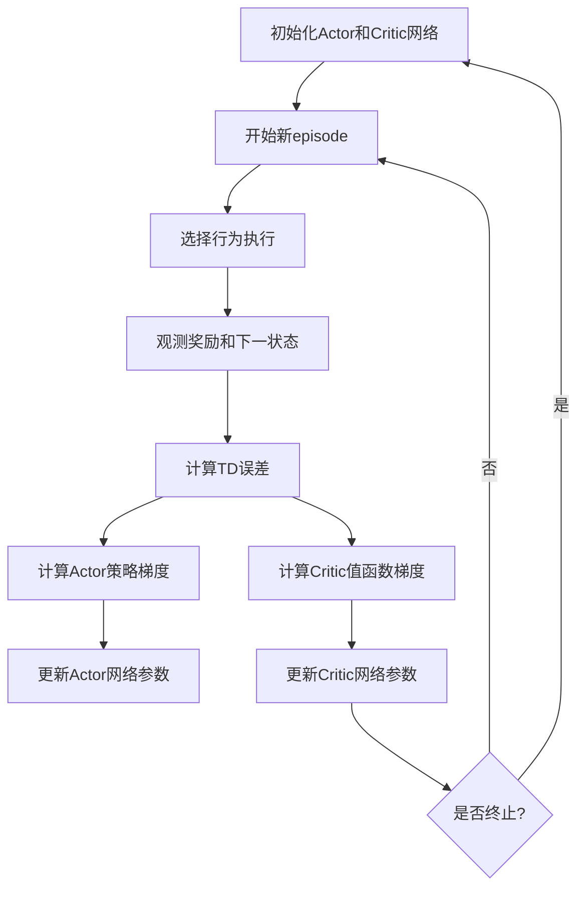
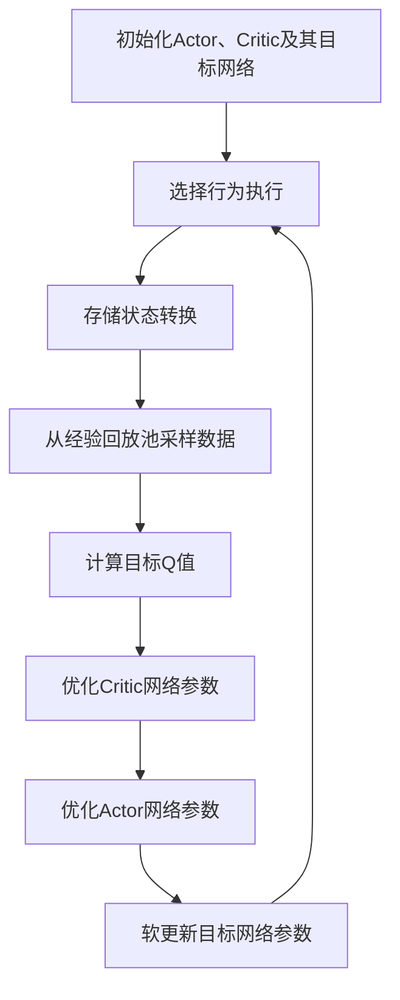

# AI人工智能深度学习算法：跨领域自主深度学习代理的集成

## 1. 背景介绍

### 1.1 人工智能的发展历程

人工智能(Artificial Intelligence, AI)是现代计算机科学的一个分支领域,旨在研究模拟人类智能行为的理论和方法。自20世纪50年代被正式提出以来,人工智能经历了多个发展阶段,从早期的专家系统和符号主义,到90年代的机器学习和数据驱动方法,再到近年来的深度学习和强化学习的兴起。

### 1.2 深度学习的崛起

深度学习(Deep Learning)作为机器学习的一个新兴热点,在计算机视觉、自然语言处理、语音识别等领域取得了突破性进展。深度学习模型通过对大量数据进行训练,能够自动学习数据的特征表示,并对复杂问题进行建模和预测。常见的深度学习模型包括卷积神经网络(CNN)、递归神经网络(RNN)、长短期记忆网络(LSTM)等。

### 1.3 自主智能体的需求

随着人工智能技术的不断发展,人们对智能体的期望也在不断提高。传统的人工智能系统往往局限于特定领域,缺乏跨领域的适应性和自主性。因此,构建具有通用智能的自主智能体成为人工智能领域的一个重要目标。自主智能体需要具备自主学习、决策和行为调整的能力,能够根据环境变化做出合理反应,并持续优化自身的行为策略。

## 2. 核心概念与联系

### 2.1 深度学习代理

深度学习代理(Deep Learning Agent)是指基于深度学习技术构建的智能体。它利用神经网络模型来表示环境状态和行为策略,通过对大量数据的训练,学习环境的内在规律和最优行为策略。深度学习代理具有端到端学习、自动特征提取和泛化能力等优势,在复杂环境下表现出色。

### 2.2 强化学习

强化学习(Reinforcement Learning)是机器学习的一个重要分支,旨在让智能体通过与环境的交互来学习最优策略。强化学习代理通过观测环境状态,执行行为,并根据获得的奖励信号来调整策略,最终达到最大化累积奖励的目标。强化学习为构建自主智能体提供了理论基础和实现方法。

### 2.3 多智能体系统

多智能体系统(Multi-Agent System)是指由多个智能体组成的系统,智能体之间可以相互协作或竞争。在这种系统中,每个智能体都需要根据自身的观测和目标做出决策,同时考虑其他智能体的行为。多智能体系统能够模拟复杂的社会现象,并在分布式决策、协作控制等领域有广泛应用。

### 2.4 元学习

元学习(Meta-Learning)旨在让智能体具备快速学习新任务的能力,即"学会学习"。传统的机器学习模型通常需要针对每个新任务重新训练,而元学习则希望智能体能够基于以前的经验,快速适应新的环境和任务。元学习为构建通用智能体提供了新的思路和方法。

### 2.5 知识迁移

知识迁移(Transfer Learning)是指利用在一个领域或任务中学习到的知识,来帮助另一个相关领域或任务的学习。在构建通用智能体的过程中,知识迁移可以帮助智能体复用已学习的知识,加速新任务的学习过程,提高学习效率。

## 3. 核心算法原理具体操作步骤

### 3.1 深度Q网络算法(Deep Q-Network, DQN)

深度Q网络算法是将深度学习与强化学习相结合的经典算法之一。它使用深度神经网络来近似Q函数,即状态-行为值函数,从而学习最优策略。DQN算法的具体步骤如下:

1. 初始化深度神经网络Q(s, a; θ),其中s为状态,a为行为,θ为网络参数。
2. 初始化经验回放池D,用于存储过去的状态-行为-奖励-下一状态转换。
3. 对于每个时间步t:
    a. 根据当前策略选择行为a_t = argmax_a Q(s_t, a; θ)。
    b. 执行行为a_t,观测奖励r_t和下一状态s_{t+1}。
    c. 将(s_t, a_t, r_t, s_{t+1})存入经验回放池D。
    d. 从D中随机采样一批数据(s_j, a_j, r_j, s_{j+1})。
    e. 计算目标Q值y_j = r_j + γ max_a' Q(s_{j+1}, a'; θ^-),其中γ为折扣因子,θ^-为目标网络参数。
    f. 优化损失函数L = E[(y_j - Q(s_j, a_j; θ))^2],更新网络参数θ。
    g. 定期将θ复制到θ^-,以固定目标网络参数。

4. 重复步骤3,直到收敛。

DQN算法通过经验回放池和目标网络的引入,解决了传统Q学习算法中的不稳定性和发散问题,使得深度神经网络能够有效地近似Q函数。

### 3.2 策略梯度算法(Policy Gradient)

策略梯度算法是另一种常用的强化学习算法,它直接学习策略函数π(a|s),即在给定状态s下选择行为a的概率。策略梯度算法的具体步骤如下:

1. 初始化策略网络π(a|s; θ),其中θ为网络参数。
2. 对于每个episode:
    a. 初始化状态s_0。
    b. 对于每个时间步t:
        i. 根据当前策略选择行为a_t ~ π(a|s_t; θ)。
        ii. 执行行为a_t,观测奖励r_t和下一状态s_{t+1}。
    c. 计算episode的累积奖励R = Σ_t γ^t r_t。
    d. 计算策略梯度∇_θ J(θ) = E[∇_θ log π(a_t|s_t; θ)R]。
    e. 使用策略梯度更新网络参数θ = θ + α∇_θ J(θ),其中α为学习率。

3. 重复步骤2,直到收敛。

策略梯度算法直接优化策略函数,避免了需要估计Q函数的步骤。它适用于连续行为空间和非马尔可夫决策过程(Non-Markov Decision Process)等情况。然而,策略梯度算法也存在一些挑战,如高方差问题和样本效率低等。

### 3.3 Actor-Critic算法

Actor-Critic算法是策略梯度算法的一种变体,它将策略函数(Actor)和值函数(Critic)结合起来,利用值函数的估计来减小策略梯度的方差。Actor-Critic算法的具体步骤如下:

1. 初始化Actor网络π(a|s; θ)和Critic网络V(s; w),其中θ和w分别为Actor和Critic的网络参数。
2. 对于每个episode:
    a. 初始化状态s_0。
    b. 对于每个时间步t:
        i. 根据当前策略选择行为a_t ~ π(a|s_t; θ)。
        ii. 执行行为a_t,观测奖励r_t和下一状态s_{t+1}。
        iii. 计算TD误差δ_t = r_t + γV(s_{t+1}; w) - V(s_t; w)。
        iv. 计算Actor的策略梯度∇_θ J(θ) = ∇_θ log π(a_t|s_t; θ)δ_t。
        v. 计算Critic的值函数梯度∇_w J(w) = ∇_w (δ_t)^2。
    c. 使用策略梯度更新Actor网络参数θ = θ + α∇_θ J(θ)。
    d. 使用值函数梯度更新Critic网络参数w = w + β∇_w J(w),其中α和β为学习率。

3. 重复步骤2,直到收敛。

Actor-Critic算法将策略优化和值函数估计结合起来,利用值函数的估计来减小策略梯度的方差,从而提高了算法的稳定性和收敛速度。

### 3.4 深度确定性策略梯度算法(Deep Deterministic Policy Gradient, DDPG)

DDPG算法是Actor-Critic算法在连续行为空间下的一种扩展,它使用确定性策略函数和目标网络来提高算法的稳定性和收敛性。DDPG算法的具体步骤如下:

1. 初始化Actor网络μ(s; θ^μ)、Critic网络Q(s, a; θ^Q)及其目标网络μ'(s; θ^μ')和Q'(s, a; θ^Q')。
2. 初始化经验回放池D。
3. 对于每个时间步t:
    a. 根据当前策略选择行为a_t = μ(s_t; θ^μ) + N_t,其中N_t为探索噪声。
    b. 执行行为a_t,观测奖励r_t和下一状态s_{t+1}。
    c. 将(s_t, a_t, r_t, s_{t+1})存入经验回放池D。
    d. 从D中随机采样一批数据(s_j, a_j, r_j, s_{j+1})。
    e. 计算目标Q值y_j = r_j + γQ'(s_{j+1}, μ'(s_{j+1}; θ^μ'); θ^Q')。
    f. 优化Critic网络损失函数L_Q = E[(Q(s_j, a_j; θ^Q) - y_j)^2],更新网络参数θ^Q。
    g. 优化Actor网络损失函数L_μ = -E[Q(s_j, μ(s_j; θ^μ); θ^Q)],更新网络参数θ^μ。
    h. 软更新目标网络参数:
        θ^Q' = τθ^Q + (1 - τ)θ^Q'
        θ^μ' = τθ^μ + (1 - τ)θ^μ'

4. 重复步骤3,直到收敛。

DDPG算法通过引入目标网络和软更新机制,提高了算法的稳定性和收敛性。同时,它使用确定性策略函数,避免了连续行为空间下的高方差问题。

## 4. 数学模型和公式详细讲解举例说明

### 4.1 马尔可夫决策过程(Markov Decision Process, MDP)

马尔可夫决策过程是强化学习的基础数学模型,它描述了智能体与环境之间的交互过程。一个MDP可以用元组(S, A, P, R, γ)来表示,其中:

- S是状态集合,表示环境的所有可能