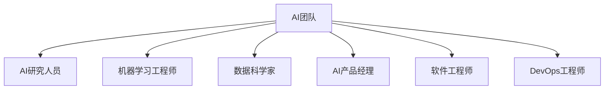

# AI人才招聘与团队建设原理与代码实战案例讲解

## 1.背景介绍

### 1.1 人工智能时代的到来

人工智能(AI)已经成为当今科技发展的核心驱动力,正在深刻改变着我们的生活、工作和社会。随着算力的不断提升、数据的爆炸式增长以及算法的持续创新,AI技术在诸多领域取得了突破性进展,例如计算机视觉、自然语言处理、决策系统等。AI已经渗透到了金融、医疗、制造、交通等各个行业,为企业带来了前所未有的机遇和挑战。

### 1.2 AI人才的战略重要性

在这场AI革命的浪潮中,人才是最宝贵的资源。拥有AI人才,尤其是顶尖的AI人才,已经成为企业赢得竞争优势的关键因素。AI人才不仅需要扎实的数学和计算机科学基础,还需要具备跨学科知识、创新思维和终身学习的能力。然而,AI人才的供给严重短缺,各大企业和机构都在激烈角逐这一稀缺资源。

### 1.3 AI团队建设的重要性

构建高绩效的AI团队是企业实现AI战略目标的基础。一支优秀的AI团队需要拥有多元化的人才结构,包括算法科学家、数据工程师、产品经理等,他们通力协作,发挥整体合力。同时,AI团队建设还需要注重人才培养、文化建设、组织架构优化等多个方面,以激发团队的创新活力和凝聚力。

## 2.核心概念与联系

### 2.1 AI人才定义

AI人才是指从事AI相关工作的人员,包括但不限于:

- **AI研究人员**: 致力于AI理论和算法的创新,推动AI技术发展。
- **机器学习工程师**: 将AI算法应用于实际问题,构建和优化机器学习模型。  
- **数据科学家**: 负责数据采集、清洗、建模和分析,为AI系统提供数据支持。
- **AI产品经理**: 负责AI产品的规划、设计和交付,把AI技术转化为面向用户的产品和服务。

### 2.2 AI团队构成

高绩效的AI团队通常由以下几个核心角色组成:



这些角色相互协作,共同推动AI项目的开发和交付。AI研究人员关注算法创新,机器学习工程师将算法应用于实践,数据科学家负责数据处理,AI产品经理将技术转化为产品,软件工程师实现系统开发,DevOps工程师负责系统部署和运维。

### 2.3 AI人才能力模型

AI人才需要具备多方面的能力,包括:

- **专业技能**: 数学、算法、编程、数据处理等AI核心技能。
- **创新能力**: 洞察问题本质,提出创新性解决方案的能力。
- **学习能力**: 不断学习新知识、掌握新技术的能力。
- **沟通协作**: 与团队成员高效沟通协作的能力。
- **领域知识**: 对应用领域的深入理解和经验积累。

## 3.核心算法原理具体操作步骤

### 3.1 AI人才评估算法

评估AI人才的综合能力是招聘的重要环节。常用的AI人才评估算法包括:

1. **知识测试**: 通过笔试或在线测试,评估应聘者的专业知识水平。
2. **编程挑战**: 设计一些编程任务,考察应聘者的编码能力和解决问题的思路。
3. **项目评审**: 让应聘者介绍过去的项目经验,评估其实践能力。
4. **面试环节**: 通过结构化面试,全面评估应聘者的技能、经验和潜力。

这些评估环节通常会综合考虑应聘者的专业知识、实践经验、创新思维和沟通能力等多个维度。

### 3.2 AI团队优化算法

构建高绩效的AI团队需要不断优化团队的架构和流程,常用的优化算法包括:

1. **角色优化**: 根据项目需求,调整团队成员的角色分工,确保角色清晰、责权匹配。
2. **流程优化**: 梳理并优化AI项目的开发流程,提高效率和质量。
3. **知识共享**: 建立知识共享机制,促进团队内部的学习和交流。
4. **奖惩机制**: 建立合理的奖惩机制,激励团队成员的工作积极性。
5. **文化建设**: 培育包容、创新、协作的企业文化氛围。

通过持续优化,AI团队可以不断提升凝聚力和执行力,更好地完成AI项目目标。

## 4.数学模型和公式详细讲解举例说明

在AI领域,数学模型和公式扮演着至关重要的角色。以下是一些常用的数学模型和公式:

### 4.1 线性回归模型

线性回归是一种常用的监督学习算法,用于预测连续型目标变量。它的数学模型如下:

$$y = \theta_0 + \theta_1x_1 + \theta_2x_2 + ... + \theta_nx_n$$

其中,$y$是目标变量,$x_i$是特征变量,$\theta_i$是模型参数。模型的目标是找到最优参数$\theta$,使预测值$\hat{y}$与真实值$y$的差异最小化。

常用的损失函数是均方误差(MSE):

$$MSE = \frac{1}{n}\sum_{i=1}^n(y_i - \hat{y_i})^2$$

通过梯度下降等优化算法,可以找到最小化MSE的最优参数$\theta$。

### 4.2 逻辑回归模型

逻辑回归是一种用于分类问题的算法,适用于二分类和多分类场景。它的数学模型如下:

$$\hat{y} = \sigma(\theta_0 + \theta_1x_1 + \theta_2x_2 + ... + \theta_nx_n)$$

其中,$\sigma$是sigmoid函数:

$$\sigma(z) = \frac{1}{1 + e^{-z}}$$

$\hat{y}$的取值范围是(0,1),可以将其解释为样本属于正类的概率。通过设置阈值,即可进行二分类。

对于多分类问题,可以使用Softmax回归:

$$\hat{y_i} = \frac{e^{\theta_i^Tx}}{\sum_{j=1}^K e^{\theta_j^Tx}}$$

其中,$K$是类别数,$\hat{y_i}$表示样本属于第$i$类的概率。

### 4.3 决策树模型

决策树是一种常用的监督学习算法,可以用于分类和回归任务。它的工作原理是根据特征的取值,将样本空间逐步划分为更小的区域,每个区域对应一个预测值。

决策树的构建过程可以用信息增益或基尼系数来度量特征的重要性,选择最优特征进行分裂。具体公式如下:

信息增益:
$$Gain(D, a) = Ent(D) - \sum_{v=1}^V \frac{|D^v|}{|D|} Ent(D^v)$$

其中,$D$是数据集,$a$是特征,$V$是特征$a$的取值集合,$D^v$是特征$a$取值为$v$的子集。$Ent(D)$是数据集$D$的信息熵,定义为:

$$Ent(D) = -\sum_{i=1}^c p_i \log_2 p_i$$

其中,$c$是类别数,$p_i$是第$i$类样本的概率。

基尼系数:
$$Gini(D) = 1 - \sum_{i=1}^c p_i^2$$

通过递归地选择最优特征分裂,直至满足停止条件,即可构建出决策树模型。

以上是一些常用的数学模型和公式,在实际应用中还有许多其他模型,如支持向量机、神经网络等,它们都有着丰富的数学理论支撑。掌握这些数学基础,对于构建高质量的AI模型至关重要。

## 5.项目实践:代码实例和详细解释说明

为了更好地理解AI算法的原理和实现,我们将通过一个实际项目案例,讲解如何使用Python构建一个简单的推荐系统。

### 5.1 项目概述

推荐系统是一种广泛应用于电商、娱乐、社交等领域的AI技术,它可以根据用户的历史行为数据,预测用户的潜在兴趣偏好,并推荐相关的商品或内容。

在本案例中,我们将使用协同过滤算法,基于用户对商品的历史评分数据,构建一个电影推荐系统。

### 5.2 数据准备

我们将使用一个开源的电影评分数据集MovieLens 100K,其中包含了10万条评分记录,涉及943位用户和1682部电影。数据集的格式如下:

```
user_id,movie_id,rating,timestamp
196,242,3,881250949
...
```

我们首先需要加载并预处理这些数据,以便后续的建模和训练。

```python
import pandas as pd

# 加载数据
ratings = pd.read_csv('ml-100k/u.data', delimiter='\t', names=['user_id', 'movie_id', 'rating', 'timestamp'])

# 将用户ID和电影ID转换为连续的数值ID
user_ids = ratings.user_id.unique().tolist()
movie_ids = ratings.movie_id.unique().tolist()
user2user_id = {user_id: i for i, user_id in enumerate(user_ids)}
movie2movie_id = {movie_id: i for i, movie_id in enumerate(movie_ids)}

# 将原始数据转换为用户-电影评分矩阵
ratings_matrix = np.zeros((len(user_ids), len(movie_ids)))
for user_id, movie_id, rating in ratings.values:
    ratings_matrix[user2user_id[user_id], movie2movie_id[movie_id]] = rating
```

### 5.3 协同过滤算法

协同过滤算法是推荐系统中一种常用的技术,它基于这样一个假设:如果两个用户对某些商品的评价相似,那么他们对其他商品的评价也可能相似。

我们将使用基于用户的协同过滤算法,具体步骤如下:

1. 计算任意两个用户之间的相似度,常用的相似度度量方法有皮尔逊相关系数、余弦相似度等。
2. 对于目标用户,找到与其最相似的K个用户,称为最近邻用户。
3. 根据最近邻用户对商品的评分,预测目标用户对该商品的评分。
4. 对所有商品重复步骤3,得到目标用户的预测评分列表。
5. 将预测评分从高到低排序,推荐排名靠前的商品给目标用户。

下面是Python代码实现:

```python
import numpy as np
from scipy.stats import pearsonr

def predict_rating(ratings_matrix, user_id, movie_id, k=30, similarity_metric=pearsonr):
    """
    预测目标用户对目标电影的评分
    """
    # 获取目标用户的已评分电影
    rated_movies = ratings_matrix[user_id].nonzero()[0]
    
    # 计算目标用户与其他用户的相似度
    similarities = []
    for other_user in range(ratings_matrix.shape[0]):
        if other_user != user_id:
            other_rated_movies = ratings_matrix[other_user].nonzero()[0]
            common_movies = np.intersect1d(rated_movies, other_rated_movies)
            if len(common_movies) > 0:
                similarity = similarity_metric(ratings_matrix[user_id, common_movies],
                                               ratings_matrix[other_user, common_movies])[0]
                similarities.append((other_user, similarity))
    
    # 获取最相似的K个用户
    similarities.sort(key=lambda x: x[1], reverse=True)
    top_k_neighbors = [neighbor for neighbor, _ in similarities[:k]]
    
    # 计算预测评分
    weighted_sum = 0
    weight_sum = 0
    for neighbor in top_k_neighbors:
        if ratings_matrix[neighbor, movie_id] > 0:
            similarity = similarities[neighbor][1]
            weighted_sum += ratings_matrix[neighbor, movie_id] * similarity
            weight_sum += similarity
    if weight_sum > 0:
        predicted_rating = weighted_sum / weight_sum
    else:
        predicted_rating =