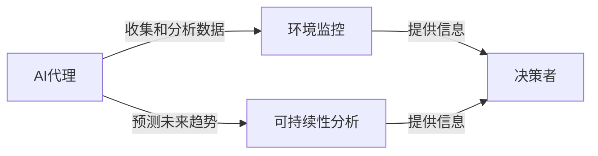

## 1.背景介绍

在可持续性和环境监控的背景下，人工智能（AI）代理的应用越来越广泛。AI代理能够处理大量数据，提供深度洞察，促进更好的决策制定。本文将深入探讨AI代理在环境监控与可持续性分析的工作流应用。

## 2.核心概念与联系

AI代理是一种能够自主执行任务的软件，它可以理解其环境，做出决策并执行任务。在环境监控和可持续性分析中，AI代理可以帮助收集和分析数据，预测未来趋势，并为决策者提供有价值的信息。



## 3.核心算法原理具体操作步骤

AI代理在环境监控和可持续性分析中的应用，主要涉及以下步骤：

1. 数据收集：AI代理通过各种传感器和数据源收集环境数据。
2. 数据预处理：AI代理对收集的数据进行清洗和格式化，以便后续处理。
3. 数据分析：AI代理使用机器学习算法对数据进行分析，以识别模式和趋势。
4. 预测：AI代理使用预测模型预测未来的环境变化。
5. 决策支持：AI代理将分析和预测结果以可视化的形式呈现给决策者，帮助他们做出更好的决策。

## 4.数学模型和公式详细讲解举例说明

在数据分析和预测阶段，AI代理通常使用机器学习算法。例如，AI代理可以使用线性回归模型预测未来的环境变化。线性回归模型的数学公式如下：

$$ Y = aX + b $$

其中，$Y$ 是预测的结果，$X$ 是输入的数据，$a$ 和 $b$ 是模型的参数，需要通过训练数据来学习。

## 5.项目实践：代码实例和详细解释说明

以下是一个简单的Python代码示例，展示了如何使用线性回归模型进行预测：

```python
from sklearn.linear_model import LinearRegression

# 创建线性回归模型实例
model = LinearRegression()

# 训练模型
model.fit(X_train, y_train)

# 使用模型进行预测
predictions = model.predict(X_test)
```

## 6.实际应用场景

AI代理在环境监控和可持续性分析中的应用场景非常广泛，例如：

- 空气质量监控：AI代理可以收集和分析空气质量数据，预测未来的空气质量，为政策制定者提供决策支持。
- 气候变化分析：AI代理可以分析气候数据，预测未来的气候变化，帮助我们更好地理解和应对气候变化。
- 能源消耗分析：AI代理可以分析能源消耗数据，预测未来的能源需求，为能源政策制定提供支持。

## 7.工具和资源推荐

以下是一些在环境监控和可持续性分析中使用AI代理的推荐工具和资源：

- Python：Python是一种广泛使用的编程语言，有许多用于数据分析和机器学习的库，如Pandas和Scikit-learn。
- TensorFlow：TensorFlow是一个开源的机器学习框架，可以用于构建和训练复杂的机器学习模型。
- Google Earth Engine：Google Earth Engine是一个用于地理数据分析的平台，可以用于环境监控和可持续性分析。

## 8.总结：未来发展趋势与挑战

随着技术的发展，AI代理在环境监控和可持续性分析中的应用将越来越广泛。然而，也存在一些挑战，例如数据质量问题、模型的解释性问题等。我们需要不断研究和改进技术，以克服这些挑战。

## 9.附录：常见问题与解答

Q: AI代理在环境监控和可持续性分析中的主要作用是什么？

A: AI代理可以收集和分析大量数据，预测未来趋势，为决策者提供有价值的信息。

Q: AI代理如何进行数据分析和预测？

A: AI代理通常使用机器学习算法进行数据分析和预测。例如，可以使用线性回归模型预测未来的环境变化。

作者：禅与计算机程序设计艺术 / Zen and the Art of Computer Programming