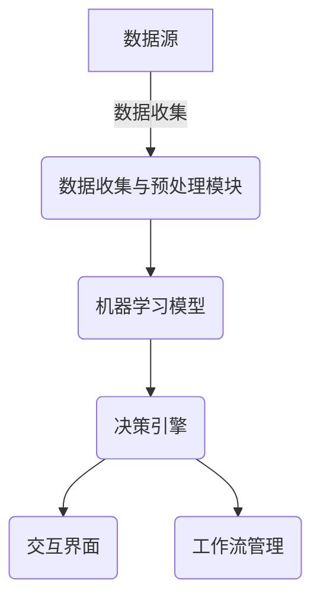

# AI代理在金融服务中的工作流程与风险评估

## 1.背景介绍

### 1.1 金融服务行业的数字化转型

在当今快节奏的数字时代，金融服务行业正经历着前所未有的变革。传统的金融机构不得不与新兴的金融科技公司展开激烈竞争,以满足日益增长的客户需求和期望。在这种背景下,人工智能(AI)技术应运而生,成为推动金融服务数字化转型的关键驱动力。

### 1.2 AI代理的兴起

AI代理是一种基于人工智能技术的虚拟助手或智能系统,能够自主执行各种任务和决策。在金融服务领域,AI代理被广泛应用于客户服务、风险管理、投资组合优化、反欺诈监控等多个方面。它们可以处理大量数据、识别模式、预测趋势,并提供智能化建议和自动化流程,从而提高效率、降低成本并改善客户体验。

### 1.3 AI代理带来的机遇与挑战

尽管AI代理为金融服务带来了巨大的机遇,但同时也存在一些潜在的风险和挑战。例如,AI系统的决策过程可能存在偏差和不透明性,导致不公平或不负责任的结果。此外,AI代理在处理敏感数据和重要决策时,也面临着数据隐私、网络安全和监管合规性等问题。因此,有必要对AI代理的工作流程和风险进行全面评估和管控。

## 2.核心概念与联系

### 2.1 AI代理的构成

AI代理通常由以下几个核心组件构成:

1. **数据收集与预处理模块**: 从各种来源(如数据库、API、文件等)收集相关数据,并对原始数据进行清洗、转换和标准化处理。

2. **机器学习模型**: 使用监督学习、非监督学习或强化学习等算法,从历史数据中学习模式和规律,构建预测或决策模型。

3. **决策引擎**: 根据机器学习模型的输出,结合规则引擎和优化算法,做出智能化决策或建议。

4. **交互界面**: 通过自然语言处理(NLP)、计算机视觉等技术,实现与用户或其他系统的友好交互。

5. **工作流管理**: 协调和管理AI代理在整个决策过程中的各个步骤和组件。

### 2.2 AI代理在金融服务中的应用场景

AI代理在金融服务中的应用场景包括但不限于:

- **客户服务**: 智能客服机器人可以快速响应客户查询,提供个性化建议和解决方案。
- **贷款审批**: AI模型可以评估申请人的信用风险,加快审批流程并提高准确性。
- **反欺诈监控**: 通过分析大量交易数据,AI系统能够及时识别可疑活动并发出警报。
- **投资组合管理**: 利用AI算法优化投资组合的配置和再平衡,最大化回报并控制风险。
- **量化交易**: AI代理可以快速分析市场数据,执行高频算法交易策略。

## 3.核心算法原理具体操作步骤  

AI代理通常采用机器学习和优化算法来构建决策模型和执行智能化流程。以下是一些常见算法的核心原理和操作步骤:

### 3.1 监督学习算法

#### 3.1.1 逻辑回归

逻辑回归是一种广泛应用于分类问题的算法,常用于信用风险评估、欺诈检测等场景。其核心思想是通过对数几率(log-odds)建模,将输入特征映射到0到1之间的概率值。

1. 收集带有标签(如0/1、真/假等)的训练数据。
2. 选择合适的特征,并对特征进行标准化或其他预处理。
3. 初始化模型参数(权重和偏置)。
4. 使用最大似然估计或梯度下降等优化方法,学习模型参数。
5. 在测试数据上评估模型性能,并根据需要进行调整和优化。

#### 3.1.2 决策树和随机森林

决策树是一种基于树状结构的监督学习算法,可用于分类和回归任务。随机森林则是通过构建多个决策树,并综合它们的预测结果来提高性能。这些算法在金融领域有广泛应用,如信用评分、异常检测等。

1. 收集带有标签的训练数据。
2. 选择合适的特征,并可能需要进行特征选择或特征工程。
3. 对于决策树:
   - 根据信息增益或基尼系数等指标,递归地构建决策树。
   - 设置合适的停止条件,如最大深度、最小样本数等,以防止过拟合。
4. 对于随机森林:
   - 通过自助采样(bootstrap)从原始数据集中抽取多个子集。
   - 在每个子集上训练一个决策树,并对特征进行随机采样以引入随机性。
   - 将所有决策树的预测结果进行集成(如投票或平均),得到最终预测。
5. 在测试数据上评估模型性能,并根据需要进行调参和优化。

### 3.2 非监督学习算法

#### 3.2.1 K-Means聚类

K-Means聚类是一种常用的无监督学习算法,可用于客户细分、异常检测等场景。其目标是将数据划分为K个簇,使得簇内样本相似度高,簇间相似度低。

1. 选择合适的特征,并对特征进行标准化或其他预处理。
2. 初始化K个随机质心(聚类中心)。
3. 对每个样本,计算其与每个质心的距离,并将其分配给最近的质心所在的簇。
4. 重新计算每个簇的质心,作为该簇所有样本的均值。
5. 重复步骤3和4,直到质心不再发生变化或达到最大迭代次数。

#### 3.2.2 主成分分析 (PCA)

PCA是一种常用的无监督学习技术,可用于数据降维、可视化和噪声去除。在金融领域,PCA可用于简化投资组合的风险因子,或提取交易数据的主要模式。

1. 收集并标准化输入数据。
2. 计算数据的协方差矩阵。
3. 计算协方差矩阵的特征值和特征向量。
4. 选择前N个最大的特征值对应的特征向量作为主成分。
5. 将原始数据投影到主成分空间,得到降维后的数据表示。

### 3.3 强化学习算法

#### 3.3.1 Q-Learning

Q-Learning是一种常用的强化学习算法,可用于自动交易系统、投资组合优化等场景。它的目标是通过与环境的互动,学习一个最优的行为策略,以最大化长期累积奖励。

1. 定义状态空间、行为空间和奖励函数。
2. 初始化Q表格(状态-行为值函数)。
3. 对于每个时间步:
   - 观察当前状态。
   - 根据当前Q值选择一个行为(如ε-贪婪策略)。
   - 执行选择的行为,观察下一个状态和奖励。
   - 更新Q表格中相应的Q值,使用时间差分(TD)学习规则。
4. 重复步骤3,直到策略收敛或达到最大迭代次数。

### 3.4 优化算法

#### 3.4.1 线性规划

线性规划是一种常用的优化技术,可用于投资组合优化、资源分配等场景。其目标是在满足一系列线性约束条件的前提下,最大化或最小化一个线性目标函数。

1. 定义决策变量、目标函数和约束条件。
2. 将问题转化为标准形式的线性规划模型。
3. 使用单纯形算法或内点法等算法求解线性规划问题。
4. 检查解的可行性和最优性。
5. 根据需要进行敏感性分析或对模型进行调整。

#### 3.4.2 遗传算法

遗传算法是一种启发式优化算法,可用于组合优化、规则发现等复杂问题。它模拟生物进化过程,通过选择、交叉和变异等操作,逐渐优化解的质量。

1. 定义适应度函数、编码方案和遗传操作(选择、交叉、变异)。
2. 随机生成初始种群(一组候选解)。
3. 评估每个个体的适应度(目标函数值)。
4. 根据适应度值,选择优秀个体进行交叉和变异,产生新一代种群。
5. 重复步骤3和4,直到达到终止条件(如最大迭代次数或目标适应度)。

## 4.数学模型和公式详细讲解举例说明

AI代理中使用的数学模型和公式通常与机器学习和优化算法密切相关。以下是一些常见模型和公式的详细讲解:

### 4.1 线性回归

线性回归是一种基本的监督学习算法,用于建立输入特征与目标变量之间的线性关系。给定一组训练数据 $\{(x_i, y_i)\}_{i=1}^N$,其中 $x_i$ 是输入特征向量, $y_i$ 是目标变量,线性回归模型可以表示为:

$$y = w^Tx + b$$

其中 $w$ 是权重向量, $b$ 是偏置项。模型的目标是找到最优的 $w$ 和 $b$,使得预测值 $\hat{y}$ 与真实值 $y$ 之间的均方误差最小化:

$$\min_{w,b} \sum_{i=1}^N (y_i - w^Tx_i - b)^2$$

这个优化问题可以通过最小二乘法或梯度下降法等方法求解。

### 4.2 逻辑回归

逻辑回归是一种广泛应用于分类问题的算法。与线性回归不同,逻辑回归使用 Sigmoid 函数将线性模型的输出映射到 (0,1) 区间,表示事件发生的概率:

$$p(y=1|x) = \sigma(w^Tx + b) = \frac{1}{1 + e^{-(w^Tx + b)}}$$

其中 $\sigma(\cdot)$ 是 Sigmoid 函数。模型的目标是最大化训练数据的对数似然函数:

$$\max_{w,b} \sum_{i=1}^N [y_i \log p(y_i=1|x_i) + (1-y_i) \log (1-p(y_i=1|x_i))]$$

这个优化问题通常使用梯度下降法或其他优化算法求解。

### 4.3 决策树

决策树是一种基于树状结构的监督学习算法,可用于分类和回归任务。每个内部节点代表一个特征,每个分支代表该特征的一个取值,而每个叶节点代表一个类别(对于分类问题)或一个预测值(对于回归问题)。

决策树的构建过程是一个递归的过程,通常使用信息增益或基尼系数等指标来选择最优特征进行分裂。对于分类问题,给定一个节点 $t$ 及其相关数据 $D_t$,信息增益可以定义为:

$$\text{Gain}(D_t, a) = \text{Entropy}(D_t) - \sum_{v \in \text{Values}(a)} \frac{|D_t^v|}{|D_t|} \text{Entropy}(D_t^v)$$

其中 $a$ 是特征, $v$ 是特征 $a$ 的一个可能取值, $D_t^v$ 是在节点 $t$ 上,特征 $a$ 取值为 $v$ 的数据子集, $\text{Entropy}(\cdot)$ 是信息熵。

对于回归问题,通常使用均方差或平均绝对偏差等指标来评估分裂质量。

### 4.4 K-Means 聚类

K-Means 是一种常用的无监督学习算法,旨在将 $N$ 个样本划分为 $K$ 个簇,使得簇内样本相似度高,簇间相似度低。给定一组数据 $\{x_i\}_{i=1}^N