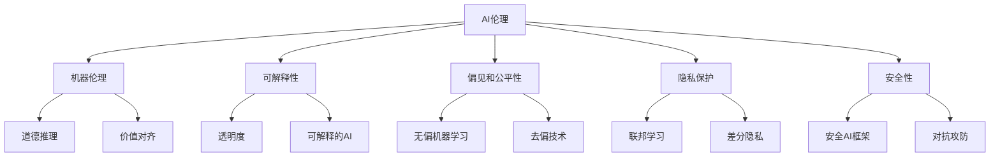

# AI伦理 原理与代码实例讲解

## 1.背景介绍
### 1.1 AI伦理的重要性
人工智能(Artificial Intelligence,AI)技术的快速发展,正在深刻影响和改变着人类社会的方方面面。然而,AI系统的决策和行为可能会带来意想不到的负面后果,引发一系列伦理问题。建立AI伦理规范,确保AI系统以安全、公平、透明、可解释、可问责的方式运行,已成为当前AI发展亟待解决的关键性问题。

### 1.2 AI伦理面临的挑战
AI伦理面临诸多挑战:
- AI系统自主性和不可预测性带来的风险
- AI系统黑盒特性导致的透明度和可解释性不足
- 算法偏见和歧视问题
- 隐私和数据安全风险
- 失业和工作岗位流失
- 军事和杀伤性自主武器的滥用
- 人机关系的伦理边界模糊

这些挑战需要从技术、法律、伦理、社会等多个维度协同应对。

### 1.3 AI伦理原则概述
为指导AI的研发和应用,学术界和产业界提出了一系列AI伦理原则,主要包括:
- 有利原则:AI应该为人类带来利益,增进人类福祉 
- 无害原则:AI不应该伤害人类,应将风险降到最低
- 自主原则:AI应该尊重人的自主权,不能操纵或强迫人
- 公平原则:AI应该公平对待所有人,不能有偏见和歧视
- 透明原则:AI系统的决策过程应该透明,并能解释
- 问责原则:对AI系统的决策和行为应有明确的责任归属
- 隐私原则:AI系统应该保护个人隐私和数据安全
- 共享利益原则:AI带来的利益应该为所有人共享

这些原则为构建负责任、可信赖的AI系统提供了基本的伦理框架。

## 2.核心概念与联系
### 2.1 AI伦理的核心概念
#### 2.1.1 机器伦理(Machine Ethics)
研究如何将伦理和道德规范嵌入到智能系统中,使其具有道德推理和决策能力,能够遵循人类的伦理价值观。

#### 2.1.2 可解释性(Explainability) 
AI系统能够解释其决策和行为的内在逻辑,使人能够理解、信任并有效监管AI。可解释性是实现AI透明和问责的基础。

#### 2.1.3 偏见和公平性(Bias and Fairness)
AI系统在学习过程中,可能从数据中习得人类社会的偏见,做出有失公允的决策。消除算法偏见,确保AI的公平性是一大挑战。

#### 2.1.4 隐私保护(Privacy Protection)
AI系统大量使用个人数据进行学习,可能侵犯个人隐私。需要在数据使用与隐私保护之间寻求平衡。

#### 2.1.5 安全性(Safety)
确保AI系统不会做出危及人类安全的行为。这需要AI系统具备基本的常识和风险意识。

### 2.2 核心概念之间的关系
下图展示了AI伦理的核心概念之间的关系:



机器伦理是AI伦理的核心,通过嵌入道德推理能力和人类价值观,使AI系统获得做出符合伦理的决策的能力。可解释性是实现AI透明和问责的基础,偏见和公平性则关注消除AI的偏见,确保其决策的公平性。隐私保护需要在数据驱动的AI时代,平衡数据价值和隐私安全。安全性则确保AI系统不会做出危及人类的行为。

## 3.核心算法原理具体操作步骤
本节介绍几种实现AI伦理的核心算法,包括:
### 3.1 基于约束的AI伦理推理
通过将伦理规则和约束嵌入到AI系统的推理和决策过程中,使其满足特定的伦理要求。主要步骤如下:

1. 定义伦理约束集合 $C={c_1,c_2,...,c_n}$,每个约束 $c_i$ 表示一条具体的伦理规则。

2. 将伦理约束转化为AI系统可以处理的形式,如谓词逻辑、线性不等式等。例如,可将"AI不可伤害人类"表示为谓词逻辑: $\forall a \in Actions,\forall h \in Humans, \lnot Harm(a,h)$。

3. 在AI系统的推理和决策过程中,将伦理约束作为硬约束加入到优化目标中:

$$
\begin{align*}
\max \quad & Utility(a) \\
\text{s.t.} \quad & a \in Actions \\  
& C(a)=True
\end{align*}
$$

其中,$Utility(a)$ 表示行为 $a$ 的效用,$C(a)=True$ 表示行为 $a$ 满足伦理约束集合 $C$ 中的所有约束。

4. 求解上述优化问题,得到满足伦理约束的最优行为决策。

### 3.2 无偏机器学习
通过算法和模型设计,减少机器学习模型的偏见,提高其公平性。主要方法包括:

1. 数据预处理去偏:通过修改训练数据,平衡不同群体的代表性,消除数据中的偏见。例如,对于敏感属性 $A$,可以通过重采样、赋权等方式,使训练数据服从 $P(X|A=a_1)=P(X|A=a_2)$。

2. 模型约束去偏:在模型训练过程中,引入公平性约束或正则项,惩罚模型的偏见。以demographic parity为例,其要求模型预测结果 $\hat{Y}$ 与敏感属性 $A$ 无关:

$$P(\hat{Y}=1|A=a_1)=P(\hat{Y}=1|A=a_2)$$

可以将其作为正则项加入到损失函数中:

$$Loss = L(Y,\hat{Y}) + \lambda \cdot |P(\hat{Y}=1|A=a_1)-P(\hat{Y}=1|A=a_2)|$$

其中 $\lambda$ 为平衡因子。

3. 后处理去偏:在模型训练完成后,对模型的预测结果进行校正,消除其中的偏见。常见方法有阈值调整、均衡化等。

### 3.3 联邦学习与差分隐私
联邦学习和差分隐私是在隐私保护的前提下开展AI训练的重要技术。

联邦学习的基本步骤如下:
1. 将训练数据分散在多个本地节点,每个节点只能访问自己的本地数据。
2. 各节点在本地数据上训练本地模型,得到本地模型参数。
3. 通过安全的通信协议,将各节点的本地模型参数聚合为全局模型,更新全局模型参数。
4. 将更新后的全局模型参数分发给各节点,重复步骤2-4,直到模型收敛。

联邦学习避免了原始数据的集中,保护了数据隐私。

差分隐私则在数据发布和分析的过程中,通过引入随机噪声,使得单个个体的数据变化不会显著影响数据分析的结果,从而保护个体隐私。形式化地,一个算法 $M$ 满足 $\varepsilon$-差分隐私,若对于任意两个相邻数据集 $D$ 和 $D'$,以及任意输出 $S$,有:

$$\Pr[M(D)\in S] \leq e^\varepsilon \cdot \Pr[M(D')\in S]$$

$\varepsilon$ 表示隐私保护强度,越小表示保护力度越大。

## 4.数学模型和公式详细讲解举例说明
本节以偏见和公平性问题为例,详细讲解其数学模型和公式。

假设有一个二元分类模型 $f$,目标是根据个人属性 $X$ 预测其是否违约 $Y$。其中 $X$ 包含敏感属性 $A$,如性别、种族等。我们希望模型 $f$ 的预测结果 $\hat{Y}$ 不因 $A$ 的取值不同而有所偏差,即满足demographic parity。

形式化地,demographic parity要求:

$$P(\hat{Y}=1|A=a_1)=P(\hat{Y}=1|A=a_2), \forall a_1,a_2$$

其中 $a_1,a_2$ 为敏感属性 $A$ 的任意两个取值。

为达到这一目标,我们可以在模型训练时引入fairness constraint:

$$
\begin{align*}
\min \quad & \mathbb{E}[l(Y,\hat{Y})] \\
\text{s.t.} \quad & |P(\hat{Y}=1|A=a_1)-P(\hat{Y}=1|A=a_2)| \leq \epsilon, \forall a_1,a_2
\end{align*}
$$

其中 $l(Y,\hat{Y})$ 为损失函数,$\epsilon$ 为可容忍的偏差阈值。

上式可进一步改写为:

$$
\begin{align*}
\min \quad & \mathbb{E}[l(Y,\hat{Y})] + \lambda \cdot \max_{a_1,a_2} |P(\hat{Y}=1|A=a_1)-P(\hat{Y}=1|A=a_2)|
\end{align*}
$$

其中 $\lambda$ 为平衡因子。

在实际训练中,可以用经验风险来近似:

$$
\begin{align*}
\min \quad & \frac{1}{N}\sum^N_{i=1}l(y_i,\hat{y}_i) + \lambda \cdot \max_{a_1,a_2} |\frac{\sum_{i:A_i=a_1}\hat{y}_i}{N_{a_1}}-\frac{\sum_{i:A_i=a_2}\hat{y}_i}{N_{a_2}}|
\end{align*}
$$

其中 $N$ 为样本总数,$N_{a_1},N_{a_2}$ 分别为敏感属性取值为 $a_1,a_2$ 的样本数。

通过引入fairness constraint,可以在一定程度上削弱模型的偏见,提高其预测的公平性。但同时也可能损失一定的准确性。因此,需要在公平性和性能之间进行权衡。

## 5.项目实践:代码实例和详细解释说明
本节以一个简单的逻辑回归模型为例,展示如何在PyTorch中实现带fairness constraint的模型训练。

首先,定义带fairness constraint的损失函数:

```python
def fair_loss(pred, target, sensitive, lambda_):
    loss = F.binary_cross_entropy(pred, target)
    
    sensitive_values = sensitive.unique()
    n_a1 = sum(sensitive==sensitive_values[0])
    n_a2 = sum(sensitive==sensitive_values[1])
    
    fair_constraint = torch.abs(pred[sensitive==sensitive_values[0]].mean() - 
                                pred[sensitive==sensitive_values[1]].mean())
    
    return loss + lambda_ * fair_constraint
```

其中,`pred`为模型预测值,`target`为真实标签,`sensitive`为敏感属性,`lambda_`为平衡因子。该损失函数由两部分组成:一是常规的交叉熵损失,二是fairness constraint,即敏感属性不同取值下的预测值差的绝对值。

接下来,定义模型并进行训练:

```python
class FairModel(nn.Module):
    def __init__(self, n_features):
        super(FairModel, self).__init__()
        self.linear = nn.Linear(n_features, 1)
        
    def forward(self, x):
        return torch.sigmoid(self.linear(x))

model = FairModel(n_features)
optimizer = optim.Adam(model.parameters())

for epoch in range(num_epochs):
    for batch in dataloader:
        features, labels, sensitive = batch
        pred = model(features)
        loss = fair_loss(pred, labels, sensitive, lambda_)
        
        optimizer.zero_grad()
        loss.backward()
        optimizer.step()
```

模型结构为一个简单的Logistic Regression,使用`fair_loss`作为损失函数进行训练。通过