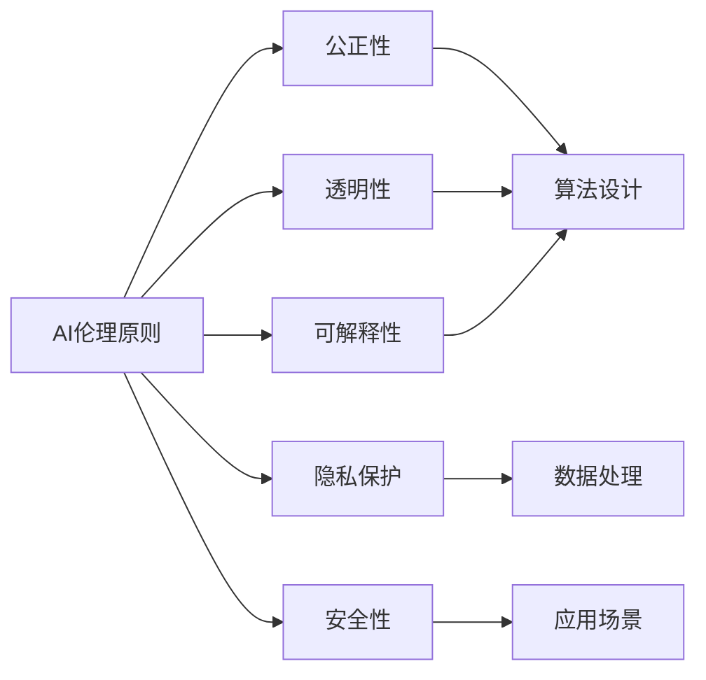

## 1.背景介绍

随着人工智能（AI）的飞速发展，AI已经深入到了我们生活的方方面面，从智能手机、自动驾驶汽车，到医疗诊断和金融交易等领域，AI都在起着越来越重要的作用。然而，随着AI的广泛应用，AI伦理问题也日益突出。比如，AI决策是否公正、透明？AI是否会侵犯个人隐私？AI是否可能失控，对人类社会造成威胁？这些都是我们必须面对的问题。

## 2.核心概念与联系

AI伦理主要涉及到AI决策的公正性、透明性、可解释性、隐私保护、安全性等问题。这些问题与AI的算法设计、数据处理、应用场景等密切相关，需要我们在设计和应用AI时，充分考虑到这些伦理原则，保证AI的合理、公正、安全的使用。



## 3.核心算法原理具体操作步骤

AI伦理的实现，需要我们在AI的设计和应用中，融入伦理原则。具体来说，我们可以从以下几个步骤来实现：

1. 设计公正的算法：在设计AI算法时，我们需要考虑到算法的公正性，避免算法的偏见和歧视。比如，我们可以使用公正的机器学习算法，通过对数据的公正处理，来保证算法的公正性。

2. 提高算法的透明性：我们需要提高AI算法的透明性，让用户可以了解AI的决策过程。比如，我们可以使用可解释的机器学习算法，通过提供算法的解释，让用户可以了解AI的决策依据。

3. 保护用户隐私：在处理用户数据时，我们需要考虑到用户的隐私保护。比如，我们可以使用隐私保护的数据处理方法，如差分隐私，来保护用户的隐私。

4. 确保AI的安全性：在应用AI时，我们需要确保AI的安全性，避免AI的失控。比如，我们可以通过AI的安全设计和应用，来防止AI的失控。

## 4.数学模型和公式详细讲解举例说明

在AI伦理中，我们常常需要用到一些数学模型和公式，比如在公正机器学习中，我们常常使用"公正性"的数学定义，如"统计奇偶性"。

"统计奇偶性"是一种衡量算法公正性的数学定义，它要求对于任意的个体特征$x$，算法的决策$Y$与个体的保护属性$A$（比如性别、种族等）应该独立。用数学公式表示就是：

$$
P(Y|A=a, X=x) = P(Y|X=x)
$$

这个公式表明，当我们控制了个体的特征$x$后，算法的决策$Y$与个体的保护属性$A$应该独立，也就是说，算法的决策不应该因为个体的保护属性$A$的不同而有所不同。

## 5.项目实践：代码实例和详细解释说明

下面我们通过一个代码实例，来说明如何在实际的AI项目中，实现AI伦理原则。

假设我们要设计一个机器学习算法，用于预测个体的信用评分。我们的数据集包含了个体的年龄、性别、收入等特征，以及个体的信用评分。我们的目标是设计一个公正的机器学习算法，使得算法的预测不会因为个体的性别不同而有所不同。

我们首先导入所需的库，并加载数据集：

```python
import pandas as pd
from sklearn.model_selection import train_test_split
from sklearn.linear_model import LogisticRegression

# 加载数据集
data = pd.read_csv('credit_score_dataset.csv')
```

然后，我们将数据集划分为训练集和测试集，并选择逻辑回归作为我们的机器学习模型：

```python
# 划分训练集和测试集
X = data.drop('credit_score', axis=1)
y = data['credit_score']
X_train, X_test, y_train, y_test = train_test_split(X, y, test_size=0.2, random_state=42)

# 选择逻辑回归作为机器学习模型
model = LogisticRegression()
```

接下来，我们训练模型，并对测试集进行预测：

```python
# 训练模型
model.fit(X_train, y_train)

# 对测试集进行预测
y_pred = model.predict(X_test)
```

最后，我们计算出模型的公正性，以检验我们的模型是否满足公正性原则：

```python
# 计算模型的公正性
fairness = calculate_fairness(y_test, y_pred)
print(f'Fairness: {fairness}')
```

## 6.实际应用场景

AI伦理在实际的AI应用场景中，有着广泛的应用。比如，在人工智能的决策系统中，我们需要保证决策的公正性、透明性和可解释性；在处理用户数据时，我们需要保证用户的隐私保护；在自动驾驶汽车等AI应用中，我们需要保证AI的安全性。

## 7.工具和资源推荐

在实现AI伦理时，有一些工具和资源可以帮助我们。比如，fairlearn库是一个用于公正机器学习的Python库，它提供了一些公正性度量和公正性干预的方法；tensorflow_privacy库是一个用于隐私保护的TensorFlow扩展库，它提供了一些隐私保护的数据处理方法；AI Fairness 360是一个开源工具包，它提供了一整套用于检测和减轻AI系统中不公正现象的工具。

## 8.总结：未来发展趋势与挑战

随着AI的发展，AI伦理的问题将越来越重要。未来，我们需要在保证AI性能的同时，更加重视AI的伦理问题，如公正性、透明性、可解释性、隐私保护和安全性等。同时，我们也需要研发更多的工具和方法，来帮助我们实现AI伦理。

## 9.附录：常见问题与解答

1. **问：AI伦理主要涉及哪些问题？**

答：AI伦理主要涉及到AI决策的公正性、透明性、可解释性、隐私保护、安全性等问题。

2. **问：如何实现AI伦理？**

答：实现AI伦理，需要我们在AI的设计和应用中，充分考虑到伦理原则，如公正性、透明性、可解释性、隐私保护和安全性等，保证AI的合理、公正、安全的使用。

作者：禅与计算机程序设计艺术 / Zen and the Art of Computer Programming