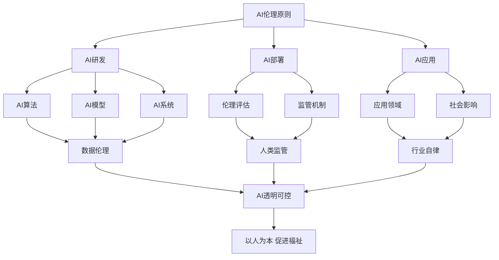

# AI伦理的终极目标：构建人类福祉导向的AI

## 1.背景介绍
### 1.1 人工智能的迅猛发展
人工智能(Artificial Intelligence, AI)技术在近年来取得了突飞猛进的发展。从语音识别、图像识别到自然语言处理,再到AlphaGo战胜人类顶尖围棋高手,AI在各个领域展现出了超越人类的能力。AI正在深刻改变着我们的生活和工作方式。

### 1.2 AI带来的机遇与挑战
AI为人类社会带来了巨大的发展机遇。它有望在医疗、教育、交通、金融等诸多领域极大提升效率,改善人们的生活质量。但与此同时,AI的发展也引发了一系列伦理问题和挑战,例如:
- AI系统可能产生偏见和歧视
- AI可能被滥用于监控和操纵 
- AI可能导致就业岗位流失
- 强人工智能可能威胁人类地位

这些问题如果处理不当,将严重影响AI的健康发展和人类社会的稳定。因此,我们必须高度重视AI伦理问题,推动构建有利于人类福祉的AI。

### 1.3 AI伦理的重要意义
AI伦理是指在AI的研发、部署和使用过程中,所遵循的道德规范和价值标准。它旨在确保AI能够造福人类,避免对人类造成伤害。AI伦理关乎AI能否服务于人类福祉这一根本目标。只有建立健全的AI伦理规范,才能最大限度发挥AI的积极作用,把AI引向正确的方向。

## 2.核心概念与联系
### 2.1 AI伦理的核心原则
AI伦理主要包括以下几个核心原则:
1. **有益原则**: AI应当有利于人类福祉,不得危害人类利益。
2. **尊重人权**: AI不得侵犯人的基本权利,如生命权、自由权、隐私权等。  
3. **公平公正**: AI不得产生或加剧偏见和歧视,应保障机会平等。
4. **透明可控**: AI系统的决策逻辑应当透明,接受人类监管。
5. **安全可靠**: AI系统应当稳定可靠,不得危及人类生命安全。

### 2.2 AI伦理与人类福祉的关系
AI伦理的终极目标,是确保AI能够服务于人类福祉。所谓人类福祉,是指人的生存质量和发展水平,既包括物质需求的满足,也包括精神需求的满足。AI通过提升效率、创造财富,能够提高人类物质生活水平。但AI也可能加剧贫富分化、剥夺就业机会、侵犯隐私自由,损害人的尊严和权益。

因此,AI伦理必须以人类福祉为导向,确保AI造福全人类。这就要求在AI的设计、开发、应用的全过程贯彻伦理原则,时刻以人为本,把对人类整体利益的考量放在首位。只有这样,AI才能成为促进人类福祉的积极力量。

### 2.3 AI伦理框架

上图展示了一个基本的AI伦理框架。AI伦理原则贯穿AI发展的全过程,对AI研发、部署、应用提出要求。在研发阶段,要遵循数据伦理,确保算法、模型、系统的伦理属性。在部署阶段,要开展伦理评估,建立人类监管机制。在应用阶段,要重视行业自律,评估社会影响。各环节相互协同,最终实现AI的透明可控,确保AI以人为本,服务人类福祉。

## 3.核心算法原则和具体操作步骤
为了构建有利于人类福祉的AI,在算法设计和开发过程中,需要遵循以下核心原则和操作步骤:

### 3.1 数据伦理原则
- 数据合法合规:数据的收集、存储、使用应符合法律法规要求,尊重个人隐私和数据权益。
- 数据多样公正:数据应具有代表性和多样性,避免偏差和歧视。要重视少数群体和弱势群体的数据收集。
- 数据质量把控:数据应准确、完整、及时,减少噪音和异常值。

### 3.2 算法伦理原则 
- 算法公平:在数据、特征工程、模型选择等方面,应消除人为和系统性偏见,确保算法的公平性。
- 算法透明:应提供算法的可解释性,对外披露算法逻辑,接受外部审计。
- 算法安全:应评估算法的鲁棒性和稳定性,设置安全边界,防范误用和恶意攻击。

### 3.3 人机协作原则
- 人机界面友好:AI系统应当易用易理解,减少使用门槛,提供人性化交互。
- 人工干预机制:对于高风险、高敏感度的AI决策,应设置人工干预和否决机制。
- 人力资源配置:应合理配置人力资源,提供岗位再培训,帮助员工适应人机协作新模式。

### 3.4 具体操作步骤
1. 伦理评估:开展全面的伦理风险评估,识别AI系统可能带来的伦理问题。
2. 需求分析:明确AI系统的使用场景和目标用户,分析利益相关方的伦理诉求。
3. 数据治理:制定数据治理策略,确保数据的合规、多样、质量。
4. 算法设计:在算法设计过程中,贯彻公平、透明、安全的原则。
5. 测试评估:全面测试AI系统,评估其伦理属性,及时发现和修正问题。
6. 人机配置:合理设计人机交互和人工干预流程,优化人力资源配置。
7. 监管审计:建立内外部监管审计机制,定期评估AI系统的伦理绩效。
8. 持续改进:持续跟踪AI系统的伦理表现,积极吸收反馈,持续优化改进。

## 4.数学模型和公式详细讲解举例说明
为了实现AI伦理目标,需要建立相应的数学模型,对AI系统的伦理属性进行量化评估。下面以公平性评估为例,讲解相关数学模型和公式。

### 4.1 统计平等模型
统计平等是评估AI系统公平性的一个重要指标。它要求不同人群在AI决策中获得相同的积极结果概率。以二分类问题为例,假设AI系统对不同人群(如男性和女性)的决策结果服从如下概率分布:

$$
\begin{aligned}
P(\hat{Y}=1|A=0) &= p_0 \\
P(\hat{Y}=1|A=1) &= p_1
\end{aligned}
$$

其中,$\hat{Y}$表示AI的决策(取值为0或1),$A$表示敏感属性(取值为0或1)。统计平等要求:

$$p_0 = p_1$$

即不同人群获得积极决策的概率应当相等。

### 4.2 机会平等模型
机会平等是另一种常用的公平性衡量指标。它要求AI系统对具有相似条件的不同人群,给出相同的积极决策概率。以贷款审批为例,假设有两个人群A和B,他们在收入、信用记录等条件上相似,那么AI系统应当给出相同的贷款通过率。

令$X$表示申请人的条件属性向量,则机会平等可以表示为:

$$P(\hat{Y}=1|A=0,X=x) = P(\hat{Y}=1|A=1,X=x), \forall x$$

即在相同条件$X=x$下,不同人群获得贷款通过的概率应当相等。

### 4.3 均衡损失模型
在实际应用中,完全的统计平等或机会平等可能难以达成,因为不同人群的数据分布可能存在差异。均衡损失模型允许一定的公平性偏差,但要求正负偏差均衡。以招聘为例,假设AI系统对男性和女性的录取率分别为:

$$
\begin{aligned}
P(\hat{Y}=1|A=0) &= p_0 \\
P(\hat{Y}=1|A=1) &= p_1
\end{aligned}
$$

均衡损失模型允许$p_0$和$p_1$存在差异,但要求:

$$|p_0 - p| = |p_1 - p|$$

其中,$p$为总体的录取率。即要求男女录取率与总体录取率的偏差大小相等。

### 4.4 公平性优化方法
在AI模型的训练过程中,可以将公平性指标纳入优化目标,引导模型向更加公平的方向学习。以统计平等为例,可以在模型的损失函数中加入公平性正则项:

$$Loss = L(f(X), Y) + \lambda(p_0 - p_1)^2$$

其中,$L$为传统的损失函数(如交叉熵),$\lambda$为平衡因子。通过最小化该损失函数,可以在提高模型性能的同时,缩小不同人群的积极决策概率差距。

类似地,也可以将机会平等、均衡损失等指标纳入优化过程,以提升AI模型的整体公平性。

## 5.项目实践：代码实例和详细解释说明
下面以一个简单的二分类问题为例,演示如何在PyTorch中实现公平性感知的模型训练。

### 5.1 数据准备
假设我们有一个二分类数据集,其中$X$为特征变量,$Y$为目标变量(取值为0或1),$A$为敏感属性(取值为0或1)。我们首先加载和预处理数据:

```python
import torch
from sklearn.model_selection import train_test_split

# 加载数据
X, Y, A = load_data()  

# 划分训练集和测试集
X_train, X_test, Y_train, Y_test, A_train, A_test = train_test_split(X, Y, A)

# 转换为PyTorch张量
X_train = torch.tensor(X_train, dtype=torch.float32) 
Y_train = torch.tensor(Y_train, dtype=torch.long)
A_train = torch.tensor(A_train, dtype=torch.long)
```

### 5.2 模型定义
我们使用一个简单的多层感知机作为分类模型:

```python
class MLP(torch.nn.Module):
    def __init__(self, input_dim, hidden_dim, output_dim):
        super().__init__()
        self.hidden = torch.nn.Linear(input_dim, hidden_dim)
        self.output = torch.nn.Linear(hidden_dim, output_dim)

    def forward(self, x):
        x = torch.relu(self.hidden(x))
        x = self.output(x)
        return x
```

### 5.3 公平性度量
我们定义统计平等指标,作为模型公平性的度量:

```python
def statistical_parity(y_pred, a):
    p0 = y_pred[a==0].mean()
    p1 = y_pred[a==1].mean()
    return abs(p0 - p1)
```

### 5.4 损失函数设计
我们在传统的交叉熵损失函数基础上,加入统计平等正则项:

```python
def fair_loss(y_pred, y_true, a, lam=1.0):
    ce_loss = torch.nn.functional.cross_entropy(y_pred, y_true)
    sp_loss = statistical_parity(y_pred.argmax(dim=1), a)
    return ce_loss + lam * sp_loss
```

其中,$\lambda$为平衡准确性和公平性的权重因子。

### 5.5 模型训练
我们使用Adam优化器和设计的损失函数,对模型进行训练:

```python
model = MLP(input_dim, hidden_dim, output_dim)
optimizer = torch.optim.Adam(model.parameters())

for epoch in range(num_epochs):
    model.train()
    y_pred = model(X_train)
    loss = fair_loss(y_pred, Y_train, A_train, lam)
    
    optimizer.zero_grad()
    loss.backward()
    optimizer.step()
```

### 5.6 模型评估
我们在测