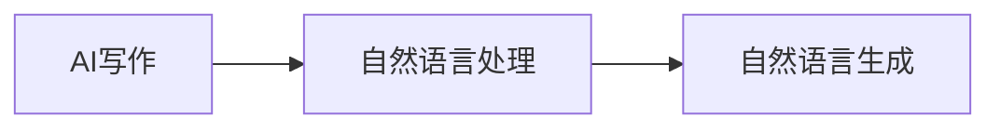
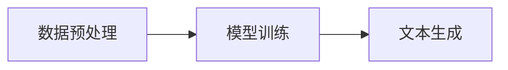

## 1.背景介绍

在过去的几年里，人工智能(AI)已经渗透到我们日常生活的各个方面，包括我们如何获取信息、购物、与朋友和家人交流，甚至是如何工作。但是，AI的影响力并没有止步于此。如今，AI已经开始进军创作领域，从新闻稿到诗歌创作，AI正在改变我们的创作方式和过程。

## 2.核心概念与联系

AI写作是指使用人工智能技术生成或辅助生成文本内容的过程。这种技术的核心是自然语言处理(NLP)，一种AI的分支，其目标是让计算机理解、生成并与人类自然语言进行交互。NLP的一个重要应用就是自然语言生成(NLG)，即使用算法将数据转化为人类可以理解的自然语言文本。



## 3.核心算法原理具体操作步骤

AI写作的核心是机器学习算法，尤其是深度学习模型，如循环神经网络(RNN)和变压器模型(Transformer)。这些模型可以在大量文本数据上进行训练，学习语言的模式和结构，然后生成新的文本。

以下是一个简化的AI写作过程：

1. 数据预处理：从互联网或其他数据源收集大量文本数据，进行清洗和标注。
2. 模型训练：使用深度学习模型，如RNN或Transformer，对预处理后的数据进行训练。
3. 文本生成：输入一个或多个初始词或短语，模型会根据学习到的语言模式生成一段新的文本。



## 4.数学模型和公式详细讲解举例说明

深度学习模型的核心是神经网络，它由多个层次的神经元组成。每个神经元接收输入，通过权重矩阵进行线性变换，然后通过激活函数进行非线性变换，生成输出。

以循环神经网络(RNN)为例，其基本单位是一个带有自我连接的神经元。其数学模型可以表示为：

$$
h_t = \sigma(W_{hh}h_{t-1} + W_{xh}x_t + b_h)
$$

$$
y_t = W_{hy}h_t + b_y
$$

其中，$h_t$是时间步$t$的隐藏状态，$x_t$是时间步$t$的输入，$W_{hh}$、$W_{xh}$和$W_{hy}$是权重矩阵，$b_h$和$b_y$是偏置，$\sigma$是激活函数。

## 5.项目实践：代码实例和详细解释说明

以下是一个简单的Python代码示例，使用TensorFlow库的Keras API实现一个基本的RNN模型：

```python
from tensorflow.keras.models import Sequential
from tensorflow.keras.layers import Embedding, SimpleRNN, Dense

model = Sequential()
model.add(Embedding(input_dim=10000, output_dim=32))
model.add(SimpleRNN(32, return_sequences=True))
model.add(SimpleRNN(32))
model.add(Dense(1, activation='sigmoid'))

model.compile(optimizer='rmsprop', loss='binary_crossentropy', metrics=['acc'])
```

这个模型首先使用一个嵌入层将整数序列转换为固定大小的向量，然后通过两个RNN层处理序列数据，最后通过一个密集层输出最终的预测结果。

## 6.实际应用场景

AI写作的应用场景非常广泛，包括但不限于：

- 新闻报道：一些新闻机构已经使用AI生成财经新闻、体育赛事报道等。
- 内容营销：企业可以使用AI生成营销文案、博客文章、社交媒体帖子等。
- 诗歌创作：AI可以根据给定的主题或风格生成诗歌。
- 小说创作：AI可以生成短篇甚至长篇小说。

## 7.工具和资源推荐

以下是一些推荐的AI写作工具和资源：

- OpenAI的GPT-3：这是目前最先进的语言生成模型，可以生成非常自然和流畅的文本。
- TensorFlow和PyTorch：这两个是最流行的深度学习库，提供了丰富的模型和工具。
- Hugging Face的Transformers：这个库提供了许多预训练的Transformer模型，可以用于各种NLP任务。

## 8.总结：未来发展趋势与挑战

AI写作的发展前景广阔，但也面临一些挑战。一方面，随着技术的进步，AI写作的质量和效率将进一步提高，应用场景也将更加广泛。另一方面，AI写作也带来了一些问题，如内容的原创性、质量控制、道德和法律问题等。

## 9.附录：常见问题与解答

- AI写作能否取代人类作家？
  - 尽管AI写作已经取得了显著的进步，但它仍然无法完全取代人类作家。AI可以生成结构合理、语法正确的文本，但它缺乏真正的创造力和情感。

- AI写作是否安全？
  - AI写作本身是安全的，但其产生的内容可能被用于不良目的，如制造假新闻、网络钓鱼等。因此，使用AI写作时需要谨慎。

作者：禅与计算机程序设计艺术 / Zen and the Art of Computer Programming