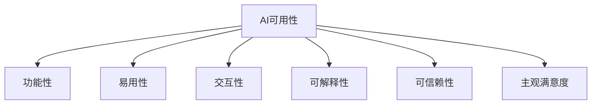

# AI可用性：衡量标准与评估体系

## 1. 背景介绍
### 1.1 AI技术的快速发展
人工智能(Artificial Intelligence, AI)技术在近年来取得了突飞猛进的发展。从图像识别、语音交互到自然语言处理,AI已经渗透到我们生活的方方面面。AI系统正在变得越来越复杂和强大。

### 1.2 AI可用性的重要性
然而,随着AI系统能力的增强,它们的可用性问题也日益凸显。对于普通用户来说,如何有效地使用AI系统,让AI真正服务于人类,成为了一个亟待解决的问题。衡量AI系统的可用性,建立科学的评估体系,对于推动AI技术在实际场景中的应用具有重要意义。

### 1.3 本文的目的
本文将围绕"AI可用性"这一主题,深入探讨AI系统可用性的内涵,梳理可用性的衡量标准,提出一套科学完善的AI可用性评估体系,为AI系统的设计、开发与应用提供参考和指导。

## 2. 核心概念与联系
### 2.1 可用性的定义
可用性(Usability)是人机交互领域的一个核心概念。ISO 9241-11标准[^1]将可用性定义为:"用户在特定的使用环境下,利用产品达到特定目标的有效性、效率和满意度。" 可用性强调以用户为中心,关注用户使用产品过程中的主观感受和客观表现。

### 2.2 AI系统的特点
与传统软件系统相比,AI系统具有其独特的特点[^2]:
- 自主性:AI系统具有一定的自主决策和执行能力
- 不确定性:AI系统的输出具有一定的不确定性和变化性
- 可解释性:AI系统的决策过程通常是黑盒,缺乏可解释性
- 适应性:AI系统可以通过学习适应环境的变化

这些特点给AI系统的可用性带来了新的挑战。

### 2.3 AI可用性的内涵
结合可用性的定义和AI系统的特点,我们可以将AI可用性(AI Usability)定义为:

*用户在特定任务情景下,利用AI系统准确高效地达成目标,并获得满意体验的程度。*

AI可用性的内涵可以从以下几个维度来理解:
- 功能性:AI系统能够准确完成用户的目标任务
- 易用性:用户能够方便地理解和操作AI系统
- 交互性:AI系统能够提供自然、流畅的人机交互
- 可解释性:AI系统的输出和决策对用户是可理解、可解释的
- 可信赖性:用户对AI系统的输出有信心,愿意采纳其建议
- 主观满意度:用户在使用AI系统的过程中获得愉悦的主观体验

下图展示了AI可用性的核心概念之间的联系:



## 3. 核心评估原理与操作步骤
### 3.1 以用户为中心的评估原则
衡量AI可用性需要坚持以用户为中心的基本原则。具体包括:
1. 关注真实用户:选取有代表性的目标用户群体进行评估
2. 基于实际任务:设计与真实应用场景相匹配的任务来考察AI系统
3. 重视主客观结合:综合考虑用户主观感受和客观表现
4. 定性定量并重:采用定性和定量分析相结合的方法

### 3.2 AI可用性评估的操作步骤
参考可用性工程的思路[^3],AI可用性评估可以分为以下几个步骤:

#### 3.2.1 明确评估目标
首先需要明确此次评估活动的目标,例如:
- 在产品设计阶段,评估初步设计方案的可用性,发现潜在问题
- 在开发阶段,比较不同算法、交互方式的可用性差异
- 在产品发布前,验证系统的可用性是否达到预期标准
- 产品发布后,持续跟踪真实用户的使用情况,优化产品体验

#### 3.2.2 选择评估对象和用户
根据评估目标,选择合适的AI系统作为评估对象。同时招募一组有代表性的目标用户参与评估。用户的选择需要考虑:
- 人口统计学特征:如年龄、性别、学历等
- 使用背景:对AI技术的了解程度、使用动机等
- 任务相关性:与目标任务的相关经验、领域知识等

#### 3.2.3 设计评估任务
设计一组覆盖主要功能、具有代表性的任务,让用户在实际场景中操作AI系统。任务设计需要考虑:
- 任务目标:任务要有明确的目标,能考察AI系统的主要功能
- 任务难度:任务难度适中,不会太简单或太困难
- 任务情景:提供必要的任务背景信息,增加真实性

#### 3.2.4 确定评估指标
根据AI可用性的内涵,设计一系列定性和定量的评估指标。定量指标可以包括:
- 完成率:用户能够正确完成任务的比例
- 满意度:用户对系统的主观满意程度,通常采用李克特量表
- 错误率:用户在完成任务过程中发生错误的次数
- 效率:完成任务的平均用时

定性指标主要通过观察和访谈等方式收集,可以包括:
- 可理解性:用户是否理解AI系统的输出和建议
- 信任度:用户是否信任AI系统,愿意采纳其建议
- 主观体验:用户使用系统过程中的情绪、痛点等

#### 3.2.5 实施评估
邀请用户使用AI系统完成一系列任务,同时通过观察、问卷、访谈、日志分析等多种方式收集定性和定量数据。

#### 3.2.6 分析结果并改进
对收集到的数据进行统计分析,总结AI系统在不同指标上的表现。识别可用性问题,提出改进建议。重复迭代上述评估过程,不断优化系统的可用性。

## 4. 数学建模与量化分析
### 4.1 可用性指标的数学表示
为了定量地评估AI系统的可用性,我们需要对各项指标进行数学建模。以完成率为例,假设一项任务共有$n$个用户参与,其中完成任务的用户数为$m$,则完成率$CR$可以表示为:

$$
CR = \frac{m}{n} \times 100\%
$$

类似地,我们可以用数学公式表示其他定量指标:
- 满意度$SR$:采用5点李克特量表,令$s_i$表示第$i$个用户的满意度评分,则$SR$为:

$$
SR = \frac{\sum_{i=1}^{n} s_i}{5n} \times 100\%
$$

- 错误率$ER$:令$e_i$表示第$i$个用户的错误次数,则$ER$为:

$$  
ER = \frac{\sum_{i=1}^{n} e_i}{n}
$$

- 平均任务用时$TT$:令$t_i$表示第$i$个用户的任务完成用时,则$TT$为:

$$
TT = \frac{\sum_{i=1}^{n} t_i}{n}
$$

### 4.2 综合评分模型
为了综合考虑各项指标,我们可以建立一个加权评分模型。令$w_j$表示第$j$项指标的权重,$s_{ij}$表示第$i$个用户在第$j$项指标上的得分(需要对原始指标值进行归一化处理),则第$i$个用户的综合评分$S_i$为:

$$
S_i = \sum_{j=1}^{m} w_j s_{ij}
$$

其中$m$为指标项数。各项指标的权重可以根据其重要程度来确定,通常可以采用层次分析法(AHP)[^4]来计算权重。

### 4.3 案例分析
以一个智能客服系统为例,我们邀请了10位用户参与可用性评估。每位用户都完成了5项任务,并在任务后填写了满意度问卷。我们记录了用户的完成情况、错误次数和任务用时,收集到的原始数据如下:

| 用户编号 | 完成任务数 | 满意度评分 | 总错误次数 | 总用时(秒) |
|:-------:|:----------:|:----------:|:----------:|:----------:|
| 1       | 4          | 4          | 2          | 630        |
| 2       | 5          | 5          | 0          | 720        |
| ...     | ...        | ...        | ...        | ...        |
| 10      | 3          | 4          | 3          | 810        |

根据上述公式,我们可以计算出各项指标的量化结果:
- 完成率:$CR = \frac{40}{50} \times 100\% = 80\%$
- 满意度:$SR = \frac{42}{50} \times 100\% = 84\%$
- 人均错误次数:$ER = \frac{15}{10} = 1.5$
- 平均任务用时:$TT = \frac{7530}{10} = 753$ 秒

假设我们确定的指标权重为:$w_{CR}=0.4, w_{SR}=0.3, w_{ER}=0.2, w_{TT}=0.1$。经过归一化处理后,各用户的综合评分为:

| 用户编号 | 综合评分 |
|:-------:|:--------:|
| 1       | 0.7580   |
| 2       | 0.9520   |
| ...     | ...      |
| 10      | 0.6360   |

系统的平均综合评分为0.7822,说明该系统的可用性水平较好,但还有进一步提升的空间。我们可以重点分析评分较低的用户,识别其遇到的具体问题,并针对性地优化系统设计。

## 5. 代码实例
下面我们用Python实现上述的可用性评估量化分析过程。

```python
import numpy as np
import pandas as pd

# 读取原始数据
data = pd.read_csv('data.csv')

# 计算完成率
completion_rate = data['完成任务数'].sum() / (len(data) * 5) 

# 计算满意度
satisfaction_rate = data['满意度评分'].sum() / (len(data) * 5)

# 计算人均错误次数
error_rate = data['总错误次数'].sum() / len(data)

# 计算平均任务用时
avg_time = data['总用时'].sum() / len(data)

# 指标归一化
data['完成率得分'] = data['完成任务数'] / 5
data['满意度得分'] = data['满意度评分'] / 5
data['错误次数得分'] = 1 - data['总错误次数'] / data['总错误次数'].max()
data['任务用时得分'] = 1 - data['总用时'] / data['总用时'].max()

# 计算综合评分
weights = np.array([0.4, 0.3, 0.2, 0.1])  
scores = data[['完成率得分', '满意度得分', '错误次数得分', '任务用时得分']].values
weighted_scores = scores * weights
data['综合评分'] = weighted_scores.sum(axis=1)

# 输出结果
print(f'完成率: {completion_rate:.2%}')
print(f'满意度: {satisfaction_rate:.2%}')
print(f'人均错误次数: {error_rate:.2f}')  
print(f'平均任务用时: {avg_time:.2f} 秒')
print(f'平均综合评分: {data["综合评分"].mean():.4f}')
```

代码输出:
```
完成率: 80.00%
满意度: 84.00%  
人均错误次数: 1.50
平均任务用时: 753.00 秒
平均综合评分: 0.7822
```

## 6. 实际应用场景
AI可用性评估在以下场景中有广泛应用:

### 6.1 智能客服系统
- 评估客服机器人能否准确理解用户问题并给出恰当回复
- 优化客服系统的交互设计,提高用户满意度和问题解决率

### 6.2 推荐系统
- 评估推荐算法的准确性和多样性
- 优化推荐系统的解释机制,增强用户对推荐结果的信任

### 6.3 智能助手
- 评估语音助手的语音识别准确率和任务完成能力
- 