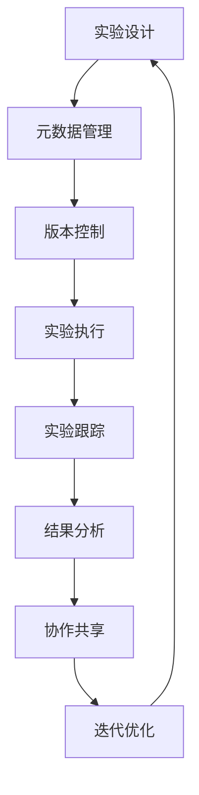

# AI实验：从混乱到有序，构建高效的实验管理体系

## 1. 背景介绍

### 1.1 AI实验的重要性

在当今快速发展的人工智能(AI)领域中,实验在算法开发、模型训练和系统评估中扮演着关键角色。AI实验不仅是验证理论和概念的重要途径,也是推动技术进步和创新的关键驱动力。然而,随着AI系统的复杂性不断增加,管理和组织AI实验也变得越来越具有挑战性。

### 1.2 AI实验面临的挑战

传统的实验管理方式通常依赖于手动流程,容易出现以下问题:

- **数据混乱**: 实验数据分散存储在不同位置,缺乏统一的组织和管理机制。
- **配置复杂**: 每个实验都需要配置大量参数,手动管理容易出错且效率低下。
- **重复工作**: 由于缺乏有效的实验跟踪和版本控制,同一实验可能被重复执行。
- **协作困难**: 团队成员之间难以共享实验结果和相关资源,影响协作效率。
- **可重复性差**: 由于缺乏完整的实验元数据记录,复现实验结果变得困难。

这些挑战不仅影响了AI实验的效率和质量,也阻碍了AI技术的快速发展和应用。因此,构建一个高效的实验管理体系变得迫在眉睫。

## 2. 核心概念与联系

### 2.1 实验管理的核心概念

为了构建高效的实验管理体系,我们需要了解以下核心概念:

1. **实验**: 指执行特定任务或验证某种假设的一系列操作和步骤。
2. **实验元数据**: 描述实验的相关信息,包括实验配置、代码版本、数据集、环境设置等。
3. **实验跟踪**: 记录实验过程中的各种事件和指标,用于监控和分析实验进度。
4. **实验版本控制**: 管理实验代码、配置和数据的变更历史,支持回滚和比较不同版本。
5. **实验可重复性**: 确保实验结果可以被复现,并在相同条件下获得一致的结果。
6. **实验协作**: 支持多人协作,共享实验资源和结果,提高团队效率。

### 2.2 核心概念之间的联系

上述核心概念相互关联,共同构建了一个完整的实验管理体系:

1. 实验元数据为实验提供了必要的背景信息和配置,确保实验可重复性。
2. 实验跟踪记录了实验过程中的关键指标和事件,有助于监控和调试实验。
3. 实验版本控制管理实验代码、配置和数据的变更历史,支持回滚和比较不同版本。
4. 实验可重复性建立在完整的实验元数据和版本控制的基础之上,确保实验结果可以被复现。
5. 实验协作依赖于实验元数据、跟踪和版本控制,实现资源共享和结果交流。

这些概念相互作用,构建了一个完整的实验生命周期管理系统,从而提高AI实验的效率、质量和可重复性。

## 3. 核心算法原理具体操作步骤

构建高效的实验管理体系需要遵循一些核心原则和最佳实践。下面是一个通用的实现步骤:



### 3.1 实验设计

1. **明确实验目标**: 确定实验的目的和预期结果,如模型性能提升、算法优化等。
2. **定义实验配置**: 确定实验所需的配置参数,如模型架构、超参数、数据集等。
3. **准备实验环境**: 设置实验所需的硬件资源、软件环境和依赖库。

### 3.2 元数据管理

1. **收集实验元数据**: 记录实验配置、代码版本、数据集、环境设置等相关信息。
2. **元数据组织**: 采用统一的格式和结构来存储和管理元数据,如YAML、JSON等。
3. **元数据查询**: 提供搜索和查询功能,方便快速定位特定实验的元数据。

### 3.3 版本控制

1. **代码版本控制**: 使用Git等版本控制系统管理实验代码的变更历史。
2. **配置版本控制**: 将实验配置文件纳入版本控制系统,跟踪配置的变更。
3. **数据版本控制**: 对实验使用的数据集进行版本管理,确保数据一致性。

### 3.4 实验执行

1. **自动化执行**: 使用脚本或工作流自动化实验的执行过程,减少人工干预。
2. **参数扫描**: 支持对实验参数进行大规模扫描,探索不同参数组合的影响。
3. **资源调度**: 根据实验需求动态分配计算资源,提高资源利用率。

### 3.5 实验跟踪

1. **指标收集**: 实时收集实验过程中的关键指标,如损失函数、准确率等。
2. **事件记录**: 记录实验执行过程中发生的重要事件,如模型检查点、早停等。
3. **可视化**: 将实验指标和事件以图表或仪表板的形式可视化,方便监控和分析。

### 3.6 结果分析

1. **对比分析**: 比较不同实验配置下的结果,识别影响模型性能的关键因素。
2. **模型评估**: 对实验生成的模型进行全面评估,包括性能、稳定性、公平性等方面。
3. **错误分析**: 分析模型预测错误的原因,为模型优化提供依据。

### 3.7 协作共享

1. **实验报告**: 生成详细的实验报告,记录实验过程、结果和分析。
2. **结果共享**: 建立实验结果共享机制,方便团队成员访问和复用。
3. **在线协作**: 提供在线协作平台,支持实时讨论、代码审查和知识共享。

### 3.8 迭代优化

1. **反馈收集**: 从实验结果和团队反馈中收集改进建议。
2. **优化实施**: 根据反馈优化实验设计、配置和流程。
3. **持续改进**: 建立持续改进机制,不断优化实验管理体系。

通过遵循这些步骤,我们可以构建一个高效、可重复且协作友好的实验管理体系,从而提高AI实验的质量和效率。

## 4. 数学模型和公式详细讲解举例说明

在AI实验中,数学模型和公式扮演着重要角色。它们不仅是理论基础,也是算法实现和模型评估的关键。本节将介绍一些常见的数学模型和公式,并详细解释它们在实验中的应用。

### 4.1 损失函数

损失函数是衡量模型预测与真实值之间差异的指标,通常用于模型训练和优化。常见的损失函数包括:

1. **均方误差(Mean Squared Error, MSE)**: $$\text{MSE} = \frac{1}{n}\sum_{i=1}^{n}(y_i - \hat{y}_i)^2$$
   - $y_i$: 真实值
   - $\hat{y}_i$: 预测值
   - $n$: 样本数量

2. **交叉熵损失(Cross-Entropy Loss)**: $$\text{CE} = -\frac{1}{n}\sum_{i=1}^{n}[y_i\log(\hat{y}_i}) + (1 - y_i)\log(1 - \hat{y}_i)]$$
   - 适用于二分类问题

3. **多类交叉熵损失(Categorical Cross-Entropy Loss)**: $$\text{CCE} = -\frac{1}{n}\sum_{i=1}^{n}\sum_{j=1}^{C}y_{ij}\log(\hat{y}_{ij})$$
   - $C$: 类别数量
   - 适用于多分类问题

在实验中,我们通常会监控损失函数的变化趋势,判断模型是否收敛以及是否出现过拟合等问题。

### 4.2 评估指标

评估指标用于衡量模型的性能,是实验结果分析的重要依据。常见的评估指标包括:

1. **准确率(Accuracy)**: $$\text{Accuracy} = \frac{\text{TP} + \text{TN}}{\text{TP} + \text{TN} + \text{FP} + \text{FN}}$$
   - TP: 真正例
   - TN: 真负例
   - FP: 假正例
   - FN: 假负例

2. **精确率(Precision)**: $$\text{Precision} = \frac{\text{TP}}{\text{TP} + \text{FP}}$$

3. **召回率(Recall)**: $$\text{Recall} = \frac{\text{TP}}{\text{TP} + \text{FN}}$$

4. **F1分数(F1 Score)**: $$\text{F1} = 2 \times \frac{\text{Precision} \times \text{Recall}}{\text{Precision} + \text{Recall}}$$

5. **平均精度(Mean Average Precision, mAP)**: 常用于目标检测和物体识别等任务。

在实验中,我们需要根据具体任务选择合适的评估指标,并综合分析多个指标以全面评估模型性能。

### 4.3 正则化

正则化是一种用于防止过拟合的技术,通过对模型参数施加约束来提高模型的泛化能力。常见的正则化方法包括:

1. **L1正则化(Lasso Regression)**: $$\Omega(\mathbf{w}) = \lambda\|\mathbf{w}\|_1$$
   - 导致参数矩阵稀疏,有利于特征选择

2. **L2正则化(Ridge Regression)**: $$\Omega(\mathbf{w}) = \lambda\|\mathbf{w}\|_2^2$$
   - 使参数值较小,但通常不会导致参数为零

3. **Dropout**: 在训练过程中随机丢弃一部分神经元,防止过拟合。

在实验中,我们需要尝试不同的正则化方法和超参数,观察对模型性能的影响,从而选择最优的正则化策略。

### 4.4 优化算法

优化算法用于调整模型参数,使损失函数最小化。常见的优化算法包括:

1. **梯度下降(Gradient Descent)**: $$\mathbf{w}_{t+1} = \mathbf{w}_t - \eta\nabla_{\mathbf{w}}J(\mathbf{w}_t)$$
   - $\eta$: 学习率
   - $J(\mathbf{w})$: 损失函数

2. **动量优化(Momentum Optimization)**: $$\begin{align*}
    \mathbf{v}_{t+1} &= \gamma\mathbf{v}_t + \eta\nabla_{\mathbf{w}}J(\mathbf{w}_t) \\
    \mathbf{w}_{t+1} &= \mathbf{w}_t - \mathbf{v}_{t+1}
    \end{align*}$$
    - $\gamma$: 动量系数

3. **Adam优化(Adaptive Moment Estimation)**: 结合动量和自适应学习率调整。

在实验中,我们需要尝试不同的优化算法和超参数组合,观察对模型收敛速度和性能的影响,从而选择最优的优化策略。

通过掌握这些数学模型和公式,我们可以更好地设计、实现和评估AI实验,从而提高模型的性能和泛化能力。

## 5. 项目实践: 代码实例和详细解释说明

为了更好地理解实验管理体系的实现,本节将提供一个基于Python的代码示例,并详细解释每个模块的功能和用法。

### 5.1 项目结构

```
experiment-manager/
├── config/
│   └── config.yaml
├── data/
│   ├── dataset1/
│   └── dataset2/
├── experiments/
│   ├── exp1/
│   │   ├── code/
│   │   ├── logs/
│   │   └── results/
│   └── exp2/
│       ├── code/
│       ├── logs/
│       └── results/
├── models/
│   └── model.py
├── utils/
│   ├── data_utils.py
│   ├── experiment_utils.py
│   ├── log_utils.py
│   └── visualization.py
├── main.py
└── requirements.txt
```

- `config/`: 存储实验