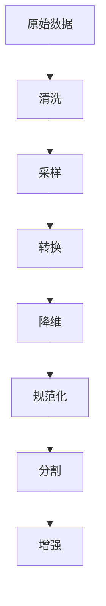

# AI数据预处理原理与代码实战案例讲解

## 1.背景介绍

### 1.1 数据预处理的重要性

在机器学习和深度学习项目中,数据预处理是一个至关重要的步骤。原始数据通常包含噪声、缺失值、异常值等问题,直接将其输入模型会导致模型性能下降。因此,对数据进行适当的清洗、转换和规范化处理是必要的。高质量的数据预处理不仅能提高模型的准确性和泛化能力,还能减少训练时间,提高模型的收敛速度。

### 1.2 数据预处理的挑战

尽管数据预处理的重要性不言而喻,但它也面临着一些挑战:

- **数据多样性**:不同领域和问题的数据形式和特征各不相同,需要针对性地设计预处理方法。
- **自动化难度**:很多预处理步骤需要人工参与,自动化程度不高。
- **领域知识依赖**:有效的数据预处理需要对数据和问题领域有深入的理解。

### 1.3 本文主旨

本文将系统地介绍AI数据预处理的核心原理和实战技巧,包括常见的预处理方法、算法细节、代码实现等。我们将结合实际案例,深入浅出地讲解每一个环节,帮助读者掌握数据预处理的方方面面。

## 2.核心概念与联系

### 2.1 数据预处理流程

数据预处理通常包括以下几个步骤:



1. **清洗(Cleaning)**: 处理缺失值、异常值、重复数据等。
2. **采样(Sampling)**: 在数据过多或过少时,进行过采样或欠采样。
3. **转换(Transformation)**: 对特征进行编码、分箱、构造等转换。
4. **降维(Dimensionality Reduction)**: 减少特征数量,提高计算效率。
5. **规范化(Normalization)**: 将不同量纲的特征值规范到同一量纲。
6. **分割(Splitting)**: 将数据分为训练集、验证集和测试集。
7. **增强(Augmentation)**: 通过一些规则对训练数据进行增强。

这些步骤的先后顺序并非固定,需要根据具体数据和问题进行调整。

### 2.2 常见预处理技术

常见的数据预处理技术包括但不限于:

- **插补法(Imputation)**:填充缺失值
- **移除异常值(Outlier Removal)**: 用统计学方法检测并移除异常值
- **重复数据消除(Deduplication)**: 去除重复数据
- **归一化(Normalization)**: 将数据规范到同一量纲,如Min-Max、Z-Score等
- **编码(Encoding)**: 将类别型数据转换为数值型,如One-Hot、Label等
- **分箱(Binning)**: 将连续值数据转换为分箱离散特征
- **构造特征(Feature Construction)**: 从原始特征构造出新的更有意义的特征
- **主成分分析(PCA)**: 线性降维技术,将高维数据映射到低维空间
- **过采样(Oversampling)**: 通过复制、插值等方式增加少数类样本
- **欠采样(Undersampling)**: 移除部分多数类样本,使类别比例更加均衡
- **数据增强(Data Augmentation)**: 对训练数据进行一些扩充,如旋转、平移等

不同的数据预处理技术需要根据具体问题进行选择和组合,并非一个万能钥匙。我们将在后续章节中对这些技术进行详细介绍。

## 3.核心算法原理具体操作步骤

在这一部分,我们将介绍几种核心的数据预处理算法的原理和具体操作步骤。

### 3.1 插补法处理缺失值

缺失值是数据预处理中最常见的问题之一。常用的缺失值插补方法有:

1. **删除**:直接删除含有缺失值的数据样本或特征列。适用于样本数量充足,缺失值较少的情况。
2. **均值插补**:用该特征的均值替换缺失值。简单但有效,适用于缺失值遵循随机分布的情况。
3. **中位数插补**:用该特征的中位数替换缺失值。相比均值,更加鲁棒。
4. **最高频率值插补**:用该特征的最高频率值(众数)替换缺失值。适用于离散型特征。
5. **模型插补**:构建一个模型,使用其他特征值预测缺失值。复杂但精度较高。

以均值插补为例,算法步骤如下:

1. 计算每个特征列的均值,忽略缺失值。
2. 遍历该特征列,将缺失值替换为均值。

```python
import numpy as np
from sklearn.impute import SimpleImputer

# 均值插补
def mean_imputer(X):
    imp = SimpleImputer(missing_values=np.nan, strategy='mean')
    return imp.fit_transform(X)
```

### 3.2 分箱算法

分箱(Binning)是一种常见的数据转换技术,可以将连续值特征转换为离散型分箱特征。主要分箱方法有:

1. **等宽分箱(Equal-Width Binning)**: 根据特征值的范围,将其等距分为若干个箱。
2. **等频分箱(Equal-Frequency Binning)**: 根据样本分布,将特征值等频率分为若干个箱。
3. **聚类分箱(Cluster-Based Binning)**: 使用聚类算法(如K-Means)对特征值进行分箱。

以等宽分箱为例,算法步骤如下:

1. 计算特征值的最小值和最大值。
2. 根据箱的个数n,计算每个箱的宽度 $\mathrm{bin\_width} = \frac{\mathrm{max} - \mathrm{min}}{n}$。
3. 遍历特征值,将其映射到对应的箱中。

```python
import numpy as np

# 等宽分箱
def equal_width_binning(X, n_bins=10):
    bins = np.linspace(X.min(), X.max(), n_bins + 1)
    whichbin = np.digitize(X, bins)
    return whichbin
```

### 3.3 编码算法

对于类别型特征,我们需要先将其编码为数值型,才能输入机器学习模型。常见的编码方法有:

1. **One-Hot Encoding**: 将每个类别映射为一个独热向量。
2. **Label Encoding**: 将每个类别映射为一个整数值。
3. **Target Encoding**: 基于目标变量,为每个类别赋予一个权重。
4. **Entity Embedding**: 将类别映射到一个低维稠密向量。

以One-Hot Encoding为例,算法步骤如下:

1. 获取特征中的所有唯一类别值。
2. 为每个类别构造一个独热向量,长度等于类别数。
3. 遍历该特征,将每个类别值替换为其对应的独热向量。

```python
from sklearn.preprocessing import OneHotEncoder

# One-Hot Encoding
def one_hot_encoder(X):
    enc = OneHotEncoder(handle_unknown='ignore')
    return enc.fit_transform(X).toarray()
```

## 4.数学模型和公式详细讲解举例说明

在数据预处理中,我们经常会用到一些数学模型和公式,下面我们将对其进行详细讲解。

### 4.1 缺失值插补

在3.1节中,我们介绍了均值插补法处理缺失值。现在我们来看一下它的数学模型:

设有n个样本 $\{x_1, x_2, \ldots, x_n\}$,其中一部分样本在第j个特征上缺失值,记为 $x_{ij}=\mathrm{nan}$。我们需要估计缺失值 $\hat{x}_{ij}$。

均值插补法的公式为:

$$\hat{x}_{ij} = \frac{1}{m}\sum_{k=1}^m x_{kj}$$

其中m是第j个特征上非缺失值的样本数量。

直观上,我们用该特征的平均值来填充缺失值。这种方法简单有效,但也有一些缺陷:

- 如果缺失不是完全随机的,用均值填充会引入偏差。
- 对于离群值较多的长尾分布,均值不是一个好的代表。

### 4.2 标准化

在机器学习算法中,我们经常需要对数据进行标准化(Normalization),使不同量纲的特征值映射到同一量纲。常见的标准化方法有Min-Max标准化和Z-Score标准化。

**Min-Max标准化**

Min-Max标准化的公式为:

$$x' = \frac{x - \min(x)}{\max(x) - \min(x)}$$

其中 $x'$ 是标准化后的值,范围在[0, 1]之间。$\min(x)$和$\max(x)$分别是该特征的最小值和最大值。

**Z-Score标准化**

Z-Score标准化的公式为:

$$x' = \frac{x - \mu}{\sigma}$$

其中 $x'$ 是标准化后的值,均值为0,标准差为1。$\mu$和$\sigma$分别是该特征的均值和标准差。

$$\mu = \frac{1}{n}\sum_{i=1}^n x_i$$

$$\sigma = \sqrt{\frac{1}{n}\sum_{i=1}^n (x_i - \mu)^2}$$

Min-Max标准化对异常值较为敏感,而Z-Score标准化则更加鲁棒。在实际应用中,需要根据具体情况选择合适的标准化方法。

### 4.3 主成分分析(PCA)

主成分分析(Principal Component Analysis, PCA)是一种常用的线性无监督降维技术。其核心思想是将原始高维数据映射到一个低维子空间,使得投影后的数据方差最大化。

设有n个样本 $\{x_1, x_2, \ldots, x_n\}$,每个样本是一个d维向量。我们需要找到一个k维子空间(k<d),使得投影到该子空间后的数据方差最大。

具体来说,我们需要找到一组正交基 $\{u_1, u_2, \ldots, u_k\}$,使得投影后的数据方差之和最大:

$$\max \sum_{i=1}^k \mathrm{Var}(u_i^T X)$$

其中 $\mathrm{Var}(\cdot)$ 表示方差,X是样本矩阵。

通过对协方差矩阵进行特征值分解,我们可以得到这些正交基,它们就是协方差矩阵的前k个特征向量。投影后的低维数据为:

$$Y = X \cdot U_k$$

其中 $U_k$ 是由前k个特征向量构成的矩阵。

PCA可以有效地降低数据维度,提高计算效率。但是它是一种线性无监督降维技术,对于非线性数据可能效果不佳。

## 5.项目实践:代码实例和详细解释说明

为了更好地理解数据预处理的原理和实践,我们将通过一个实际案例进行讲解。这个案例是一个经典的房价预测问题,使用加州房价数据集。

### 5.1 导入数据集

首先,我们导入必要的库和数据集:

```python
import pandas as pd
from sklearn.datasets import fetch_california_housing

# 加载数据集
data = fetch_california_housing()
X = pd.DataFrame(data.data, columns=data.feature_names)
y = pd.Series(data.target)
```

数据集包含8个特征和1个目标变量(房价中位数)。我们将特征和目标变量分别存储在X和y中。

### 5.2 探索性数据分析

在进行预处理之前,我们先对数据进行探索性分析,了解数据的基本情况:

```python
# 数据概览
print(X.info())
print(X.describe())

# 检查缺失值
print(X.isnull().sum())

# 检查异常值
import matplotlib.pyplot as plt
%matplotlib inline
X.boxplot(figsize=(12, 8))
plt.show()
```

通过上述代码,我们可以发现:

- 数据集中没有缺失值
- 部分特征存在异常值(outliers)

### 5.3 处理异常值

接下来,我们使用3σ原则来移除异常值:

```python
# 移除异常值
from scipy.stats import zscore

# 计算每个特征的z-score
z_scores = zscore(X)

# 