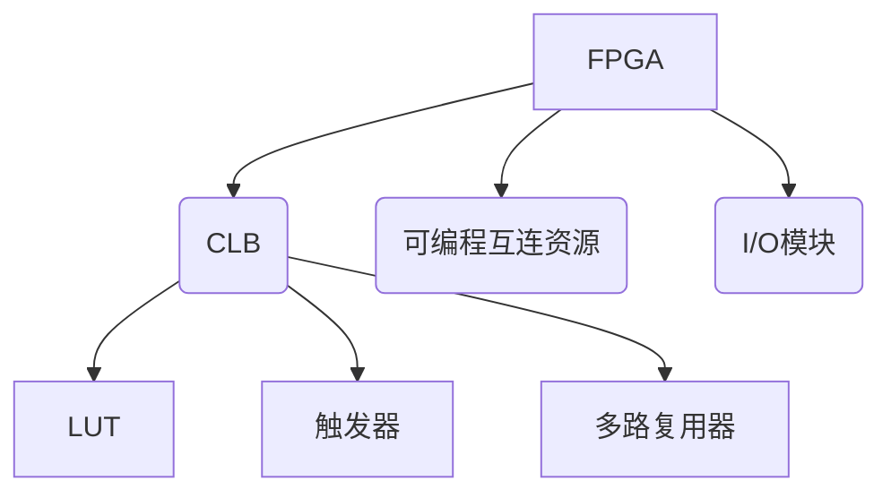
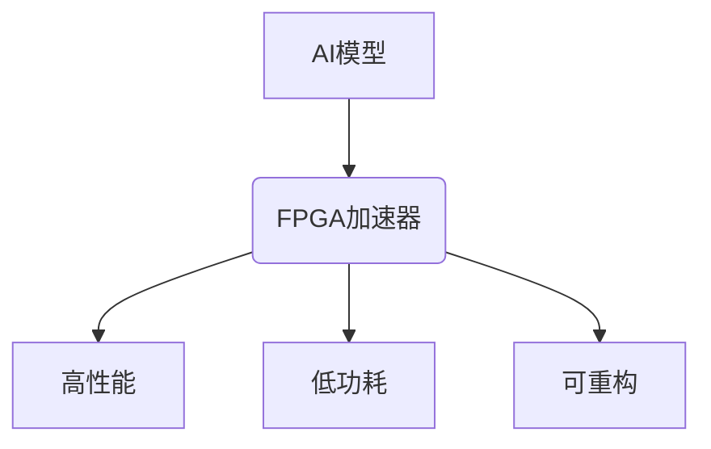
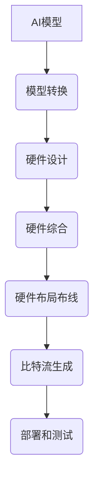

# AI模型部署到FPGA原理与代码实战案例讲解

## 1.背景介绍

### 1.1 AI模型在硬件加速器上部署的重要性

随着深度学习模型在各个领域的广泛应用,对于模型的计算性能和能源效率提出了更高的要求。由于大多数深度学习模型都是在通用CPU或GPU上进行训练和推理的,这种通用硬件无法满足AI模型对于计算能力和能效的需求。因此,将AI模型部署到专用硬件加速器上成为了一种有效的解决方案。

### 1.2 FPGA作为AI模型加速器的优势

现场可编程门阵列(FPGA)凭借其可重构计算架构、高度并行性、低功耗等优势,成为了部署AI模型的理想选择。与GPU相比,FPGA具有更高的能效比,可以为AI模型提供更高的性能和更低的功耗。此外,FPGA还具有可重构性,可以根据不同的AI模型架构进行硬件加速器的定制化设计,充分发挥硬件加速的潜力。

### 1.3 AI模型在FPGA上部署的挑战

尽管FPGA在加速AI模型方面具有诸多优势,但将AI模型部署到FPGA上仍然面临着一些挑战。首先,FPGA的编程模型与CPU和GPU有着本质的区别,需要使用硬件描述语言(HDL)进行编程,这对于大多数AI开发人员来说是一个陡峭的学习曲线。其次,AI模型通常是使用高级编程语言(如Python)开发的,需要将其转换为HDL代码,这个过程往往是手动完成的,存在着效率低下和错误风险的问题。最后,不同的FPGA供应商提供的开发工具和流程也存在差异,增加了学习和迁移的成本。

## 2.核心概念与联系

### 2.1 FPGA架构概述

FPGA是一种可编程逻辑器件,由可编程逻辑块(CLB)、可编程互连资源和I/O模块组成。CLB是FPGA的基本逻辑单元,由查找表(LUT)、触发器和多路复用器等组成,可以实现任意组合逻辑和有限状态机。可编程互连资源用于连接CLB和其他资源,实现所需的逻辑功能。I/O模块则用于FPGA与外部设备的数据交换。



### 2.2 FPGA在AI加速中的作用

FPGA可以通过硬件加速的方式来加速AI模型的推理过程。AI模型中的各种运算操作,如卷积、矩阵乘法等,可以在FPGA上实现专用的硬件加速器,利用FPGA的并行计算能力和可重构性,大幅提升AI模型的计算性能和能效比。



### 2.3 AI模型到FPGA的部署流程

将AI模型部署到FPGA上通常需要经历以下几个步骤:

1. 模型转换: 将AI模型从高级语言(如Python)转换为硬件描述语言(HDL)代码。
2. 硬件设计: 基于HDL代码设计FPGA硬件加速器架构。
3. 硬件综合: 将HDL代码综合为FPGA可编程逻辑资源的映射关系。
4. 硬件布局布线: 将综合后的逻辑资源进行物理布局和互连布线。
5. 比特流生成: 生成FPGA配置比特流文件,用于编程FPGA芯片。
6. 部署和测试: 将比特流下载到FPGA芯片上,并进行功能测试和性能评估。



## 3.核心算法原理具体操作步骤

### 3.1 AI模型转换为HDL代码

将AI模型转换为HDL代码是部署到FPGA上的关键步骤。常见的方法包括:

1. 手动转换: 由开发人员手动将AI模型中的各种运算操作转换为HDL代码,这种方式灵活性高,但工作量大且容易出错。
2. 高级综合(HLS): 使用HLS工具将高级语言(如C/C++)描述的AI模型自动转换为HDL代码,提高了开发效率。
3. 模型转换框架: 使用专门的AI模型到HDL转换框架,如Xilinx的DNNDK、Intel的OpenVINO等,可以自动完成模型转换过程。

无论采用何种方式,都需要对AI模型进行优化和量化,以适应FPGA硬件资源的限制和提高计算效率。

### 3.2 FPGA硬件加速器设计

设计FPGA硬件加速器架构是将AI模型高效部署到FPGA上的关键。常见的加速器架构包括:

1. 流水线架构: 将AI模型的各个运算操作划分为多个流水线阶段,实现流水线并行处理,提高吞吐量。
2. 并行处理架构: 利用FPGA的大量并行计算资源,实现多个运算操作的并行执行,加速计算过程。
3. 存储器优化: 优化数据存储和访问方式,减少存储器带宽瓶颈,提高数据传输效率。
4. 数据流优化: 采用数据流编程模型,实现流水线和并行处理,提高数据传输和计算效率。

在设计加速器架构时,需要权衡资源利用率、性能和功耗等因素,并根据具体的AI模型特点进行优化。

### 3.3 硬件综合、布局布线和比特流生成

经过硬件设计后,需要将HDL代码综合为FPGA可编程逻辑资源的映射关系,然后进行物理布局和互连布线,最终生成FPGA配置比特流文件。这些步骤通常由FPGA供应商提供的EDA工具自动完成。

在这个过程中,需要进行timing约束、资源约束和功耗优化等工作,以确保设计满足时序、资源和功耗要求。同时,还需要进行逻辑优化、重构和资源共享等优化,以提高设计的性能和资源利用率。

## 4.数学模型和公式详细讲解举例说明

### 4.1 卷积神经网络中的卷积运算

卷积运算是卷积神经网络中的核心运算之一,用于提取输入特征图中的局部特征。卷积运算可以用如下公式表示:

$$
y_{i,j} = \sum_{m}\sum_{n}x_{m,n}w_{i-m,j-n} + b
$$

其中,$ x $ 表示输入特征图,$ w $ 表示卷积核权重,$ b $ 表示偏置项,$ y $ 表示输出特征图。

在FPGA上实现卷积运算时,通常采用滑动窗口的方式,将输入特征图分成多个窗口,并与卷积核进行点乘累加运算。这种方式可以充分利用FPGA的并行计算能力,实现高效的卷积运算加速。

### 4.2 全连接层中的矩阵乘法运算

全连接层是神经网络中另一个重要的运算,它实现了输入向量和权重矩阵之间的矩阵乘法运算。矩阵乘法可以用如下公式表示:

$$
Y = XW + b
$$

其中,$ X $ 表示输入向量,$ W $ 表示权重矩阵,$ b $ 表示偏置项,$ Y $ 表示输出向量。

在FPGA上实现矩阵乘法运算时,可以采用分块矩阵乘法或系数展开等优化方法,利用FPGA的并行计算资源和存储资源,实现高效的矩阵乘法加速。同时,还需要注意数据传输和存储访问的优化,以避免带宽瓶颈。

### 4.3 激活函数计算

激活函数是神经网络中另一个重要的运算,用于引入非线性,提高模型的表达能力。常见的激活函数包括ReLU、Sigmoid和Tanh等。以ReLU函数为例,其数学表达式如下:

$$
f(x) = \max(0, x)
$$

在FPGA上实现激活函数计算时,可以利用查找表(LUT)或者近似多项式等方法,实现高效的计算。同时,还需要考虑数据类型和精度的trade-off,在保证精度的同时减小资源占用。

## 5.项目实践:代码实例和详细解释说明

在本节中,我们将通过一个实际的项目案例,演示如何将一个卷积神经网络模型部署到FPGA上。我们将使用Xilinx的DNNDK框架进行模型转换,并使用HLS工具进行硬件加速器设计。

### 5.1 项目概述

本项目的目标是将一个用于手写数字识别的卷积神经网络模型部署到Xilinx的FPGA开发板上。该模型包含以下层:

- 输入层: 28x28的灰度图像
- 卷积层1: 5x5卷积核,32个输出通道
- 池化层1: 2x2最大池化
- 卷积层2: 5x5卷积核,64个输出通道
- 池化层2: 2x2最大池化
- 全连接层1: 1024个神经元
- 全连接层2: 10个神经元(输出层)

### 5.2 模型转换

首先,我们需要将训练好的神经网络模型转换为FPGA可以识别的格式。在本例中,我们使用Xilinx的DNNDK框架进行模型转换。

```python
import tensorflow as tf
from dnndk import dnndk

# 加载训练好的模型
model = tf.keras.models.load_model('mnist_cnn.h5')

# 使用DNNDK进行模型转换
dnndk.exportToDPUV2("mnist_cnn.xmodel", model)
```

上述代码将TensorFlow模型转换为Xilinx DPU(深度处理单元)可以识别的`.xmodel`格式。

### 5.3 硬件加速器设计

接下来,我们使用Xilinx的Vitis HLS工具进行硬件加速器设计。我们将卷积层和全连接层的运算通过HLS转换为HDL代码,并进行硬件架构优化。

```c++
// 卷积层加速器
void conv(
    const int input_height,
    const int input_width,
    const int input_channels,
    const int output_channels,
    const int kernel_height,
    const int kernel_width,
    const int stride_height,
    const int stride_width,
    const int pad_height,
    const int pad_width,
    const float input_data[INPUT_SIZE],
    const float kernel_data[KERNEL_SIZE],
    float output_data[OUTPUT_SIZE]
) {
#pragma HLS INTERFACE m_axi port=input_data  offset=slave bundlexgmem
#pragma HLS INTERFACE m_axi port=kernel_data offset=slave bundlexgmem
#pragma HLS INTERFACE m_axi port=output_data offset=slave bundlexgmem
    // 实现卷积层加速器逻辑...
}
```

上述代码展示了一个卷积层加速器的HLS代码框架。通过HLS编译器,该代码将被转换为HDL代码,并进行硬件架构优化,如流水线、并行处理等。同时,我们还需要进行数据传输和存储优化,以提高整体性能。

### 5.4 硬件综合和部署

经过HLS编译后,我们将得到HDL代码。接下来,我们使用Xilinx的Vivado工具进行硬件综合、布局布线和比特流生成。

```
# 综合
vivado -mode batch -source synth.tcl

# 布局布线
vivado -mode batch -source impl.tcl

# 生成比特流
vivado -mode batch -source bitstream.tcl
```

上述命令将自动完成硬件综合、布局布线和比特流生成过程。最终,我们将得到一个可以编程到FPGA上的比特流文件。

### 5.5 功能测试和性能评估

最后,我们将比特流文件下载到FPGA开发板上,并进行功能测试和性能评估。我们可以使用测试数据