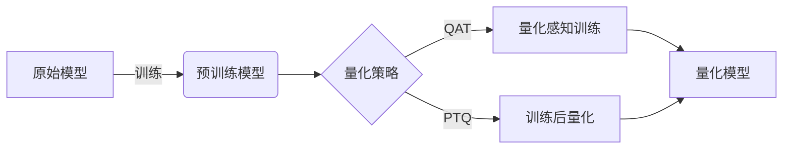
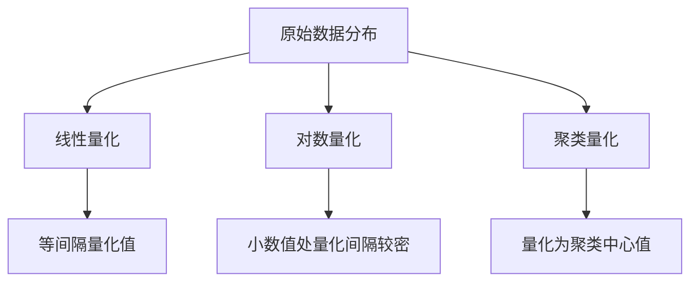

# AI模型量化原理与代码实战案例讲解

## 1.背景介绍
### 1.1 AI模型量化的重要意义
在当前人工智能快速发展的时代,深度学习模型已经广泛应用于各个领域。然而,随着模型的不断增大和复杂化,其在实际部署中面临着诸多挑战,如计算资源有限、存储空间不足、能耗过高等问题。AI模型量化技术应运而生,通过减少模型参数的数值精度,在保证模型性能的同时大幅降低其存储和计算开销,使得AI模型能够更高效地在各类硬件平台上运行。

### 1.2 AI模型量化的研究现状
近年来,AI模型量化技术得到了学术界和工业界的广泛关注。谷歌、微软、英特尔等科技巨头纷纷推出了自己的量化工具和框架,如TensorFlow Lite、ONNX Runtime等。同时,众多研究者也在量化算法、量化感知训练、量化推理等方面取得了重要进展。但目前量化技术仍面临着量化位宽选择、精度损失控制等挑战,亟需更多的理论探索和实践积累。

### 1.3 本文的主要内容
本文将围绕AI模型量化展开深入探讨。首先,我们将介绍量化的基本概念和分类,并阐述其与模型压缩、加速的内在联系。然后,重点解析主流的量化算法,包括线性量化、对数量化等,给出详细的数学模型和公式推导。接下来,我们将结合代码实例,演示如何使用主流框架对模型进行量化,并对比量化前后的性能差异。同时,也会讨论量化技术在图像识别、自然语言处理等领域的实际应用。最后,总结全文,展望量化技术的未来发展趋势和面临的挑战。

## 2.核心概念与联系
### 2.1 量化的定义与分类
量化是指将连续的实数值离散化为有限个离散值的过程。对于神经网络模型而言,量化就是将其参数(权重和激活值)从浮点数转换为低精度的定点数表示。根据量化粒度的不同,可分为:
- 逐层量化:对模型的每一层分别进行量化,量化参数在层间独立。
- 逐通道量化:对卷积层的每个输出通道使用不同的量化参数。
- 混合精度量化:对模型的不同部分采用不同的量化策略和位宽。

根据量化位宽,常见的有二值量化(1-bit)、三值量化(2-bit)、4-bit量化、8-bit量化等。

### 2.2 量化与模型压缩和加速
模型量化是模型压缩与加速的重要手段之一。通过降低参数精度,量化可以显著减小模型的存储体积。以8-bit量化为例,理论上可将模型大小降低为原来的1/4。同时,低精度运算替代浮点运算,不仅可以提升计算速度,还能降低能耗。当然,量化通常会带来一定的精度损失,需要在压缩比和性能之间权衡。

除了量化之外,模型压缩的常用技术还包括:
- 剪枝:去除冗余和不重要的连接或神经元。
- 低秩近似:用若干个低秩矩阵的乘积来近似原始的大矩阵。
- 知识蒸馏:用大模型的知识来训练参数更少的小模型。

这些技术可以与量化结合,进一步提升模型的压缩效果。

### 2.3 量化感知训练与训练后量化
为了尽可能减小量化带来的精度损失,一般采用两种策略:

（1）量化感知训练(QAT):在模型训练过程中就引入量化操作,使得模型参数在训练阶段就适应量化过程,收敛到量化友好的状态。QAT一般能取得更好的量化精度,但训练时间较长。

（2）训练后量化(PTQ):在模型训练完成后,直接对其进行量化,无需重新训练。PTQ部署更简单,但量化精度通常不如QAT。需要注意的是,对于某些任务如目标检测,PTQ精度下降较为明显,还需采取一些优化手段。

下图展示了两种量化策略的基本流程:



## 3.核心算法原理具体操作步骤
本节将详细介绍几种主流的模型量化算法,包括线性量化、对数量化和聚类量化等。我们将给出每种算法的基本原理、数学模型以及分步骤的操作流程。

### 3.1 线性量化
线性量化是最常用的一种量化方法,核心思想是通过线性变换将浮点数均匀映射到整数区间。设原始数据的取值范围为[xmin,xmax],量化后的整数位宽为k,则量化过程可表示为:

$$
Q(x)=round(\frac{x-xmin}{scale}), scale=\frac{xmax-xmin}{2^k-1}
$$

其中,round为取整函数。反量化过程为:

$$
x=scale \cdot Q(x) + xmin
$$

线性量化的具体步骤如下:
1. 确定量化位宽k,一般取8-bit。
2. 统计数据的最大最小值xmax和xmin,得到量化比例因子scale。
3. 对每个数据点x,计算其量化值Q(x)。
4. 将量化值存储为定点整数。
5. 反量化时,用scale和xmin还原出近似的浮点数。

优点是计算简单,量化值呈线性分布。缺点是量化间隔固定,对于数据分布不均匀的情况,量化误差较大。

### 3.2 对数量化
对数量化利用了数据的对数特性,通过对数变换,可以使得量化间隔在数值较小处更密集,更适合数据呈指数分布的情况。常用的是以2为底的对数量化:

$$
Q(x)=round(log_2(\frac{x}{xmin})), x>0
$$

反量化公式为:

$$
x=xmin \cdot 2^{Q(x)}
$$

对数量化的步骤与线性量化类似,主要区别在于:
1. 一般只量化正数,负数保持原精度。
2. 用log2函数对数据进行对数变换,再进行线性量化。
3. 反量化时先做指数运算,再乘以xmin。

对数量化能够自适应地调整量化间隔,对于长尾分布的数据有更好的表示能力。但对数运算增加了计算复杂度。

### 3.3 聚类量化
聚类量化利用聚类算法,将参数聚为k类,每一类用其聚类中心值表示。常用的是k-means聚类:
1. 随机选择k个聚类中心。
2. 重复直到收敛:
    - 将每个数据点划分到最近的聚类中心所在类。
    - 更新每个类的聚类中心为该类所有数据点的均值。
3. 用每个数据点所属类的聚类中心替代该数据点的值。

聚类量化能够自动找到最优的量化中心,量化误差较小。但聚类过程计算量大,且量化值不连续,硬件实现较复杂。

下图展示了三种量化方法的示意图:



## 4.数学模型和公式详细讲解举例说明
本节将以线性量化为例,详细推导其数学模型,并给出一个量化例子加以说明。

### 4.1 线性量化的数学模型
设原始数据的取值范围为[xmin,xmax],量化后的无符号整数位宽为k。定义量化比例因子scale和零点zp为:

$$
scale=\frac{xmax-xmin}{2^k-1}, zp=round(-\frac{xmin}{scale})
$$

则量化过程可表示为:

$$
Q(x)=round(\frac{x}{scale}+zp)
$$

反量化过程为:

$$
x=scale \cdot (Q(x)-zp)
$$

可以看出,量化本质上是一个仿射变换,scale控制量化间隔,zp控制量化值的平移。

若使用有符号整数表示,假设数据取值以0为中心,则量化公式变为:

$$
scale=\frac{max(|xmin|,|xmax|)}{2^{k-1}-1}, Q(x)=round(\frac{x}{scale})
$$

反量化公式不变。

### 4.2 量化例子说明
假设有一组数据x=[0.2,-0.5,1.3,2.1,-1.6],取值范围为[-1.6,2.1],量化为8-bit无符号整数。

首先计算量化参数:

$$
scale=\frac{2.1-(-1.6)}{2^8-1}=0.0144, zp=round(\frac{1.6}{0.0144})=111
$$

然后逐个量化数据点:

$$
Q(0.2)=round(\frac{0.2}{0.0144}+111)=125 \\
Q(-0.5)=round(\frac{-0.5}{0.0144}+111)=76 \\
Q(1.3)=round(\frac{1.3}{0.0144}+111)=201 \\
Q(2.1)=round(\frac{2.1}{0.0144}+111)=256 \\
Q(-1.6)=round(\frac{-1.6}{0.0144}+111)=0
$$

可见,原始数据被映射到了[0,255]的整数范围内。

反量化时,用scale和zp还原出近似值:

$$
0.2 \approx 0.0144 \times (125-111) = 0.2016 \\
-0.5 \approx 0.0144 \times (76-111) = -0.504 \\
1.3 \approx 0.0144 \times (201-111) = 1.296 \\
2.1 \approx 0.0144 \times (256-111) = 2.088 \\
-1.6 \approx 0.0144 \times (0-111) = -1.5984
$$

可以看出,量化前后的数值略有差异,这就是量化误差。一般来说,量化位宽越高,量化误差越小。

## 5.项目实践：代码实例和详细解释说明
本节将结合PyTorch,演示如何使用其量化工具包对模型进行量化,并对比量化前后的模型性能。

### 5.1 量化感知训练示例
下面的代码展示了如何用PyTorch进行量化感知训练:

```python
import torch
from torch import nn
import torch.quantization as quantization

# 定义模型
class Model(nn.Module):
    def __init__(self):
        super().__init__()
        self.conv = nn.Conv2d(3, 16, 3)
        self.relu = nn.ReLU()
        self.fc = nn.Linear(16*6*6, 10) 
    def forward(self, x):
        x = self.conv(x)
        x = self.relu(x)
        x = x.view(-1, 16*6*6)
        x = self.fc(x)
        return x

# 准备数据集
train_data = ...
val_data = ...

# 定义优化器和损失函数 
model = Model()
optimizer = torch.optim.SGD(model.parameters(), lr=1e-3, momentum=0.9)
criterion = nn.CrossEntropyLoss()

# 模拟量化
model.qconfig = quantization.get_default_qat_qconfig('fbgemm') 
quantized_model = quantization.prepare_qat(model)

# 量化感知训练
for epoch in range(10):
    quantized_model.train()
    for images, labels in train_data:
        optimizer.zero_grad()
        output = quantized_model(images)
        loss = criterion(output, labels)
        loss.backward()
        optimizer.step()
    
    quantized_model.eval()
    with torch.no_grad():
        correct = 0
        for images, labels in val_data:
            output = quantized_model(images)
            pred = output.argmax(dim=1)
            correct += pred.eq(labels).sum().item()
        acc = correct / len(val_data.dataset)
        print(f"Epoch {epoch}, Accuracy {acc:.2f}")

# 转换为量化模型  
quantized_model = quantization.convert(quantized_model)
```

代码解释:
1. 定义一个简单的卷积神经网络模型。
2. 准