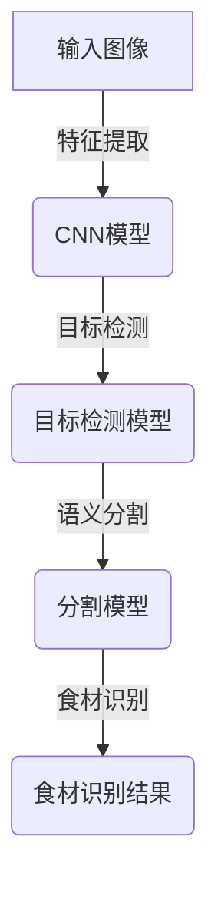
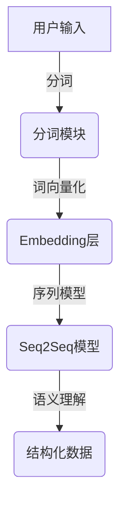
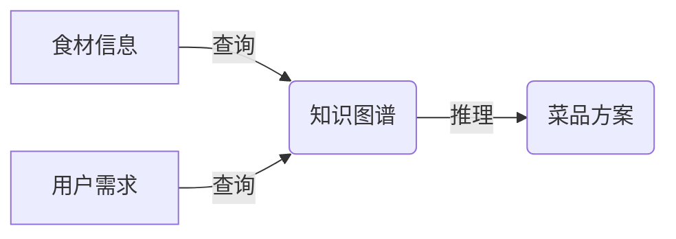
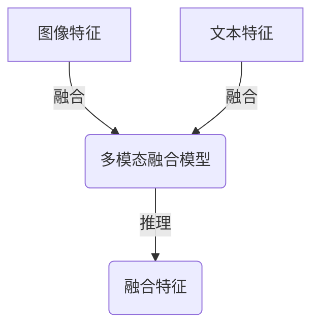
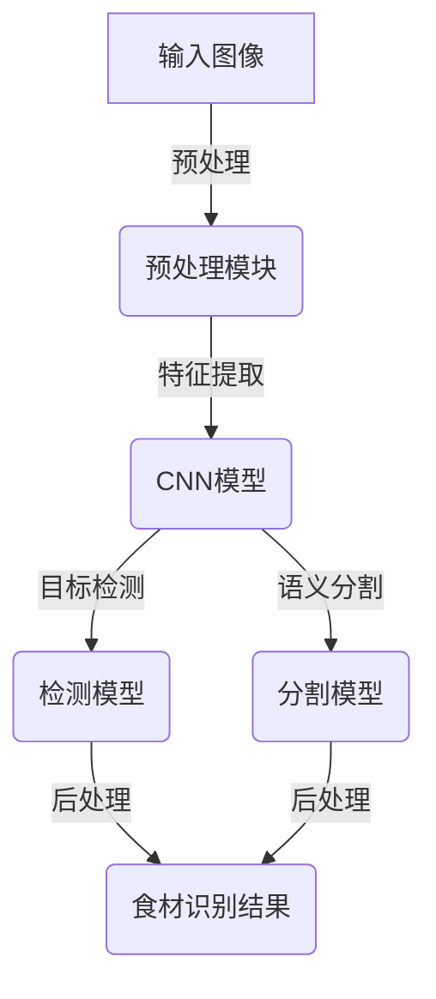
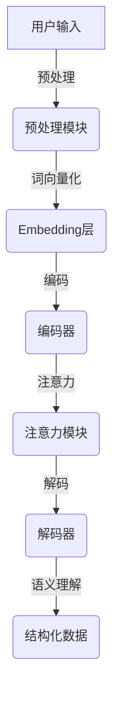
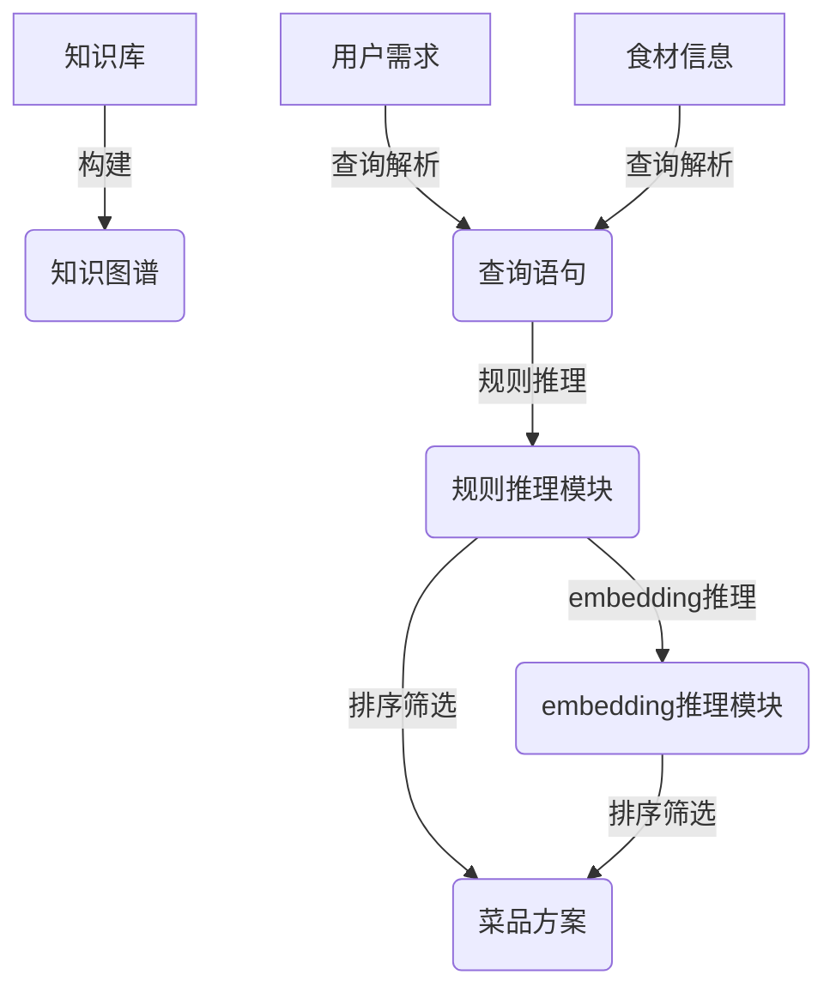
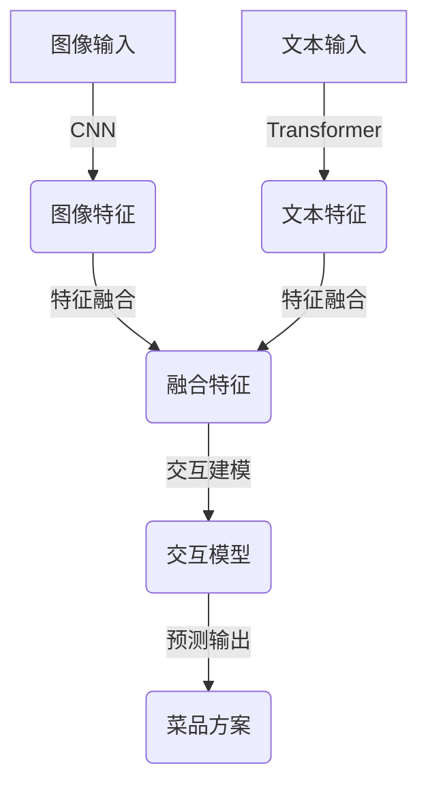

# AI系统Chef原理与代码实战案例讲解

## 1.背景介绍

### 1.1 人工智能在餐饮业的应用

人工智能(AI)技术在近年来得到了飞速发展,并逐渐渗透到各个行业领域。餐饮业作为一个传统的服务行业,也开始借助AI技术来提升运营效率、优化用户体验。其中,AI系统Chef就是一个典型的应用案例,它利用计算机视觉、自然语言处理等AI技术,为用户提供智能菜品推荐、自动化烹饪指导等创新服务。

### 1.2 AI系统Chef的概念

AI系统Chef是一种基于人工智能技术的智能化烹饪助手系统。它能够识别食材图像、理解用户的自然语言指令,并根据食谱知识库提供个性化的菜品推荐和烹饪步骤指导。用户只需要简单地描述自己的需求或上传食材图片,AI系统Chef就能生成对应的菜谱方案,大大降低了烹饪的门槛和难度。

### 1.3 AI系统Chef的意义

AI系统Chef的出现,不仅为餐饮从业者提供了高效的辅助工具,也为普通家庭用户带来了全新的烹饪体验。它有助于推广健康饮食理念,培养大众的烹饪兴趣,促进餐饮文化的传承和创新。同时,AI系统Chef也为人工智能技术在实际应用场景中的落地提供了一个生动的范例。

## 2.核心概念与联系

### 2.1 计算机视觉

计算机视觉(Computer Vision)是AI系统Chef的核心技术之一。它能够对输入的食材图像进行识别和理解,提取出食材的种类、数量、状态等关键信息。常用的计算机视觉算法包括卷积神经网络(CNN)、目标检测(Object Detection)、语义分割(Semantic Segmentation)等。

### 2.2 自然语言处理

自然语言处理(Natural Language Processing, NLP)是另一项AI系统Chef所依赖的关键技术。它能够理解用户的自然语言输入,例如"我想吃一份家常菜"、"这些食材能做什么菜"等,并将其转化为计算机可以理解的结构化数据。常用的NLP算法包括词向量(Word Embedding)、序列到序列模型(Seq2Seq)、命名实体识别(Named Entity Recognition)等。

### 2.3 知识图谱与推理

除了计算机视觉和自然语言处理,AI系统Chef还需要一个庞大的食谱知识库作为支撑。这个知识库通常采用知识图谱的形式来组织和存储食材、菜品、烹饪步骤等相关信息。在获取到用户需求和食材信息后,系统就可以基于知识图谱进行推理,生成满足条件的菜品方案。

### 2.4 多模态融合

AI系统Chef需要将计算机视觉、自然语言处理、知识推理等多种技术有机结合,实现多模态信息的融合处理。这就需要设计一种高效的多模态融合模型,将不同模态的输入特征进行融合,得到更加准确和全面的理解结果。常用的多模态融合方法包括特征级融合(Feature-level Fusion)、模态级融合(Modality-level Fusion)等。

## 3.核心算法原理具体操作步骤

### 3.1 食材识别算法

食材识别是AI系统Chef的基础环节,它需要对输入的食材图像进行准确识别和理解。常用的食材识别算法基于目标检测和语义分割技术,具体步骤如下:

1. 图像预处理:对输入图像进行标准化、数据增强等预处理操作,以提高模型的泛化能力。
2. 特征提取:使用卷积神经网络(CNN)对预处理后的图像进行特征提取,得到图像的特征向量表示。
3. 目标检测:将特征向量输入目标检测模型(如Faster R-CNN、YOLO等),获取图像中各个目标的边界框和类别信息。
4. 语义分割:将特征向量输入语义分割模型(如FCN、DeepLab等),对图像中的每个像素进行分类,获取食材的精确轮廓和位置信息。
5. 后处理:综合目标检测和语义分割的结果,进行食材种类、数量、状态等属性的识别和判断。

### 3.2 自然语言理解算法

自然语言理解是AI系统Chef另一个关键环节,它需要对用户的自然语言输入进行准确分析和理解。常用的自然语言理解算法基于序列到序列模型和注意力机制,具体步骤如下:

1. 文本预处理:对输入文本进行分词、去停用词、词形还原等预处理操作。
2. 词向量化:将预处理后的词语映射为对应的词向量表示,作为序列模型的输入。
3. 编码:使用循环神经网络(RNN)或Transformer等序列模型对输入词向量序列进行编码,获取文本的上下文语义表示。
4. 注意力机制:在编码的基础上,引入注意力机制,捕捉文本中的关键信息,提高模型的理解能力。
5. 解码:将编码后的上下文语义表示输入解码器,生成对应的结构化数据表示,如命名实体、语义框架等。

### 3.3 知识推理算法

在获取到食材信息和用户需求后,AI系统Chef需要基于知识图谱进行推理,生成满足条件的菜品方案。常用的知识推理算法包括基于规则的推理、基于embedding的推理等,具体步骤如下:

1. 知识库构建:从各种食谱数据源中抽取相关知识,构建包含食材、菜品、烹饪步骤等实体和关系的知识图谱。
2. 查询解析:将用户需求和食材信息转化为结构化的查询语句,用于在知识图谱中进行查询和推理。
3. 规则推理:根据预定义的推理规则,在知识图谱中进行链接遍历和模式匹配,推导出符合条件的菜品候选集。
4. embedding推理:将知识图谱中的实体和关系映射为低维向量表示,利用embedding的相似性计算,发现隐式的关联关系。
5. 排序筛选:根据菜品的营养价值、用户偏好等因素,对候选菜品进行打分和排序,选取最优方案。

### 3.4 多模态融合算法

AI系统Chef需要将计算机视觉、自然语言处理、知识推理等多种模态的信息进行融合,以获取更加全面和准确的理解结果。常用的多模态融合算法包括特征级融合、模态级融合等,具体步骤如下:

1. 特征提取:分别使用各个模态对应的模型(如CNN、Transformer等)对输入数据进行特征提取,获取不同模态的特征表示。
2. 特征融合:将不同模态的特征向量进行拼接或加权求和,得到融合后的多模态特征表示。
3. 交互建模:使用注意力机制或门控循环单元等方法,对融合后的特征进行交互建模,捕捉模态间的相关性和依赖关系。
4. 预测输出:将交互建模后的融合特征输入分类器或回归器,得到最终的预测输出,如菜品类别、烹饪步骤等。

## 4.数学模型和公式详细讲解举例说明

### 4.1 卷积神经网络

卷积神经网络(Convolutional Neural Network, CNN)是计算机视觉领域的核心算法之一,它能够自动从图像数据中学习出有效的特征表示。CNN的基本结构包括卷积层、池化层和全连接层,其中卷积层是CNN的核心部分。

卷积层的计算过程可以用下式表示:

$$
y_{ij}^l = f\left(\sum_{m}\sum_{p=0}^{P_l-1}\sum_{q=0}^{Q_l-1}w_{pq}^{lm}x_{i+p,j+q}^{l-1} + b_m^l\right)
$$

其中,$y_{ij}^l$表示第$l$层特征图的$(i,j)$位置的输出值,$x_{i+p,j+q}^{l-1}$表示前一层特征图的$(i+p,j+q)$位置的输入值,$w_{pq}^{lm}$表示第$l$层第$m$个卷积核在$(p,q)$位置的权重值,$b_m^l$表示第$l$层第$m$个卷积核的偏置值,$P_l$和$Q_l$分别表示第$l$层卷积核的高度和宽度,$f$为激活函数(如ReLU)。

通过反复堆叠卷积层、池化层和全连接层,CNN可以自动学习出图像的层次特征表示,并应用于目标检测、语义分割等计算机视觉任务。

### 4.2 序列到序列模型

序列到序列模型(Sequence-to-Sequence Model)是自然语言处理领域的核心算法之一,它能够将一个序列(如自然语言文本)映射为另一个序列(如结构化数据表示)。序列到序列模型通常由编码器(Encoder)和解码器(Decoder)两部分组成。

编码器的计算过程可以用下式表示:

$$
h_t = f(x_t, h_{t-1})
$$

其中,$x_t$表示时间步$t$的输入,$h_t$表示时间步$t$的隐藏状态,$f$为递归函数(如LSTM或GRU)。编码器将输入序列$x_1,x_2,...,x_T$编码为一系列隐藏状态$h_1,h_2,...,h_T$,捕捉序列的上下文语义信息。

解码器的计算过程可以用下式表示:

$$
p(y_t|y_1,...,y_{t-1},c) = g(y_{t-1}, s_t, c)
$$

其中,$y_t$表示时间步$t$的输出,$s_t$表示时间步$t$的解码器隐藏状态,$c$表示编码器的上下文向量,$g$为解码函数。解码器根据编码器的上下文向量$c$和历史输出$y_1,...,y_{t-1}$,预测下一