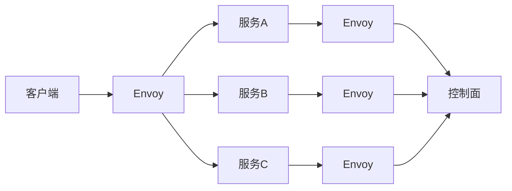

## 1.背景介绍

在当今的IT领域，微服务架构已经成为了一种主流的软件开发模式。然而，随着微服务数量的增加，服务间的通信、服务的发现、负载均衡、故障恢复、服务监控等问题变得越来越复杂。为了解决这些问题，服务网格(Service Mesh)应运而生。而Istio就是其中最为知名的一个服务网格项目，它提供了一种易于使用、强大的解决方案来管理微服务之间的通信。

## 2.核心概念与联系

Istio的核心概念包括服务网格、数据面和控制面。服务网格是由微服务应用的网络，包括了服务间的所有通信路径。数据面由一组智能代理（Envoy）组成，这些代理可以调度和控制微服务之间的所有网络通信。控制面负责管理和配置代理来路由流量，以及执行策略。

下面是一个简单的Istio架构图：



## 3.核心算法原理具体操作步骤

Istio的工作原理是在每个微服务的网络通信路径上都部署一个Envoy代理。Envoy代理会拦截所有进出微服务的网络流量，然后根据从控制面获取的策略进行路由、负载均衡、故障恢复等操作。

## 4.数学模型和公式详细讲解举例说明

在Istio中，负载均衡算法是一个重要的组成部分。常用的负载均衡算法有轮询、随机、加权轮询等。这里以加权轮询为例，来解释一下其工作原理。

假设有三个服务实例，权重分别为1，2，3。那么，我们可以将这些权重看作是一个数轴上的点，如下所示：

```
0-----1-----3-----6
```

然后，我们在0到6之间随机选择一个数，假设选择的数是4。那么，4在数轴上的位置对应的就是权重为3的服务实例。因此，我们就选择了权重为3的服务实例来处理请求。

## 5.项目实践：代码实例和详细解释说明

下面是一个使用Istio进行流量管理的简单示例。首先，我们需要在Kubernetes集群中部署Istio。然后，我们创建一个名为`reviews`的微服务，并部署三个版本。最后，我们使用Istio的流量管理功能，将80%的流量路由到`reviews:v1`，将20%的流量路由到`reviews:v2`。

```yaml
apiVersion: networking.istio.io/v1alpha3
kind: VirtualService
metadata:
  name: reviews
spec:
  hosts:
  - reviews
  http:
  - route:
    - destination:
        host: reviews
        subset: v1
      weight: 80
    - destination:
        host: reviews
        subset: v2
      weight: 20
```

## 6.实际应用场景

Istio的应用场景非常广泛，包括但不限于：

1. 微服务的流量管理：可以轻松实现蓝绿部署、金丝雀发布等复杂的部署策略。
2. 微服务的安全：提供了全面的安全解决方案，包括认证、授权和服务间的加密通信。
3. 微服务的观察性：提供了丰富的指标、日志和追踪信息，帮助我们理解服务的行为和性能。

## 7.工具和资源推荐

1. Istio官方文档：提供了详细的安装指南、概念解释、操作指南等资源。
2. Envoy官方文档：了解更多关于Envoy的信息。
3. Kiali：一个用于观察Istio服务网格的工具。

## 8.总结：未来发展趋势与挑战

随着微服务和云原生技术的发展，Istio的重要性将越来越高。然而，Istio也面临着一些挑战，例如如何简化安装和配置过程，如何提高性能，如何提供更好的跨集群支持等。

## 9.附录：常见问题与解答

1. Q: Istio是否支持非Kubernetes的环境？
   A: 是的，Istio支持多种环境，包括Kubernetes、Mesos、Cloud Foundry等。

2. Q: Istio的性能如何？
   A: Istio的性能取决于很多因素，包括硬件、网络、配置等。Istio官方提供了一些性能测试结果，可以作为参考。

3. Q: Istio是否支持Windows？
   A: 目前，Istio只支持Linux和macOS。

作者：禅与计算机程序设计艺术 / Zen and the Art of Computer Programming
