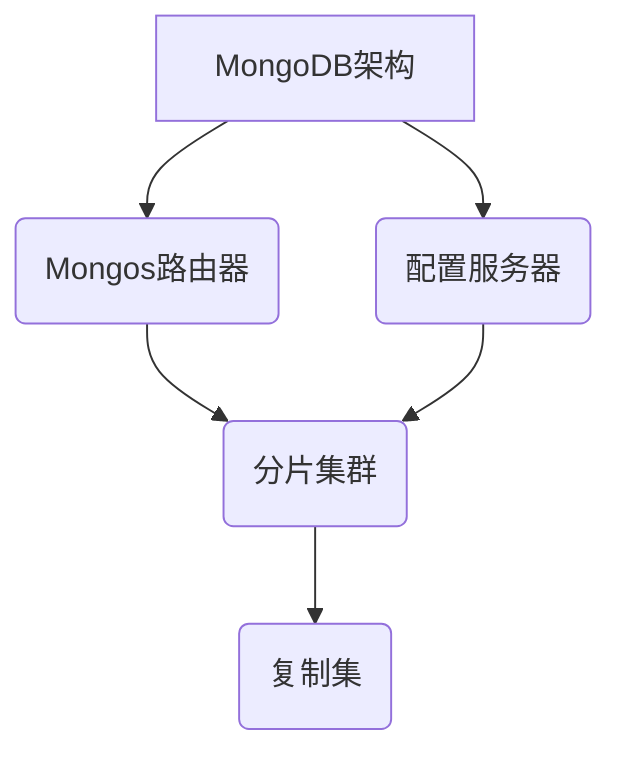

# AI系统MongoDB原理与代码实战案例讲解

## 1.背景介绍

### 1.1 人工智能系统的重要性

人工智能(AI)已经成为当代科技发展的核心驱动力,在各行各业都有广泛的应用。随着数据量的激增和算力的飞速提升,AI系统的性能和复杂度也在不断提高。高效、可扩展、分布式的数据库系统对于支撑AI系统的运行至关重要。

### 1.2 MongoDB在AI系统中的作用

MongoDB是一种流行的开源NoSQL文档数据库,具有schema-less、高性能、可扩展等优势。它的灵活数据模型和丰富的查询语言,使其非常适合存储和管理AI系统中的非结构化、半结构化数据。此外,MongoDB还提供了分片集群、复制集等特性,确保了数据的高可用性和容错性。

### 1.3 本文概览

本文将全面解析MongoDB在AI系统中的应用原理和实践案例。我们将介绍MongoDB的核心概念、架构设计、数据建模方法,并通过实际代码示例,讲解如何利用MongoDB高效存储和查询AI数据。最后,我们还将探讨MongoDB在AI领域的未来发展趋势和挑战。

## 2.核心概念与联系  

### 2.1 MongoDB的核心概念

#### 2.1.1 文档模型

MongoDB采用的是面向文档(Document)的数据模型,而不是关系型数据库中的行和列。每个文档由一组键值对(key-value)组成,文档之间是schema-less的,可以有不同的字段和结构。

```json
{
   "_id": ObjectId("63b9c3b0d371cb9021d67281"),
   "name": "John Doe",
   "email": "john@example.com",
   "age": 35,
   "interests": ["reading", "hiking", "coding"]
}
```

#### 2.1.2 集合

文档被组织并存储在集合(Collection)中,类似于关系型数据库中的表。集合本身也是schema-less的,可以包含不同结构的文档。

#### 2.1.3 数据库

MongoDB将集合组织在数据库(Database)中,一个MongoDB实例可以承载多个独立的数据库。

### 2.2 MongoDB与AI系统的联系

#### 2.2.1 AI数据的多样性

AI系统需要处理各种形式的数据,包括结构化数据(如数值、类别等)、非结构化数据(如文本、图像、视频等)和半结构化数据(如JSON、XML等)。MongoDB的文档模型非常适合存储和管理这些多样化的数据类型。

#### 2.2.2 数据建模的灵活性

在AI系统中,数据模型往往需要根据算法和应用场景进行频繁调整。MongoDB的schema-less特性使得数据建模更加灵活,可以轻松添加、修改或删除字段,而无需进行复杂的模式迁移。

#### 2.2.3 高性能查询和聚合

AI算法通常需要对大量数据进行复杂的查询和聚合操作。MongoDB提供了丰富的查询语言和聚合框架,可以高效地执行各种数据操作,满足AI系统的性能需求。

#### 2.2.4 分布式架构和可扩展性

随着AI系统的发展,数据量将呈指数级增长。MongoDB的分片集群架构可以轻松实现数据的水平扩展,确保系统的可扩展性和高可用性。

## 3.核心算法原理具体操作步骤

### 3.1 MongoDB架构概览

MongoDB的架构设计旨在提供高性能、可扩展和高可用性的数据存储和管理能力。它主要由以下几个核心组件组成:



#### 3.1.1 Mongos路由器

Mongos是MongoDB的查询路由器,负责将客户端请求路由到正确的分片,并合并来自多个分片的结果。它还负责从配置服务器获取集群元数据,以确保路由决策的正确性。

#### 3.1.2 配置服务器

配置服务器存储了MongoDB集群的元数据,包括分片信息、chunk范围等。它由一个或多个mongod实例组成,通常部署为一个复制集,以确保元数据的可靠性和高可用性。

#### 3.1.3 分片集群

分片集群是MongoDB的核心组件,由多个分片(Shard)组成。每个分片都是一个独立的数据库实例,负责存储一部分数据。分片集群通过将数据分割成多个chunk,并将这些chunk分布在不同的分片上,实现了数据的水平扩展。

#### 3.1.4 复制集

复制集是MongoDB实现数据高可用性和容错性的关键机制。它由一组mongod实例组成,其中一个实例是主节点(Primary),负责处理所有写操作,其他实例是从节点(Secondary),用于备份数据和提供只读查询服务。

### 3.2 数据分片原理

MongoDB通过数据分片(Sharding)实现了数据的水平扩展,可以支持大规模数据集和高吞吐量的工作负载。数据分片的核心思想是将数据集划分为多个chunk,并将这些chunk分布在不同的分片上。

#### 3.2.1 分片键

分片键(Shard Key)是MongoDB用于确定文档应该存储在哪个分片上的关键字段或字段组合。选择合适的分片键对于实现均匀的数据分布和高效的查询路由至关重要。

#### 3.2.2 数据分布

MongoDB根据分片键的值,将文档分配到不同的chunk中。每个chunk包含一个连续的分片键范围,并被映射到一个特定的分片。当一个chunk达到了最大大小限制时,MongoDB会自动对其进行拆分,并将新的子chunk分配到不同的分片上。

#### 3.2.3 查询路由

当客户端发出查询请求时,Mongos路由器会根据查询条件中包含的分片键,确定需要路由到哪些分片。如果查询涉及多个分片,Mongos会并行地向这些分片发送查询,并合并返回的结果。

### 3.3 复制集原理

MongoDB的复制集(Replica Set)机制确保了数据的高可用性和容错性。它由一组mongod实例组成,其中一个实例是主节点,负责处理所有写操作,其他实例是从节点,用于备份数据和提供只读查询服务。

#### 3.3.1 主从复制

当主节点接收到写操作时,它会将操作记录到自身的操作日志(oplog)中,并异步地将操作日志复制到所有从节点。从节点通过应用操作日志中的操作,来保持与主节点的数据一致性。

#### 3.3.2 自动故障转移

复制集中的所有节点都会定期进行"心跳"检查,以监控其他节点的状态。如果主节点发生故障,从节点会自动举行一次选举,选举出一个新的主节点,以确保写操作的连续性。

#### 3.3.3 读写分离

复制集支持读写分离,允许将读操作路由到从节点,而将写操作仅路由到主节点。这种机制可以提高系统的读取吞吐量,并减轻主节点的负载。

## 4.数学模型和公式详细讲解举例说明

在MongoDB中,数据分片和复制集的设计都涉及到一些数学模型和公式,用于优化数据分布、负载均衡和故障转移等方面的性能。

### 4.1 数据分片的数学模型

MongoDB采用基于范围的分片策略,将数据集划分为多个chunk,并将这些chunk分布在不同的分片上。数据分片的核心目标是实现均匀的数据分布,以避免数据倾斜和热点问题。

假设我们有一个包含N个文档的数据集,需要将其分布在M个分片上。我们可以使用以下公式计算每个分片应该存储的文档数量:

$$
n_i = \frac{N}{M}
$$

其中,$ n_i $表示第i个分片应该存储的文档数量。

然而,由于数据分布的不均匀性,实际情况可能会偏离理想状态。为了评估数据分布的均匀程度,我们可以使用方差(Variance)作为指标:

$$
\sigma^2 = \frac{1}{M}\sum_{i=1}^{M}(n_i - \mu)^2
$$

其中,$ \mu $表示每个分片的理想文档数量,即$ \mu = \frac{N}{M} $。方差越小,表示数据分布越均匀。

MongoDB会根据分片键的值,将文档分配到不同的chunk中。为了实现更好的数据分布,我们需要选择一个具有良好分布特性的分片键。一种常见的做法是使用哈希分片键(Hashed Shard Key),它可以将数据均匀地分布在不同的chunk中。

### 4.2 复制集的数学模型

MongoDB的复制集机制旨在提高数据的可用性和容错性。在复制集中,主节点负责处理所有写操作,而从节点则用于备份数据和提供只读查询服务。

假设我们有一个包含N个节点的复制集,其中一个节点是主节点,其余节点是从节点。我们可以使用以下公式计算复制集的可用性:

$$
A = 1 - \left(\frac{N!}{(N-f)!N^f}\right)
$$

其中,$ f $表示允许的最大故障节点数。通常,我们希望复制集能够容忍$ \lfloor \frac{N-1}{2} \rfloor $个节点故障,以确保数据的安全性和可用性。

在复制集中,主节点会将操作记录到自身的操作日志(oplog)中,并异步地将操作日志复制到所有从节点。从节点通过应用操作日志中的操作,来保持与主节点的数据一致性。

为了评估复制延迟,我们可以使用平均复制延迟(Mean Replication Lag)作为指标:

$$
L = \frac{1}{N-1}\sum_{i=1}^{N-1}(t_i - t_0)
$$

其中,$ t_0 $表示主节点执行写操作的时间,$ t_i $表示第i个从节点应用该写操作的时间。复制延迟越小,表示从节点与主节点的数据同步越好。

## 5.项目实践：代码实例和详细解释说明

在本节中,我们将通过实际的代码示例,演示如何在Python中使用PyMongo驱动程序与MongoDB进行交互,包括数据插入、查询、更新和删除等操作。

### 5.1 连接MongoDB

首先,我们需要导入PyMongo库,并建立与MongoDB实例的连接。

```python
from pymongo import MongoClient

# 连接到MongoDB
client = MongoClient('mongodb://localhost:27017/')

# 获取数据库和集合对象
db = client['mydatabase']
collection = db['mycollection']
```

在上面的代码中,我们首先导入了`MongoClient`类,用于建立与MongoDB实例的连接。然后,我们创建了一个`MongoClient`对象,并指定了MongoDB的连接字符串`mongodb://localhost:27017/`。

接下来,我们使用`client`对象获取了一个名为`mydatabase`的数据库对象,以及该数据库中一个名为`mycollection`的集合对象。

### 5.2 插入数据

我们可以使用`insert_one()`或`insert_many()`方法向MongoDB集合中插入文档。

```python
# 插入单个文档
document = {'name': 'John Doe', 'age': 35, 'interests': ['reading', 'hiking']}
result = collection.insert_one(document)
print(f'Inserted document with ID: {result.inserted_id}')

# 插入多个文档
documents = [
    {'name': 'Jane Smith', 'age': 28, 'interests': ['coding', 'photography']},
    {'name': 'Bob Johnson', 'age': 42, 'interests': ['gardening', 'cooking']}
]
results = collection.insert_many(documents)
print(f'Inserted {len(results.inserted_ids)} documents')
```

在上面的代码中,我们首先定义了一个Python字典`document`,作为要插入的文档。然后,我们调用`insert_one()`方法,将该文档插入到`mycollection`集合中。`insert_one()`方法返回一个`InsertOneResult`对象,其中包含了插入文档的ID。

接下来,我们定义了一个包含多个文档的列表`documents`。然后,我们调用`insert_many()`方法,将这些文档批量插入到`mycollection`集合中。`insert_many()`方法返回一个`InsertManyResult`对象,其中包含了所