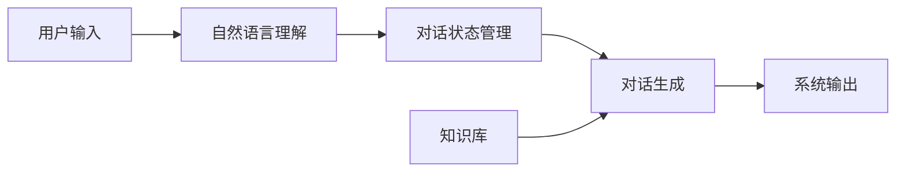
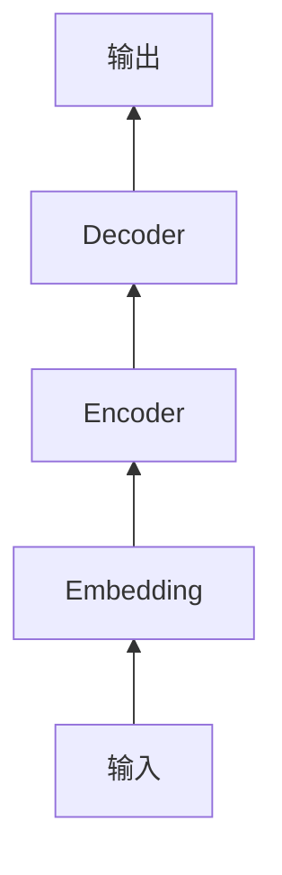
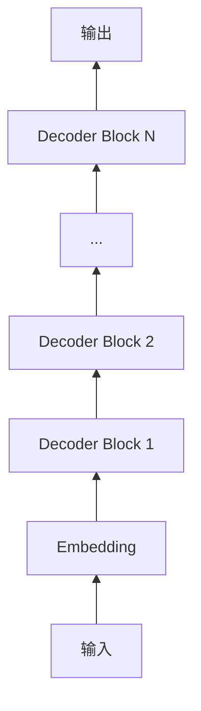

# AI系统Puppet原理与代码实战案例讲解

## 1.背景介绍

### 1.1 AI系统Puppet的兴起

近年来,随着人工智能技术的飞速发展,AI系统在各行各业得到了广泛应用。而AI系统Puppet作为一种新兴的AI交互范式,以其独特的交互方式和强大的功能,正在受到越来越多的关注。

### 1.2 AI系统Puppet的定义

AI系统Puppet是一种基于对话式交互的AI系统,它能够根据用户的输入,动态生成具有逻辑性、连贯性的对话内容。与传统的问答系统不同,AI系统Puppet更加注重对话的自然性和交互性,力求给用户一种与真人对话的感觉。

### 1.3 AI系统Puppet的应用场景

AI系统Puppet在客服、教育、娱乐等领域都有广泛的应用前景。例如,在客服领域,AI系统Puppet可以作为智能客服助手,为用户提供24小时不间断的服务;在教育领域,AI系统Puppet可以作为智能教学助手,为学生提供个性化的学习指导;在娱乐领域,AI系统Puppet可以作为智能陪聊助手,为用户提供有趣的聊天体验。

## 2.核心概念与联系

### 2.1 对话状态管理

对话状态管理是AI系统Puppet的核心概念之一。它指的是系统如何跟踪和管理对话的上下文信息,以确保生成的对话内容具有连贯性和逻辑性。常见的对话状态管理方法包括:

- 基于规则的状态管理:通过预先定义好的规则来管理对话状态,例如当用户问到某个关键词时,系统就切换到相应的对话状态。
- 基于机器学习的状态管理:通过机器学习算法(如RNN、LSTM等)来自动学习和管理对话状态。

### 2.2 自然语言理解

自然语言理解(NLU)是AI系统Puppet的另一个核心概念。它指的是系统如何理解用户输入的自然语言,并将其转化为计算机可以处理的结构化数据。常见的NLU技术包括:

- 基于规则的NLU:通过预先定义好的语法规则和词典来理解自然语言。
- 基于机器学习的NLU:通过机器学习算法(如CNN、Transformer等)来自动学习语言特征和语义信息。

### 2.3 对话生成

对话生成是AI系统Puppet的最终目标,它指的是系统如何根据当前的对话状态和用户输入,生成符合上下文的对话内容。常见的对话生成方法包括:

- 基于检索的生成:从预先构建好的对话库中检索出最相关的对话内容。
- 基于生成的方法:通过自然语言生成(NLG)模型来实时生成对话内容,如Seq2Seq、GPT等。

### 2.4 知识库

知识库是支撑AI系统Puppet运行的基础,它存储了系统赖以生成对话内容的各种知识和信息,如词典、同义词库、百科知识等。知识库的质量直接影响到系统生成对话的效果。

### 2.5 各概念之间的关系

下面是各个核心概念之间的关系示意图:



## 3.核心算法原理具体操作步骤

### 3.1 Transformer模型

Transformer是当前对话生成领域的主流模型之一,其基本结构如下:



具体步骤如下:

1. 将输入文本转化为向量表示(Embedding)
2. 将Embedding序列输入到Encoder中,提取输入的特征表示
3. 将Encoder的输出和Decoder的上一步输出一起输入到Decoder中,生成下一个词
4. 重复步骤3,直到生成结束标记或达到最大长度

### 3.2 GPT模型

GPT(Generative Pre-trained Transformer)是Transformer的一种变体,它只包含Decoder部分,预训练阶段使用无标签数据进行自回归任务训练。其基本结构如下:



使用GPT生成对话的步骤如下:

1. 将对话历史和当前用户输入拼接为一个序列,输入到GPT模型中
2. 使用Top-p采样或Beam Search等方法生成下一个词
3. 将生成的词附加到序列末尾,重复步骤2直到生成结束标记或达到最大长度

## 4.数学模型和公式详细讲解举例说明

### 4.1 Transformer的注意力机制

Transformer的核心是自注意力机制(Self-Attention),它允许模型的每个位置都能attend到序列的所有位置。对于一个长度为$n$的输入序列$X=(x_1,\cdots,x_n)$,自注意力的计算过程如下:

1. 将输入$X$通过三个线性变换得到Query、Key、Value矩阵:

$$
\begin{aligned}
Q &= XW^Q \\
K &= XW^K \\
V &= XW^V
\end{aligned}
$$

其中$W^Q, W^K, W^V \in \mathbb{R}^{d_{model} \times d_k}$是可学习的参数矩阵。

2. 计算Attention权重矩阵:

$$
A = \text{softmax}(\frac{QK^T}{\sqrt{d_k}})
$$

其中$A \in \mathbb{R}^{n \times n}$,$A_{ij}$表示位置$i$到位置$j$的注意力权重。

3. 计算Attention输出:

$$
\text{Attention}(Q,K,V) = AV
$$

最后将Attention输出通过一个线性变换得到最终的输出表示:

$$
\text{Output} = \text{Attention}(Q,K,V)W^O
$$

其中$W^O \in \mathbb{R}^{d_v \times d_{model}}$是可学习的参数矩阵。

举个例子,假设输入序列为"我爱学习",Embedding维度为4,则$Q,K,V$的维度为$3 \times 4$,Attention权重矩阵$A$的维度为$3 \times 3$:

$$
A=
\begin{bmatrix} 
0.5 & 0.3 & 0.2\\
0.1 & 0.7 & 0.2\\
0.2 & 0.3 & 0.5
\end{bmatrix}
$$

$A_{12}=0.3$表示第1个词"我"到第2个词"爱"的注意力权重为0.3。最终的输出维度也为$3 \times 4$。

### 4.2 GPT的损失函数

GPT使用Language Modeling的损失函数,即最大化下一个词的概率。对于一个长度为$n$的序列$X=(x_1,\cdots,x_n)$,GPT的损失函数定义为:

$$
L(X) = -\sum_{i=1}^{n-1} \log P(x_{i+1}|x_1,\cdots,x_i;\theta)
$$

其中$\theta$为模型参数。直观地看,就是最大化每个位置真实词的概率。假设序列为"我爱学习",Vocab大小为10000,模型在每个位置的预测概率如下:

```
我 爱 学 习
0.1 0.2 0.05 0.01
0.2 0.3 0.1 0.05
... ... ... ...
```

则损失函数为:

$$
\begin{aligned}
L &= -(\log 0.2 + \log 0.1 + \log 0.01) \\
&= -(-1.6-2.3-4.6) = 8.5
\end{aligned}
$$

最小化该损失函数就可以训练出一个高质量的语言模型。

## 5.项目实践：代码实例和详细解释说明

下面是使用PyTorch实现的Transformer模型的核心代码:

```python
import torch
import torch.nn as nn

class SelfAttention(nn.Module):
    def __init__(self, d_model, n_heads):
        super().__init__()
        self.d_model = d_model
        self.n_heads = n_heads
        self.head_dim = d_model // n_heads
        
        self.q_linear = nn.Linear(d_model, d_model)
        self.k_linear = nn.Linear(d_model, d_model)
        self.v_linear = nn.Linear(d_model, d_model)
        self.out = nn.Linear(d_model, d_model)
    
    def forward(self, x, mask=None):
        batch_size, seq_len, _ = x.size() 
        
        q = self.q_linear(x).view(batch_size, seq_len, self.n_heads, self.head_dim).transpose(1, 2)
        k = self.k_linear(x).view(batch_size, seq_len, self.n_heads, self.head_dim).transpose(1, 2)
        v = self.v_linear(x).view(batch_size, seq_len, self.n_heads, self.head_dim).transpose(1, 2)
        
        scores = torch.matmul(q, k.transpose(-2, -1)) / torch.sqrt(self.head_dim)
        if mask is not None:
            scores = scores.masked_fill(mask == 0, -1e9)
        attn_weights = torch.softmax(scores, dim=-1)
        
        output = torch.matmul(attn_weights, v)
        output = output.transpose(1, 2).contiguous().view(batch_size, seq_len, self.d_model)
        return self.out(output)

class TransformerBlock(nn.Module):
    def __init__(self, d_model, n_heads, dropout=0.1):
        super().__init__()
        self.attn = SelfAttention(d_model, n_heads)
        self.norm1 = nn.LayerNorm(d_model)
        self.norm2 = nn.LayerNorm(d_model)
        self.linear1 = nn.Linear(d_model, 4*d_model)
        self.linear2 = nn.Linear(4*d_model, d_model)
        self.dropout = nn.Dropout(dropout)
        
    def forward(self, x, mask=None):
        attn_out = self.attn(x, mask)
        x = self.norm1(x + self.dropout(attn_out))
        
        ff_out = self.linear2(torch.relu(self.linear1(x)))
        x = self.norm2(x + self.dropout(ff_out))
        return x
```

主要包含两个部分:

- SelfAttention:实现了多头自注意力机制,可以并行计算不同位置之间的注意力权重。
- TransformerBlock:由SelfAttention、LayerNorm、FeedForward等模块组成,是Transformer的基本组件。

模型的输入为(batch_size, seq_len, d_model)的张量,输出也是相同形状的张量。其中:

- batch_size:批大小
- seq_len:序列长度
- d_model:Embedding维度

使用这些模块就可以搭建出完整的Transformer模型,用于各种NLP任务。例如搭建一个基于Transformer的分类模型:

```python
class TransformerClassifier(nn.Module):
    def __init__(self, vocab_size, d_model, n_heads, n_layers, n_classes, max_len=512):
        super().__init__()
        self.embedding = nn.Embedding(vocab_size, d_model)
        self.pos_embedding = nn.Embedding(max_len, d_model)
        self.blocks = nn.ModuleList([TransformerBlock(d_model, n_heads) for _ in range(n_layers)])
        self.fc = nn.Linear(d_model, n_classes)
    
    def forward(self, x):
        seq_len = x.size(1)
        pos = torch.arange(seq_len, dtype=torch.long, device=x.device)
        
        x = self.embedding(x) + self.pos_embedding(pos)
        for block in self.blocks:
            x = block(x)
        
        x = x.mean(dim=1)
        return self.fc(x)
```

这个分类器包含以下部分:

- Embedding层:将离散的token id映射为连续的向量表示。
- Position Embedding:为每个位置添加位置信息。
- 若干个TransformerBlock:提取输入序列的高层特征表示。
- 分类器:将序列的表示pooling后映射到类别空间。

模型的输入为(batch_size, seq_len)的张量,输出为(batch_size, n_classes)的张量。假设Vocab大小为10000,类别数为2,则可以这样使用该分类器:

```python
vocab_size = 10000
d_model = 512
n_heads = 8
n_layers = 6
n_classes = 2
model = TransformerClassifier(vocab_size, d_model, n_heads,