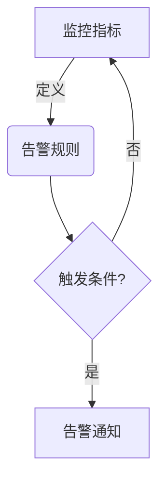
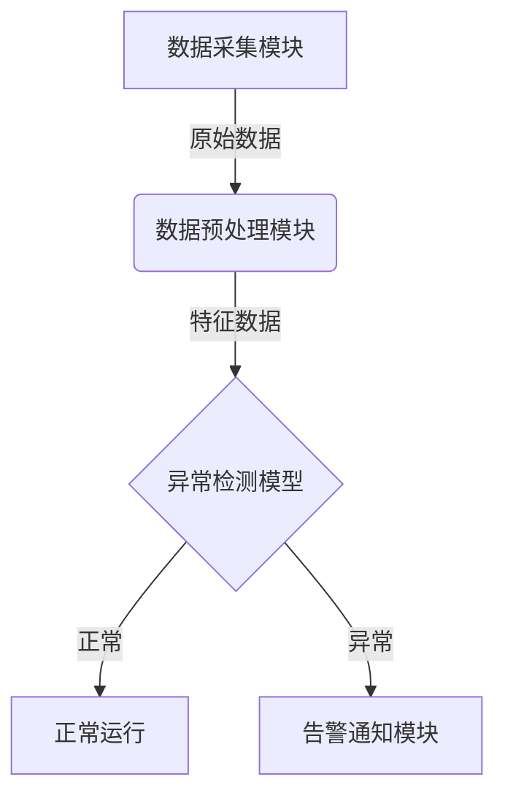

# AI系统告警机制原理与代码实战案例讲解

## 1.背景介绍

### 1.1 AI系统重要性

在当今科技飞速发展的时代，人工智能(AI)系统已经广泛应用于各个领域,如金融、医疗、制造业、交通等。这些系统在处理复杂任务和大量数据时展现出了非凡的能力,但同时也面临着各种风险和挑战。因此,建立高效可靠的AI系统告警机制至关重要。

### 1.2 告警机制的作用

AI系统告警机制的主要作用是实时监控系统运行状态,及时发现异常情况并发出警报,从而确保系统的稳定性和可用性。一个完善的告警机制不仅可以提高系统的可靠性,还可以减少系统故障带来的经济损失和潜在风险。

## 2.核心概念与联系

### 2.1 监控指标

监控指标是评估AI系统运行状态的关键因素。常见的监控指标包括:

- 系统资源利用率(CPU、内存、磁盘等)
- 网络流量和延迟
- 日志错误和警告信息
- 模型精度和性能指标

### 2.2 告警规则

告警规则定义了触发告警的条件,通常基于监控指标的阈值或异常模式。规则可以是静态的,也可以是动态自适应的。合理设置告警规则对于减少误报和漏报至关重要。

### 2.3 告警级别

不同的告警级别代表了事件的严重程度,通常分为信息、警告、错误和严重等级。级别的划分有助于快速识别和响应关键事件。

### 2.4 告警通知

当触发告警规则时,系统需要通过多种渠道(如邮件、短信、webhooks等)将告警信息及时通知相关人员,以便采取相应的应对措施。

### 2.5 Mermaid流程图



上图展示了AI系统告警机制的核心流程。监控指标定义了告警规则,一旦满足触发条件,系统就会发送告警通知。

## 3.核心算法原理具体操作步骤

AI系统告警机制的核心算法主要包括以下几个步骤:

### 3.1 数据采集

第一步是从AI系统中采集各种监控数据,包括系统指标、日志信息、模型输出等。数据采集可以通过代理、日志收集器或直接从系统API获取。

### 3.2 数据预处理

采集到的原始数据通常需要进行清洗、转换和规范化等预处理,以便后续的特征提取和模式识别。常见的预处理操作包括去重、填充缺失值、数据格式转换等。

### 3.3 特征工程

从预处理后的数据中提取有意义的特征是机器学习算法的基础。特征工程的目标是构建能够有效表示系统状态的特征向量,通常需要结合领域知识和数据探索。

### 3.4 模型训练

基于提取的特征,使用监督或无监督的机器学习算法训练异常检测模型。常用的算法包括决策树、随机森林、支持向量机、聚类等。模型训练过程需要反复调整超参数,以达到最佳性能。

### 3.5 异常检测

将新的系统数据输入到训练好的模型中,模型会输出异常分数或标签,判断当前系统状态是否正常。异常分数超过预设阈值时,就会触发告警规则。

### 3.6 告警触发

一旦检测到异常情况,告警模块会根据预定义的规则和级别,通过不同的通知渠道发送告警信息,以提醒相关人员采取行动。

## 4.数学模型和公式详细讲解举例说明

在AI系统告警机制中,常用的数学模型和算法包括:

### 4.1 统计模型

统计模型通过分析系统指标的统计分布,检测异常值或异常模式。常用的统计模型有:

- **三sigma原理**: 假设数据服从正态分布,当观测值偏离均值超过3个标准差时,视为异常。

$$
异常分数 = \frac{|x - \mu|}{\sigma}
$$

其中$x$为观测值,$\mu$为均值,$\sigma$为标准差。

- **概率密度估计**: 通过核密度估计、高斯混合模型等方法估计数据的概率密度函数,低概率密度区域视为异常。

### 4.2 基于距离的模型

这类模型基于数据点之间的距离或相似性,将离群点视为异常。常用算法有:

- **k-近邻算法(k-NN)**: 计算每个数据点到其k个最近邻居的平均距离,距离大的点被视为异常。
- **局部异常系数(LOF)**: 衡量一个数据点与其k个邻居的密度比值,密度比值小的点被视为异常。

### 4.3 基于模型的方法

这类方法假设正常数据符合某种模型,任何不符合模型的数据都被视为异常。常用模型有:

- **一类支持向量机(One-Class SVM)**: 将大部分数据包围在一个超球面内,落在球面外的点被视为异常。
- **隔离森林(Isolation Forest)**: 通过随机分割特征空间构建二叉树,异常点会被较快地隔离,因此具有较短的路径长度。

### 4.4 示例:基于LSTM的时序异常检测

对于时序数据,我们可以使用长短期记忆网络(LSTM)等递归神经网络进行异常检测。LSTM能够学习数据的时序模式,对于不符合模式的数据会产生较大的重构误差,从而被检测为异常。

假设我们有一个包含系统指标时序数据的训练集$\{X_1, X_2, \cdots, X_N\}$,其中$X_i = \{x_i^1, x_i^2, \cdots, x_i^T\}$表示第i个时间序列,长度为T。我们的目标是训练一个LSTM模型,对给定的时间序列$X$,能够重构出与其最相似的序列$\hat{X}$。

LSTM的损失函数可以定义为:

$$
L(X, \hat{X}) = \sum_{t=1}^{T}l(x_t, \hat{x}_t)
$$

其中$l$是每个时间步的损失函数,如均方误差:$l(x, \hat{x}) = (x - \hat{x})^2$。

对于新的时间序列$X^*$,我们可以计算其重构误差$L(X^*, \hat{X}^*)$。如果误差超过预设阈值,就将$X^*$标记为异常序列,并触发告警。

## 5.项目实践:代码实例和详细解释说明

为了更好地理解AI系统告警机制,我们将通过一个基于Python的实战项目进行讲解。该项目旨在为一个在线视频流服务构建告警系统,监控服务器资源利用率和视频质量等指标。

### 5.1 项目架构



整个项目分为四个主要模块:

1. **数据采集模块**: 从视频流服务的各个组件(如Web服务器、编码器、数据库等)采集监控数据,包括CPU、内存、网络流量、视频质量等指标。
2. **数据预处理模块**: 对采集到的原始数据进行清洗、规范化和特征提取,为异常检测模型做准备。
3. **异常检测模型**: 使用机器学习算法(如隔离森林、One-Class SVM等)训练异常检测模型,对新的监控数据进行评分,判断是否异常。
4. **告警通知模块**: 当检测到异常时,根据预设的告警规则和级别,通过邮件、短信或webhooks等渠道发送告警通知。

### 5.2 代码实例

以下是项目中一些关键代码片段,展示了如何实现异常检测和告警通知功能。

#### 5.2.1 数据采集和预处理

```python
import psutil
import numpy as np
from sklearn.preprocessing import MinMaxScaler

# 采集CPU利用率
cpu_percent = psutil.cpu_percent(interval=1)

# 采集内存利用率
mem = psutil.virtual_memory()
mem_percent = mem.percent

# 特征缩放
scaler = MinMaxScaler()
X = np.array([[cpu_percent, mem_percent]]).reshape(1, -1)
X_scaled = scaler.transform(X)
```

上述代码使用`psutil`库采集CPU和内存利用率,并使用`MinMaxScaler`对特征数据进行缩放,以满足模型输入要求。

#### 5.2.2 异常检测模型

```python
from sklearn.ensemble import IsolationForest

# 训练隔离森林模型
model = IsolationForest(contamination=0.1)
model.fit(X_train)

# 获取异常分数
scores = model.decision_function(X_scaled)

# 判断是否异常
if scores < -0.5:
    print("异常情况!")
else:
    print("正常运行")
```

这里使用`IsolationForest`算法训练异常检测模型。`contamination`参数指定了训练数据中异常样本的比例。对于新的监控数据,模型会输出一个异常分数,根据分数的阈值判断是否异常。

#### 5.2.3 告警通知

```python
import smtplib

# 发送邮件通知
def send_alert_email(subject, body):
    sender = 'alertsystem@example.com'
    receivers = ['ops@example.com']

    message = f"""From: Alert System <{sender}>
To: Operations Team <{receivers[0]}>
Subject: {subject}

{body}
"""

    with smtplib.SMTP('localhost') as server:
        server.sendmail(sender, receivers, message)
        print("Email sent!")

# 触发告警
if scores < -0.5:
    subject = "Critical Alert: Video Streaming Service"
    body = "Abnormal resource usage detected. Please check the servers immediately."
    send_alert_email(subject, body)
```

上述代码定义了一个`send_alert_email`函数,用于通过SMTP协议发送告警邮件。当检测到异常情况时,会触发该函数,向运维团队发送告警通知。

需要注意的是,为了保证告警系统的可靠性,实际项目中还需要添加错误处理、重试机制、多种通知渠道等功能。

## 6.实际应用场景

AI系统告警机制在各个领域都有广泛的应用,以下是一些典型场景:

### 6.1 金融风控

在金融领域,AI系统被广泛用于欺诈检测、交易监控和风险管理。及时发现异常交易活动对于防范金融犯罪至关重要。告警机制可以监控交易数据、账户活动等,一旦发现可疑情况就会触发警报,从而最大限度地降低风险。

### 6.2 网络安全

网络安全是当今社会的一大挑战。AI系统可以用于入侵检测、垃圾邮件过滤、恶意软件分析等任务。通过建立正常网络流量的基线模型,告警系统能够及时发现异常活动,如分布式拒绝服务攻击、恶意扫描等,从而提高网络的安全性。

### 6.3 医疗健康

在医疗领域,AI系统被用于辅助诊断、病情监控、药物研发等任务。告警机制可以监控患者的生理指标、医疗设备运行状态等,一旦发现异常就会立即通知医护人员,确保患者的安全。同时,它也可以用于监控临床试验数据,发现潜在的安全隐患。

### 6.4 智能制造

在智能制造领域,AI系统被广泛应用于预测性维护、质量控制、工艺优化等环节。告警机制可以实时监控生产线的运行状态,包括设备健康度、产品质量、能源消耗等,一旦发现异常就会触发警报,帮助工程师及时采取措施,避免产生更大的经济损失。

## 7.工具和资源推荐

为了更好地构建和管理AI系统告警机制,以下是一些推荐的工具和资源:

### 7.1 开源工具

- **Prometheus**: 一款开源的系统监控和告警工具套件,提供了