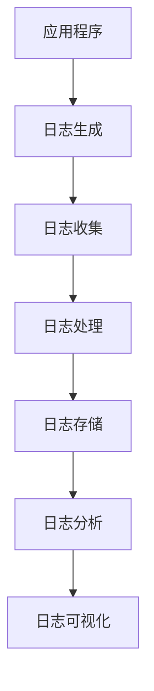
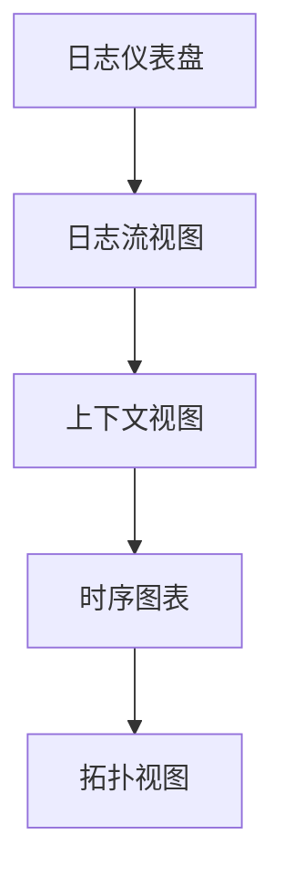
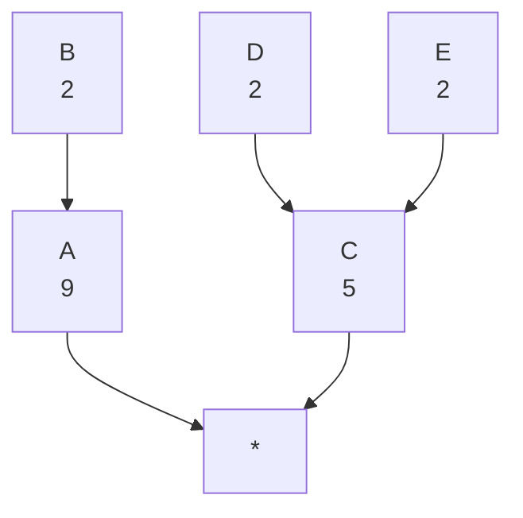

# AI系统日志管理原理与代码实战案例讲解

## 1.背景介绍

### 1.1 日志管理的重要性

在现代的软件系统中,日志管理扮演着至关重要的角色。随着系统复杂度的不断增加,有效的日志记录和分析变得愈发关键。日志不仅是系统运行状态的宝贵记录,也是故障诊断、性能优化和安全审计的重要依据。

### 1.2 传统日志管理的挑战

传统的日志管理方式面临诸多挑战:

- **日志数据量爆炸式增长**:随着系统规模的扩大,海量的日志数据给存储、传输和分析带来了巨大压力。
- **日志格式多样化**:不同组件、不同语言产生的日志格式参差不齐,给统一处理带来障碍。
- **上下文信息缺失**:单一日志条目往往缺乏足够的上下文信息,难以还原完整的执行过程。
- **可观测性不足**:传统日志系统无法提供全面的系统可观测性,如指标、分布式追踪等。

### 1.3 AI系统日志管理的特殊需求

作为新兴的技术领域,AI系统对日志管理提出了更高的要求:

- **AI模型训练与推理日志**:需要记录大规模并行的模型训练和推理过程。
- **数据处理流水线日志**:涉及数据采集、清洗、标注等复杂流程。
- **可解释性需求**:AI决策过程需要通过日志得到解释和审计。

## 2.核心概念与联系 

### 2.1 日志数据生命周期

日志数据的生命周期包括以下几个阶段:

1. **日志生成**:应用程序在运行过程中生成日志事件。
2. **日志收集**:将分散的日志数据收集到中央存储系统。
3. **日志处理**:对日志数据进行格式化、解析、富化等处理。
4. **日志存储**:将处理后的日志数据持久化存储。
5. **日志分析**:从海量日志数据中提取有价值的信息。
6. **日志可视化**:以可视化的方式呈现日志分析结果。



### 2.2 日志数据结构

一条标准的日志事件通常包含以下字段:

- **时间戳**:记录事件发生的准确时间。
- **日志级别**:如DEBUG、INFO、WARNING、ERROR等。
- **线程ID**:记录产生日志的线程信息。
- **类名和方法名**:记录日志来源的代码位置。
- **消息内容**:记录具体的日志信息。
- **上下文信息**:如请求ID、用户ID等关联信息。

### 2.3 日志传输协议

常见的日志传输协议包括:

- **Syslog**:老牌的日志传输协议,基于UDP。
- **RELP**:可靠的Syslog协议,基于TCP。
- **Logstash**:Elastic Stack中的日志收集工具。
- **Fluentd**:统一日志层,支持多种数据源。

## 3.核心算法原理具体操作步骤

### 3.1 日志生成

高效的日志生成是整个系统的基础。主要原理包括:

1. **异步日志记录**:使用生产者-消费者模式,将日志写入内存队列,由后台线程批量刷新到磁盘,避免阻塞主线程。
2. **日志级别控制**:根据级别过滤日志,避免记录过多无用日志。
3. **对象池设计**:重用日志事件对象,减少对象创建和GC开销。

```java
// 异步日志记录示例
logger.debug("Processing trade with id: {}", tradeId);

// 日志级别控制示例  
if(logger.isDebugEnabled()) {
    logger.debug("Trade with id {} processed", tradeId);
}
```

### 3.2 日志收集

收集分散的日志数据是关键一环,需要高效且可靠。主要算法包括:

1. **批量读取**:批量从磁盘读取日志数据,减少I/O开销。
2. **内存缓冲**:使用环形缓冲区暂存日志数据,实现高吞吐低延迟。
3. **负载均衡**:根据一致性哈希等算法,均衡日志收集负载。

```java
// 批量读取日志文件
byte[] buf = new byte[8192];
int len = randomAccessFile.read(buf);

// 一致性哈希负载均衡
int nodeCount = 3;
int replicas = 3;
Collection<CollectorNode> nodes = createRingNodes(nodeCount, replicas);
CollectorNode node = nodes.get(getNodeIndex(log.id, nodes));
```

### 3.3 日志处理

对原始日志数据进行标准化处理,以提高后续分析效率:

1. **格式化**:将日志消息解析为结构化数据,如JSON或者Protobuf。
2. **解析**:从原始消息中提取关键字段,如时间戳、级别等。
3. **规范化**:对日志字段进行清理和标准化,如IP地址格式化。
4. **富化**:从其他数据源添加上下文信息,如用户信息、地理位置等。

```java
// Grok模式提取字段  
%{DATA:message}

// 使用Dissect解析器
token.extractors : [
    {
        "field" : "message",
        "tokenizer" : "tokenizer"
    }
]
```

### 3.4 日志存储

为了高效存储和查询海量日志数据,需要采用优秀的存储引擎:

1. **列存储**:按列存储数据,提高查询效率,如Parquet、ORC等。
2. **数据分区**:按时间、主机等维度对数据分区,加速过滤。
3. **索引技术**:使用倒排索引、位图索引等,加速数据查找。
4. **压缩编码**:对数据进行压缩编码,节省存储空间。

```sql
-- Hive分区表
CREATE TABLE logs (
    event STRING,
    timestamp BIGINT
) PARTITIONED BY (date_id STRING)
STORED AS PARQUET;

-- Elasticsearch索引映射
PUT my_index
{
  "mappings": {
    "properties": {
      "message": {
        "type": "text"
      },
      "timestamp": {
        "type": "date"
      }
    }
  }
}
```

### 3.5 日志分析

从海量日志数据中提取有价值的信息,是日志管理的核心目标:

1. **全文检索**:基于倒排索引,支持对日志消息的全文检索。
2. **统计分析**:对数值型日志字段进行统计分析,如计算平均值、百分位等。
3. **关联分析**:发现日志事件之间的关联模式,如路径分析、频繁模式挖掘。
4. **异常检测**:基于统计模型或机器学习算法,检测异常日志事件。
5. **可视分析**:将分析结果以可视化的形式呈现,如仪表盘、报表等。

```sql
-- 全文搜索查询
SELECT * FROM logs 
WHERE match(message, 'query');

-- 统计分析
SELECT 
    level,
    count(*) AS count
FROM logs
GROUP BY level;
```

### 3.6 日志可视化

直观的可视化界面有助于理解复杂的日志数据:

1. **仪表盘**:展示关键指标和统计数据,如日志事件计数、错误率等。
2. **日志流**:以实时流的形式展示最新日志事件。
3. **上下文视图**:展示与日志事件相关的上下文信息,如请求参数、会话信息等。
4. **时序图表**:展示日志事件在时间维度上的分布情况。
5. **拓扑视图**:以拓扑结构展示分布式系统中的日志事件流动。



## 4.数学模型和公式详细讲解举例说明

### 4.1 日志压缩编码

为了节省存储空间,常采用高效的压缩编码算法对日志数据进行压缩。

**整数编码**:对于整数型的日志字段,可以使用变长编码算法,如Elias Gamma编码:

$$\mathrm{Elias\gamma}(x) = \mathrm{encode}(x) = \begin{cases} 
0 & \text{if } x = 0\\
\mathrm{bin}(x)\,\mathrm{offset}\,\mathrm{by}\,2^{\lfloor\log_2(x)\rfloor+1} & \text{if } x > 0
\end{cases}$$

其中$\mathrm{bin}(x)$表示$x$的二进制表示,offset by表示将二进制码向左移位。

例如,对于整数23,其Elias Gamma编码为:

$$\begin{aligned}
\mathrm{Elias\gamma}(23) &= \underbrace{00000000000000000000000}_{前缀(5\,bits)} \underbrace{10111}_{数值(5\,bits)} \\
&= 0000000000000000000000010111_2
\end{aligned}$$

**字符串编码**:对于字符串型的日志字段,可以使用前缀编码算法,如Huffman编码。给定字符及其权重(出现频率),Huffman编码可以构建前缀编码,没有码字是其他码字的前缀。

例如,给定字符串"AAAABBCCCCDDE",构建Huffman树:



对应的Huffman编码为:A=0, B=101, C=11, D=1001, E=1000。

### 4.2 日志异常检测

检测异常日志事件是日志分析的一项重要任务。常用的方法包括:

**统计模型**:基于日志事件的统计特征,构建正常模型,任何偏离该模型的事件就被视为异常。

设$x$为日志事件的特征向量,正常模型为$P(x)$,可以使用核密度估计等方法对$P(x)$进行建模。对于新的日志事件$x_0$,计算其概率密度$P(x_0)$,若小于给定阈值,则判定为异常。

$$\mathrm{anomaly}(x_0) = \begin{cases}
1 & \text{if } P(x_0) < \epsilon\\
0 & \text{otherwise}
\end{cases}$$

**聚类模型**:基于日志事件的相似性,将正常事件聚类为若干簇,离群点视为异常。

给定日志事件$x_1,x_2,...,x_n$,使用K-Means等聚类算法得到$k$个簇$C_1,C_2,...,C_k$。对于新事件$x_0$,计算其与各簇中心的距离,取最小距离$d_{\min}(x_0)$,若大于给定阈值,则判定为异常。

$$\mathrm{anomaly}(x_0) = \begin{cases}
1 & \text{if } d_{\min}(x_0) > \delta\\
0 & \text{otherwise}
\end{cases}$$

**深度学习模型**:使用深度神经网络从原始日志消息中自动提取特征,并对正常与异常事件进行分类。

给定训练数据$\{(x_i, y_i)\}$,其中$x_i$为日志消息,$y_i\in\{0,1\}$为标签,使用LSTM或CNN等模型进行异常检测分类:

$$\hat{y} = f(x;\theta)$$

使用交叉熵损失函数优化模型参数$\theta$:

$$\mathcal{L}(\theta) = -\frac{1}{N}\sum_{i=1}^N y_i\log\hat{y}_i + (1-y_i)\log(1-\hat{y}_i)$$

## 5.项目实践:代码实例和详细解释说明

### 5.1 异步日志记录

使用LMAX Disruptor实现高性能的异步日志记录:

```java
// 定义日志事件
public class LogEvent {
    private static final EventFactory<LogEvent> FACTORY = new LogEventFactory();
    private long sequence;
    private String message;
    // ...
}

// 初始化Disruptor
int bufferSize = 1024;
Executor executor = Executors.newFixedThreadPool(2);

EventFactory<LogEvent> factory = LogEvent.FACTORY;
Disruptor<Log