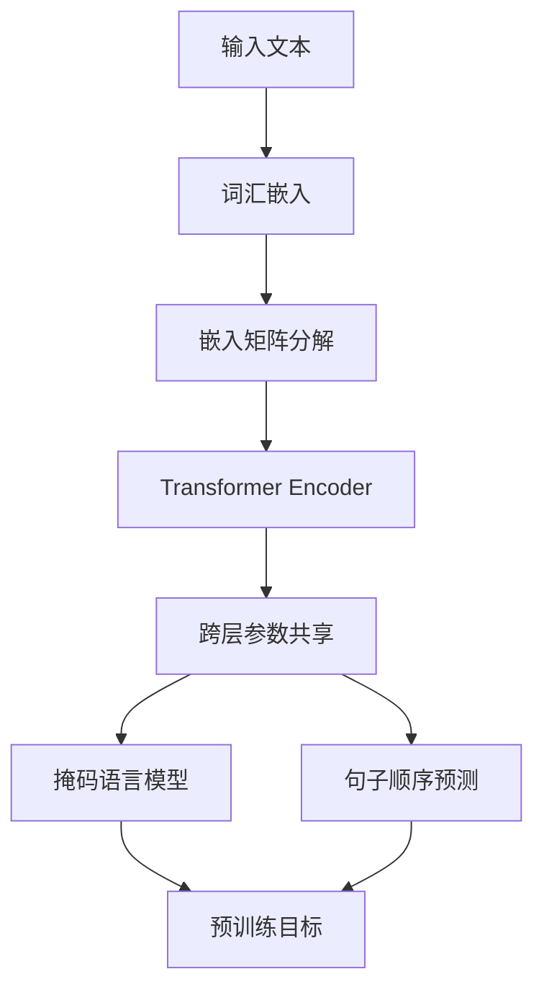

# ALBERT与元学习：快速适应新任务的模型

## 1.背景介绍

### 1.1 自然语言处理的挑战

自然语言处理(NLP)是人工智能领域中最具挑战性的任务之一。由于人类语言的复杂性和多样性,构建能够准确理解和生成自然语言的人工智能系统一直是一个巨大的挑战。传统的NLP模型通常专注于特定任务,如文本分类、机器翻译或问答系统,并且需要大量的标注数据进行训练。然而,这种方法存在一些局限性:

1. 数据孤岛:每个NLP任务都需要大量的标注数据,导致数据无法共享和重用。
2. 缺乏泛化能力:模型在训练数据之外的场景中表现欠佳,无法很好地泛化。
3. 知识转移困难:无法轻松地将一个任务中学习到的知识转移到另一个相关任务中。

### 1.2 预训练语言模型的兴起

为了解决上述挑战,预训练语言模型(Pre-trained Language Models,PLMs)应运而生。PLMs通过在大型未标注语料库上进行自监督预训练,学习通用的语言表示,然后在下游任务上进行微调(fine-tuning),从而实现跨任务的知识转移。这种范式极大地提高了NLP模型的性能,并推动了该领域的快速发展。

代表性的PLMs包括BERT、GPT、XLNet等。其中,BERT(Bidirectional Encoder Representations from Transformers)由谷歌提出,通过掩码语言模型(Masked Language Model)和下一句预测(Next Sentence Prediction)任务进行预训练,在多个NLP任务上取得了出色的表现。

### 1.3 ALBERT的提出

尽管BERT取得了巨大成功,但它仍然存在一些局限性,如参数量巨大、预训练成本高昂等。为了解决这些问题,谷歌大脑团队在2019年提出了ALBERT(A Lite BERT for Self-supervised Task)模型。ALBERT通过参数压缩和跨层参数共享等技术,大幅减小了模型的参数量,同时保持了与BERT相当的性能。

## 2.核心概念与联系

### 2.1 ALBERT的核心创新点

ALBERT的核心创新点包括:

1. 嵌入矩阵分解(Factorized Embedding Parameterization)
2. 跨层参数共享(Cross-layer Parameter Sharing)
3. 句子顺序预测(Sentence Order Prediction,SOP)

下面将详细介绍这些创新点。

#### 2.1.1 嵌入矩阵分解

在BERT中,每个词汇都被映射为一个固定长度的向量表示,称为词嵌入(Word Embedding)。由于词汇表通常包含数十万个词,因此词嵌入矩阵的参数量非常庞大。为了减小参数量,ALBERT采用了嵌入矩阵分解的技术。

具体来说,ALBERT将原始的词嵌入矩阵$\mathbf{E} \in \mathbb{R}^{V \times D}$分解为两个矩阵的乘积:$\mathbf{E} = \mathbf{E}_1 \mathbf{E}_2$,其中$\mathbf{E}_1 \in \mathbb{R}^{V \times m}$,$\mathbf{E}_2 \in \mathbb{R}^{m \times D}$,且$m \ll D$。这种分解技术可以将参数量从$VD$减少到$Vm + mD$,从而大幅降低模型的参数量。

#### 2.1.2 跨层参数共享

除了词嵌入矩阵,Transformer的参数主要集中在注意力(Attention)和前馈神经网络(Feed-Forward Neural Network,FFN)层。ALBERT采用了跨层参数共享的策略,即在不同的Transformer层之间共享注意力和FFN的参数。这种策略可以进一步减少模型的参数量,同时也有助于提高模型的泛化能力。

#### 2.1.3 句子顺序预测

BERT在预训练阶段采用了掩码语言模型和下一句预测两个任务。ALBERT则放弃了下一句预测任务,转而采用了句子顺序预测(Sentence Order Prediction,SOP)任务。在SOP任务中,模型需要判断两个句子的前后顺序是否正确。相比下一句预测,SOP任务更加简单且有效,能够帮助模型捕捉句子级别的连贯性和语义关系。

### 2.2 ALBERT与元学习的联系

元学习(Meta-Learning)是机器学习中的一个重要概念,旨在提高模型在新任务上的快速适应能力。元学习算法通过在一系列相关任务上进行训练,学习一种通用的学习策略,从而在遇到新任务时能够快速适应和学习。

ALBERT与元学习之间存在一些联系:

1. ALBERT通过在大型语料库上进行自监督预训练,学习了通用的语言表示,为下游任务提供了良好的初始化。这种方式与元学习的思想类似,都是希望模型能够从先前的学习经验中获益,快速适应新任务。

2. ALBERT采用了跨层参数共享的策略,这种参数共享机制有助于提高模型的泛化能力,使其能够更好地适应新的任务和数据分布。

3. ALBERT的预训练任务(如掩码语言模型和句子顺序预测)可以被视为一系列相关的"元任务",通过在这些任务上进行训练,模型学习了一种通用的语言理解和生成能力,为快速适应新的NLP任务奠定了基础。

因此,虽然ALBERT本身并不直接采用元学习算法,但其设计理念和一些技术细节与元学习的思想不谋而合,都是为了提高模型在新任务上的快速适应能力。

## 3.核心算法原理具体操作步骤

在这一部分,我们将详细介绍ALBERT的核心算法原理和具体操作步骤。

### 3.1 ALBERT的整体架构

ALBERT的整体架构如下图所示:

可以看到,ALBERT的架构基于Transformer Encoder,并在其基础上引入了嵌入矩阵分解、跨层参数共享等创新技术。下面将逐步介绍各个模块的具体原理和操作步骤。

### 3.2 嵌入矩阵分解

如前所述,ALBERT采用了嵌入矩阵分解的技术来减小参数量。具体操作步骤如下:

1. 将原始的词嵌入矩阵$\mathbf{E} \in \mathbb{R}^{V \times D}$分解为两个矩阵$\mathbf{E}_1 \in \mathbb{R}^{V \times m}$和$\mathbf{E}_2 \in \mathbb{R}^{m \times D}$,其中$m \ll D$。
2. 对于每个词汇$w_i$,其词嵌入向量$\mathbf{e}_i$由$\mathbf{e}_i = \mathbf{E}_1[i] \mathbf{E}_2$计算得到,其中$\mathbf{E}_1[i]$表示$\mathbf{E}_1$的第$i$行。

通过这种分解技术,词嵌入矩阵的参数量从$VD$减少到$Vm + mD$,当$m \ll D$时,可以极大地减小参数量。

### 3.3 跨层参数共享

ALBERT在不同的Transformer层之间共享注意力和前馈神经网络的参数。具体操作步骤如下:

1. 对于第$l$层的多头注意力模块,其参数包括查询矩阵$\mathbf{Q}^{(l)}$、键矩阵$\mathbf{K}^{(l)}$、值矩阵$\mathbf{V}^{(l)}$以及输出投影矩阵$\mathbf{W}_\text{out}^{(l)}$。
2. 在跨层参数共享策略下,所有层共享相同的$\mathbf{Q}$、$\mathbf{K}$、$\mathbf{V}$和$\mathbf{W}_\text{out}$,即$\mathbf{Q}^{(l)} = \mathbf{Q}$、$\mathbf{K}^{(l)} = \mathbf{K}$、$\mathbf{V}^{(l)} = \mathbf{V}$、$\mathbf{W}_\text{out}^{(l)} = \mathbf{W}_\text{out}$。
3. 对于前馈神经网络,其参数包括$\mathbf{W}_1^{(l)}$、$\mathbf{W}_2^{(l)}$和偏置项$\mathbf{b}_1^{(l)}$、$\mathbf{b}_2^{(l)}$。同样地,所有层共享相同的$\mathbf{W}_1$、$\mathbf{W}_2$、$\mathbf{b}_1$和$\mathbf{b}_2$。

通过这种跨层参数共享策略,ALBERT大幅减小了模型的参数量,同时也有助于提高模型的泛化能力。

### 3.4 预训练任务

ALBERT在预训练阶段采用了两个主要任务:掩码语言模型(Masked Language Model,MLM)和句子顺序预测(Sentence Order Prediction,SOP)。

#### 3.4.1 掩码语言模型

掩码语言模型任务的目标是根据上下文预测被掩码的词汇。具体操作步骤如下:

1. 从语料库中随机采样一个句子$S = (w_1, w_2, \ldots, w_n)$。
2. 以概率$p$随机选择一些词汇进行掩码,得到掩码后的句子$\tilde{S} = (\tilde{w}_1, \tilde{w}_2, \ldots, \tilde{w}_n)$,其中$\tilde{w}_i$可能是原始词汇、掩码标记[MASK]或随机替换的词汇。
3. 将$\tilde{S}$输入到ALBERT模型中,得到每个位置的词汇预测分布$P(\tilde{w}_i | \tilde{S})$。
4. 对于被掩码的位置$i$,计算预测词汇$w_i$的负对数似然损失$-\log P(w_i | \tilde{S})$,将所有位置的损失求和作为最终的损失函数。
5. 使用优化算法(如Adam)最小化损失函数,更新ALBERT的参数。

通过掩码语言模型任务,ALBERT学习了捕捉上下文信息和预测缺失词汇的能力,为下游任务奠定了基础。

#### 3.4.2 句子顺序预测

句子顺序预测任务的目标是判断两个句子的前后顺序是否正确。具体操作步骤如下:

1. 从语料库中随机采样两个句子$S_A$和$S_B$,以$0.5$的概率交换它们的顺序,得到$S_1$和$S_2$。
2. 将$S_1$和$S_2$连接起来,加上特殊标记[SEP]和[CLS],构成输入序列$X = ([CLS], S_1, [SEP], S_2, [SEP])$。
3. 将$X$输入到ALBERT模型中,得到[CLS]标记对应的向量表示$\mathbf{c}$。
4. 将$\mathbf{c}$输入到一个二分类器中,预测$S_1$和$S_2$的顺序是否正确,得到概率$P(y | X)$,其中$y \in \{0, 1\}$表示顺序是否正确。
5. 计算二元交叉熵损失$-\log P(y | X)$,使用优化算法最小化损失函数。

通过句子顺序预测任务,ALBERT学习了捕捉句子级别的语义关系和连贯性,有助于提高模型在下游任务中的表现。

## 4.数学模型和公式详细讲解举例说明

在这一部分,我们将详细介绍ALBERT中涉及的一些核心数学模型和公式,并给出具体的例子说明。

### 4.1 注意力机制

注意力机制是Transformer及其变体(如BERT和ALBERT)中的核心组件。它允许模型动态地捕捉输入序列中不同位置之间的依赖关系,对于处理序列数据(如自然语言)具有重要意义。

在ALBERT中,注意力机制的计算过程