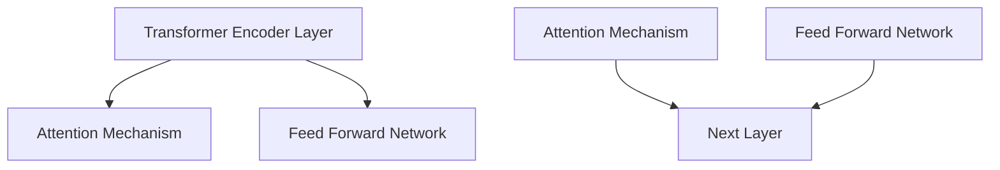

# ALBERT原理与代码实例讲解

## 1.背景介绍

在自然语言处理(NLP)领域,Transformer模型凭借其出色的性能,成为了主流架构。然而,Transformer模型在处理长序列时会面临计算资源消耗过大的问题。为了解决这一挑战,Google AI团队于2019年提出了ALBERT(A Lite BERT)模型。

ALBERT是在BERT基础上进行改进和压缩的模型,旨在降低内存占用和提高训练效率,同时保持BERT模型的优秀性能。它主要采用了三种策略:跨层参数共享(Cross-Layer Parameter Sharing)、嵌入数据分解(Embedding Matrix Decomposition)和句子顺序预测(Sentence Order Prediction)。

### 1.1 Transformer和BERT模型概述

Transformer是一种基于注意力机制的序列到序列模型,可以有效捕捉序列中元素之间的长程依赖关系。它不仅在机器翻译等序列生成任务中表现出色,也被广泛应用于自然语言理解任务。

BERT(Bidirectional Encoder Representations from Transformers)是一种基于Transformer的双向编码器模型,通过预训练和微调的方式在多个NLP任务上取得了state-of-the-art的表现。然而,BERT模型存在参数量大、内存消耗高的缺点,限制了它在生产环境中的部署。

### 1.2 ALBERT的优势

相比BERT,ALBERT模型具有以下优势:

1. **参数量更小**:通过跨层参数共享和嵌入分解技术,ALBERT模型的参数量大幅减少,有利于部署到终端设备等资源受限环境。
2. **训练效率更高**:由于参数量的减少,ALBERT在相同硬件条件下的训练速度更快。
3. **性能与BERT相当**:尽管参数量减少,但ALBERT在多项NLP任务上的性能与BERT相当,甚至在某些任务上表现更优。

## 2.核心概念与联系

### 2.1 跨层参数共享(Cross-Layer Parameter Sharing)

Transformer模型中,每一层的参数都是独立的,导致了巨大的参数冗余。ALBERT提出了跨层参数共享的策略,将Transformer的编码器层(Encoder Layer)分为两部分:

1. **前馈网络(Feed Forward Network)**
2. **注意力机制(Attention Mechanism)**

在同一组编码器层内,前馈网络的参数是共享的,而注意力机制的参数则是独立的。这种策略大幅减少了参数量,同时保留了注意力机制捕捉序列依赖关系的能力。



### 2.2 嵌入数解码(Embedding Matrix Decomposition)

在BERT中,词嵌入矩阵(Embedding Matrix)占用了大量的参数空间。ALBERT采用了分解技术,将高维的嵌入矩阵分解为两个低维矩阵的乘积,从而减少参数量。具体来说,如果原始嵌入矩阵的维度为$V \times E$,则可以分解为两个矩阵$V \times K$和$K \times E$的乘积,其中$K \ll E$。

$$\text{Embedding Matrix} = V \times E = (V \times K) \cdot (K \times E)$$

这种分解技术不仅减少了参数量,还增加了嵌入矩阵的表达能力。

### 2.3 句子顺序预测(Sentence Order Prediction)

BERT在预训练阶段采用了"下一句预测"(Next Sentence Prediction)任务,用于捕捉句子之间的关系。然而,这种二分类任务较为简单,无法很好地建模复杂的句子关系。

ALBERT则使用了句子顺序预测(Sentence Order Prediction)任务,给定两个句子,模型需要预测它们的先后顺序。这种多分类任务更加贴近自然语言的特点,有助于提高模型对上下文语义的理解能力。

## 3.核心算法原理具体操作步骤

ALBERT的核心算法原理可以概括为以下几个步骤:

### 3.1 输入表示

与BERT类似,ALBERT也采用了WordPiece嵌入和位置嵌入的方式来表示输入序列。不同之处在于,ALBERT使用了嵌入矩阵分解技术来减少参数量。

具体来说,对于一个长度为$T$的输入序列,其WordPiece嵌入矩阵$E^{word} \in \mathbb{R}^{V \times E}$被分解为两个矩阵$E_1 \in \mathbb{R}^{V \times K}$和$E_2 \in \mathbb{R}^{K \times E}$的乘积,其中$K \ll E$。同样地,位置嵌入矩阵$E^{pos} \in \mathbb{R}^{T \times E}$也被分解为$E_1^{pos} \in \mathbb{R}^{T \times K}$和$E_2$的乘积。

最终的输入表示$H^0 \in \mathbb{R}^{T \times E}$由WordPiece嵌入和位置嵌入相加得到:

$$H^0 = E_1^{word}E_2 + E_1^{pos}E_2$$

### 3.2 Transformer编码器层

ALBERT的Transformer编码器层与BERT的结构相似,包括多头注意力机制(Multi-Head Attention)和前馈网络(Feed Forward Network)两个子层。不同之处在于,ALBERT采用了跨层参数共享策略,将编码器层分为两部分:

1. **注意力机制部分**:每一层的注意力机制参数都是独立的。
2. **前馈网络部分**:同一组编码器层内的前馈网络参数是共享的。

具体来说,假设ALBERT模型有$N$个编码器层,被划分为$m$组,每组包含$g$个层。那么第$i$组的第$j$层的输出$H_i^j$可以表示为:

$$H_i^j = \text{FFN}_i(H_i^{j-1}) + H_i^{j-1}$$
$$H_i^j = \text{Attention}_i^j(H_i^j) + H_i^j$$

其中,$\text{FFN}_i$表示第$i$组的共享前馈网络,$\text{Attention}_i^j$表示第$i$组第$j$层的独立注意力机制。通过这种策略,ALBERT大幅减少了参数量,同时保留了注意力机制捕捉长程依赖的能力。

### 3.3 预训练任务

ALBERT在预训练阶段采用了两个任务:掩码语言模型(Masked Language Model)和句子顺序预测(Sentence Order Prediction)。

**1. 掩码语言模型(Masked Language Model)**

与BERT相同,ALBERT也使用了掩码语言模型任务来捕捉双向语境信息。具体来说,对于一个输入序列,会随机将部分词元(WordPiece)用特殊的`[MASK]`标记替换,然后让模型根据上下文预测被掩码的词元。

**2. 句子顺序预测(Sentence Order Prediction)**

不同于BERT的"下一句预测"任务,ALBERT采用了句子顺序预测任务。给定两个句子$A$和$B$,模型需要预测它们的先后顺序,即$A$在前还是$B$在前。这种多分类任务能更好地建模复杂的句子关系,提高模型对上下文语义的理解能力。

在预训练过程中,ALBERT会同时优化这两个任务的损失函数,从而学习到通用的语言表示。

## 4.数学模型和公式详细讲解举例说明

### 4.1 注意力机制(Attention Mechanism)

注意力机制是Transformer模型的核心部分,它能够有效捕捉序列中元素之间的长程依赖关系。ALBERT中的注意力机制与BERT相同,采用了多头注意力(Multi-Head Attention)的结构。

给定一个查询向量$Q \in \mathbb{R}^{n_q \times d_q}$,键向量$K \in \mathbb{R}^{n_k \times d_k}$和值向量$V \in \mathbb{R}^{n_v \times d_v}$,单头注意力的计算过程如下:

1. 计算注意力分数:

$$\text{Attention}(Q, K, V) = \text{softmax}\left(\frac{QK^T}{\sqrt{d_k}}\right)V$$

2. 多头注意力通过将查询、键和值分别线性投影到不同的子空间,然后并行计算多个注意力头,最后将它们的结果拼接起来:

$$\text{MultiHead}(Q, K, V) = \text{Concat}(head_1, \dots, head_h)W^O$$
$$\text{where } head_i = \text{Attention}(QW_i^Q, KW_i^K, VW_i^V)$$

其中,$W_i^Q \in \mathbb{R}^{d_q \times d_q/h}$,$W_i^K \in \mathbb{R}^{d_k \times d_k/h}$,$W_i^V \in \mathbb{R}^{d_v \times d_v/h}$和$W^O \in \mathbb{R}^{hd_v \times d_o}$是可学习的线性投影参数,$h$是注意力头的数量。

### 4.2 前馈网络(Feed Forward Network)

前馈网络是Transformer编码器层的另一个重要组成部分,它对每个位置的表示进行独立的非线性变换。ALBERT中的前馈网络与BERT相同,由两个线性变换和一个ReLU激活函数组成:

$$\text{FFN}(x) = \max(0, xW_1 + b_1)W_2 + b_2$$

其中,$W_1 \in \mathbb{R}^{d \times d_{ff}}$,$W_2 \in \mathbb{R}^{d_{ff} \times d}$,$b_1 \in \mathbb{R}^{d_{ff}}$和$b_2 \in \mathbb{R}^d$是可学习的参数,$d_{ff}$是前馈网络的隐藏层大小。

### 4.3 嵌入矩阵分解

为了减少参数量,ALBERT采用了嵌入矩阵分解技术。具体来说,对于一个$V \times E$维的嵌入矩阵$E$,它被分解为两个低维矩阵$E_1 \in \mathbb{R}^{V \times K}$和$E_2 \in \mathbb{R}^{K \times E}$的乘积,其中$K \ll E$。

$$E = E_1E_2$$

通过这种分解,ALBERT大幅减少了嵌入矩阵的参数量,从$VE$降低到$V(K+E)$,同时还增加了嵌入矩阵的表达能力。

## 5.项目实践:代码实例和详细解释说明

在这一部分,我们将通过一个实际的代码示例,详细解释ALBERT模型的实现细节。我们将使用PyTorch框架,并基于Hugging Face的Transformers库进行开发。

### 5.1 导入必要的库

```python
import torch
from transformers import AlbertModel, AlbertTokenizer
```

我们首先导入PyTorch和Transformers库。AlbertModel用于加载预训练的ALBERT模型,AlbertTokenizer用于对输入文本进行tokenize和编码。

### 5.2 加载预训练模型和分词器

```python
model_name = 'albert-base-v2'
tokenizer = AlbertTokenizer.from_pretrained(model_name)
model = AlbertModel.from_pretrained(model_name)
```

我们加载了`albert-base-v2`预训练模型和对应的分词器。`from_pretrained`方法会自动下载预训练权重并加载到模型中。

### 5.3 文本预处理

```python
text = "This is a sample text for demonstrating the ALBERT model."
encoded_input = tokenizer(text, return_tensors='pt')
```

我们定义了一个样例文本,并使用分词器对其进行tokenize和编码。`return_tensors='pt'`参数指定返回PyTorch张量格式的编码结果。

### 5.4 模型前向传播

```python
output = model(**encoded_input)
```

我们将编码后的输入传递给ALBERT模型,获得模型的输出。`**`操作符用于将字典形式的编码结果解包为关键字参数。

### 5.5 输出解析

```python
last_hidden_state = output.last_hidden_state
```

ALBERT模型的输出是一个包含多个张量的元组。我们取出其中的`last_hidden_state`张量,它表示输入序列在ALBERT模型的最后一层编码器层的隐藏状态。

这个隐藏状态张量可以用于下游的自然语言处理任务,如文本分类、命名实体识别