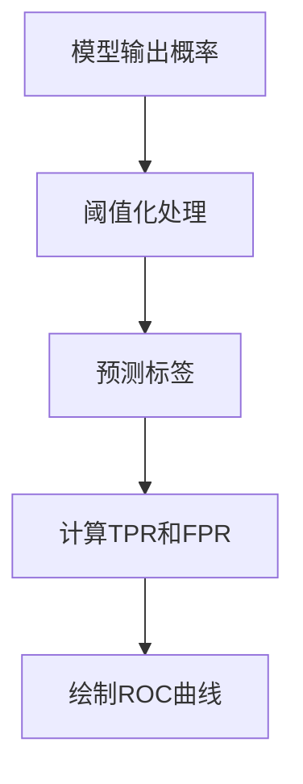
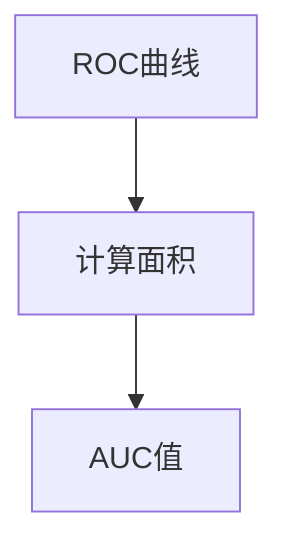

# AUC原理与代码实例讲解

## 1.背景介绍

在机器学习和数据挖掘领域中,评估模型的性能是一个至关重要的任务。AUC(Area Under the Curve,受试者工作特征曲线下的面积)是衡量二分类模型性能的一种常用指标。它基于ROC(Receiver Operating Characteristic)曲线,能够综合考虑模型的真阳性率(TPR)和假阳性率(FPR),从而全面评估模型的分类能力。

### 1.1 ROC曲线

ROC曲线是一种常用的可视化工具,用于展示二分类模型在不同阈值下的性能。它的横轴表示假阳性率(FPR),纵轴表示真阳性率(TPR)。理想的模型应该具有较高的TPR和较低的FPR,因此ROC曲线越靠近左上角,模型的性能越好。

$$
TPR = \frac{TP}{TP + FN}
$$

$$
FPR = \frac{FP}{FP + TN}
$$

其中,TP(True Positive)表示正确预测为正例的数量,FN(False Negative)表示错误预测为负例的正例数量,FP(False Positive)表示错误预测为正例的负例数量,TN(True Negative)表示正确预测为负例的数量。

### 1.2 AUC的定义

AUC是ROC曲线下的面积,它反映了模型对正负例进行排序的能力。AUC的取值范围在0到1之间,值越接近1,模型的性能越好。一个完美的模型的AUC值为1,而一个随机猜测的模型的AUC值约为0.5。

## 2.核心概念与联系

### 2.1 阈值与ROC曲线

在二分类问题中,我们通常会对模型的输出概率进行阈值化处理,将其转化为0或1的预测标签。不同的阈值会导致模型的真阳性率和假阳性率发生变化,从而影响ROC曲线的形状。

当阈值设置较低时,模型会倾向于将更多样本预测为正例,这会导致较高的真阳性率,但也会增加假阳性率。相反,当阈值设置较高时,模型会倾向于将更多样本预测为负例,这会降低假阳性率,但也会降低真阳性率。

因此,ROC曲线实际上是在不同阈值下,模型的真阳性率和假阳性率的变化曲线。



### 2.2 AUC与ROC曲线的关系

AUC的计算过程实际上是对ROC曲线下的面积进行积分。一个完美的模型的ROC曲线会紧贴着左上角,AUC值为1。而一个随机猜测的模型,ROC曲线会呈现对角线,AUC值约为0.5。

AUC不仅能够综合考虑模型的真阳性率和假阳性率,还能够反映模型对正负例进行排序的能力。如果一个模型能够很好地将正例排在负例之前,那么它的AUC值就会较高。



### 2.3 AUC与其他评估指标的关系

除了AUC,还有一些常用的二分类模型评估指标,如准确率(Accuracy)、精确率(Precision)、召回率(Recall)和F1分数。这些指标各有侧重,适用于不同的场景。

AUC的优势在于它不受样本分布的影响,能够更好地评估模型的整体性能。但在某些场景下,如果我们更关注模型在特定阈值下的表现,那么准确率、精确率和召回率等指标可能更加合适。

因此,在实际应用中,我们通常会结合多个评估指标来全面评估模型的性能。

## 3.核心算法原理具体操作步骤

### 3.1 AUC的计算方法

AUC的计算方法有多种,最常见的是基于排名的方法和基于概率的方法。

#### 3.1.1 基于排名的方法

基于排名的方法是一种非参数方法,它不需要假设模型输出的概率分布。该方法的核心思想是计算所有正例与负例的排名对之间的顺序统计量。

具体步骤如下:

1. 对所有样本按照模型输出的分数进行降序排序。
2. 遍历排序后的样本列表,对于每一个正例样本,计算它与排在它之后的负例样本的数量。
3. 将所有正例样本与排在它之后的负例样本的数量之和除以(正例数量 * 负例数量),即可得到AUC的值。

该方法的时间复杂度为O(n log n),其中n是样本数量。

#### 3.1.2 基于概率的方法

基于概率的方法假设模型输出的分数服从某种分布,通常是高斯分布或者logistic分布。该方法的核心思想是计算正例样本的分数大于负例样本的分数的概率。

具体步骤如下:

1. 计算所有正例样本的分数均值和方差。
2. 计算所有负例样本的分数均值和方差。
3. 根据正态分布或logistic分布的概率密度函数,计算正例样本的分数大于负例样本的分数的概率。
4. 将所有这些概率求和并除以(正例数量 * 负例数量),即可得到AUC的值。

该方法的时间复杂度为O(n),其中n是样本数量。但是,它需要假设模型输出的分数服从某种分布,如果假设不成立,计算结果可能会有偏差。

### 3.2 AUC的优缺点

#### 3.2.1 优点

- 不受样本分布的影响,能够更好地评估模型的整体性能。
- 能够综合考虑模型的真阳性率和假阳性率,全面评估模型的分类能力。
- 对于不平衡数据集,AUC的表现通常比准确率更加可靠。

#### 3.2.2 缺点

- 对于高度不平衡的数据集,AUC可能会过于乐观,无法真实反映模型的实际性能。
- AUC只关注模型的排序能力,无法评估模型在特定阈值下的表现。
- 计算AUC的时间复杂度较高,对于大规模数据集可能会带来计算开销。

## 4.数学模型和公式详细讲解举例说明

### 4.1 ROC曲线的数学表示

ROC曲线可以用一个参数方程来表示,其中x轴表示假阳性率(FPR),y轴表示真阳性率(TPR)。

$$
TPR = f(FPR)
$$

其中,f是一个单调递增函数,取值范围在[0,1]之间。

对于给定的阈值t,我们可以计算出对应的TPR和FPR:

$$
TPR(t) = \frac{\sum_{i=1}^{n_p} I(y_i=1, s_i \geq t)}{\sum_{i=1}^{n_p} I(y_i=1)}
$$

$$
FPR(t) = \frac{\sum_{i=1}^{n_n} I(y_i=0, s_i \geq t)}{\sum_{i=1}^{n_n} I(y_i=0)}
$$

其中,n_p和n_n分别表示正例和负例的数量,y_i表示第i个样本的真实标签(0或1),s_i表示第i个样本的模型输出分数,I(·)是指示函数。

通过改变阈值t,我们可以得到不同的(TPR,FPR)对,从而绘制出ROC曲线。

### 4.2 AUC的数学表示

AUC可以被定义为ROC曲线下的面积,用积分的形式表示为:

$$
AUC = \int_0^1 f(x) dx
$$

其中,f(x)是ROC曲线的参数方程。

对于基于排名的AUC计算方法,我们可以将AUC表示为:

$$
AUC = \frac{1}{n_p n_n} \sum_{i=1}^{n_p} \sum_{j=1}^{n_n} I(s_i > s_j)
$$

其中,s_i和s_j分别表示第i个正例样本和第j个负例样本的模型输出分数。

对于基于概率的AUC计算方法,我们可以将AUC表示为:

$$
AUC = \int_{-\infty}^{\infty} F_p(x) (1 - F_n(x)) dx
$$

其中,F_p(x)和F_n(x)分别表示正例样本和负例样本的分数分布函数。

### 4.3 AUC的统计解释

AUC还可以被解释为一个统计量,表示从正例和负例的总体中随机抽取一对样本,正例样本的分数大于负例样本的分数的概率。

$$
AUC = P(s_p > s_n)
$$

其中,s_p和s_n分别表示从正例和负例的总体中随机抽取的样本的模型输出分数。

这个解释揭示了AUC与模型对正负例进行排序的能力之间的密切关系。如果模型能够很好地将正例排在负例之前,那么AUC的值就会较高。

### 4.4 AUC的置信区间估计

在实际应用中,我们通常需要估计AUC的置信区间,以评估AUC估计的可靠性。常用的方法包括:

- 非参数置信区间估计,如基于重采样(Bootstrap)的方法。
- 基于正态近似的置信区间估计。
- 基于二项分布的置信区间估计。

以基于重采样的非参数置信区间估计为例,具体步骤如下:

1. 从原始数据集中进行重采样,构建B个新的数据集。
2. 对于每个新的数据集,计算AUC的值,得到B个AUC估计值。
3. 根据这B个AUC估计值,计算出AUC的置信区间。

通过置信区间估计,我们可以更好地评估AUC估计的可靠性和稳定性。

## 5.项目实践:代码实例和详细解释说明

在这一部分,我们将提供一个基于Python和scikit-learn库的代码示例,用于计算AUC并绘制ROC曲线。

```python
import numpy as np
from sklearn.datasets import make_classification
from sklearn.linear_model import LogisticRegression
from sklearn.metrics import roc_curve, auc
import matplotlib.pyplot as plt

# 生成模拟数据
X, y = make_classification(n_samples=10000, n_features=10, n_redundant=0, random_state=42)

# 训练逻辑回归模型
model = LogisticRegression()
model.fit(X, y)

# 计算模型输出的概率
y_score = model.predict_proba(X)[:, 1]

# 计算ROC曲线和AUC
fpr, tpr, thresholds = roc_curve(y, y_score)
roc_auc = auc(fpr, tpr)

# 绘制ROC曲线
plt.figure()
lw = 2
plt.plot(fpr, tpr, color='darkorange', lw=lw, label='ROC curve (area = %0.2f)' % roc_auc)
plt.plot([0, 1], [0, 1], color='navy', lw=lw, linestyle='--')
plt.xlim([0.0, 1.0])
plt.ylim([0.0, 1.05])
plt.xlabel('False Positive Rate')
plt.ylabel('True Positive Rate')
plt.title('Receiver Operating Characteristic')
plt.legend(loc="lower right")
plt.show()
```

代码解释:

1. 首先,我们使用scikit-learn库中的`make_classification`函数生成一个模拟的二分类数据集。
2. 然后,我们训练一个逻辑回归模型,并使用该模型对数据集进行预测,获得每个样本的概率输出。
3. 接下来,我们使用scikit-learn库中的`roc_curve`和`auc`函数计算ROC曲线和AUC值。
4. 最后,我们使用Matplotlib库绘制ROC曲线,并在图例中显示AUC值。

在这个示例中,我们使用了scikit-learn库中的`roc_curve`和`auc`函数来计算ROC曲线和AUC值。这些函数提供了便捷的方式来评估二分类模型的性能。

需要注意的是,在实际应用中,我们通常会使用交叉验证或者独立的测试集来评估模型的性能,以避免过拟合。此外,