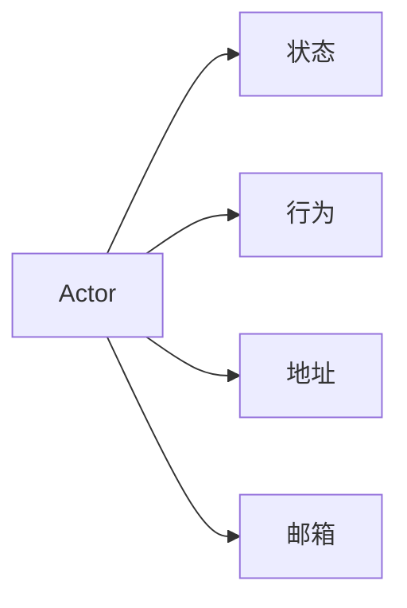
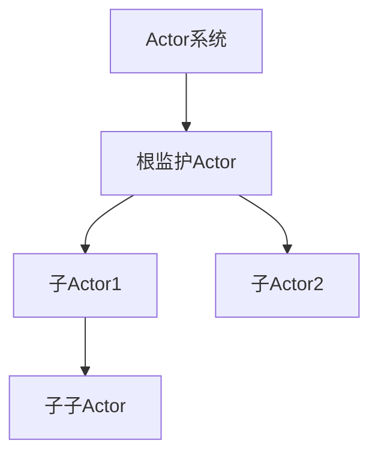
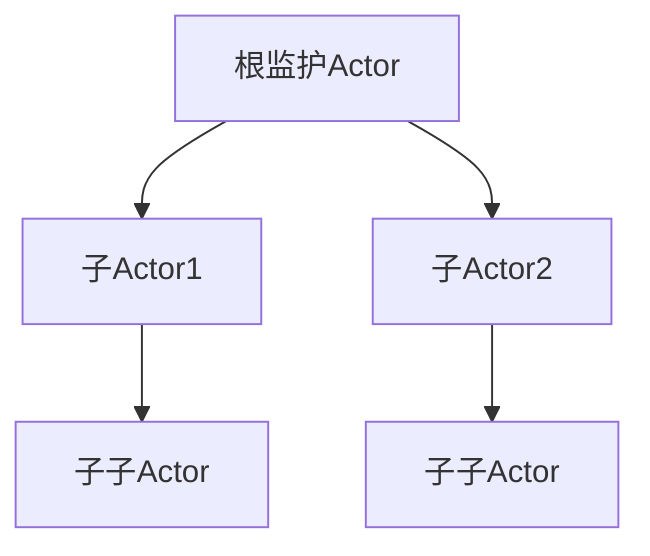
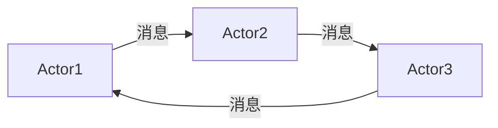
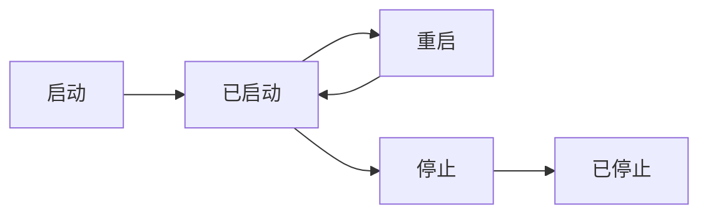

# Akka原理与代码实例讲解

## 1.背景介绍

### 1.1 什么是Akka

Akka是一个用于构建高度并发、分布式和容错应用程序的开源工具包和运行时。它基于Actor模型构建,并使用Scala和Java编写。Actor模型是一种将应用程序设计为由许多独立执行单元(Actor)组成的并发计算模型。每个Actor都有自己的状态和行为,可以通过异步消息传递与其他Actor通信。

### 1.2 Actor模型的优势

Actor模型具有以下优势:

- **简单性**: Actor模型提供了一种直观的并发编程抽象,使开发人员能够专注于业务逻辑,而不必担心底层的线程管理和锁定问题。
- **高度并发**: Actor可以在不同的线程或进程中执行,从而充分利用现代硬件的多核和分布式计算能力。
- **容错性**: Actor是独立的执行单元,一个Actor的失败不会影响整个系统。Akka提供了监督机制来管理Actor的生命周期和错误处理。
- **位置透明性**: Actor之间通过异步消息传递进行通信,无需关注Actor的物理位置,这使得构建分布式系统变得更加容易。

### 1.3 Akka的应用场景

Akka可以应用于各种场景,包括但不限于:

- **高并发Web应用**: Akka可以用于构建高度并发的Web应用程序,如实时数据处理、在线游戏等。
- **分布式系统**: Akka支持构建跨多个节点的分布式系统,如分布式计算、分布式存储等。
- **事件驱动架构**: Akka天生支持事件驱动架构,可以用于构建事件源(Event Sourcing)、CQRS(命令查询责任分离)等架构。
- **物联网(IoT)和边缘计算**: Akka可以用于构建物联网和边缘计算应用程序,如设备管理、数据处理等。

## 2.核心概念与联系

### 2.1 Actor

Actor是Akka的核心概念,它是一个独立的执行单元,具有以下特点:

- **状态**: Actor可以拥有自己的状态,这些状态只能由Actor自身访问和修改。
- **行为**: Actor定义了如何响应接收到的消息,这些行为由Actor自身实现。
- **地址**: 每个Actor都有一个唯一的地址,用于标识和寻址。
- **邮箱**: Actor通过邮箱接收消息,消息按照先入先出(FIFO)的顺序处理。



### 2.2 Actor系统

Actor系统是一组Actor的集合,它提供了Actor的创建、监督和消息路由等功能。Actor系统有一个根监护Actor,所有其他Actor都是它的子Actor。



### 2.3 监督树

Akka采用了层次化的监督树结构来管理Actor的生命周期和错误处理。每个Actor都有一个监护Actor,负责监督它的行为和状态。当一个Actor出现故障时,它的监护Actor可以采取适当的策略,如重启、停止或者恢复该Actor。



### 2.4 消息传递

Actor之间通过异步消息传递进行通信。发送者将消息发送到接收者的邮箱中,接收者按照FIFO的顺序处理这些消息。消息传递是无锁的,因此可以实现高度并发。



## 3.核心算法原理具体操作步骤

### 3.1 创建Actor

在Akka中,创建Actor的步骤如下:

1. 定义Actor类,继承自`Actor`trait或`AbstractActor`类。
2. 重写`receive`方法,定义Actor的行为,即如何响应不同的消息。
3. 使用`ActorSystem`的`actorOf`方法创建Actor实例。

```scala
import akka.actor.Actor
import akka.actor.ActorSystem
import akka.actor.Props

// 定义Actor类
class HelloActor extends Actor {
  def receive = {
    case "hello" => println("Hello!")
    case _       => println("Unknown message")
  }
}

// 创建Actor实例
val system = ActorSystem("mySystem")
val helloActor = system.actorOf(Props[HelloActor], "helloActor")

// 发送消息
helloActor ! "hello" // 输出: Hello!
helloActor ! "world" // 输出: Unknown message
```

### 3.2 Actor生命周期

Actor具有以下生命周期:

1. **启动(Starting)**: Actor被创建时进入该状态。
2. **已启动(Started)**: Actor准备就绪,可以接收消息。
3. **重启(Restarting)**: Actor由于某些原因需要重启时进入该状态。
4. **停止(Stopping)**: Actor将要终止时进入该状态。
5. **已停止(Stopped)**: Actor已经终止,不再处理任何消息。



### 3.3 监督策略

Akka采用了一种称为"让它崩溃"(Let it crash)的设计理念。当Actor出现异常时,它会崩溃并重启,而不是试图捕获和处理异常。监护Actor负责监督子Actor的行为,并根据预定义的监督策略决定如何处理子Actor的故障。

监督策略包括以下几种:

- **恢复(Resume)**: 忽略异常,保持Actor的内部状态不变。
- **重启(Restart)**: 重启Actor,清除其内部状态。
- **停止(Stop)**: 终止Actor,不再重启。
- **暂停(Escalate)**: 将异常传递给上级监护Actor,由上级决定如何处理。

```scala
import akka.actor.OneForOneStrategy
import akka.actor.SupervisorStrategy._

val strategy = OneForOneStrategy(maxNrOfRetries = 10, withinTimeRange = 1 minute) {
  case _: ArithmeticException      => Resume
  case _: NullPointerException     => Restart
  case _: IllegalArgumentException => Stop
  case _: Exception                => Escalate
}
```

### 3.4 路由

Akka提供了多种路由机制,用于将消息路由到一组Actor。常见的路由策略包括:

- **循环路由(Round-Robin)**: 按顺序将消息发送到不同的Actor。
- **随机路由(Random)**: 随机选择一个Actor接收消息。
- **广播路由(Broadcast)**: 将消息发送到所有Actor。
- **最小邮箱路由(SmallestMailboxPool)**: 将消息发送到邮箱中消息最少的Actor。

```scala
import akka.routing.RoundRobinPool

val routerPool = context.actorOf(RoundRobinPool(5).props(Props[Worker]), "routerPool")
```

## 4.数学模型和公式详细讲解举例说明

在分布式系统中,一个关键问题是如何保证消息的可靠传递。Akka采用了一种基于"至少一次"语义的可靠消息传递机制,其核心思想是通过重传机制来确保消息最终被成功接收。

设$p$为单次消息传输的失败概率,则$n$次重传后消息传输成功的概率为:

$$
P_{\text{success}} = 1 - p^{n+1}
$$

例如,如果单次消息传输失败概率为$p=0.1$,那么经过3次重传后,消息传输成功的概率为:

$$
P_{\text{success}} = 1 - 0.1^{3+1} = 0.9999
$$

通过适当增加重传次数,可以使消息传输成功的概率接近于1。

另一个重要问题是如何确保Actor的状态一致性。Akka采用了一种称为"事件源(Event Sourcing)"的模式,将Actor的状态变化记录为一系列不可变的事件。当Actor需要重启时,它可以通过重放这些事件来重建其状态。

设$S_0$为Actor的初始状态,$e_1, e_2, \dots, e_n$为影响Actor状态的事件序列,则Actor的最终状态$S_n$可以表示为:

$$
S_n = f(S_0, e_1, e_2, \dots, e_n)
$$

其中$f$是一个纯函数,表示如何根据初始状态和事件序列计算最终状态。由于事件是不可变的,因此可以保证Actor的状态是确定性的,从而实现状态的一致性和可重建性。

## 5.项目实践:代码实例和详细解释说明

下面是一个简单的示例,演示如何使用Akka创建一个计数器Actor。

```scala
import akka.actor.Actor
import akka.actor.ActorSystem
import akka.actor.Props

// 定义计数器Actor
class CounterActor extends Actor {
  var count = 0

  def receive = {
    case "increment" =>
      count += 1
      println(s"Current count: $count")
    case "decrement" =>
      count -= 1
      println(s"Current count: $count")
    case "get" =>
      sender() ! count
    case _ =>
      println("Unknown message")
  }
}

// 创建Actor系统和计数器Actor
val system = ActorSystem("CounterSystem")
val counterActor = system.actorOf(Props[CounterActor], "counterActor")

// 发送消息
counterActor ! "increment" // 输出: Current count: 1
counterActor ! "increment" // 输出: Current count: 2
counterActor ! "decrement" // 输出: Current count: 1
counterActor ! "get"       // 不会有输出,但会将count值发送给发送者

// 关闭Actor系统
system.terminate()
```

在这个示例中:

1. 我们定义了一个`CounterActor`类,它继承自`Actor`trait。
2. `CounterActor`维护一个`count`变量,用于存储计数器的值。
3. `receive`方法定义了Actor的行为,即如何响应不同的消息。在这个例子中,`"increment"`消息会增加计数器的值,`"decrement"`消息会减少计数器的值,`"get"`消息会将当前计数器值发送给发送者。
4. 我们使用`ActorSystem`的`actorOf`方法创建了一个`CounterActor`实例。
5. 然后,我们向`CounterActor`发送不同的消息,它会根据消息的类型执行相应的操作。
6. 最后,我们终止了Actor系统。

这个示例展示了如何定义Actor及其行为,如何创建Actor实例,以及如何向Actor发送消息。虽然这是一个非常简单的例子,但它揭示了Akka编程模型的核心思想。

## 6.实际应用场景

Akka可以应用于各种场景,下面是一些常见的应用场景:

### 6.1 实时数据处理

在实时数据处理系统中,Akka可以用于构建高度并发和容错的数据处理管道。每个Actor可以负责处理特定类型的数据,并将处理结果发送给下游Actor。由于Actor之间通过异步消息传递进行通信,因此可以实现高吞吐量和低延迟的数据处理。

### 6.2 物联网(IoT)和边缘计算

在物联网和边缘计算领域,Akka可以用于构建设备管理系统、数据聚合和处理系统等。每个设备或边缘节点可以表示为一个Actor,它们可以通过消息传递进行通信和协调。由于Actor模型的容错性,系统可以很好地处理设备故障和网络中断等情况。

### 6.3 在线游戏

在在线游戏中,Akka可以用于构建游戏服务器和游戏逻辑。每个玩家可以表示为一个Actor,游戏世界中的各个实体也可以表示为Actor。通过Actor之间的消息传递,可以实现游戏逻辑的执行和玩家之间的交互。由于Akka的高度并发性,游戏服务器可以支持大量并发玩家。

### 6.4 事件驱动架构

Akka天生支持事件驱动架构,如事件源(Event Sourcing)和CQRS(命令查询责任分离)。在这种架构中,系统的状态变化被表示为一系列不可变的事件,Actor可以通过重放这些事件来重建其状态。这种架构具有很好的可扩展性和容错性,适合构建复杂的分布式系统。