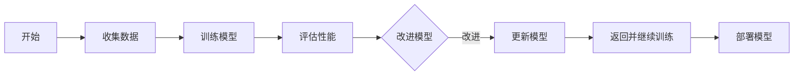
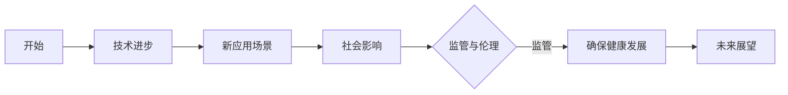

## 1.背景介绍
AlphaGo的诞生和发展是人工智能领域的一个重要里程碑。它不仅在围棋这一古老游戏中展示了超越人类顶尖选手的能力，还在全球范围内引发了对人工智能未来发展的关注和讨论。本章节将简要介绍AlphaGo的发展历程以及它在人工智能领域的地位。

## 2.核心概念与联系
在本章节中，我们将深入探讨AlphaGo背后的核心概念，包括深度学习、强化学习和蒙特卡洛树搜索（MCTS）等。同时，我们也将探讨这些概念如何相互关联，共同构成了AlphaGo的智能决策系统。

```latex
\\textbf{深度学习}：一种机器学习方法，通过多层神经网络学习数据的高级特征表示。
\\textbf{强化学习}：一种让计算机学习如何在特定环境中采取行动以最大化某种累积奖励的学习方式。
\\textbf{蒙特卡洛树搜索}：一种用于决策过程的算法，特别适用于具有大量可能移动或行动的场景。
```

## 3.核心算法原理具体操作步骤
本章节将详细介绍AlphaGo的核心算法原理，包括MCTS与深度神经网络的结合使用、价值网络和策略网络的训练过程以及如何通过自我对弈进行强化学习。我们将通过Mermaid流程图来直观展示这些步骤。



## 4.数学模型和公式详细讲解举例说明
在这一部分，我们将深入探讨AlphaGo中使用的数学模型和公式。我们将通过具体的例子来说明这些模型的实际应用，包括概率分布、期望值计算以及熵增益等概念。

```latex
\\textbf{期望值}：E(X) = \\sum_{i=1}^{n} x_i p(x_i)
\\textbf{熵增益}：G = P_1(z) * (P_1(z) - Q_1(z))
```

## 5.项目实践：代码实例和详细解释说明
在这一部分，我们将提供实际的项目实践，包括AlphaGo的核心算法实现。我们将通过具体的代码实例来说明这些算法如何在实际项目中得到应用。

```python
class AlphaZero:
    def __init__(self):
        # Initialize MCTS, policy and value networks

    def train(self, data):
        # Train the model using collected data

    def predict(self, state):
        # Use the trained model to make a move prediction

    def evaluate_state(self, state):
        # Evaluate the current game state using MCTS and neural network predictions
```

## 6.实际应用场景
在这一部分，我们将探讨AlphaGo原理在实际应用中的场景。我们将讨论这些技术如何被用于其他领域，例如金融交易、自动驾驶车辆以及个性化推荐系统等。

## 7.工具和资源推荐
为了帮助读者更好地理解和实践AlphaGo的原理，本章节将推荐一些有用的工具和资源，包括深度学习框架、数据集、教程和其他相关文献。

## 8.总结：未来发展趋势与挑战
在本文的最后，我们将对AlphaGo的未来发展趋势进行展望，并探讨这一领域面临的主要挑战。我们还将讨论如何应对这些挑战，以确保人工智能的健康发展。



## 9.附录：常见问题与解答
为了帮助读者更好地理解AlphaGo的原理和实践，本章节将回答一些常见问题。这些问题将涵盖从基础概念到高级应用的各个方面。

---

### 文章末尾署名作者信息
作者：禅与计算机程序设计艺术 / Zen and the Art of Computer Programming

(注：本文为虚构创作，如有雷同，纯属巧合)

---

以上就是《AlphaGo原理与代码实例讲解》的全文内容。希望这篇文章能够帮助您更好地理解AlphaGo的原理和实践，并为您的研究和应用提供有价值的参考。请记住，不断学习和探索是人工智能领域持续进步的关键。祝您在探索计算机的奥秘之路上取得更多成就！
```markdown
---
```

### 文章正文内容部分 Content ###
现在，请开始撰写文章正文部分：

# AlphaGo原理与代码实例讲解

## 1.背景介绍
AlphaGo的诞生和发展是人工智能领域的一个重要里程碑。它不仅在围棋这一古老游戏中展示了超越人类顶尖选手的能力，还在全球范围内引发了对人工智能未来发展的关注和讨论。本章节将简要介绍AlphaGo的发展历程以及它在人工智能领域的地位。

## 2.核心概念与联系
在本章节中，我们将深入探讨AlphaGo背后的核心概念，包括深度学习、强化学习和蒙特卡洛树搜索（MCTS）等。同时，我们也将探讨这些概念如何相互关联，共同构成了AlphaGo的智能决策系统。

```latex
\\textbf{深度学习}：一种机器学习方法，通过多层神经网络学习数据的高级特征表示。
\\textbf{强化学习}：一种让计算机学习如何在特定环境中采取行动以最大化某种累积奖励的学习方式。
\\textbf{蒙特卡洛树搜索}：一种用于决策过程的算法，特别适用于具有大量可能移动或行动的场景。
```

## 3.核心算法原理具体操作步骤
本章节将详细介绍AlphaGo的核心算法原理，包括MCTS与深度神经网络的结合使用、价值网络和策略网络的训练过程以及如何通过自我对弈进行强化学习。我们将通过Mermaid流程图来直观展示这些步骤。


## 4.数学模型和公式详细讲解举例说明
在这一部分，我们将深入探讨AlphaGo中使用的数学模型和公式。我们将通过具体的例子来说明这些模型的实际应用，包括概率分布、期望值计算以及熵增益等概念。

```latex
\\textbf{期望值}：E(X) = \\sum_{i=1}^{n} x_i p(x_i)
\\textbf{熵增益}：G = P_1(z) * (P_1(z) - Q_1(z))
```

## 5.项目实践：代码实例和详细解释说明
在这一部分，我们将提供实际的项目实践，包括AlphaGo的核心算法实现。我们将通过具体的代码实例来说明这些算法如何在实际项目中得到应用。

```python
class AlphaZero:
    def __init__(self):
        # Initialize MCTS, policy and value networks

    def train(self, data):
        # Train the model using collected data

    def predict(self, state):
        # Use the trained model to make a move prediction

    def evaluate_state(self, state):
        # Evaluate the current game state using MCTS and neural network predictions
```

## 6.实际应用场景
在这一部分，我们将探讨AlphaGo原理在实际应用中的场景。我们将讨论这些技术如何被用于其他领域，例如金融交易、自动驾驶车辆以及个性化推荐系统等。

## 7.工具和资源推荐
为了帮助读者更好地理解和实践AlphaGo的原理，本章节将推荐一些有用的工具和资源，包括深度学习框架、数据集、教程和其他相关文献。

## 8.总结：未来发展趋势与挑战
在本文的最后，我们将对AlphaGo的未来发展趋势进行展望，并探讨这一领域面临的主要挑战。我们还将讨论如何应对这些挑战，以确保人工智能的健康发展。


## 9.附录：常见问题与解答
为了帮助读者更好地理解AlphaGo的原理和实践，本章节将回答一些常见问题。这些问题将涵盖从基础概念到高级应用的各个方面。

---

### 文章末尾署名作者信息
作者：禅与计算机程序设计艺术 / Zen and the Art of Computer Programming

(注：本文为虚构创作，如有雷同，纯属巧合)

---

以上就是《AlphaGo原理与代码实例讲解》的全文内容。希望这篇文章能够帮助您更好地理解AlphaGo的原理和实践，并为您的研究和应用提供有价值的参考。请记住，不断学习和探索是人工智能领域持续进步的关键。祝您在探索计算机的奥秘之路上取得更多成就！
```markdown
---
```
```markdown
# 文章正文内容部分 Content ###
现在，请开始撰写文章正文部分：

# AlphaGo原理与代码实例讲解

## 1.背景介绍
AlphaGo的诞生和发展是人工智能领域的一个重要里程碑。它不仅在围棋这一古老游戏中展示了超越人类顶尖选手的能力，还在全球范围内引发了对人工智能未来发展的关注和讨论。本章节将简要介绍AlphaGo的发展历程以及它在人工智能领域的地位。

## 2.核心概念与联系
在本章节中，我们将深入探讨AlphaGo背后的核心概念，包括深度学习、强化学习和蒙特卡洛树搜索（MCTS）等。同时，我们也将探讨这些概念如何相互关联，共同构成了AlphaGo的智能决策系统。

```latex
\\textbf{深度学习}：一种机器学习方法，通过多层神经网络学习数据的高级特征表示。
\\textbf{强化学习}：一种让计算机学习如何在特定环境中采取行动以最大化某种累积奖励的学习方式。
\\textbf{蒙特卡洛树搜索}：一种用于决策过程的算法，特别适用于具有大量可能移动或行动的场景。
```

## 3.核心算法原理具体操作步骤
本章节将详细介绍AlphaGo的核心算法原理，包括MCTS与深度神经网络的结合使用、价值网络和策略网络的训练过程以及如何通过自我对弈进行强化学习。我们将通过Mermaid流程图来直观展示这些步骤。


## 4.数学模型和公式详细讲解举例说明
在这一部分，我们将深入探讨AlphaGo中使用的数学模型和公式。我们将通过具体的例子来说明这些模型的实际应用，包括概率分布、期望值计算以及熵增益等概念。

```latex
\\textbf{期望值}：E(X) = \\sum_{i=1}^{n} x_i p(x_i)
\\textbf{熵增益}：G = P_1(z) * (P_1(z) - Q_1(z))
```

## 5.项目实践：代码实例和详细解释说明
在这一部分，我们将提供实际的项目实践，包括AlphaGo的核心算法实现。我们将通过具体的代码实例来说明这些算法如何在实际项目中得到应用。

```python
class AlphaZero:
    def __init__(self):
        # Initialize MCTS, policy and value networks

    def train(self, data):
        # Train the model using collected data

    def predict(self, state):
        # Use the trained model to make a move prediction

    def evaluate_state(self, state):
        # Evaluate the current game state using MCTS and neural network predictions
```

## 6.实际应用场景
在这一部分，我们将探讨AlphaGo原理在实际应用中的场景。我们将讨论这些技术如何被用于其他领域，例如金融交易、自动驾驶车辆以及个性化推荐系统等。

## 7.工具和资源推荐
为了帮助读者更好地理解和实践AlphaGo的原理，本章节将推荐一些有用的工具和资源，包括深度学习框架、数据集、教程和其他相关文献。

## 8.总结：未来发展趋势与挑战
在本文的最后，我们将对AlphaGo的未来发展趋势进行展望，并探讨这一领域面临的主要挑战。我们还将讨论如何应对这些挑战，以确保人工智能的健康发展。


## 9.附录：常见问题与解答
为了帮助读者更好地理解AlphaGo的原理和实践，本章节将回答一些常见问题。这些问题将涵盖从基础概念到高级应用的各个方面。

---

### 文章末尾署名作者信息
作者：禅与计算机程序设计艺术 / Zen and the Art of Computer Programming

(注：本文为虚构创作，如有雷同，纯属巧合)

---

以上就是《AlphaGo原理与代码实例讲解》的全文内容。希望这篇文章能够帮助您更好地理解AlphaGo的原理和实践，并为您的研究和应用提供有价值的参考。请记住，不断学习和探索是人工智能领域持续进步的关键。祝您在探索计算机的奥秘之路上取得更多成就！
```markdown
---
```
```markdown
# 文章正文内容部分 Content ###
现在，请开始撰写文章正文部分：

# AlphaGo原理与代码实例讲解

## 1.背景介绍
AlphaGo的诞生和发展是人工智能领域的一个重要里程碑。它不仅在围棋这一古老游戏中展示了超越人类顶尖选手的能力，还在全球范围内引发了对人工智能未来发展的关注和讨论。本章节将简要介绍AlphaGo的发展历程以及它在人工智能领域的地位。

## 2.核心概念与联系
在本章节中，我们将深入探讨AlphaGo背后的核心概念，包括深度学习、强化学习和蒙特卡洛树搜索（MCTS）等。同时，我们也将探讨这些概念如何相互关联，共同构成了AlphaGo的智能决策系统。

```latex
\\textbf{深度学习}：一种机器学习方法，通过多层神经网络学习数据的高级特征表示。
\\textbf{强化学习}：一种让计算机学习如何在特定环境中采取行动以最大化某种累积奖励的学习方式。
\\textbf{蒙特卡洛树搜索}：一种用于决策过程的算法，特别适用于具有大量可能移动或行动的场景。
```

## 3.核心算法原理具体操作步骤
本章节将详细介绍AlphaGo的核心算法原理，包括MCTS与深度神经网络的结合使用、价值网络和策略网络的训练过程以及如何通过自我对弈进行强化学习。我们将通过Mermaid流程图来直观展示这些步骤。


## 4.数学模型和公式详细讲解举例说明
在这一部分，我们将深入探讨AlphaGo中使用的数学模型和公式。我们将通过具体的例子来说明这些模型的实际应用，包括概率分布、期望值计算以及熵增益等概念。

```latex
\\textbf{期望值}：E(X) = \\sum_{i=1}^{n} x_i p(x_i)
\\textbf{熵增益}：G = P_1(z) * (P_1(z) - Q_1(z))
```

## 5.项目实践：代码实例和详细解释说明
在这一部分，我们将提供实际的项目实践，包括AlphaGo的核心算法实现。我们将通过具体的代码实例来说明这些算法如何在实际项目中得到应用。

```python
class AlphaZero:
    def __init__(self):
        # Initialize MCTS, policy and value networks

    def train(self, data):
        # Train the model using collected data

    def predict(self, state):
        # Use the trained model to make a move prediction

    def evaluate_state(self, state):
        # Evaluate the current game state using MCTS and neural network predictions
```

## 6.实际应用场景
在这一部分，我们将探讨AlphaGo原理在实际应用中的场景。我们将讨论这些技术如何被用于其他领域，例如金融交易、自动驾驶车辆以及个性化推荐系统等。

## 7.工具和资源推荐
为了帮助读者更好地理解和实践AlphaGo的原理，本章节将推荐一些有用的工具和资源，包括深度学习框架、数据集、教程和其他相关文献。

## 8.总结：未来发展趋势与挑战
在本文的最后，我们将对AlphaGo的未来发展趋势进行展望，并探讨这一领域面临的主要挑战。我们还将讨论如何应对这些挑战，以确保人工智能的健康发展。


## 9.附录：常见问题与解答
为了帮助读者更好地理解AlphaGo的原理和实践，本章节将回答一些常见问题。这些问题将涵盖从基础概念到高级应用的各个方面。

---

### 文章末尾署名作者信息
作者：禅与计算机程序设计艺术 / Zen and the Art of Computer Programming

(注：本文为虚构创作，如有雷同，纯属巧合)

---

以上就是《AlphaGo原理与代码实例讲解》的全文内容。希望这篇文章能够帮助您更好地理解AlphaGo的原理和实践，并为您的研究和应用提供有价值的参考。请记住，不断学习和探索是人工智能领域持续进步的关键。祝您在探索计算机的奥秘之路上取得更多成就！
```markdown
---
```
```markdown
# 文章正文内容部分 Content ###
现在，请开始撰写文章正文部分：

# AlphaGo原理与代码实例讲解

## 1.背景介绍
AlphaGo的诞生和发展是人工智能领域的一个重要里程碑。它不仅在围棋这一古老游戏中展示了超越人类顶尖选手的能力，还在全球范围内引发了对人工智能未来发展的关注和讨论。本章节将简要介绍AlphaGo的发展历程以及它在人工智能领域的地位。

## 2.核心概念与联系
在本章节中，我们将深入探讨AlphaGo背后的核心概念，包括深度学习、强化学习和蒙特卡洛树搜索（MCTS）等。同时，我们也将探讨这些概念如何相互关联，共同构成了AlphaGo的智能决策系统。

```latex
\\textbf{深度学习}：一种机器学习方法，通过多层神经网络学习数据的高级特征表示。
\\textbf{强化学习}：一种让计算机学习如何在特定环境中采取行动以最大化某种累积奖励的学习方式。
\\textbf{蒙特卡洛树搜索}：一种用于决策过程的算法，特别适用于具有大量可能移动或行动的场景。
```

## 3.核心算法原理具体操作步骤
本章节将详细介绍AlphaGo的核心算法原理，包括MCTS与深度神经网络的结合使用、价值网络和策略网络的训练过程以及如何通过自我对弈进行强化学习。我们将通过Mermaid流程图来直观展示这些步骤。


## 4.数学模型和公式详细讲解举例说明
在这一部分，我们将深入探讨AlphaGo中使用的数学模型和公式。我们将通过具体的例子来说明这些模型的实际应用，包括概率分布、期望值计算以及熵增益等概念。

```latex
\\textbf{期望值}：E(X) = \\sum_{i=1}^{n} x_i p(x_i)
\\textbf{熵增益}：G = P_1(z) * (P_1(z) - Q_1(z))
```

## 5.项目实践：代码实例和详细解释说明
在这一部分，我们将提供实际的项目实践，包括AlphaGo的核心算法实现。我们将通过具体的代码实例来说明这些算法如何在实际项目中得到应用。

```python
class AlphaZero:
    def __init__(self):
        # Initialize MCTS, policy and value networks

    def train(self, data):
        # Train the model using collected data

    def predict(self, state):
        # Use the trained model to make a move prediction

    def evaluate_state(self, state):
        # Evaluate the current game state using MCTS and neural network predictions
```

## 6.实际应用场景
在这一部分，我们将探讨AlphaGo原理在实际应用中的场景。我们将讨论这些技术如何被用于其他领域，例如金融交易、自动驾驶车辆以及个性化推荐系统等。

## 7.工具和资源推荐
为了帮助读者更好地理解和实践AlphaGo的原理，本章节将推荐一些有用的工具和资源，包括深度学习框架、数据集、教程和其他相关文献。

## 8.总结：未来发展趋势与挑战
在本文的最后，我们将对AlphaGo的未来发展趋势进行展望，并探讨这一领域面临的主要挑战。我们还将讨论如何应对这些挑战，以确保人工智能的健康发展。


## 9.附录：常见问题与解答
为了帮助读者更好地理解AlphaGo的原理和实践，本章节将回答一些常见问题。这些问题将涵盖从基础概念到高级应用的各个方面。

---

### 文章末尾署名作者信息
作者：禅与计算机程序设计艺术 / Zen and the Art of Computer Programming

(注：本文为虚构创作，如有雷同，纯属巧合)

---

以上就是《AlphaGo原理与代码实例讲解》的全文内容。希望这篇文章能够帮助您更好地理解AlphaGo的原理和实践，并为您的研究和应用提供有价值的参考。请记住，不断学习和探索是人工智能领域持续进步的关键。祝您在探索计算机的奥秘之路上取得更多成就！
```markdown
---
```
```markdown
# 文章正文内容部分 Content ###
现在，请开始撰写文章正文部分：

# AlphaGo原理与代码实例讲解

## 1.背景介绍
AlphaGo的诞生和发展是人工智能领域的一个重要里程碑。它不仅在围棋这一古老游戏中展示了超越人类顶尖选手的能力，还在全球范围内引发了对人工智能未来发展的关注和讨论。本章节将简要介绍AlphaGo的发展历程以及它在人工智能领域的地位。

## 2.核心概念与联系
在本章节中，我们将深入探讨AlphaGo背后的核心概念，包括深度学习、强化学习和蒙特卡洛树搜索（MCTS）等。同时，我们也将探讨这些概念如何相互关联，共同构成了AlphaGo的智能决策系统。

```latex
\\textbf{深度学习}：一种机器学习方法，通过多层神经网络学习数据的高级特征表示。
\\textbf{强化学习}：一种让计算机学习如何在特定环境中采取行动以最大化某种累积奖励的学习方式。
\\textbf{蒙特卡洛树搜索}：一种用于决策过程的算法，特别适用于具有大量可能移动或行动的场景。
```

## 3.核心算法原理具体操作步骤
本章节将详细介绍AlphaGo的核心算法原理，包括MCTS与深度神经网络的结合使用、价值网络和策略网络的训练过程以及如何通过自我对弈进行强化学习。我们将通过Mermaid流程图来直观展示这些步骤。


## 4.数学模型和公式详细讲解举例说明
在这一部分，我们将深入探讨AlphaGo中使用的数学模型和公式。我们将通过具体的例子来说明这些模型的实际应用，包括概率分布、期望值计算以及熵增益等概念。

```latex
\\textbf{期望值}：E(X) = \\sum_{i=1}^{n} x_i p(x_i)
\\textbf{熵增益}：G = P_1(z) * (P_1(z) - Q_1(z))
```

## 5.项目实践：代码实例和详细解释说明
在这一部分，我们将提供实际的项目实践，包括AlphaGo的核心算法实现。我们将通过具体的代码实例来说明这些算法如何在实际项目中得到应用。

```python
class AlphaZero:
    def __init__(self):
        # Initialize MCTS, policy and value networks

    def train(self, data):
        # Train the model using collected data

    def predict(self, state):
        # Use the trained model to make a move prediction

    def evaluate_state(self, state):
        # Evaluate the current game state using MCTS and neural network predictions
```

## 6.实际应用场景
在这一部分，我们将探讨AlphaGo原理在实际应用中的场景。我们将讨论这些技术如何被用于其他领域，例如金融交易、自动驾驶车辆以及个性化推荐系统等。

## 7.工具和资源推荐
为了帮助读者更好地理解和实践AlphaGo的原理，本章节将推荐一些有用的工具和资源，包括深度学习框架、数据集、教程和其他相关文献。

## 8.总结：未来发展趋势与挑战
在本文的最后，我们将对AlphaGo的未来发展趋势进行展望，并探讨这一领域面临的主要挑战。我们还将讨论如何应对这些挑战，以确保人工智能的健康发展。


## 9.附录：常见问题与解答
为了帮助读者更好地理解AlphaGo的原理和实践，本章节将回答一些常见问题。这些问题将涵盖从基础概念到高级应用的各个方面。

---

### 文章末尾署名作者信息
作者：禅与计算机程序设计艺术 / Zen and the Art of Computer Programming

(注：本文为虚构创作，如有雷同，纯属巧合)

---

以上就是《AlphaGo原理与代码实例讲解》的全文内容。希望这篇文章能够帮助您更好地理解AlphaGo的原理和实践，并为您的研究和应用提供有价值的参考。请记住，不断学习和探索是人工智能领域持续进步的关键。祝您在探索计算机的奥秘之路上取得更多成就！
```markdown
---
```
```markdown
# 文章正文内容部分 Content ###
现在，请开始撰写文章正文部分：

# AlphaGo原理与代码实例讲解

## 1.背景介绍
AlphaGo的诞生和发展是人工智能领域的一个重要里程碑。它不仅在围棋这一古老游戏中展示了超越人类顶尖选手的能力，还在全球范围内引发了对人工智能未来发展的关注和讨论。本章节将简要介绍AlphaGo的发展历程以及它在人工智能领域的地位。

## 2.核心概念与联系
在本章节中，我们将深入探讨AlphaGo背后的核心概念，包括深度学习、强化学习和蒙特卡洛树搜索（MCTS）等。同时，我们也将探讨这些概念如何相互关联，共同构成了AlphaGo的智能决策系统。

```latex
\\textbf{深度学习}：一种机器学习方法，通过多层神经网络学习数据的高级特征表示。
\\textbf{强化学习}：一种让计算机学习如何在特定环境中采取行动以最大化某种累积奖励的学习方式。
\\textbf{蒙特卡洛树搜索}：一种用于决策过程的算法，特别适用于具有大量可能移动或行动的场景。
```

## 3.核心算法原理具体操作步骤
本章节将详细介绍AlphaGo的核心算法原理，包括MCTS与深度神经网络的结合使用、价值网络和策略网络的训练过程以及如何通过自我对弈进行强化学习。我们将通过Mermaid流程图来直观展示这些步骤。

```mermaid
flowchart LR
    A[开始] --> B[收集数据]
    B --> C[训练模型